# Databricks Fundamentals: Complete Guide

## Table of Contents

1. [Introduction to Databricks](#1-introduction-to-databricks)
2. [Why Databricks vs Pandas/Hadoop?](#2-why-databricks-vs-pandashadoop)
   - [The Evolution of Big Data Processing](#21-the-evolution-of-big-data-processing)
   - [Pandas: Strengths and Limitations](#22-pandas-strengths-and-limitations)
   - [Hadoop: The Original Big Data Solution](#23-hadoop-the-original-big-data-solution)
   - [Apache Spark: The Game Changer](#24-apache-spark-the-game-changer)
   - [Databricks: The Unified Analytics Platform](#25-databricks-the-unified-analytics-platform)
   - [Comprehensive Comparison Table](#26-comprehensive-comparison-table)
3. [Lakehouse Architecture Basics](#3-lakehouse-architecture-basics)
   - [Understanding Data Architectures Evolution](#31-understanding-data-architectures-evolution)
   - [What is a Data Lakehouse?](#32-what-is-a-data-lakehouse)
   - [Delta Lake: The Foundation](#33-delta-lake-the-foundation)
   - [Lakehouse Architecture Components](#34-lakehouse-architecture-components)
   - [ACID Transactions in Lakehouse](#35-acid-transactions-in-lakehouse)
   - [Medallion Architecture](#36-medallion-architecture)
4. [Databricks Workspace Structure](#4-databricks-workspace-structure)
   - [Workspace Overview](#41-workspace-overview)
   - [Navigation and Components](#42-navigation-and-components)
   - [Compute Resources](#43-compute-resources)
   - [Data Explorer](#44-data-explorer)
   - [Notebooks](#45-notebooks)
   - [Jobs and Workflows](#46-jobs-and-workflows)
5. [Industry Use Cases](#5-industry-use-cases)
   - [Netflix: Real-time Streaming Analytics](#51-netflix-real-time-streaming-analytics)
   - [Shell: Energy and IoT Analytics](#52-shell-energy-and-iot-analytics)
   - [Comcast: Customer Experience Analytics](#53-comcast-customer-experience-analytics)
   - [Other Notable Use Cases](#54-other-notable-use-cases)
6. [Hands-On Tasks](#6-hands-on-tasks)
   - [Task 1: Create Databricks Community Edition Account](#61-task-1-create-databricks-community-edition-account)
   - [Task 2: Navigate Workspace, Compute, Data Explorer](#62-task-2-navigate-workspace-compute-data-explorer)
   - [Task 3: Create Your First Notebook](#63-task-3-create-your-first-notebook)
   - [Task 4: Run Basic PySpark Commands](#64-task-4-run-basic-pyspark-commands)
7. [Quick Reference](#7-quick-reference)
8. [Glossary](#8-glossary)

---

## 1. Introduction to Databricks

**Databricks** is a unified analytics platform built on top of Apache Spark. It was founded in 2013 by the original creators of Apache Spark, Delta Lake, and MLflow at UC Berkeley's AMPLab. The platform provides a collaborative environment for data engineers, data scientists, and machine learning engineers to work together on data processing, analytics, and AI/ML workloads.

Think of Databricks as a "one-stop-shop" for all your data needs. Instead of juggling multiple tools for data ingestion, processing, analysis, and machine learning, Databricks brings everything under one roof with a cloud-native, scalable architecture.

**Key Value Propositions:**
- Unified platform for data engineering, data science, and machine learning
- Built on open-source technologies (Spark, Delta Lake, MLflow)
- Cloud-native deployment (AWS, Azure, GCP)
- Collaborative workspace with notebooks
- Enterprise-grade security and governance

---

## 2. Why Databricks vs Pandas/Hadoop?

### 2.1 The Evolution of Big Data Processing

To understand why Databricks exists, we need to trace the evolution of data processing tools:

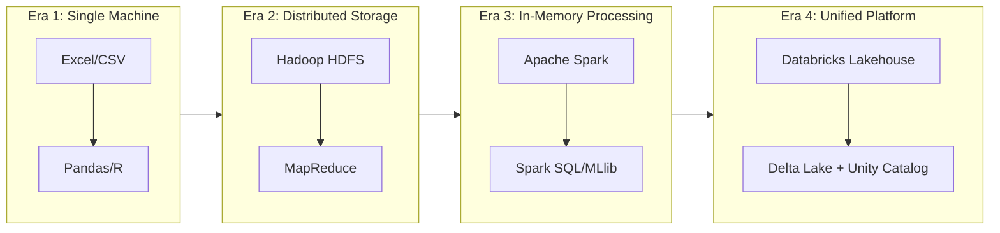

Each era solved specific problems but introduced new challenges, leading to the next evolution.

### 2.2 Pandas: Strengths and Limitations

**What is Pandas?**

Pandas is a powerful Python library for data manipulation and analysis. It's the go-to tool for data scientists working with structured data on a single machine.

**How Pandas Works:**

When you load data into Pandas, it reads the entire dataset into your computer's RAM (Random Access Memory). All operations happen in memory on a single machine.

```python
import pandas as pd

# This loads ENTIRE file into RAM
df = pd.read_csv("sales_data.csv")

# All processing happens in memory
df_filtered = df[df['sales'] > 1000]
df_grouped = df.groupby('region').sum()
```

**Strengths of Pandas:**
- Intuitive API with rich functionality
- Fast for small to medium datasets (up to a few GB)
- Extensive ecosystem and community support
- Great for exploratory data analysis (EDA)
- Excellent integration with visualization libraries

**Limitations of Pandas:**

| Limitation | Explanation | Real-World Impact |
|------------|-------------|-------------------|
| **Memory Bound** | Entire dataset must fit in RAM | A 16GB RAM laptop cannot process a 50GB dataset |
| **Single Machine** | No built-in distribution | Cannot utilize cluster computing |
| **Vertical Scaling Only** | Need bigger machine for bigger data | Expensive hardware upgrades required |
| **No Lazy Evaluation** | Operations execute immediately | Memory spikes during complex transformations |
| **Limited Fault Tolerance** | Crash = Start over | Long-running jobs are risky |

**The "Pandas Memory Problem" Explained:**

Imagine you have a 10GB CSV file and a laptop with 8GB RAM:

$$
\text{Available RAM} = 8\text{GB} < 10\text{GB} = \text{Data Size}
$$

$$
\Rightarrow \text{Pandas fails with MemoryError}
$$

Even if data fits initially, operations create intermediate copies:

$$
\text{Actual Memory Needed} \approx \text{Data Size} \times 2 \text{ to } 5\times
$$

This is because Pandas often creates copies during operations like `df.apply()`, `df.merge()`, etc.

### 2.3 Hadoop: The Original Big Data Solution

**What is Hadoop?**

Hadoop is an open-source framework designed for distributed storage and processing of large datasets across clusters of computers. It emerged from Google's papers on Google File System (GFS) and MapReduce.

**Hadoop Ecosystem Components:**

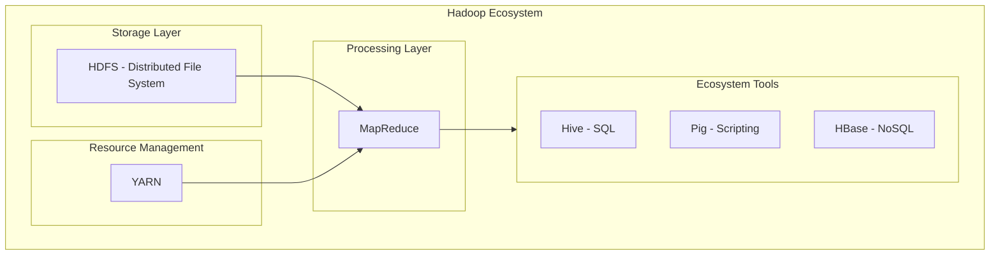

**How MapReduce Works:**

MapReduce processes data in two phases:

1. **Map Phase**: Data is split and processed in parallel across nodes
2. **Reduce Phase**: Results are aggregated

Example: Word Count

```
Input: "hello world hello spark hello"

Map Phase:
  Node 1: ["hello", "world"] → [(hello, 1), (world, 1)]
  Node 2: ["hello", "spark", "hello"] → [(hello, 1), (spark, 1), (hello, 1)]

Shuffle & Sort:
  Group by key → {hello: [1,1,1], world: [1], spark: [1]}

Reduce Phase:
  Sum values → {hello: 3, world: 1, spark: 1}
```

**Hadoop Limitations:**

| Limitation | Explanation | Impact |
|------------|-------------|--------|
| **Disk-Based Processing** | Reads/writes to disk between Map and Reduce | 10-100x slower than in-memory |
| **High Latency** | Each job takes minutes minimum | Not suitable for interactive queries |
| **Complex Programming Model** | MapReduce is verbose and difficult | Simple tasks require many lines of code |
| **Batch Only** | No real-time/streaming support | Cannot handle live data |
| **Multiple Tools Required** | Need Hive, Pig, HBase separately | Complex ecosystem management |

**The Hadoop I/O Bottleneck:**

In MapReduce, every operation involves disk:

$$
\text{Total Time} = \text{Read from Disk} + \text{Process} + \text{Write to Disk} + \text{Repeat...}
$$

For iterative algorithms (like ML), this becomes:

$$
\text{Time}_{\text{iterative}} = n \times (\text{Disk Read} + \text{Disk Write})
$$

Where $n$ is the number of iterations. This makes machine learning prohibitively slow.

### 2.4 Apache Spark: The Game Changer

**What is Apache Spark?**

Apache Spark is a unified analytics engine for large-scale data processing. Created at UC Berkeley's AMPLab, it addresses Hadoop's limitations through in-memory computing.

**The Core Innovation: RDDs (Resilient Distributed Datasets)**

RDDs are Spark's fundamental data structure:
- **Resilient**: Can recover from node failures
- **Distributed**: Data is partitioned across cluster nodes
- **Datasets**: Collection of elements that can be operated on in parallel

**How Spark Achieves Speed:**

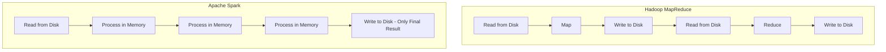

**Spark vs Hadoop Performance:**

$$
\text{Spark Speed} \approx 100 \times \text{Hadoop Speed (in-memory)}
$$

$$
\text{Spark Speed} \approx 10 \times \text{Hadoop Speed (on-disk)}
$$

This is because:
- Memory access: ~100 nanoseconds
- Disk access: ~10 milliseconds
- Ratio: $\frac{10 \times 10^{-3}}{100 \times 10^{-9}} = 100,000\times$ difference

**Spark Unified Stack:**

Spark provides multiple APIs on one engine:

| Component | Purpose | Use Case |
|-----------|---------|----------|
| **Spark SQL** | Structured data processing | SQL queries, DataFrames |
| **Spark Streaming** | Real-time data processing | Live dashboards, event processing |
| **MLlib** | Machine Learning | Training models at scale |
| **GraphX** | Graph processing | Social networks, recommendations |

### 2.5 Databricks: The Unified Analytics Platform

**What Makes Databricks Different from Spark?**

While Spark is the engine, Databricks is the complete vehicle:

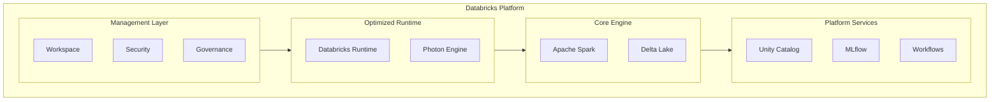

**Databricks Value-Add Over Open-Source Spark:**

| Feature | Open-Source Spark | Databricks |
|---------|-------------------|------------|
| **Setup** | Manual cluster configuration | One-click clusters |
| **Performance** | Base Spark speed | 2-5x faster with Photon |
| **Notebooks** | Jupyter (separate) | Integrated, collaborative |
| **Scheduling** | External tools needed | Built-in Workflows |
| **ML Tracking** | Manual or MLflow | Integrated MLflow |
| **Data Governance** | External solutions | Unity Catalog |
| **Delta Lake** | Self-managed | Managed, optimized |
| **Auto-scaling** | Manual configuration | Automatic |
| **Cost Management** | DIY | Built-in controls |

**The Databricks Runtime:**

Databricks Runtime (DBR) is an optimized version of Spark with:
- Pre-installed libraries (pandas, numpy, scikit-learn)
- Photon engine (C++ based query engine, 2-8x faster)
- Delta Lake integration
- GPU support for ML
- Optimized I/O and shuffles

### 2.6 Comprehensive Comparison Table

| Criteria | Pandas | Hadoop | Spark | Databricks |
|----------|--------|--------|-------|------------|
| **Data Size** | MB to few GB | TB to PB | TB to PB | TB to PB |
| **Processing** | Single machine | Distributed (disk) | Distributed (memory) | Distributed (optimized) |
| **Speed** | Fast for small data | Slow (disk I/O) | 100x Hadoop | 2-5x Spark |
| **Learning Curve** | Easy | Hard | Medium | Medium |
| **Real-time** | No | No | Yes (Structured Streaming) | Yes (enhanced) |
| **ML Support** | scikit-learn | Mahout (deprecated) | MLlib | MLlib + MLflow |
| **SQL Support** | Limited | Hive | Spark SQL | Spark SQL + Photon |
| **Fault Tolerance** | None | HDFS replication | RDD lineage | Enhanced recovery |
| **Cost** | Free | Infrastructure only | Infrastructure only | Infrastructure + License |
| **Governance** | Manual | Limited | Limited | Unity Catalog |
| **Best For** | Exploration, small data | Legacy systems | Large-scale processing | Enterprise analytics |

**When to Use What:**

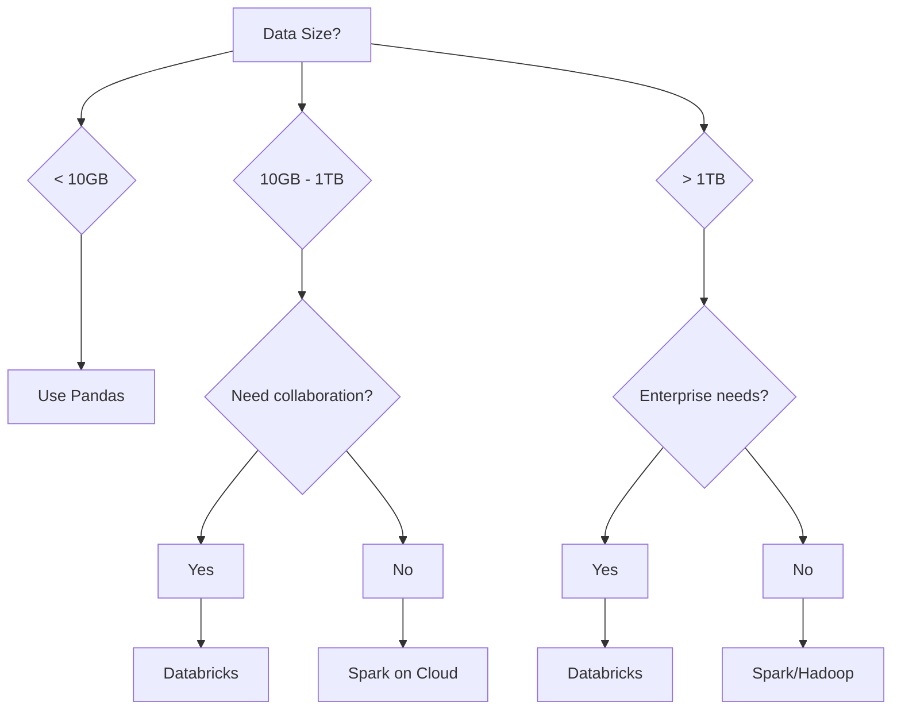

---

## 3. Lakehouse Architecture Basics

### 3.1 Understanding Data Architectures Evolution

Before understanding Lakehouse, let's trace how data architectures evolved:

**Phase 1: Data Warehouses (1980s-2000s)**

Data Warehouses store structured data for business intelligence:

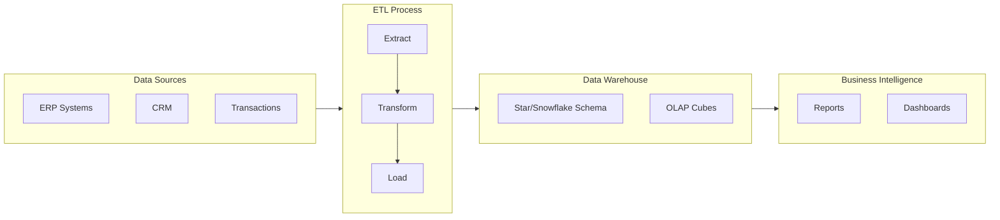

**Characteristics:**
- Structured data only (tables with schemas)
- ACID transactions (reliable updates)
- SQL-based querying
- High cost per terabyte
- Not suitable for unstructured data (images, logs, JSON)

**Phase 2: Data Lakes (2010s)**

Data Lakes store all types of data in raw format:

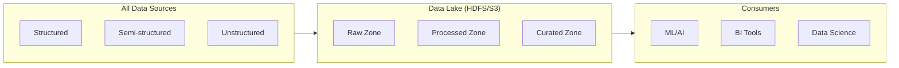

**Characteristics:**
- All data types (structured, semi-structured, unstructured)
- Schema-on-read (define schema when querying)
- Low cost storage (object storage)
- Poor data quality and reliability
- No ACID transactions → "Data Swamps"

**The Two-Tier Problem:**

Organizations ended up with both:

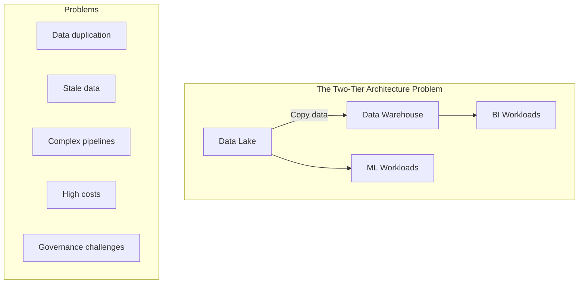

### 3.2 What is a Data Lakehouse?

A **Data Lakehouse** combines the best of Data Lakes and Data Warehouses:

$$
\text{Lakehouse} = \text{Data Lake (flexibility, low cost)} + \text{Data Warehouse (reliability, governance)}
$$

**The Lakehouse Vision:**

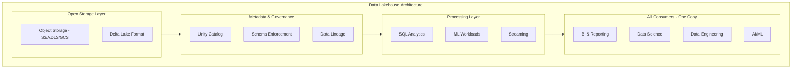

**Key Lakehouse Principles:**

| Principle | Description | Benefit |
|-----------|-------------|---------|
| **Open Formats** | Data stored in open formats (Parquet, Delta) | No vendor lock-in |
| **ACID Transactions** | Reliable updates like a database | Data consistency |
| **Schema Enforcement** | Ensure data quality at write time | Prevent bad data |
| **Time Travel** | Access previous versions of data | Auditing, rollback |
| **Unified Access** | Same data for all workloads | No data silos |
| **Direct Access** | Query data where it lives | No data copying |

### 3.3 Delta Lake: The Foundation

**What is Delta Lake?**

Delta Lake is an open-source storage layer that brings reliability to Data Lakes. It's the technology that makes Lakehouse possible.

**How Delta Lake Works:**

Delta Lake stores data as Parquet files plus a transaction log:

```
delta_table/
├── _delta_log/                    # Transaction Log
│   ├── 00000000000000000000.json  # Version 0 - Initial write
│   ├── 00000000000000000001.json  # Version 1 - Update
│   ├── 00000000000000000002.json  # Version 2 - Delete
│   └── 00000000000000000003.json  # Version 3 - Insert
├── part-00000-xyz.parquet         # Data files
├── part-00001-abc.parquet
└── part-00002-def.parquet
```

**The Transaction Log Explained:**

Each JSON file in `_delta_log` records what happened:

```json
// 00000000000000000001.json (Version 1 - an UPDATE)
{
  "add": {
    "path": "part-00003-new.parquet",
    "size": 1024,
    "modificationTime": 1699000000000,
    "dataChange": true
  },
  "remove": {
    "path": "part-00001-old.parquet",
    "deletionTimestamp": 1699000000000
  }
}
```

**Delta Lake Features:**

| Feature | Description | Example |
|---------|-------------|---------|
| **ACID Transactions** | Atomic, Consistent, Isolated, Durable operations | Multiple users can write simultaneously |
| **Time Travel** | Query historical versions | `SELECT * FROM table VERSION AS OF 5` |
| **Schema Evolution** | Add columns without breaking queries | `ALTER TABLE ADD COLUMN new_col` |
| **Schema Enforcement** | Reject invalid data | Writing wrong types fails |
| **Audit History** | Track all changes | `DESCRIBE HISTORY table` |
| **Upserts (MERGE)** | Update/Insert in one operation | CDC processing |
| **Optimize & Z-Order** | Compact files and co-locate data | Faster queries |

**Time Travel Example:**

```sql
-- Query current version
SELECT * FROM sales;

-- Query as of specific version
SELECT * FROM sales VERSION AS OF 5;

-- Query as of specific timestamp
SELECT * FROM sales TIMESTAMP AS OF '2024-01-01';

-- Restore to previous version
RESTORE TABLE sales TO VERSION AS OF 5;
```

### 3.4 Lakehouse Architecture Components

```mermaid
flowchart TB
    subgraph LakehouseArch["Complete Lakehouse Architecture"]
        subgraph Ingestion["Data Ingestion"]
            BATCH[Batch - Auto Loader]
            STREAM[Streaming - Kafka, Event Hubs]
            CDC[Change Data Capture]
        end
        
        subgraph Storage["Storage Layer"]
            CLOUD[Cloud Object Storage]
            DELTA[Delta Lake Tables]
        end
        
        subgraph Processing["Processing & Transformation"]
            SPARK[Apache Spark]
            PHOTON[Photon Engine]
            DLT[Delta Live Tables]
        end
        
        subgraph Governance["Governance & Security"]
            UNITY[Unity Catalog]
            LINEAGE[Lineage Tracking]
            ACCESS[Fine-grained Access Control]
        end
        
        subgraph Serving["Serving Layer"]
            SQLW[SQL Warehouses]
            MLSERV[Model Serving]
            FEATURES[Feature Store]
        end
        
        subgraph Consumption["Consumption"]
            BITOOLS[BI Tools - Tableau, Power BI]
            MLOPS[MLOps - MLflow]
            APPS[Applications]
        end
    end
    
    Ingestion --> Storage
    Storage --> Processing
    Processing --> Governance
    Governance --> Serving
    Serving --> Consumption
```

**Component Details:**

**1. Data Ingestion Layer**
- **Auto Loader**: Incrementally ingests new files from cloud storage
- **Streaming**: Real-time ingestion from Kafka, Event Hubs, Kinesis
- **CDC (Change Data Capture)**: Captures changes from operational databases

**2. Storage Layer**
- **Cloud Object Storage**: S3, Azure Data Lake Storage (ADLS), Google Cloud Storage
- **Delta Lake**: Adds reliability layer on top of object storage

**3. Processing Layer**
- **Apache Spark**: Core processing engine
- **Photon Engine**: C++ vectorized engine (2-8x faster)
- **Delta Live Tables (DLT)**: Declarative ETL framework

**4. Governance Layer**
- **Unity Catalog**: Centralized governance for all data assets
- **Data Lineage**: Track data flow and dependencies
- **Access Control**: Row/column level security

**5. Serving Layer**
- **SQL Warehouses**: Serverless SQL compute
- **Model Serving**: Deploy ML models as endpoints
- **Feature Store**: Manage ML features

### 3.5 ACID Transactions in Lakehouse

**What are ACID Properties?**

ACID ensures data reliability:

$$
\text{ACID} = \text{Atomicity} + \text{Consistency} + \text{Isolation} + \text{Durability}
$$

| Property | Definition | Example |
|----------|------------|---------|
| **Atomicity** | All operations succeed or all fail | Bank transfer: debit AND credit both happen or neither |
| **Consistency** | Data always valid after transaction | Balance never negative |
| **Isolation** | Concurrent transactions don't interfere | Two users updating same record |
| **Durability** | Committed data survives failures | Power outage doesn't lose committed data |

**How Delta Lake Achieves ACID:**

1. **Optimistic Concurrency Control**: 
   - Writers don't block each other
   - Conflicts detected at commit time
   - Automatic retry with serialization

2. **Write-Ahead Log (WAL)**:
   - Changes recorded in log before data files
   - Enables recovery from failures

3. **Atomic Commits**:
   - New log entry = transaction complete
   - Incomplete writes ignored

**Concurrent Write Example:**

```
Time    Writer 1              Writer 2              Table State
────────────────────────────────────────────────────────────────
T1      Start transaction     -                     Version 0
T2      Read version 0        Start transaction     Version 0
T3      -                     Read version 0        Version 0
T4      Write new files       -                     Version 0
T5      Commit → Version 1    Write new files       Version 1
T6      -                     Commit attempt        CONFLICT!
T7      -                     Retry: Read V1        Version 1
T8      -                     Commit → Version 2    Version 2
```

### 3.6 Medallion Architecture

The **Medallion Architecture** (also called Multi-Hop Architecture) is a design pattern for organizing data in a Lakehouse:

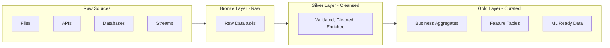

**Medallion Layers Explained:**

| Layer | Also Called | Purpose | Data Quality | Example |
|-------|-------------|---------|--------------|---------|
| **Bronze** | Raw, Landing | Store raw data exactly as received | Low - may have errors, duplicates | Raw JSON from IoT sensors |
| **Silver** | Cleansed, Validated | Clean, validate, deduplicate | Medium - business rules applied | Parsed, typed, deduplicated sensor readings |
| **Gold** | Curated, Aggregated | Business-ready aggregations | High - analytics ready | Hourly averages by location |

**Bronze Layer Characteristics:**
- Raw data "as-is" from source
- No transformations (or minimal)
- Append-only writes
- Full history preserved
- Schema-on-read

**Silver Layer Characteristics:**
- Cleaned and validated data
- Deduplication applied
- Data types enforced
- Joined with reference data
- Schema enforced (schema-on-write)

**Gold Layer Characteristics:**
- Business-level aggregations
- Denormalized for query performance
- Optimized for specific use cases
- May have multiple gold tables per domain

**Example: E-commerce Data Pipeline:**

```
Bronze: raw_orders
├── Raw JSON from order service
├── Contains duplicates, nulls, wrong types
├── All historical orders preserved

Silver: cleaned_orders
├── Parsed JSON to columns
├── Removed duplicates
├── Validated order amounts
├── Joined with customer dimension

Gold: daily_sales_summary
├── Aggregated by day, region, product category
├── Calculated metrics (AOV, conversion rate)
├── Ready for BI dashboards
```

---

## 4. Databricks Workspace Structure

### 4.1 Workspace Overview

The Databricks Workspace is your central hub for all data operations. Think of it as your "home base" where you access notebooks, data, compute resources, and more.

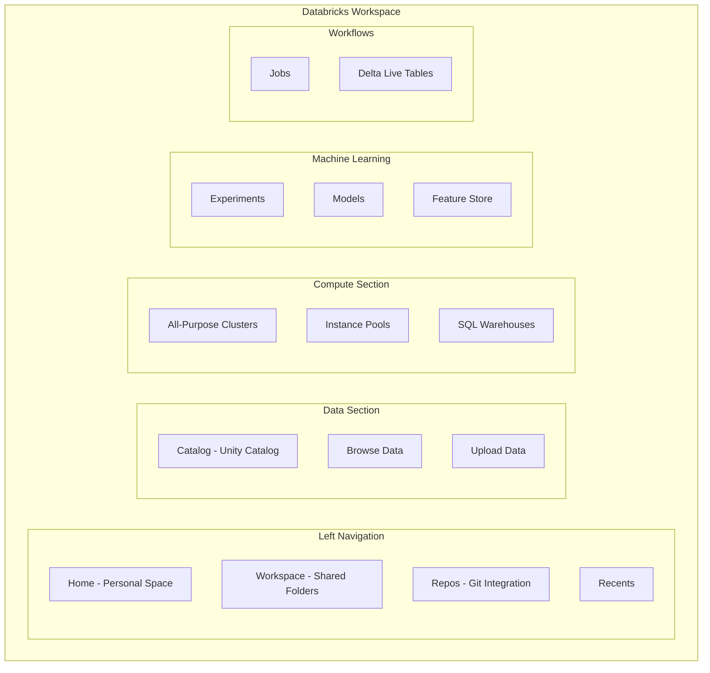

### 4.2 Navigation and Components

**Main Navigation Areas:**

| Area | Icon | Purpose | Key Features |
|------|------|---------|--------------|
| **Home** | 🏠 | Personal workspace | Your notebooks, files, recently accessed |
| **Workspace** | 📁 | Shared folders | Collaborate with team members |
| **Repos** | 📂 | Git integration | Version control, CI/CD |
| **Catalog** | 🗃️ | Data governance | Unity Catalog, schemas, tables |
| **Workflows** | ⚙️ | Job orchestration | Scheduled runs, dependencies |
| **Compute** | 💻 | Resources | Clusters, SQL Warehouses |
| **Machine Learning** | 🤖 | ML lifecycle | Experiments, models, serving |

**Workspace Folder Structure:**

```
Workspace/
├── Users/
│   ├── your.email@company.com/  # Personal folder
│   │   ├── Notebooks/
│   │   ├── Experiments/
│   │   └── Libraries/
│   └── other.user@company.com/
├── Shared/                       # Team-shared content
│   ├── Projects/
│   └── Common Libraries/
└── Repos/                        # Git repositories
    ├── project-repo/
    └── ml-pipeline-repo/
```

### 4.3 Compute Resources

Databricks offers different types of compute resources for different workloads:

**Compute Types Comparison:**

| Compute Type | Best For | Scaling | Cost Model | Start Time |
|--------------|----------|---------|------------|------------|
| **All-Purpose Cluster** | Development, exploration, interactive work | Manual or auto-scale | Pay while running | 2-5 minutes |
| **Job Cluster** | Production jobs | Auto-scale | Pay per job | 2-5 minutes |
| **SQL Warehouse** | SQL analytics, BI | Serverless auto-scale | Pay per query | 10-30 seconds |
| **Instance Pool** | Pre-warmed instances | Pool + clusters | Pay for idle + active | Seconds |

**Cluster Configuration Options:**

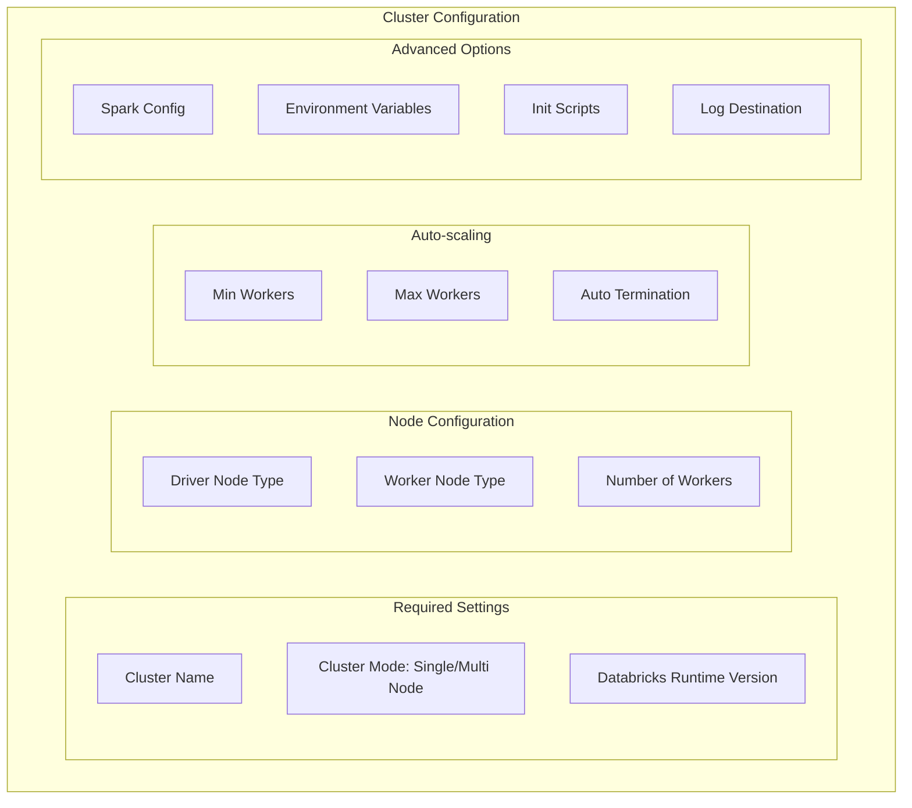

**Cluster Modes Explained:**

1. **Standard Mode (Multi-Node)**
   - Driver + Worker nodes
   - For production workloads
   - Can scale workers

2. **Single Node Mode**
   - One node for driver and compute
   - For small datasets, learning
   - Lower cost

**Databricks Runtime (DBR) Versions:**

| Runtime Type | Use Case | Includes |
|--------------|----------|----------|
| **Standard** | General workloads | Spark, Python, R, Scala |
| **ML Runtime** | Machine Learning | + PyTorch, TensorFlow, XGBoost |
| **Photon Runtime** | SQL-heavy workloads | + Photon engine |
| **GPU Runtime** | Deep Learning | + CUDA, GPU libraries |

### 4.4 Data Explorer

The Data Explorer (Catalog) provides a unified view of all your data assets:

**Catalog Hierarchy:**

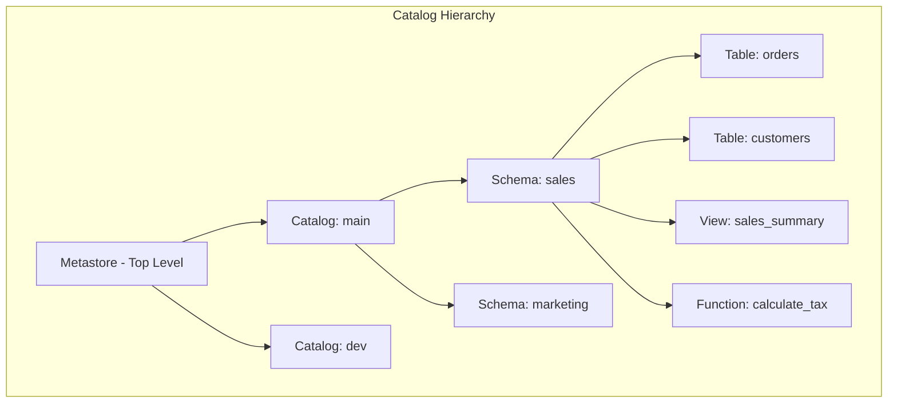

**Three-Level Namespace:**

In Unity Catalog, every data asset has a three-part name:

$$
\text{Full Table Name} = \text{catalog}.\text{schema}.\text{table}
$$

Example: `main.sales.orders`

**Data Explorer Features:**

| Feature | Description | How to Use |
|---------|-------------|------------|
| **Browse Tables** | Navigate catalog/schema/table hierarchy | Click through left panel |
| **View Schema** | See columns, types, descriptions | Click table → Schema tab |
| **Sample Data** | Preview rows | Click table → Sample Data tab |
| **History** | View table versions | Click table → History tab |
| **Permissions** | Manage access | Click table → Permissions tab |
| **Lineage** | Track data flow | Click table → Lineage tab |

### 4.5 Notebooks

Databricks notebooks are interactive documents for code, visualizations, and narrative text.

**Notebook Features:**

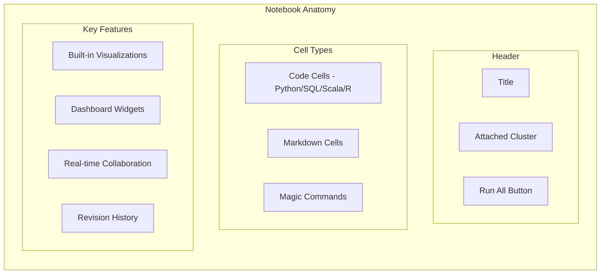

**Supported Languages:**

| Language | Magic Command | Use Case |
|----------|---------------|----------|
| Python | `%python` (default) | General programming, ML |
| SQL | `%sql` | Data queries, exploration |
| Scala | `%scala` | Performance-critical code |
| R | `%r` | Statistical analysis |
| Markdown | `%md` | Documentation |
| Shell | `%sh` | System commands |
| File System | `%fs` | DBFS operations |

**Magic Commands Explained:**

```python
# Run SQL from Python notebook
%sql
SELECT * FROM sales.orders LIMIT 10

# Run shell command
%sh
ls -la /dbfs/

# File system operations
%fs
ls /mnt/data/

# Run Python in another cell type
%python
df = spark.sql("SELECT * FROM sales.orders")

# Markdown for documentation
%md
# This is a Header
This is explanation text.
```

**Notebook Widgets (Interactive Parameters):**

```python
# Create widgets
dbutils.widgets.text("start_date", "2024-01-01", "Start Date")
dbutils.widgets.dropdown("region", "US", ["US", "EU", "APAC"], "Region")
dbutils.widgets.multiselect("products", "All", ["All", "A", "B", "C"], "Products")

# Get widget values
start_date = dbutils.widgets.get("start_date")
region = dbutils.widgets.get("region")

# Use in queries
df = spark.sql(f"""
    SELECT * FROM sales 
    WHERE date >= '{start_date}' 
    AND region = '{region}'
""")
```

### 4.6 Jobs and Workflows

**Jobs** automate notebook execution on schedules or triggers.

**Workflow Components:**

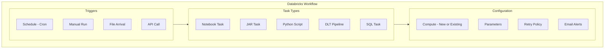

**Multi-Task Workflow Example:**

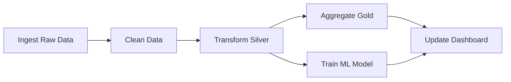

---

## 5. Industry Use Cases

### 5.1 Netflix: Real-time Streaming Analytics

**The Challenge:**

Netflix serves 230+ million subscribers with 1+ billion hours of content watched weekly. They need to:
- Track viewing behavior in real-time
- Personalize recommendations instantly
- Monitor stream quality across devices
- Optimize content delivery globally

**The Solution with Databricks:**

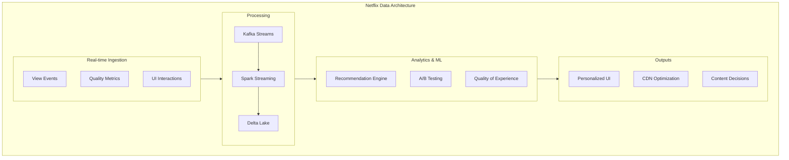

**Key Implementations:**

| Use Case | Technology | Benefit |
|----------|------------|---------|
| **Real-time Recommendations** | Spark Streaming + ML | Personalized rows update instantly |
| **A/B Testing Platform** | Delta Lake + SQL Analytics | Test 100s of UI variants simultaneously |
| **Content Analytics** | Medallion Architecture | Understand viewing patterns at scale |
| **Stream Quality Monitoring** | Structured Streaming | Detect and fix issues in seconds |

**Scale Numbers:**
- 1.5 trillion events/day processed
- 100+ petabytes in data lake
- Recommendations updated every 10 seconds
- 1000s of A/B tests running concurrently

### 5.2 Shell: Energy and IoT Analytics

**The Challenge:**

Shell operates 45,000+ retail stations, refineries, and offshore platforms globally. They need to:
- Process IoT sensor data from equipment
- Predict maintenance needs
- Optimize energy production
- Ensure safety compliance

**The Solution with Databricks:**

```mermaid
flowchart TB
    subgraph ShellArch["Shell IoT Architecture"]
        subgraph Sources["IoT Sources"]
            SENSOR[Equipment Sensors]
            SCADA[SCADA Systems]
            GEO[Geological Data]
        end
        
        subgraph Ingestion["Edge + Cloud Ingestion"]
            EDGE[Edge Processing]
            IOT[IoT Hub]
        end
        
        subgraph Lakehouse["Databricks Lakehouse"]
            BRONZE[Bronze: Raw Sensor Data]
            SILVER[Silver: Cleaned Time Series]
            GOLD[Gold: Aggregated Metrics]
        end
        
        subgraph ML["Predictive Analytics"]
            PdM[Predictive Maintenance]
            ANOM[Anomaly Detection]
            OPT[Production Optimization]
        end
        
        subgraph Actions["Actions"]
            ALERT[Maintenance Alerts]
            AUTO[Automated Adjustments]
            REPORT[Compliance Reports]
        end
    end
    
    Sources --> Ingestion --> Lakehouse --> ML --> Actions
```

**Key Implementations:**

| Use Case | Implementation | Impact |
|----------|----------------|--------|
| **Predictive Maintenance** | ML on sensor data | 30% reduction in unplanned downtime |
| **Real-time Monitoring** | Streaming anomaly detection | Detect equipment issues in minutes |
| **Energy Optimization** | ML for production tuning | 15% improvement in efficiency |
| **Safety Analytics** | Pattern recognition | Prevent incidents before they happen |

**Technical Details:**
- 1 million+ sensors monitored
- Microsecond-level time series data
- Delta Lake for time travel (regulatory compliance)
- Unity Catalog for data governance

### 5.3 Comcast: Customer Experience Analytics

**The Challenge:**

Comcast serves 30+ million internet customers. They need to:
- Monitor network health in real-time
- Predict and prevent outages
- Understand customer experience
- Enable self-service troubleshooting

**The Solution with Databricks:**

```mermaid
flowchart TB
    subgraph ComcastArch["Comcast Data Platform"]
        subgraph Data["Data Sources"]
            MODEM[Modem Telemetry]
            TICKETS[Support Tickets]
            CALLS[Call Center Logs]
            NETWORK[Network Events]
        end
        
        subgraph Platform["Databricks Platform"]
            INGEST[Auto Loader]
            DELTA[Delta Lake]
            MLFLOW[MLflow]
        end
        
        subgraph Models["AI/ML Models"]
            CHURN[Churn Prediction]
            OUTAGE[Outage Prediction]
            NLP[Call Center NLP]
        end
        
        subgraph Experience["Customer Experience"]
            APP[Mobile App Insights]
            PROACTIVE[Proactive Support]
            SELF[Self-Service Tools]
        end
    end
    
    Data --> Platform --> Models --> Experience
```

**Key Implementations:**

| Use Case | Technology | Customer Impact |
|----------|------------|-----------------|
| **Network Health Scoring** | Streaming + ML | Proactive issue resolution |
| **Outage Prediction** | Time series forecasting | Prevent issues before they happen |
| **Call Center Analytics** | NLP on transcripts | Faster issue resolution |
| **Customer 360** | Unified data platform | Personalized experience |

**Results:**
- 40% reduction in truck rolls (technician visits)
- Real-time visibility into 30M+ modems
- Proactive notifications before customers notice issues
- Unified view of customer interactions

### 5.4 Other Notable Use Cases

| Company | Industry | Use Case | Scale |
|---------|----------|----------|-------|
| **Walgreens** | Retail | Personalization, inventory optimization | 9,000 stores, real-time pricing |
| **CVS Health** | Healthcare | Patient analytics, drug interactions | 10,000 pharmacies, clinical data |
| **T-Mobile** | Telecom | Network analytics, churn prediction | 100M+ customers |
| **Regeneron** | Pharma | Genomics research, drug discovery | Petabytes of genetic data |
| **HSBC** | Banking | Fraud detection, risk modeling | Real-time transaction scoring |
| **Condé Nast** | Media | Content recommendations, ad targeting | Billions of content interactions |

---

## 6. Hands-On Tasks

### 6.1 Task 1: Create Databricks Community Edition Account

**What is Community Edition?**

Databricks Community Edition is a free version of Databricks ideal for learning:
- Single-node cluster (15GB memory)
- No time limit
- Access to notebooks, DBFS, sample data
- No credit card required

**Step-by-Step Account Creation:**

**Step 1: Navigate to Signup Page**

Go to: `https://community.cloud.databricks.com/login.html`

Click "Sign Up" at the bottom of the login form.

**Step 2: Fill Registration Form**

Provide the following information:
- First Name
- Last Name
- Company/Organization (can be "Personal")
- Email Address
- Password (minimum 8 characters)

**Step 3: Select Community Edition**

Important: When asked about cloud provider, look for and click "Get started with Community Edition" link at the bottom. Do not select AWS/Azure/GCP as those require cloud accounts.

**Step 4: Verify Email**

Check your inbox for verification email from Databricks and click the verification link.

**Step 5: Complete Setup**

After verification, you'll be redirected to your Community Edition workspace. Take a moment to explore the interface.

**Community Edition Limitations:**

| Feature | Community Edition | Full Databricks |
|---------|-------------------|-----------------|
| Cluster Size | Single node, 15GB | Unlimited nodes |
| Cluster Runtime | Auto-terminate after 2 hours | Configurable |
| Cloud Provider | AWS (managed by Databricks) | AWS, Azure, GCP |
| Unity Catalog | Not available | Full access |
| Jobs/Workflows | Limited | Full access |
| SQL Warehouses | Not available | Available |
| Collaboration | Limited | Full real-time |
| Data Storage | 10GB DBFS | Unlimited |

### 6.2 Task 2: Navigate Workspace, Compute, Data Explorer

**Part A: Explore the Workspace**

**Step 1: Home Section**

After logging in, you land on the Home page. Here you'll see:
- Recently accessed notebooks
- Quick actions (Create Notebook, Create Folder)
- Sample notebooks from Databricks

**Step 2: Create a Personal Folder**

1. Click on "Workspace" in the left sidebar
2. Click on your email folder under "Users"
3. Right-click and select "Create" → "Folder"
4. Name it "Learning" or "Projects"

**Step 3: Explore Sample Notebooks**

1. Navigate to Workspace → Users → your email
2. Look for "Databricks Notebooks" folder
3. Open any sample notebook to see examples

**Part B: Navigate Compute Resources**

**Step 1: Access Compute**

Click on "Compute" in the left sidebar. You'll see the cluster management interface.

**Step 2: Create Your First Cluster**

1. Click "Create Cluster" button
2. Configure the cluster with the following settings:

| Setting | Value | Explanation |
|---------|-------|-------------|
| Cluster Name | learning-cluster | Descriptive name |
| Cluster Mode | Single Node | Only option in Community Edition |
| Databricks Runtime | Latest LTS (e.g., 14.3 LTS) | Long-term support version |
| Terminate After | 120 minutes | Auto-stop to save resources |

3. Click "Create Cluster"
4. Wait 2-5 minutes for cluster to start (status changes to "Running")

**Step 3: Understand Cluster States**

| State | Icon | Meaning |
|-------|------|---------|
| Pending | Yellow spinner | Starting up |
| Running | Green dot | Ready to use |
| Terminating | Yellow | Shutting down |
| Terminated | Gray | Stopped |

**Part C: Explore Data Explorer**

**Step 1: Access Data**

Click on "Data" in the left sidebar.

**Step 2: Explore DBFS (Databricks File System)**

1. Click "DBFS" tab
2. Navigate through folders:
   - `/databricks-datasets/` - Sample datasets
   - `/FileStore/` - Your uploaded files
   - `/mnt/` - Mounted storage (if configured)

**Step 3: Browse Sample Datasets**

Navigate to `/databricks-datasets/` and explore:
- `samples/` - Small datasets for learning
- `nyctaxi/` - NYC Taxi trip data
- `flights/` - Flight delay data
- `songs/` - Million Song dataset

### 6.3 Task 3: Create Your First Notebook

**Step 1: Create New Notebook**

1. Navigate to Workspace → Users → your email → Learning (folder you created)
2. Right-click in the folder
3. Select "Create" → "Notebook"
4. Configure notebook settings:

| Setting | Value |
|---------|-------|
| Name | my-first-notebook |
| Default Language | Python |
| Cluster | learning-cluster (select your running cluster) |

**Step 2: Understand Notebook Interface**

Your new notebook has these elements:
- **Title Bar**: Notebook name, attached cluster, Run All button
- **Menu Bar**: File, Edit, View, Cell, Run, etc.
- **Cell**: Where you write code or text
- **Add Cell Buttons**: + Code, + Markdown between cells

**Step 3: Write Your First Cells**

In the first cell (which is empty), add a markdown header:

```python
%md
# My First Databricks Notebook

Welcome to my learning journey with Databricks!

## What I'll Learn Today
- Basic PySpark operations
- Working with DataFrames
- Running SQL queries
```

Run the cell by pressing `Shift + Enter` or clicking the play button.

**Step 4: Add a Python Cell**

Click "+ Code" to add a new code cell. Write a simple Python code:

```python
# Simple Python - runs without Spark
print("Hello, Databricks!")

# Check Python version
import sys
print(f"Python version: {sys.version}")
```

Run this cell with `Shift + Enter`.

### 6.4 Task 4: Run Basic PySpark Commands

Now let's work with Spark. Add new cells and run each:

**Cell 1: Verify Spark Session**

```python
# Spark is pre-configured in Databricks
# The SparkSession is available as 'spark'

print(f"Spark Version: {spark.version}")
print(f"Spark App Name: {spark.sparkContext.appName}")
```

**Cell 2: Create a Simple DataFrame**

```python
# Method 1: Create DataFrame from Python list
data = [
    ("Alice", 25, "Engineer"),
    ("Bob", 30, "Data Scientist"),
    ("Charlie", 35, "Manager"),
    ("Diana", 28, "Analyst")
]

columns = ["name", "age", "role"]

# Create DataFrame
df = spark.createDataFrame(data, columns)

# Display the DataFrame
display(df)
```

The `display()` function is a Databricks-specific feature that shows data in a rich, interactive table format.

**Cell 3: Basic DataFrame Operations**

```python
# Show DataFrame schema
df.printSchema()
```

Output will be:
```
root
 |-- name: string (nullable = true)
 |-- age: long (nullable = true)
 |-- role: string (nullable = true)
```

**Cell 4: Filtering Data**

```python
# Filter rows where age > 27
filtered_df = df.filter(df.age > 27)
display(filtered_df)
```

**Cell 5: Selecting Columns**

```python
# Select specific columns
names_df = df.select("name", "role")
display(names_df)
```

**Cell 6: Adding New Columns**

```python
from pyspark.sql.functions import col, lit

# Add a new column
df_with_bonus = df.withColumn("bonus", col("age") * 100)
display(df_with_bonus)
```

**Cell 7: Aggregations**

```python
from pyspark.sql.functions import avg, max, min, count

# Calculate average age
df.select(avg("age").alias("average_age")).show()

# Group by and aggregate
df.groupBy("role").agg(
    count("*").alias("count"),
    avg("age").alias("avg_age")
).show()
```

**Cell 8: Using SQL**

```python
# Register DataFrame as temporary view
df.createOrReplaceTempView("employees")
```

**Cell 9: Run SQL Query**

```sql
%sql
-- Now we can query using SQL
SELECT * FROM employees WHERE age > 25 ORDER BY age DESC
```

**Cell 10: Complex SQL**

```sql
%sql
-- Aggregation with SQL
SELECT 
    role,
    COUNT(*) as employee_count,
    ROUND(AVG(age), 2) as avg_age,
    MIN(age) as youngest,
    MAX(age) as oldest
FROM employees
GROUP BY role
ORDER BY employee_count DESC
```

**Cell 11: Load Sample Data**

```python
# Load a sample dataset from Databricks
flights_df = spark.read.format("csv") \
    .option("header", "true") \
    .option("inferSchema", "true") \
    .load("/databricks-datasets/flights/departuredelays.csv")

# Show first 10 rows
display(flights_df.limit(10))
```

**Cell 12: Explore the Dataset**

```python
# Count rows
print(f"Total flights: {flights_df.count():,}")

# Show schema
flights_df.printSchema()
```

**Cell 13: Analyze Flight Delays**

```python
from pyspark.sql.functions import col, avg, sum

# Average delay by origin
avg_delay_by_origin = flights_df \
    .groupBy("origin") \
    .agg(avg("delay").alias("avg_delay")) \
    .orderBy(col("avg_delay").desc()) \
    .limit(10)

display(avg_delay_by_origin)
```

**Cell 14: Save Results**

```python
# Save as Delta table
avg_delay_by_origin.write \
    .format("delta") \
    .mode("overwrite") \
    .saveAsTable("default.flight_delays_by_origin")

print("Table saved successfully!")
```

**Cell 15: Query Saved Table**

```sql
%sql
-- Query the saved Delta table
SELECT * FROM default.flight_delays_by_origin
ORDER BY avg_delay DESC
LIMIT 5
```

---

## 7. Quick Reference

### Common PySpark Operations

| Operation | PySpark Code | SQL Equivalent |
|-----------|--------------|----------------|
| Select columns | `df.select("col1", "col2")` | `SELECT col1, col2 FROM table` |
| Filter rows | `df.filter(df.col > 5)` | `WHERE col > 5` |
| Add column | `df.withColumn("new", col("x")*2)` | `SELECT *, x*2 as new` |
| Rename column | `df.withColumnRenamed("old", "new")` | `SELECT old as new` |
| Drop column | `df.drop("col")` | Select all except col |
| Group by | `df.groupBy("col").agg(...)` | `GROUP BY col` |
| Order by | `df.orderBy("col")` | `ORDER BY col` |
| Distinct | `df.distinct()` | `SELECT DISTINCT` |
| Count | `df.count()` | `SELECT COUNT(*)` |
| Join | `df1.join(df2, "key")` | `JOIN table2 ON key` |

### Databricks Magic Commands

| Command | Purpose | Example |
|---------|---------|---------|
| `%python` | Run Python code | Default in Python notebooks |
| `%sql` | Run SQL query | `%sql SELECT * FROM table` |
| `%scala` | Run Scala code | For Scala operations |
| `%r` | Run R code | For R statistical analysis |
| `%md` | Render Markdown | Documentation |
| `%sh` | Run shell command | `%sh ls -la` |
| `%fs` | DBFS file operations | `%fs ls /mnt/` |
| `%run` | Run another notebook | `%run ./other_notebook` |

### Cluster Sizing Guidelines

| Data Size | Recommended Cluster | Workers |
|-----------|---------------------|---------|
| < 10 GB | Single Node | 0 |
| 10-100 GB | Small Multi-node | 2-4 |
| 100 GB - 1 TB | Medium | 4-8 |
| 1-10 TB | Large | 8-16 |
| 10+ TB | X-Large | 16+ |

---

## 8. Glossary

| Term | Definition |
|------|------------|
| **ACID** | Atomicity, Consistency, Isolation, Durability - properties ensuring reliable database transactions |
| **Auto Loader** | Databricks feature that incrementally and efficiently processes new data files as they arrive in cloud storage |
| **Bronze Layer** | The raw data layer in Medallion Architecture, containing data exactly as received from sources |
| **Cluster** | A set of computation resources (VMs) that run Spark jobs |
| **DataFrame** | A distributed collection of data organized into named columns, similar to a table in a relational database |
| **DBFS** | Databricks File System - distributed file system mounted in Databricks workspace |
| **Delta Lake** | Open-source storage layer that provides ACID transactions and scalable metadata handling |
| **Delta Live Tables (DLT)** | Declarative ETL framework for building reliable data pipelines |
| **Driver Node** | The node that coordinates Spark job execution and interacts with users |
| **Gold Layer** | The business-level aggregation layer in Medallion Architecture, containing curated and analytics-ready data |
| **Lakehouse** | Data architecture that combines data lake flexibility with data warehouse reliability |
| **Medallion Architecture** | Data design pattern organizing data into Bronze, Silver, and Gold layers |
| **MLflow** | Open-source platform for managing the ML lifecycle |
| **Partition** | A logical division of data for distributed processing |
| **Photon** | Databricks' C++ vectorized query engine providing significant performance improvements |
| **RDD** | Resilient Distributed Dataset - fundamental data structure in Spark |
| **Schema Enforcement** | Ensuring data conforms to a defined structure before writing |
| **Schema Evolution** | Ability to change table schema (add/modify columns) over time |
| **Silver Layer** | The cleansed and validated data layer in Medallion Architecture |
| **Spark Session** | Entry point for Spark functionality, automatically created in Databricks as `spark` |
| **SQL Warehouse** | Serverless compute optimized for SQL analytics workloads |
| **Time Travel** | Delta Lake feature allowing queries on historical versions of data |
| **Unity Catalog** | Unified governance solution for all data assets in Databricks |
| **Worker Node** | Nodes that execute the actual computation in a Spark cluster |
| **Workspace** | The Databricks environment containing notebooks, libraries, and data |

---

## Summary

This guide covered the foundational concepts of Databricks:

1. **Why Databricks?** - Unified platform solving limitations of Pandas (single-machine, memory-bound) and Hadoop (disk-based, complex) through optimized Spark with enterprise features.

2. **Lakehouse Architecture** - Combines data lake flexibility with data warehouse reliability using Delta Lake for ACID transactions, time travel, and schema enforcement.

3. **Medallion Architecture** - Organizes data into Bronze (raw), Silver (cleansed), and Gold (curated) layers for progressive data quality improvement.

4. **Workspace Structure** - Central hub for notebooks, compute, data, and workflows with collaborative features.

5. **Industry Applications** - Netflix (streaming analytics), Shell (IoT/predictive maintenance), Comcast (customer experience) demonstrate real-world scale and impact.

6. **Hands-On Practice** - Account creation, workspace navigation, notebook creation, and basic PySpark operations provide practical foundation.

The journey from single-machine Pandas to distributed Databricks represents the evolution of data processing, enabling organizations to handle massive scale while maintaining reliability, governance, and collaborative capabilities.

---

*Created for Gen AI Guru YouTube Channel - Comprehensive Databricks Learning Series*