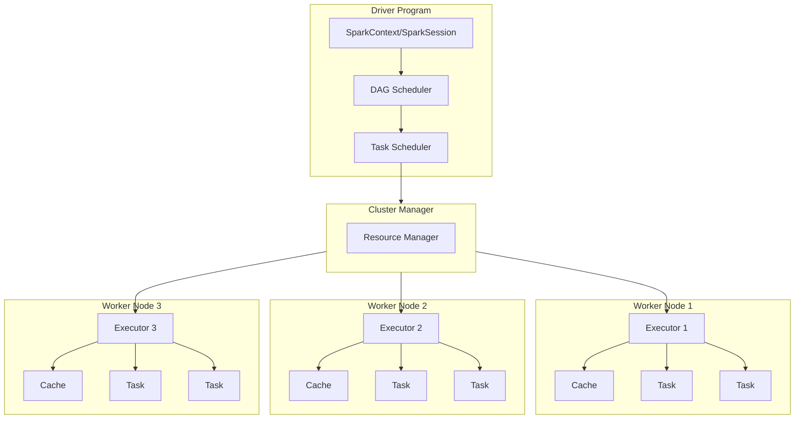
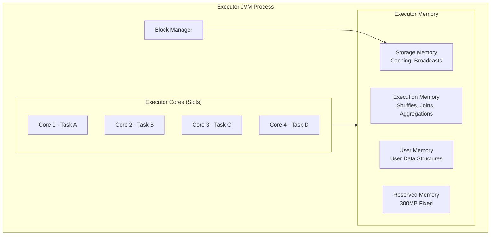
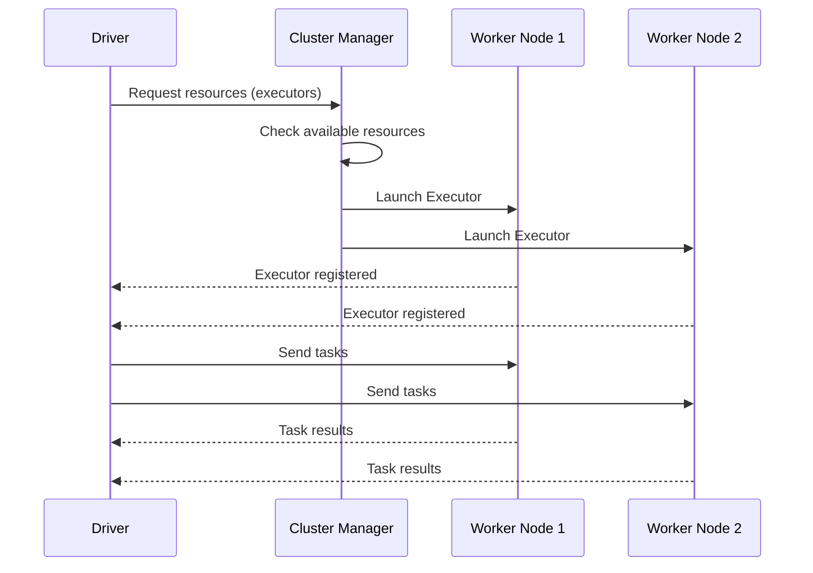
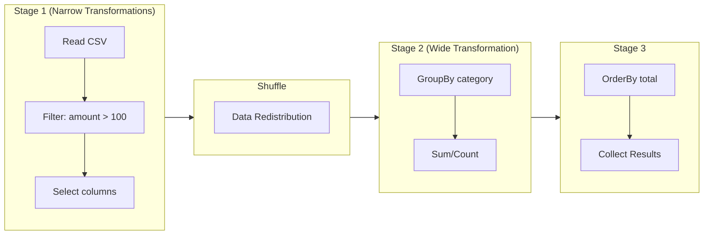
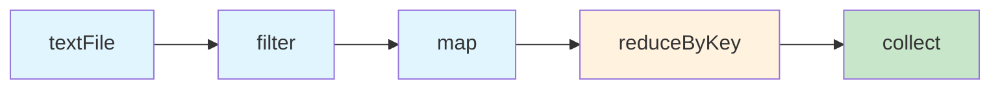
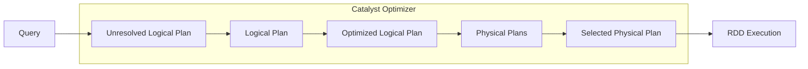
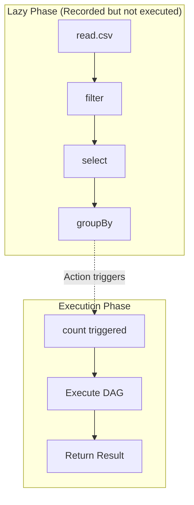
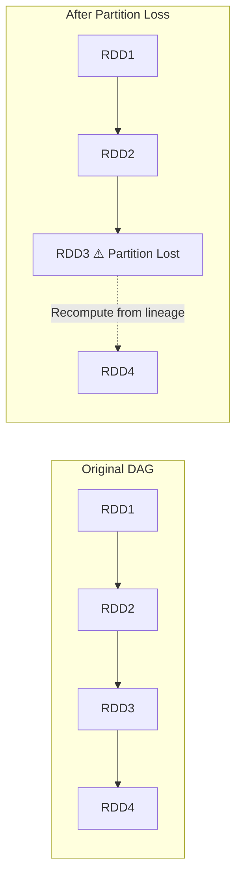

# Apache Spark Fundamentals: Complete Guide

## Table of Contents

1. [Introduction to Apache Spark](#1-introduction-to-apache-spark)
2. [Spark Architecture Deep Dive](#2-spark-architecture-deep-dive)
   - [Driver Program](#21-driver-program)
   - [Executors](#22-executors)
   - [Cluster Manager](#23-cluster-manager)
   - [DAG (Directed Acyclic Graph)](#24-dag-directed-acyclic-graph)
3. [DataFrames vs RDDs](#3-dataframes-vs-rdds)
   - [What is RDD?](#31-what-is-rdd)
   - [What is DataFrame?](#32-what-is-dataframe)
   - [Detailed Comparison](#33-detailed-comparison)
   - [When to Use What](#34-when-to-use-what)
4. [Lazy Evaluation](#4-lazy-evaluation)
   - [Understanding Lazy Evaluation](#41-understanding-lazy-evaluation)
   - [Transformations vs Actions](#42-transformations-vs-actions)
   - [Benefits of Lazy Evaluation](#43-benefits-of-lazy-evaluation)
5. [Notebook Magic Commands](#5-notebook-magic-commands)
6. [Practical Tasks: E-Commerce Data Analysis](#6-practical-tasks-e-commerce-data-analysis)
   - [Task 1: Upload Sample E-Commerce CSV](#61-task-1-upload-sample-e-commerce-csv)
   - [Task 2: Read Data into DataFrame](#62-task-2-read-data-into-dataframe)
   - [Task 3: Basic DataFrame Operations](#63-task-3-basic-dataframe-operations)
   - [Task 4: Export Results](#64-task-4-export-results)
7. [Quick Reference](#7-quick-reference)
8. [Glossary](#8-glossary)

---

## 1. Introduction to Apache Spark

Apache Spark is an **open-source, distributed computing system** designed for fast, general-purpose cluster computing. It was developed at UC Berkeley's AMPLab in 2009 and later donated to the Apache Software Foundation.

**Why Spark?**

Before Spark, Hadoop MapReduce was the standard for big data processing. However, MapReduce had significant limitations:

- **Disk I/O bottleneck**: MapReduce writes intermediate results to disk after each map and reduce phase
- **Not suitable for iterative algorithms**: Machine learning algorithms that require multiple passes over data performed poorly
- **Complex programming model**: Writing MapReduce jobs required significant boilerplate code

Spark addresses these problems by:

- **In-memory computing**: Keeping data in RAM between operations (up to 100x faster than MapReduce for certain workloads)
- **Unified engine**: Supporting batch processing, streaming, SQL queries, machine learning, and graph processing
- **Rich APIs**: Providing high-level APIs in Python, Scala, Java, and R

**Spark Ecosystem Components:**

| Component | Purpose | Description |
|-----------|---------|-------------|
| Spark Core | Foundation | Basic functionality including task scheduling, memory management, fault recovery |
| Spark SQL | Structured Data | Working with structured data using SQL and DataFrames |
| Spark Streaming | Real-time Processing | Processing live data streams |
| MLlib | Machine Learning | Scalable machine learning library |
| GraphX | Graph Processing | Graph computation and analysis |

---

## 2. Spark Architecture Deep Dive

Understanding Spark's architecture is fundamental to writing efficient Spark applications. The architecture follows a **master-slave** pattern with three main components: Driver, Executors, and Cluster Manager.



### 2.1 Driver Program

The **Driver** is the **brain of the Spark application**. It runs the `main()` function and is responsible for:

**Key Responsibilities:**

1. **Creating SparkContext/SparkSession**: The entry point to any Spark functionality

```python
# SparkSession is the unified entry point (Spark 2.0+)
from pyspark.sql import SparkSession

spark = SparkSession.builder \
    .appName("MyApp") \
    .master("local[*]") \
    .config("spark.executor.memory", "4g") \
    .getOrCreate()

# SparkContext is automatically created within SparkSession
sc = spark.sparkContext
```

2. **Converting user code to tasks**: The Driver analyzes your code and creates a logical plan

3. **Scheduling tasks on executors**: The Driver determines which executor should run which task

4. **Maintaining metadata**: Information about the application, RDDs, and their partitions

**Driver Memory Considerations:**

The Driver needs sufficient memory to:
- Hold the application's metadata
- Collect results when using `collect()` action
- Broadcast variables to executors

```python
# Configuration for Driver memory
spark = SparkSession.builder \
    .config("spark.driver.memory", "2g") \
    .getOrCreate()
```

**Warning**: If you call `collect()` on a large dataset, it will pull all data to the Driver and may cause **OutOfMemoryError**.

### 2.2 Executors

**Executors** are the **worker processes** that actually execute the tasks. Each executor runs on a worker node in the cluster.

**Key Characteristics:**

| Aspect | Description |
|--------|-------------|
| Lifetime | Launched at the start of a Spark application and run for its entire lifetime |
| Tasks | Execute tasks assigned by the Driver and return results |
| Storage | Store data in memory or disk for cached RDDs/DataFrames |
| Threads | Each executor has multiple slots (cores) to run tasks in parallel |

**Executor Architecture:**



**Executor Configuration:**

```python
spark = SparkSession.builder \
    .config("spark.executor.memory", "4g") \      # Memory per executor
    .config("spark.executor.cores", "4") \        # Cores per executor
    .config("spark.executor.instances", "10") \   # Number of executors
    .getOrCreate()
```

**Memory Division in Executor:**

The executor memory is divided into regions:

$$\text{Total Executor Memory} = \text{Heap Memory} + \text{Off-Heap Memory}$$

For Heap Memory:

$$\text{Usable Memory} = (\text{Heap Memory} - 300\text{MB}) \times \text{spark.memory.fraction}$$

Where `spark.memory.fraction` defaults to 0.6 (60%).

The usable memory is further divided:
- **Storage Memory**: For caching RDDs/DataFrames (controlled by `spark.memory.storageFraction`, default 0.5)
- **Execution Memory**: For shuffles, joins, sorts, aggregations

### 2.3 Cluster Manager

The **Cluster Manager** is an external service that manages resources across the cluster. It allocates resources to applications and starts executors.

**Supported Cluster Managers:**

| Type | Description | Use Case |
|------|-------------|----------|
| **Standalone** | Spark's built-in cluster manager | Simple setup, learning, development |
| **YARN** | Hadoop's resource manager | Production Hadoop environments |
| **Mesos** | Apache Mesos resource manager | Multi-framework environments |
| **Kubernetes** | Container orchestration | Cloud-native deployments |
| **Local** | Single JVM on local machine | Development and testing |

**How Cluster Manager Works:**



### 2.4 DAG (Directed Acyclic Graph)

The **DAG** is Spark's secret weapon for optimization. When you write Spark code, the system doesn't execute it immediately. Instead, it builds a DAG of all the operations.

**Understanding DAG:**

- **Directed**: Operations flow in one direction (from input to output)
- **Acyclic**: No circular dependencies (operations don't loop back)
- **Graph**: A visual representation of computation stages

**How DAG Works:**

When you call an action (like `count()` or `collect()`), Spark:

1. **Builds Logical Plan**: Represents the sequence of transformations
2. **Optimizes the Plan**: Applies optimizations (predicate pushdown, column pruning, etc.)
3. **Creates Physical Plan**: Determines how to execute on the cluster
4. **Divides into Stages**: Separates operations by shuffle boundaries
5. **Creates Tasks**: Each stage is divided into tasks (one per partition)

**Example DAG Visualization:**



**Stages and Shuffles:**

Spark divides the DAG into **stages** based on **shuffle boundaries**:

- **Narrow Transformation**: Each input partition contributes to at most one output partition (map, filter, union). These can be pipelined in a single stage.
  
- **Wide Transformation**: Input partitions contribute to multiple output partitions (groupBy, reduceByKey, join). These require a shuffle and create a new stage.

```python
# Example showing DAG creation
df = spark.read.csv("sales.csv", header=True)     # Stage 1 begins
df_filtered = df.filter(df.amount > 100)           # Narrow - same stage
df_selected = df_filtered.select("product", "amount")  # Narrow - same stage

# Shuffle boundary - new stage
df_grouped = df_selected.groupBy("product").sum("amount")  # Wide transformation

# New stage after shuffle
df_sorted = df_grouped.orderBy("sum(amount)", ascending=False)  # May cause another shuffle

# Action triggers execution
df_sorted.show()  # Now the entire DAG executes
```

**DAG Scheduler Workflow:**

The DAG Scheduler works in the following steps:

$$\text{User Code} \xrightarrow{\text{parse}} \text{Logical Plan} \xrightarrow{\text{optimize}} \text{Physical Plan} \xrightarrow{\text{divide}} \text{Stages} \xrightarrow{\text{parallelize}} \text{Tasks}$$

---

## 3. DataFrames vs RDDs

Understanding the difference between RDDs and DataFrames is crucial for writing efficient Spark applications.

### 3.1 What is RDD?

**RDD (Resilient Distributed Dataset)** is the fundamental data structure of Spark. It's an immutable, distributed collection of objects.

**Key Properties:**

1. **Resilient**: Fault-tolerant through lineage information (can recompute lost partitions)
2. **Distributed**: Data is spread across multiple nodes in the cluster
3. **Dataset**: Collection of partitioned data

**Creating RDDs:**

```python
# From a collection
rdd = sc.parallelize([1, 2, 3, 4, 5])

# From a file
rdd = sc.textFile("hdfs://path/to/file.txt")

# From another RDD
rdd2 = rdd.map(lambda x: x * 2)
```

**RDD Operations:**

```python
# Transformations (return new RDD)
rdd.map(lambda x: x * 2)           # Apply function to each element
rdd.filter(lambda x: x > 2)        # Keep elements satisfying condition
rdd.flatMap(lambda x: x.split())   # Map + flatten results
rdd.distinct()                     # Remove duplicates
rdd.union(other_rdd)               # Combine two RDDs

# Actions (return values to driver)
rdd.collect()                      # Return all elements
rdd.count()                        # Count elements
rdd.first()                        # First element
rdd.take(5)                        # First 5 elements
rdd.reduce(lambda a, b: a + b)     # Aggregate elements
```

**RDD Lineage:**

RDDs track their lineage (the sequence of transformations that created them). This enables fault tolerance:



### 3.2 What is DataFrame?

**DataFrame** is a distributed collection of data organized into named columns, similar to a table in a relational database or a pandas DataFrame.

**Key Features:**

1. **Schema**: DataFrames have a defined schema (column names and types)
2. **Optimization**: Catalyst optimizer and Tungsten execution engine
3. **APIs**: Support for SQL and DataFrame DSL
4. **Interoperability**: Easy conversion to/from pandas, RDDs, and various file formats

**Creating DataFrames:**

```python
# From a file
df = spark.read.csv("data.csv", header=True, inferSchema=True)
df = spark.read.json("data.json")
df = spark.read.parquet("data.parquet")

# From an RDD with schema
from pyspark.sql.types import StructType, StructField, StringType, IntegerType

schema = StructType([
    StructField("name", StringType(), True),
    StructField("age", IntegerType(), True)
])

rdd = sc.parallelize([("Alice", 30), ("Bob", 25)])
df = spark.createDataFrame(rdd, schema)

# From a Python list
data = [("Alice", 30), ("Bob", 25)]
df = spark.createDataFrame(data, ["name", "age"])

# From pandas DataFrame
import pandas as pd
pandas_df = pd.DataFrame({"name": ["Alice", "Bob"], "age": [30, 25]})
df = spark.createDataFrame(pandas_df)
```

**DataFrame Operations:**

```python
# Show schema
df.printSchema()
# root
#  |-- name: string (nullable = true)
#  |-- age: integer (nullable = true)

# Basic operations
df.show()                          # Display data
df.select("name", "age")           # Select columns
df.filter(df.age > 25)             # Filter rows
df.groupBy("category").count()     # Aggregation
df.orderBy("age", ascending=False) # Sorting
df.withColumn("new_col", df.age * 2)  # Add column
df.drop("column_name")             # Remove column
```

### 3.3 Detailed Comparison

| Aspect | RDD | DataFrame |
|--------|-----|-----------|
| **Abstraction Level** | Low-level | High-level |
| **Schema** | No schema (unstructured) | Has schema (structured) |
| **Optimization** | No automatic optimization | Catalyst optimizer + Tungsten |
| **Type Safety** | Compile-time type safety (Scala) | Runtime type checking |
| **Performance** | Slower (no optimization) | Faster (optimized execution) |
| **Memory Usage** | Higher (Java object overhead) | Lower (off-heap + columnar) |
| **APIs** | Functional transformations | SQL + DSL operations |
| **Serialization** | Java serialization | Tungsten binary format |
| **Use Case** | Unstructured data, fine-grained control | Structured data, analytics |

**Performance Comparison:**

The performance difference comes from several factors:

1. **Catalyst Optimizer**: Analyzes and optimizes query plans



2. **Tungsten Execution Engine**:
   - **Off-heap memory management**: Avoids JVM garbage collection
   - **Cache-aware computation**: Optimizes for CPU cache
   - **Code generation**: Generates optimized bytecode at runtime

3. **Columnar Storage**: DataFrames store data in columns, enabling:
   - Better compression
   - Efficient column pruning
   - Vectorized operations

**Memory Layout Comparison:**

For storing the same data `[("Alice", 30), ("Bob", 25)]`:

**RDD Memory Layout (Row-based, Java Objects):**
```
Object Header (12 bytes) + String "Alice" (Object) + Integer 30 (Object)
Object Header (12 bytes) + String "Bob" (Object) + Integer 25 (Object)
```

**DataFrame Memory Layout (Columnar, Tungsten):**
```
Column 1 (names): ["Alice", "Bob"] - contiguous memory
Column 2 (ages): [30, 25] - contiguous memory, no boxing
```

### 3.4 When to Use What

**Use RDDs When:**

- Working with unstructured data (text, media files)
- Need fine-grained control over physical execution
- Performing complex transformations not expressible in SQL
- Working with legacy Spark 1.x code

**Use DataFrames When:**

- Working with structured or semi-structured data
- Need SQL-like operations
- Want automatic optimization
- Performing analytics, aggregations, joins
- Integrating with various data sources (recommended in most cases)

```python
# RDD example - word count (unstructured text processing)
text_rdd = sc.textFile("book.txt")
word_counts = text_rdd \
    .flatMap(lambda line: line.split()) \
    .map(lambda word: (word.lower(), 1)) \
    .reduceByKey(lambda a, b: a + b)

# DataFrame example - sales analysis (structured data)
sales_df = spark.read.csv("sales.csv", header=True, inferSchema=True)
category_totals = sales_df \
    .groupBy("category") \
    .agg({"amount": "sum", "quantity": "avg"}) \
    .orderBy("sum(amount)", ascending=False)
```

---

## 4. Lazy Evaluation

Lazy evaluation is one of Spark's most important concepts. Understanding it is key to writing efficient Spark applications.

### 4.1 Understanding Lazy Evaluation

**Definition**: In Spark, transformations are not executed immediately when called. Instead, Spark records the transformation in a DAG and only executes when an action is called.

**Analogy**: Think of Spark like a recipe book:
- **Transformations** = Writing down recipe steps (doesn't cook anything)
- **Actions** = Actually cooking the dish (executes all steps)

```python
# These lines don't execute immediately
df = spark.read.csv("data.csv", header=True)  # Not executed yet
df_filtered = df.filter(df.amount > 100)       # Not executed yet
df_selected = df_filtered.select("product")    # Not executed yet

# This triggers execution of ALL above operations
df_selected.count()  # NOW everything executes!
```

**Visualization of Lazy Evaluation:**



### 4.2 Transformations vs Actions

**Transformations** create a new RDD/DataFrame from an existing one. They are lazy and return a new dataset.

**Actions** trigger computation and return results to the driver or write to storage.

| Transformations (Lazy) | Actions (Trigger Execution) |
|------------------------|---------------------------|
| `select()` | `show()` |
| `filter()` / `where()` | `count()` |
| `map()` | `collect()` |
| `flatMap()` | `first()` |
| `groupBy()` | `take(n)` |
| `orderBy()` / `sort()` | `reduce()` |
| `join()` | `foreach()` |
| `union()` | `write.save()` |
| `distinct()` | `toPandas()` |
| `withColumn()` | `describe()` |
| `drop()` | `head()` |
| `agg()` | `toLocalIterator()` |

**Code Demonstration:**

```python
from pyspark.sql import SparkSession
from pyspark.sql.functions import col

spark = SparkSession.builder.appName("LazyDemo").getOrCreate()

# Create sample data
data = [(1, "A", 100), (2, "B", 200), (3, "A", 150)]
df = spark.createDataFrame(data, ["id", "category", "amount"])

# === TRANSFORMATIONS (Lazy - just building the plan) ===
print("Applying transformations...")

df2 = df.filter(col("amount") > 100)       # Lazy - no execution
print("Filter applied")

df3 = df2.select("category", "amount")     # Lazy - no execution
print("Select applied")

df4 = df3.groupBy("category").sum("amount")  # Lazy - no execution
print("GroupBy applied")

print("No data has been processed yet!")
print("-" * 50)

# === ACTION (Triggers execution) ===
print("Calling action...")
result = df4.collect()  # NOW all transformations execute!
print(f"Result: {result}")
```

**Output:**
```
Applying transformations...
Filter applied
Select applied
GroupBy applied
No data has been processed yet!
--------------------------------------------------
Calling action...
Result: [Row(category='B', sum(amount)=200), Row(category='A', sum(amount)=150)]
```

### 4.3 Benefits of Lazy Evaluation

**1. Query Optimization**

Spark can analyze the entire computation and optimize it before execution.

```python
# Without optimization, this would scan the entire file twice
df = spark.read.csv("huge_file.csv", header=True)
df_filtered = df.filter(df.status == "active")
count = df_filtered.count()

# Spark optimizes: applies filter DURING read, not after
# This is called "predicate pushdown"
```

**2. Reduced Data Movement**

```python
# Spark combines operations to minimize data shuffles
df = spark.read.parquet("sales.parquet")
result = df \
    .select("product", "amount") \      # Selects only needed columns
    .filter(df.amount > 100) \          # Filters early
    .groupBy("product") \
    .sum("amount")

# Spark executes: Read only 2 columns → Filter → Shuffle once → Aggregate
# Instead of: Read all → Filter → Shuffle → Select → Shuffle again
```

**3. Fault Tolerance**

Since Spark knows the lineage (sequence of transformations), it can recompute lost partitions.



**4. Memory Efficiency**

Intermediate results don't need to be materialized unless necessary:

```python
# Without lazy evaluation, each step would create full intermediate dataset
step1 = read_huge_file()           # 100GB in memory
step2 = filter_data(step1)         # 50GB in memory  
step3 = transform(step2)           # 50GB in memory
step4 = aggregate(step3)           # Final result

# With lazy evaluation, Spark pipelines operations
# Only processes data as needed, streaming through transformations
```

**5. Pipelining**

Narrow transformations in the same stage are pipelined, processing one record through all operations before moving to the next:

```python
# These transformations are pipelined (single pass through data)
df.filter(col("a") > 10) \
  .select("a", "b") \
  .withColumn("c", col("a") * 2)

# For each record: filter → select → withColumn → next record
# NOT: filter ALL → select ALL → withColumn ALL
```

**Common Pitfall: Multiple Actions**

```python
df = spark.read.csv("large_file.csv", header=True)
df_processed = df.filter(...).select(...).groupBy(...)

# Each action re-executes the entire DAG!
count = df_processed.count()        # Full execution
data = df_processed.collect()       # Full execution AGAIN!
df_processed.write.parquet("out")   # Full execution AGAIN!

# Solution: Cache if reusing
df_processed.cache()  # or .persist()
count = df_processed.count()        # Full execution, result cached
data = df_processed.collect()       # Uses cached data
df_processed.write.parquet("out")   # Uses cached data
df_processed.unpersist()            # Free memory
```

---

## 5. Notebook Magic Commands

In Databricks notebooks and similar environments (Jupyter with PySpark), magic commands provide quick access to different functionalities.

**What are Magic Commands?**

Magic commands are special commands prefixed with `%` (line magic) or `%%` (cell magic) that change the behavior of a cell or provide special functionality.

### Common Magic Commands

| Command | Description | Example |
|---------|-------------|---------|
| `%python` | Execute cell as Python code | Default in Python notebooks |
| `%sql` | Execute cell as SQL query | `%sql SELECT * FROM table` |
| `%scala` | Execute cell as Scala code | For Scala operations |
| `%r` | Execute cell as R code | For R operations |
| `%fs` | File system operations | `%fs ls /data/` |
| `%sh` | Shell commands | `%sh ls -la` |
| `%md` | Markdown rendering | Documentation cells |
| `%run` | Run another notebook | `%run ./other_notebook` |

### Detailed Examples

**1. %sql - SQL Queries**

```sql
%sql
-- Create a temporary view first
-- In Python cell: df.createOrReplaceTempView("sales")

-- Then use SQL
SELECT 
    category,
    SUM(amount) as total_sales,
    COUNT(*) as num_transactions
FROM sales
WHERE amount > 100
GROUP BY category
ORDER BY total_sales DESC
LIMIT 10
```

**Benefits of %sql:**
- Familiar SQL syntax for data analysts
- Automatic visualization in Databricks
- Can create views and tables
- Optimized by Catalyst like DataFrame operations

**2. %python - Python Code**

```python
%python
# This is the default in Python notebooks
# Explicit %python is useful when switching from other languages

from pyspark.sql.functions import col, sum as _sum

result = df.groupBy("category") \
    .agg(_sum("amount").alias("total")) \
    .orderBy(col("total").desc())
    
result.show()
```

**3. %fs - File System Operations**

```bash
%fs
ls /mnt/data/

# Common fs commands:
# ls - List directory contents
# head - Show first bytes of file
# cp - Copy files
# mv - Move files
# rm - Remove files
# mkdirs - Create directories
```

**Comparison with shell:**

| Operation | %fs | %sh |
|-----------|-----|-----|
| List files | `%fs ls /path` | `%sh ls /path` |
| Scope | DBFS (Databricks File System) | Local worker filesystem |
| Use case | Cloud storage, HDFS | System commands |

**4. %sh - Shell Commands**

```bash
%sh
# Install Python packages
pip install pandas matplotlib

# System information
hostname
df -h

# Download files
wget https://example.com/data.csv

# Check Spark version
spark-submit --version
```

**5. %md - Markdown Documentation**

```markdown
%md
# Analysis Results

## Summary
This notebook analyzes **e-commerce sales data** from Q4 2024.

### Key Findings:
- Total revenue: $1.2M
- Top category: Electronics
- Growth rate: 15% YoY

| Metric | Value |
|--------|-------|
| Orders | 10,000 |
| Customers | 5,000 |
```

**6. %run - Execute Another Notebook**

```python
%run /Users/username/shared/utilities

# This executes the entire 'utilities' notebook
# All variables, functions, and DataFrames become available
# Useful for:
# - Loading common configurations
# - Importing shared functions
# - Setting up environments
```

**7. Combining Languages in One Notebook**

```python
# Cell 1: Python - Load data
%python
df = spark.read.csv("/data/sales.csv", header=True, inferSchema=True)
df.createOrReplaceTempView("sales")
```

```sql
-- Cell 2: SQL - Quick analysis
%sql
SELECT category, AVG(amount) as avg_sale
FROM sales
GROUP BY category
```

```python
# Cell 3: Python - Advanced processing
%python
from pyspark.sql.functions import when, col

df_enriched = df.withColumn(
    "size_category",
    when(col("amount") > 1000, "Large")
    .when(col("amount") > 100, "Medium")
    .otherwise("Small")
)
```

### Magic Commands in Different Environments

| Environment | Available Magic Commands |
|-------------|-------------------------|
| **Databricks** | %python, %sql, %scala, %r, %fs, %sh, %md, %run |
| **Jupyter + PySpark** | Limited - mainly %%sql with SparkMagic |
| **Zeppelin** | %spark, %sql, %md, %sh (uses interpreters) |
| **Google Colab** | Standard Jupyter magic + custom Spark setup |

---

## 6. Practical Tasks: E-Commerce Data Analysis

Let's apply what we've learned with hands-on tasks using e-commerce data.

### 6.1 Task 1: Upload Sample E-Commerce CSV

**Step 1: Create Sample Data**

First, let's understand the structure of e-commerce data:

```python
# Sample E-Commerce Data Schema
# | Column          | Type    | Description                    |
# |-----------------|---------|--------------------------------|
# | order_id        | String  | Unique order identifier        |
# | customer_id     | String  | Customer identifier            |
# | product_name    | String  | Name of the product            |
# | category        | String  | Product category               |
# | quantity        | Integer | Number of items ordered        |
# | unit_price      | Float   | Price per unit                 |
# | total_amount    | Float   | quantity × unit_price          |
# | order_date      | Date    | Date of order                  |
# | payment_method  | String  | Payment type used              |
# | city            | String  | Customer city                  |
```

**Create CSV file (Python):**

```python
import csv

# Sample e-commerce data
data = [
    ["order_id", "customer_id", "product_name", "category", "quantity", "unit_price", "total_amount", "order_date", "payment_method", "city"],
    ["ORD001", "CUST101", "iPhone 14", "Electronics", "1", "999.99", "999.99", "2024-01-15", "Credit Card", "New York"],
    ["ORD002", "CUST102", "Nike Air Max", "Footwear", "2", "129.99", "259.98", "2024-01-15", "PayPal", "Los Angeles"],
    ["ORD003", "CUST103", "Samsung TV 55\"", "Electronics", "1", "699.99", "699.99", "2024-01-16", "Credit Card", "Chicago"],
    ["ORD004", "CUST101", "AirPods Pro", "Electronics", "1", "249.99", "249.99", "2024-01-16", "Credit Card", "New York"],
    ["ORD005", "CUST104", "Levi's Jeans", "Clothing", "3", "59.99", "179.97", "2024-01-17", "Debit Card", "Houston"],
    ["ORD006", "CUST105", "Coffee Maker", "Home & Kitchen", "1", "89.99", "89.99", "2024-01-17", "PayPal", "Phoenix"],
    ["ORD007", "CUST102", "Running Shorts", "Clothing", "2", "34.99", "69.98", "2024-01-18", "PayPal", "Los Angeles"],
    ["ORD008", "CUST106", "MacBook Pro", "Electronics", "1", "1999.99", "1999.99", "2024-01-18", "Credit Card", "San Diego"],
    ["ORD009", "CUST103", "Yoga Mat", "Sports", "1", "29.99", "29.99", "2024-01-19", "Debit Card", "Chicago"],
    ["ORD010", "CUST107", "Kindle Paperwhite", "Electronics", "1", "139.99", "139.99", "2024-01-19", "Credit Card", "Dallas"],
    ["ORD011", "CUST108", "Adidas Sneakers", "Footwear", "1", "89.99", "89.99", "2024-01-20", "PayPal", "San Jose"],
    ["ORD012", "CUST101", "iPad Mini", "Electronics", "1", "499.99", "499.99", "2024-01-20", "Credit Card", "New York"],
    ["ORD013", "CUST109", "Blender", "Home & Kitchen", "1", "79.99", "79.99", "2024-01-21", "Debit Card", "Austin"],
    ["ORD014", "CUST110", "Winter Jacket", "Clothing", "1", "149.99", "149.99", "2024-01-21", "Credit Card", "Seattle"],
    ["ORD015", "CUST104", "Smart Watch", "Electronics", "1", "299.99", "299.99", "2024-01-22", "Debit Card", "Houston"],
]

# Write to CSV
with open('ecommerce_sales.csv', 'w', newline='') as file:
    writer = csv.writer(file)
    writer.writerows(data)
    
print("CSV file created successfully!")
```

**Upload Methods:**

| Method | Environment | Command/Steps |
|--------|-------------|---------------|
| **Databricks** | UI Upload | Workspace → Upload → Select file |
| **Databricks** | DBFS | `dbutils.fs.cp("file:/path/local.csv", "dbfs:/data/")` |
| **Local Spark** | Direct path | Use local file path directly |
| **HDFS** | Command line | `hdfs dfs -put local.csv /user/data/` |
| **Cloud Storage** | API/CLI | `aws s3 cp`, `gsutil cp`, `azcopy` |

**Databricks Upload Example:**

```python
# Method 1: Using dbutils (Databricks)
dbutils.fs.cp("file:/Workspace/ecommerce_sales.csv", "dbfs:/FileStore/data/ecommerce_sales.csv")

# Method 2: Check uploaded files
%fs ls /FileStore/data/
```

### 6.2 Task 2: Read Data into DataFrame

**Basic Read:**

```python
from pyspark.sql import SparkSession

# Initialize Spark Session
spark = SparkSession.builder \
    .appName("E-Commerce Analysis") \
    .getOrCreate()

# Read CSV into DataFrame
df = spark.read.csv(
    "ecommerce_sales.csv",      # File path
    header=True,                 # First row is header
    inferSchema=True             # Automatically detect data types
)

# Display DataFrame info
print("=== DataFrame Schema ===")
df.printSchema()

print("\n=== First 5 Rows ===")
df.show(5)

print(f"\n=== DataFrame Statistics ===")
print(f"Total Rows: {df.count()}")
print(f"Total Columns: {len(df.columns)}")
print(f"Columns: {df.columns}")
```

**Output:**

```
=== DataFrame Schema ===
root
 |-- order_id: string (nullable = true)
 |-- customer_id: string (nullable = true)
 |-- product_name: string (nullable = true)
 |-- category: string (nullable = true)
 |-- quantity: integer (nullable = true)
 |-- unit_price: double (nullable = true)
 |-- total_amount: double (nullable = true)
 |-- order_date: date (nullable = true)
 |-- payment_method: string (nullable = true)
 |-- city: string (nullable = true)

=== First 5 Rows ===
+--------+-----------+---------------+-----------+--------+----------+------------+----------+--------------+-----------+
|order_id|customer_id|   product_name|   category|quantity|unit_price|total_amount|order_date|payment_method|       city|
+--------+-----------+---------------+-----------+--------+----------+------------+----------+--------------+-----------+
|  ORD001|    CUST101|      iPhone 14|Electronics|       1|    999.99|      999.99|2024-01-15|   Credit Card|   New York|
|  ORD002|    CUST102|   Nike Air Max|   Footwear|       2|    129.99|      259.98|2024-01-15|        PayPal|Los Angeles|
|  ORD003|    CUST103|Samsung TV 55"|Electronics|       1|    699.99|      699.99|2024-01-16|   Credit Card|    Chicago|
|  ORD004|    CUST101|    AirPods Pro|Electronics|       1|    249.99|      249.99|2024-01-16|   Credit Card|   New York|
|  ORD005|    CUST104|   Levi's Jeans|   Clothing|       3|     59.99|      179.97|2024-01-17|    Debit Card|    Houston|
+--------+-----------+---------------+-----------+--------+----------+------------+----------+--------------+-----------+
```

**Advanced Read with Explicit Schema:**

```python
from pyspark.sql.types import StructType, StructField, StringType, IntegerType, DoubleType, DateType

# Define explicit schema for better performance and control
schema = StructType([
    StructField("order_id", StringType(), True),
    StructField("customer_id", StringType(), True),
    StructField("product_name", StringType(), True),
    StructField("category", StringType(), True),
    StructField("quantity", IntegerType(), True),
    StructField("unit_price", DoubleType(), True),
    StructField("total_amount", DoubleType(), True),
    StructField("order_date", DateType(), True),
    StructField("payment_method", StringType(), True),
    StructField("city", StringType(), True)
])

# Read with explicit schema
df = spark.read.csv(
    "ecommerce_sales.csv",
    header=True,
    schema=schema,
    dateFormat="yyyy-MM-dd"
)
```

**Reading Different File Formats:**

```python
# JSON
df_json = spark.read.json("data.json")

# Parquet (columnar format - most efficient)
df_parquet = spark.read.parquet("data.parquet")

# ORC
df_orc = spark.read.orc("data.orc")

# JDBC (Database)
df_db = spark.read.jdbc(
    url="jdbc:mysql://localhost:3306/mydb",
    table="sales",
    properties={"user": "root", "password": "pass"}
)

# Delta Lake (Databricks)
df_delta = spark.read.format("delta").load("/path/to/delta")
```

### 6.3 Task 3: Basic DataFrame Operations

Now let's perform the core DataFrame operations: **select, filter, groupBy, and orderBy**.

#### 3.1 SELECT - Choosing Columns

**Purpose**: Extract specific columns from a DataFrame.

```python
from pyspark.sql.functions import col

# Method 1: Using column names as strings
df_select1 = df.select("order_id", "product_name", "total_amount")
df_select1.show(5)

# Method 2: Using col() function
df_select2 = df.select(col("order_id"), col("product_name"), col("total_amount"))

# Method 3: Using DataFrame column reference
df_select3 = df.select(df.order_id, df.product_name, df.total_amount)

# Method 4: Select with alias (rename)
df_select4 = df.select(
    col("order_id").alias("Order ID"),
    col("product_name").alias("Product"),
    col("total_amount").alias("Amount ($)")
)
df_select4.show(5)

# Method 5: Select with expression
df_select5 = df.selectExpr(
    "order_id",
    "product_name",
    "total_amount",
    "total_amount * 1.1 as amount_with_tax"
)
df_select5.show(5)
```

**Output:**

```
+--------+--------------+------------+
|order_id|   product_name|total_amount|
+--------+--------------+------------+
|  ORD001|     iPhone 14|      999.99|
|  ORD002|  Nike Air Max|      259.98|
|  ORD003|Samsung TV 55"|      699.99|
|  ORD004|   AirPods Pro|      249.99|
|  ORD005|  Levi's Jeans|      179.97|
+--------+--------------+------------+
```

#### 3.2 FILTER / WHERE - Filtering Rows

**Purpose**: Keep only rows that satisfy certain conditions.

```python
from pyspark.sql.functions import col

# Method 1: Using filter() with column reference
df_filter1 = df.filter(df.total_amount > 500)
print("Orders over $500:")
df_filter1.show()

# Method 2: Using filter() with col()
df_filter2 = df.filter(col("total_amount") > 500)

# Method 3: Using where() - same as filter()
df_filter3 = df.where(df.total_amount > 500)

# Method 4: Using SQL expression
df_filter4 = df.filter("total_amount > 500")

# Multiple conditions with AND
df_filter5 = df.filter(
    (col("total_amount") > 100) & 
    (col("category") == "Electronics")
)
print("\nElectronics orders over $100:")
df_filter5.show()

# Multiple conditions with OR
df_filter6 = df.filter(
    (col("city") == "New York") | 
    (col("city") == "Los Angeles")
)
print("\nOrders from NY or LA:")
df_filter6.show()

# Using isin() for multiple values
df_filter7 = df.filter(col("city").isin("New York", "Chicago", "Houston"))
print("\nOrders from specific cities:")
df_filter7.show()

# Using NOT condition
df_filter8 = df.filter(~col("payment_method").isin("PayPal"))
print("\nNon-PayPal orders:")
df_filter8.show()

# Using LIKE for pattern matching
df_filter9 = df.filter(col("product_name").like("%Pro%"))
print("\nProducts with 'Pro' in name:")
df_filter9.show()

# Complex filter with multiple conditions
df_complex = df.filter(
    (col("category") == "Electronics") &
    (col("total_amount") > 200) &
    (col("order_date") >= "2024-01-16")
)
print("\nComplex filter result:")
df_complex.show()
```

**Filter Operations Quick Reference:**

| Operation | Syntax | Example |
|-----------|--------|---------|
| Equals | `==` | `col("city") == "NYC"` |
| Not equals | `!=` | `col("city") != "NYC"` |
| Greater than | `>` | `col("amount") > 100` |
| Less than | `<` | `col("amount") < 100` |
| Greater or equal | `>=` | `col("amount") >= 100` |
| Less or equal | `<=` | `col("amount") <= 100` |
| AND | `&` | `(cond1) & (cond2)` |
| OR | `\|` | `(cond1) \| (cond2)` |
| NOT | `~` | `~condition` |
| IN list | `.isin()` | `col("city").isin(["A","B"])` |
| IS NULL | `.isNull()` | `col("city").isNull()` |
| IS NOT NULL | `.isNotNull()` | `col("city").isNotNull()` |
| LIKE pattern | `.like()` | `col("name").like("%phone%")` |
| BETWEEN | `.between()` | `col("amt").between(10, 100)` |

#### 3.3 GROUPBY - Aggregating Data

**Purpose**: Group rows by column values and perform aggregate calculations.

```python
from pyspark.sql.functions import (
    col, sum as _sum, count, avg, min as _min, max as _max, 
    round as _round, countDistinct
)

# Basic groupBy with count
df_group1 = df.groupBy("category").count()
print("Orders per category:")
df_group1.show()

# GroupBy with sum
df_group2 = df.groupBy("category").sum("total_amount")
print("\nTotal sales per category:")
df_group2.show()

# GroupBy with multiple aggregations using agg()
df_group3 = df.groupBy("category").agg(
    count("*").alias("num_orders"),
    _sum("total_amount").alias("total_sales"),
    avg("total_amount").alias("avg_order_value"),
    _min("total_amount").alias("min_order"),
    _max("total_amount").alias("max_order")
)
print("\nCategory statistics:")
df_group3.show()

# GroupBy multiple columns
df_group4 = df.groupBy("category", "payment_method").agg(
    count("*").alias("orders"),
    _sum("total_amount").alias("total")
)
print("\nSales by category and payment method:")
df_group4.show()

# GroupBy with formatted output
df_group5 = df.groupBy("city").agg(
    count("*").alias("orders"),
    _round(_sum("total_amount"), 2).alias("total_revenue"),
    _round(avg("total_amount"), 2).alias("avg_order"),
    countDistinct("customer_id").alias("unique_customers")
)
print("\nCity-wise analysis:")
df_group5.show()
```

**Output:**

```
Orders per category:
+---------------+-----+
|       category|count|
+---------------+-----+
|    Electronics|    7|
|       Footwear|    2|
|       Clothing|    3|
|Home & Kitchen |    2|
|         Sports|    1|
+---------------+-----+

Category statistics:
+---------------+----------+-----------+---------------+---------+---------+
|       category|num_orders|total_sales|avg_order_value|min_order|max_order|
+---------------+----------+-----------+---------------+---------+---------+
|    Electronics|         7|    4889.92|         698.56|   139.99|  1999.99|
|       Footwear|         2|     349.97|         174.98|    89.99|   259.98|
|       Clothing|         3|     399.94|         133.31|    69.98|   179.97|
|Home & Kitchen |         2|     169.98|          84.99|    79.99|    89.99|
|         Sports|         1|      29.99|          29.99|    29.99|    29.99|
+---------------+----------+-----------+---------------+---------+---------+
```

**Aggregation Functions Reference:**

| Function | Description | Example |
|----------|-------------|---------|
| `count()` | Count rows | `count("*")` or `count("column")` |
| `sum()` | Sum values | `sum("amount")` |
| `avg()` / `mean()` | Average | `avg("amount")` |
| `min()` | Minimum | `min("amount")` |
| `max()` | Maximum | `max("amount")` |
| `countDistinct()` | Count unique | `countDistinct("customer_id")` |
| `first()` | First value | `first("product")` |
| `last()` | Last value | `last("product")` |
| `collect_list()` | List of values | `collect_list("product")` |
| `collect_set()` | Unique values | `collect_set("product")` |
| `stddev()` | Standard deviation | `stddev("amount")` |
| `variance()` | Variance | `variance("amount")` |

#### 3.4 ORDERBY / SORT - Sorting Data

**Purpose**: Sort rows by one or more columns.

```python
from pyspark.sql.functions import col, desc, asc

# Sort by single column (ascending - default)
df_sort1 = df.orderBy("total_amount")
print("Orders sorted by amount (ascending):")
df_sort1.show(5)

# Sort by single column (descending)
df_sort2 = df.orderBy(col("total_amount").desc())
print("\nOrders sorted by amount (descending):")
df_sort2.show(5)

# Alternative descending syntax
df_sort3 = df.orderBy(desc("total_amount"))

# Using sort() - same as orderBy()
df_sort4 = df.sort("total_amount", ascending=False)

# Sort by multiple columns
df_sort5 = df.orderBy(
    col("category").asc(),
    col("total_amount").desc()
)
print("\nSorted by category (asc), then amount (desc):")
df_sort5.show(10)

# Complex sorting with nulls handling
df_sort6 = df.orderBy(col("city").asc_nulls_first())
df_sort7 = df.orderBy(col("city").asc_nulls_last())

# Combining with other operations
df_top_sales = df.groupBy("category") \
    .agg(_sum("total_amount").alias("total_sales")) \
    .orderBy(col("total_sales").desc()) \
    .limit(5)
print("\nTop 5 categories by sales:")
df_top_sales.show()

# Complete analysis pipeline
df_analysis = df \
    .filter(col("total_amount") > 50) \
    .groupBy("city", "category") \
    .agg(
        count("*").alias("orders"),
        _sum("total_amount").alias("revenue")
    ) \
    .orderBy(col("revenue").desc()) \
    .limit(10)
print("\nTop 10 city-category combinations by revenue:")
df_analysis.show()
```

**Output:**

```
Top 5 categories by sales:
+---------------+-----------+
|       category|total_sales|
+---------------+-----------+
|    Electronics|    4889.92|
|       Clothing|     399.94|
|       Footwear|     349.97|
|Home & Kitchen |     169.98|
|         Sports|      29.99|
+---------------+-----------+
```

#### 3.5 Combined Operations - Full Analysis Example

```python
from pyspark.sql.functions import (
    col, sum as _sum, count, avg, round as _round,
    date_format, when, lit
)

# Comprehensive E-Commerce Analysis

# 1. Daily Sales Report
print("=== DAILY SALES REPORT ===")
daily_sales = df \
    .groupBy("order_date") \
    .agg(
        count("*").alias("orders"),
        _round(_sum("total_amount"), 2).alias("revenue"),
        _round(avg("total_amount"), 2).alias("avg_order")
    ) \
    .orderBy("order_date")
daily_sales.show()

# 2. Customer Analysis
print("\n=== TOP CUSTOMERS ===")
top_customers = df \
    .groupBy("customer_id") \
    .agg(
        count("*").alias("total_orders"),
        _round(_sum("total_amount"), 2).alias("total_spent"),
        _round(avg("total_amount"), 2).alias("avg_order")
    ) \
    .orderBy(col("total_spent").desc()) \
    .limit(5)
top_customers.show()

# 3. Payment Method Analysis
print("\n=== PAYMENT METHOD ANALYSIS ===")
payment_analysis = df \
    .groupBy("payment_method") \
    .agg(
        count("*").alias("transactions"),
        _round(_sum("total_amount"), 2).alias("total_amount"),
        _round(avg("total_amount"), 2).alias("avg_transaction")
    ) \
    .withColumn(
        "percentage",
        _round(col("transactions") / df.count() * 100, 1)
    ) \
    .orderBy(col("transactions").desc())
payment_analysis.show()

# 4. Category Performance with Ranking
print("\n=== CATEGORY PERFORMANCE ===")
from pyspark.sql.window import Window
from pyspark.sql.functions import row_number, dense_rank

category_perf = df \
    .groupBy("category") \
    .agg(
        count("*").alias("orders"),
        _sum("quantity").alias("units_sold"),
        _round(_sum("total_amount"), 2).alias("revenue")
    ) \
    .withColumn("rank", dense_rank().over(Window.orderBy(col("revenue").desc())))
category_perf.show()

# 5. High-Value Orders Analysis
print("\n=== HIGH-VALUE ORDERS (>$500) ===")
high_value = df \
    .filter(col("total_amount") > 500) \
    .select(
        "order_id",
        "customer_id", 
        "product_name",
        "total_amount",
        "city"
    ) \
    .orderBy(col("total_amount").desc())
high_value.show()
```

### 6.4 Task 4: Export Results

**Export to Various Formats:**

```python
# Prepare final analysis DataFrame
final_report = df \
    .groupBy("category") \
    .agg(
        count("*").alias("total_orders"),
        _round(_sum("total_amount"), 2).alias("total_revenue"),
        _round(avg("total_amount"), 2).alias("avg_order_value")
    ) \
    .orderBy(col("total_revenue").desc())

# 1. Export to CSV
final_report.write \
    .mode("overwrite") \
    .option("header", "true") \
    .csv("/output/category_report_csv")
print("Exported to CSV")

# 2. Export to single CSV file (coalesce to 1 partition)
final_report.coalesce(1).write \
    .mode("overwrite") \
    .option("header", "true") \
    .csv("/output/category_report_single")
print("Exported to single CSV")

# 3. Export to Parquet (recommended for big data)
final_report.write \
    .mode("overwrite") \
    .parquet("/output/category_report_parquet")
print("Exported to Parquet")

# 4. Export to JSON
final_report.write \
    .mode("overwrite") \
    .json("/output/category_report_json")
print("Exported to JSON")

# 5. Export partitioned by column
df.write \
    .mode("overwrite") \
    .partitionBy("category") \
    .parquet("/output/sales_by_category")
print("Exported with partitioning")

# 6. Save as table (Databricks/Hive)
final_report.write \
    .mode("overwrite") \
    .saveAsTable("ecommerce_db.category_summary")
print("Saved as table")

# 7. Export to JDBC (Database)
final_report.write \
    .mode("overwrite") \
    .jdbc(
        url="jdbc:mysql://localhost:3306/analytics",
        table="category_summary",
        properties={"user": "admin", "password": "password"}
    )
print("Exported to database")

# 8. Convert to Pandas and save locally
pandas_df = final_report.toPandas()
pandas_df.to_excel("category_report.xlsx", index=False)
pandas_df.to_csv("category_report.csv", index=False)
print("Exported via Pandas")
```

**Write Modes:**

| Mode | Description |
|------|-------------|
| `overwrite` | Replace existing data |
| `append` | Add to existing data |
| `ignore` | Do nothing if data exists |
| `error` | Throw error if data exists (default) |

**Complete Export Example with Verification:**

```python
# Full export workflow
output_path = "/output/final_analysis"

# Export
final_report.coalesce(1) \
    .write \
    .mode("overwrite") \
    .option("header", "true") \
    .csv(output_path)

# Verify export
print("=== Export Verification ===")
# List files
%fs ls /output/final_analysis

# Read back and verify
verification_df = spark.read.csv(output_path, header=True)
print(f"\nExported rows: {verification_df.count()}")
print("\nExported data:")
verification_df.show()
```

---

## 7. Quick Reference

### Spark Session Initialization

```python
from pyspark.sql import SparkSession

spark = SparkSession.builder \
    .appName("AppName") \
    .master("local[*]") \
    .config("spark.driver.memory", "4g") \
    .config("spark.executor.memory", "4g") \
    .getOrCreate()
```

### Common DataFrame Operations Cheat Sheet

```python
# READING DATA
df = spark.read.csv("file.csv", header=True, inferSchema=True)
df = spark.read.parquet("file.parquet")
df = spark.read.json("file.json")

# BASIC INFO
df.show(5)                    # Display first 5 rows
df.printSchema()              # Show schema
df.columns                    # List column names
df.count()                    # Count rows
df.describe().show()          # Statistics

# SELECT
df.select("col1", "col2")
df.select(col("col1").alias("new_name"))
df.selectExpr("col1", "col2 * 2 as doubled")

# FILTER
df.filter(col("amount") > 100)
df.filter((col("a") > 10) & (col("b") < 20))
df.filter(col("city").isin("NYC", "LA"))
df.filter(col("name").like("%John%"))

# GROUP BY
df.groupBy("category").count()
df.groupBy("category").agg(
    sum("amount"),
    avg("amount"),
    count("*")
)

# ORDER BY
df.orderBy("col1")
df.orderBy(col("col1").desc())
df.orderBy("col1", "col2")

# ADD/MODIFY COLUMNS
df.withColumn("new_col", col("a") + col("b"))
df.withColumnRenamed("old", "new")
df.drop("col_to_remove")

# WRITING DATA
df.write.mode("overwrite").csv("output")
df.write.mode("overwrite").parquet("output")
df.coalesce(1).write.csv("single_file")
```

### Import Statements

```python
from pyspark.sql import SparkSession
from pyspark.sql.functions import (
    col, lit, when, 
    sum as _sum, count, avg, min as _min, max as _max,
    round as _round, abs as _abs,
    concat, substring, lower, upper, trim,
    to_date, date_format, datediff, current_date,
    row_number, rank, dense_rank,
    explode, split, array, struct
)
from pyspark.sql.types import (
    StructType, StructField,
    StringType, IntegerType, DoubleType, DateType, BooleanType
)
from pyspark.sql.window import Window
```

---

## 8. Glossary

| Term | Definition |
|------|------------|
| **Action** | Operation that triggers execution and returns results (e.g., count, collect, show) |
| **Broadcast Variable** | Read-only variable cached on each executor for efficient data sharing |
| **Catalyst Optimizer** | Spark SQL's query optimizer that creates optimized execution plans |
| **Cluster Manager** | External service that manages cluster resources (YARN, Mesos, Kubernetes) |
| **DAG** | Directed Acyclic Graph representing the computation flow |
| **DataFrame** | Distributed collection of data organized into named columns |
| **Driver** | Process running the main() function and creating SparkContext |
| **Executor** | Worker process that runs tasks and stores data |
| **Job** | Parallel computation triggered by an action |
| **Lazy Evaluation** | Execution model where transformations are recorded but not executed until an action |
| **Lineage** | Record of transformations used to create an RDD/DataFrame |
| **Narrow Transformation** | Transformation where each partition contributes to at most one output partition |
| **Partition** | Basic unit of parallelism, a logical chunk of data |
| **RDD** | Resilient Distributed Dataset - fundamental data structure in Spark |
| **Shuffle** | Data redistribution across partitions for wide transformations |
| **SparkContext** | Entry point for Spark functionality in RDD API |
| **SparkSession** | Unified entry point for Spark 2.0+ (combines Context, SQL, Hive) |
| **Stage** | Set of tasks that can be executed in parallel (bounded by shuffles) |
| **Task** | Unit of work sent to an executor |
| **Transformation** | Lazy operation that creates a new RDD/DataFrame (e.g., filter, map, select) |
| **Tungsten** | Spark's execution engine for memory and CPU optimization |
| **Wide Transformation** | Transformation requiring data from multiple partitions (causes shuffle) |
| **Worker Node** | Machine in the cluster that runs executors |

---

## Summary

In this comprehensive guide, we covered:

1. **Spark Architecture**: Understanding the Driver-Executor model, cluster managers, and how DAG enables optimized execution

2. **DataFrames vs RDDs**: DataFrames are the preferred choice for structured data due to Catalyst optimization and Tungsten execution, while RDDs provide fine-grained control for unstructured data

3. **Lazy Evaluation**: Spark's strategy of recording transformations and executing only on actions enables query optimization, reduced data movement, and fault tolerance

4. **Magic Commands**: Notebook shortcuts like `%sql`, `%python`, `%fs` enable seamless switching between languages and quick operations

5. **Practical E-Commerce Analysis**: Complete workflow from data upload, reading into DataFrame, performing operations (select, filter, groupBy, orderBy), to exporting results

**Key Takeaways:**

- Spark processes data in-memory, making it much faster than disk-based systems
- The DAG scheduler optimizes execution by analyzing the entire computation graph
- Prefer DataFrames over RDDs for most use cases
- Always be mindful of shuffles - they are expensive operations
- Cache DataFrames that are reused multiple times
- Use appropriate file formats (Parquet for big data, CSV for interoperability)
