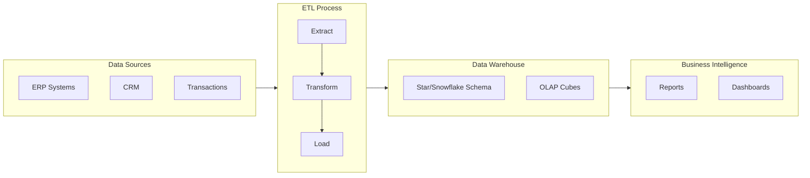
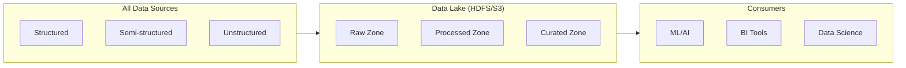
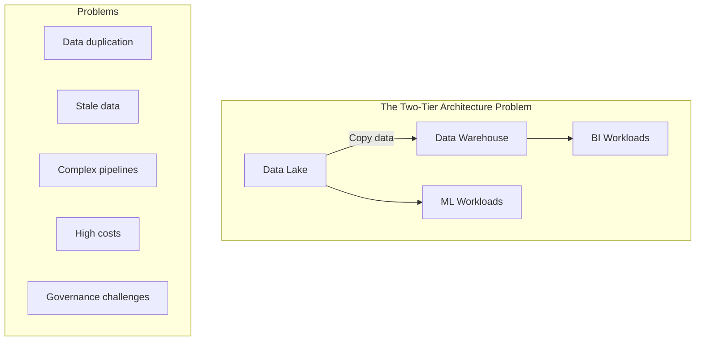
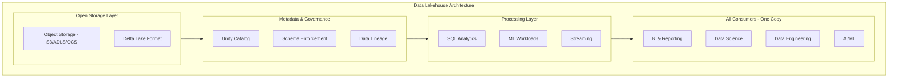
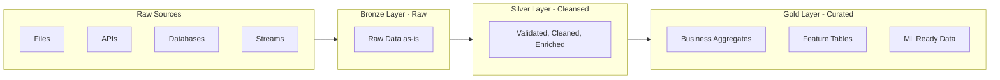

# Lakehouse Architecture Basics

## 3.1 Understanding Data Architectures Evolution

Before understanding Lakehouse, let's trace how data architectures evolved:

**Phase 1: Data Warehouses (1980s-2000s)**

Data Warehouses store structured data for business intelligence:



**Characteristics:**
- Structured data only (tables with schemas)
- ACID transactions (reliable updates)
- SQL-based querying
- High cost per terabyte
- Not suitable for unstructured data (images, logs, JSON)

**Phase 2: Data Lakes (2010s)**

Data Lakes store all types of data in raw format:



**Characteristics:**
- All data types (structured, semi-structured, unstructured)
- Schema-on-read (define schema when querying)
- Low cost storage (object storage)
- Poor data quality and reliability
- No ACID transactions → "Data Swamps"

**The Two-Tier Problem:**

Organizations ended up with both:



## 3.2 What is a Data Lakehouse?

A **Data Lakehouse** combines the best of Data Lakes and Data Warehouses:

$$
\text{Lakehouse} = \text{Data Lake (flexibility, low cost)} + \text{Data Warehouse (reliability, governance)}
$$

**The Lakehouse Vision:**



**Key Lakehouse Principles:**

| Principle | Description | Benefit |
|-----------|-------------|---------|
| **Open Formats** | Data stored in open formats (Parquet, Delta) | No vendor lock-in |
| **ACID Transactions** | Reliable updates like a database | Data consistency |
| **Schema Enforcement** | Ensure data quality at write time | Prevent bad data |
| **Time Travel** | Access previous versions of data | Auditing, rollback |
| **Unified Access** | Same data for all workloads | No data silos |
| **Direct Access** | Query data where it lives | No data copying |

## 3.3 Delta Lake: The Foundation

**What is Delta Lake?**

Delta Lake is an open-source storage layer that brings reliability to Data Lakes. It's the technology that makes Lakehouse possible.

**How Delta Lake Works:**

Delta Lake stores data as Parquet files plus a transaction log:

```
delta_table/
├── _delta_log/                    # Transaction Log
│   ├── 00000000000000000000.json  # Version 0 - Initial write
│   ├── 00000000000000000001.json  # Version 1 - Update
│   ├── 00000000000000000002.json  # Version 2 - Delete
│   └── 00000000000000000003.json  # Version 3 - Insert
├── part-00000-xyz.parquet         # Data files
├── part-00001-abc.parquet
└── part-00002-def.parquet
```

**The Transaction Log Explained:**

Each JSON file in `_delta_log` records what happened:

```json
// 00000000000000000001.json (Version 1 - an UPDATE)
{
  "add": {
    "path": "part-00003-new.parquet",
    "size": 1024,
    "modificationTime": 1699000000000,
    "dataChange": true
  },
  "remove": {
    "path": "part-00001-old.parquet",
    "deletionTimestamp": 1699000000000
  }
}
```

**Delta Lake Features:**

| Feature | Description | Example |
|---------|-------------|---------|
| **ACID Transactions** | Atomic, Consistent, Isolated, Durable operations | Multiple users can write simultaneously |
| **Time Travel** | Query historical versions | `SELECT * FROM table VERSION AS OF 5` |
| **Schema Evolution** | Add columns without breaking queries | `ALTER TABLE ADD COLUMN new_col` |
| **Schema Enforcement** | Reject invalid data | Writing wrong types fails |
| **Audit History** | Track all changes | `DESCRIBE HISTORY table` |
| **Upserts (MERGE)** | Update/Insert in one operation | CDC processing |
| **Optimize & Z-Order** | Compact files and co-locate data | Faster queries |

**Time Travel Example:**

```sql
-- Query current version
SELECT * FROM sales;

-- Query as of specific version
SELECT * FROM sales VERSION AS OF 5;

-- Query as of specific timestamp
SELECT * FROM sales TIMESTAMP AS OF '2024-01-01';

-- Restore to previous version
RESTORE TABLE sales TO VERSION AS OF 5;
```

## 3.4 Lakehouse Architecture Components

```mermaid
flowchart TB
    subgraph LakehouseArch["Complete Lakehouse Architecture"]
        subgraph Ingestion["Data Ingestion"]
            BATCH[Batch - Auto Loader]
            STREAM[Streaming - Kafka, Event Hubs]
            CDC[Change Data Capture]
        end
        
        subgraph Storage["Storage Layer"]
            CLOUD[Cloud Object Storage]
            DELTA[Delta Lake Tables]
        end
        
        subgraph Processing["Processing & Transformation"]
            SPARK[Apache Spark]
            PHOTON[Photon Engine]
            DLT[Delta Live Tables]
        end
        
        subgraph Governance["Governance & Security"]
            UNITY[Unity Catalog]
            LINEAGE[Lineage Tracking]
            ACCESS[Fine-grained Access Control]
        end
        
        subgraph Serving["Serving Layer"]
            SQLW[SQL Warehouses]
            MLSERV[Model Serving]
            FEATURES[Feature Store]
        end
        
        subgraph Consumption["Consumption"]
            BITOOLS[BI Tools - Tableau, Power BI]
            MLOPS[MLOps - MLflow]
            APPS[Applications]
        end
    end
    
    Ingestion --> Storage
    Storage --> Processing
    Processing --> Governance
    Governance --> Serving
    Serving --> Consumption
```



**Component Details:**

**1. Data Ingestion Layer**
- **Auto Loader**: Incrementally ingests new files from cloud storage
- **Streaming**: Real-time ingestion from Kafka, Event Hubs, Kinesis
- **CDC (Change Data Capture)**: Captures changes from operational databases

**2. Storage Layer**
- **Cloud Object Storage**: S3, Azure Data Lake Storage (ADLS), Google Cloud Storage
- **Delta Lake**: Adds reliability layer on top of object storage

**3. Processing Layer**
- **Apache Spark**: Core processing engine
- **Photon Engine**: C++ vectorized engine (2-8x faster)
- **Delta Live Tables (DLT)**: Declarative ETL framework

**4. Governance Layer**
- **Unity Catalog**: Centralized governance for all data assets
- **Data Lineage**: Track data flow and dependencies
- **Access Control**: Row/column level security

**5. Serving Layer**
- **SQL Warehouses**: Serverless SQL compute
- **Model Serving**: Deploy ML models as endpoints
- **Feature Store**: Manage ML features

## 3.5 ACID Transactions in Lakehouse

**What are ACID Properties?**

ACID ensures data reliability:

$$
\text{ACID} = \text{Atomicity} + \text{Consistency} + \text{Isolation} + \text{Durability}
$$

| Property | Definition | Example |
|----------|------------|---------|
| **Atomicity** | All operations succeed or all fail | Bank transfer: debit AND credit both happen or neither |
| **Consistency** | Data always valid after transaction | Balance never negative |
| **Isolation** | Concurrent transactions don't interfere | Two users updating same record |
| **Durability** | Committed data survives failures | Power outage doesn't lose committed data |

**How Delta Lake Achieves ACID:**

1. **Optimistic Concurrency Control**: 
   - Writers don't block each other
   - Conflicts detected at commit time
   - Automatic retry with serialization

2. **Write-Ahead Log (WAL)**:
   - Changes recorded in log before data files
   - Enables recovery from failures

3. **Atomic Commits**:
   - New log entry = transaction complete
   - Incomplete writes ignored

**Concurrent Write Example:**

```
Time    Writer 1              Writer 2              Table State
────────────────────────────────────────────────────────────────
T1      Start transaction     -                     Version 0
T2      Read version 0        Start transaction     Version 0
T3      -                     Read version 0        Version 0
T4      Write new files       -                     Version 0
T5      Commit → Version 1    Write new files       Version 1
T6      -                     Commit attempt        CONFLICT!
T7      -                     Retry: Read V1        Version 1
T8      -                     Commit → Version 2    Version 2
```

## 3.6 Medallion Architecture

The **Medallion Architecture** (also called Multi-Hop Architecture) is a design pattern for organizing data in a Lakehouse:



**Medallion Layers Explained:**

| Layer | Also Called | Purpose | Data Quality | Example |
|-------|-------------|---------|--------------|---------|
| **Bronze** | Raw, Landing | Store raw data exactly as received | Low - may have errors, duplicates | Raw JSON from IoT sensors |
| **Silver** | Cleansed, Validated | Clean, validate, deduplicate | Medium - business rules applied | Parsed, typed, deduplicated sensor readings |
| **Gold** | Curated, Aggregated | Business-ready aggregations | High - analytics ready | Hourly averages by location |

**Bronze Layer Characteristics:**
- Raw data "as-is" from source
- No transformations (or minimal)
- Append-only writes
- Full history preserved
- Schema-on-read

**Silver Layer Characteristics:**
- Cleaned and validated data
- Deduplication applied
- Data types enforced
- Joined with reference data
- Schema enforced (schema-on-write)

**Gold Layer Characteristics:**
- Business-level aggregations
- Denormalized for query performance
- Optimized for specific use cases
- May have multiple gold tables per domain