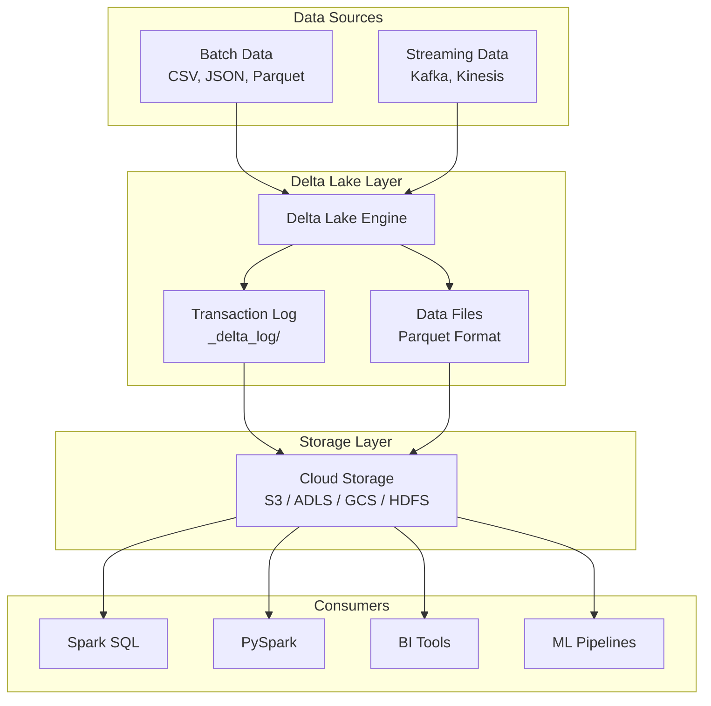
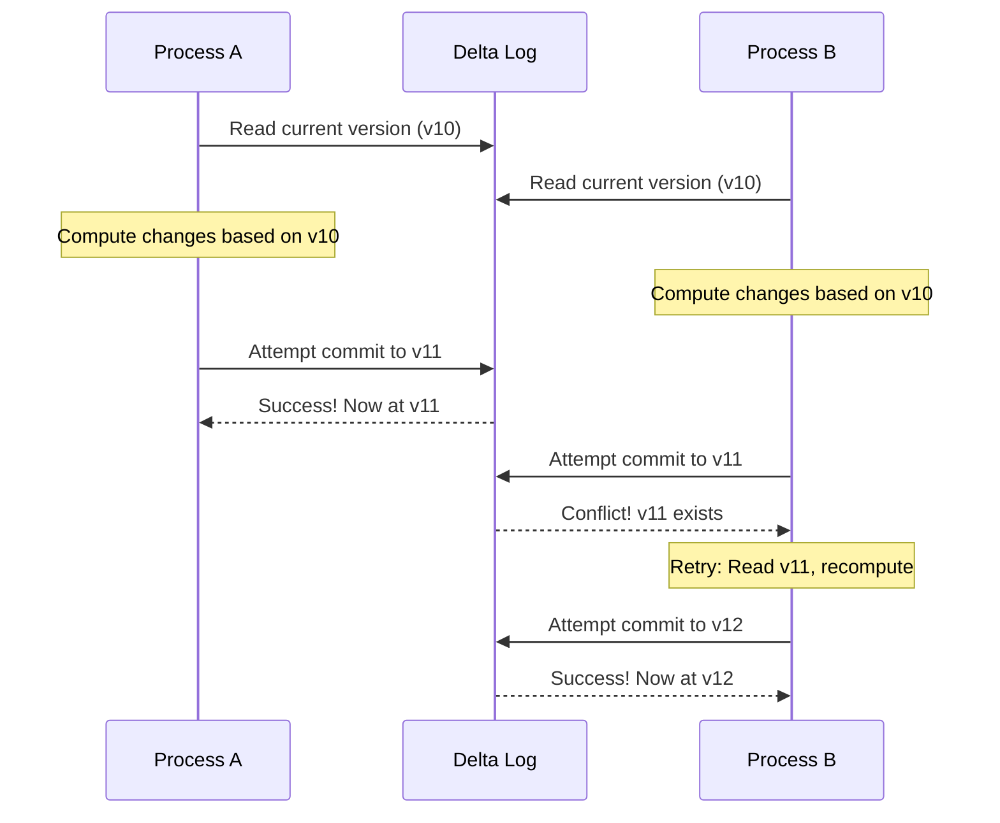
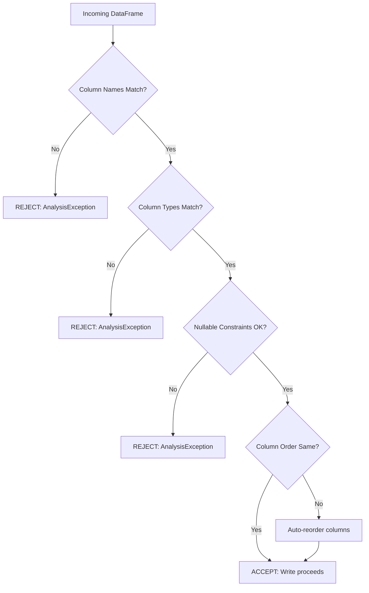
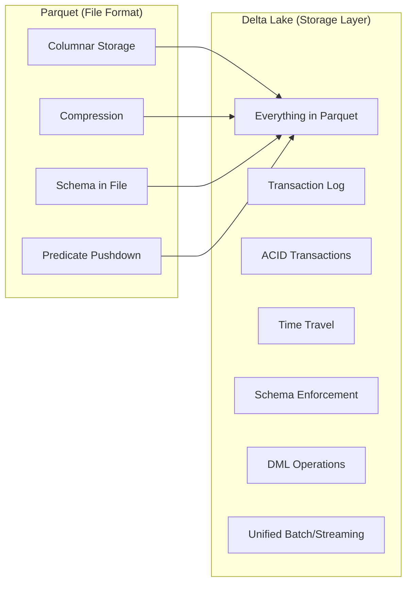
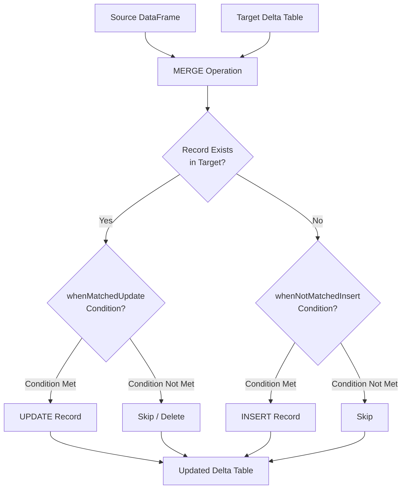

# Delta Lake Introduction - Comprehensive Guide

## Table of Contents

1. [What is Delta Lake?](#1-what-is-delta-lake)
2. [ACID Transactions](#2-acid-transactions)
3. [Schema Enforcement](#3-schema-enforcement)
4. [Delta vs Parquet](#4-delta-vs-parquet)
5. [Practical Tasks](#5-practical-tasks)
   - [Task 1: Convert CSV to Delta Format](#task-1-convert-csv-to-delta-format)
   - [Task 2: Create Delta Tables (SQL and PySpark)](#task-2-create-delta-tables-sql-and-pyspark)
   - [Task 3: Test Schema Enforcement](#task-3-test-schema-enforcement)
   - [Task 4: Handle Duplicate Inserts](#task-4-handle-duplicate-inserts)
6. [Quick Reference](#6-quick-reference)

---

## 1. What is Delta Lake?

### Definition

Delta Lake is an **open-source storage layer** that brings reliability, performance, and governance to data lakes. It runs on top of your existing data lake infrastructure and is fully compatible with Apache Spark APIs. Think of it as adding a "smart layer" on top of your raw files that makes them behave like a proper database.

### The Problem Delta Lake Solves

Traditional data lakes store data as raw files (CSV, JSON, Parquet) in distributed storage systems like HDFS, S3, or Azure Data Lake Storage. While this approach is cost-effective and scalable, it comes with significant challenges:

**Challenge 1: Data Corruption During Writes**
When multiple jobs write to the same location simultaneously, files can get corrupted or partially written. If a job fails midway, you end up with incomplete data.

**Challenge 2: No Transaction Support**
If you need to update 1000 records and the job fails after updating 500, you have no way to roll back. Your data is now in an inconsistent state.

**Challenge 3: Schema Chaos**
Different teams might write data with slightly different schemas (column names, data types), leading to "schema drift" that breaks downstream applications.

**Challenge 4: No Time Travel**
Once you overwrite data, the previous version is gone forever. If you made a mistake, there's no easy way to recover.

### How Delta Lake Works

Delta Lake stores data in **Parquet format** (the actual data files) plus a **transaction log** (the `_delta_log` directory). This transaction log is the secret sauce that enables all of Delta Lake's features.

```
my_delta_table/
├── _delta_log/                    # Transaction log directory
│   ├── 00000000000000000000.json  # First commit
│   ├── 00000000000000000001.json  # Second commit
│   ├── 00000000000000000002.json  # Third commit
│   └── ...
├── part-00000-xxx.parquet         # Data files
├── part-00001-xxx.parquet
└── ...
```

**The Transaction Log Explained:**

Each JSON file in `_delta_log` represents a single atomic commit to the table. These files contain information about:
- Which data files were added
- Which data files were removed
- Schema changes
- Metadata updates

When you read a Delta table, Spark reads the transaction log to understand which files make up the current version of the table. This is how Delta Lake achieves its reliability guarantees.

### Key Features Overview

| Feature | Description | Benefit |
|---------|-------------|---------|
| **ACID Transactions** | All operations are atomic and isolated | No partial writes, consistent reads |
| **Schema Enforcement** | Validates data against table schema | Prevents bad data from entering |
| **Schema Evolution** | Safely add new columns | Adapt to changing requirements |
| **Time Travel** | Query previous versions of data | Audit, rollback, reproduce results |
| **Unified Batch & Streaming** | Same table for both workloads | Simplified architecture |
| **DML Operations** | UPDATE, DELETE, MERGE support | SQL-like data manipulation |
| **Audit History** | Complete record of all changes | Compliance and debugging |
| **Scalable Metadata** | Handles billions of files | Enterprise-scale data lakes |

### Delta Lake Architecture



---

## 2. ACID Transactions

ACID is an acronym that stands for **Atomicity, Consistency, Isolation, and Durability**. These properties are fundamental to database systems and ensure reliable transaction processing.

### What Are ACID Transactions?

In the context of data lakes, a "transaction" is any operation that modifies data—inserting new records, updating existing ones, deleting records, or changing the schema. ACID properties guarantee that these operations happen reliably.

### The Four ACID Properties

#### 2.1 Atomicity - "All or Nothing"

**Definition:** A transaction is treated as a single, indivisible unit. Either all operations within the transaction complete successfully, or none of them do.

**Real-World Analogy:** Think of transferring money between bank accounts. You withdraw $100 from Account A and deposit $100 to Account B. These two operations must happen together—if the system crashes after withdrawal but before deposit, the money shouldn't vanish.

**How Delta Lake Achieves Atomicity:**

Delta Lake uses **optimistic concurrency control** with the transaction log. Here's the process:

1. When a write operation begins, Delta Lake reads the current state from the transaction log
2. The operation writes new Parquet files to storage
3. Delta Lake attempts to commit by writing a new JSON file to the transaction log
4. If another process committed in the meantime, the commit fails and can be retried
5. Only when the commit succeeds do the new files become visible

```python
# Example: Atomic write operation
# If this fails midway, no partial data is visible

df = spark.createDataFrame([
    (1, "Alice", 30),
    (2, "Bob", 25),
    (3, "Charlie", 35)
], ["id", "name", "age"])

# This is an atomic operation - either all 3 records are written or none
df.write.format("delta").mode("append").save("/delta/users")
```

**What Happens on Failure:**

```
Scenario: Job writes 1 million records to Delta table
         Job crashes at 500,000 records

Without Delta Lake (Plain Parquet):
- 500,000 records are partially written
- Data is corrupted and unusable
- Manual cleanup required

With Delta Lake:
- Transaction is not committed
- Partially written files are ignored
- Table remains in previous valid state
- No data corruption
```

#### 2.2 Consistency - "Valid State to Valid State"

**Definition:** A transaction brings the database from one valid state to another valid state. All defined rules (constraints, schema) must be satisfied.

**Real-World Analogy:** In a library system, if a rule says "each book must have an ISBN," then after any transaction, every book must still have an ISBN. You can't add a book without one.

**How Delta Lake Achieves Consistency:**

Delta Lake enforces consistency through:

1. **Schema Enforcement:** Rejects writes that don't match the table schema
2. **Constraints:** (Delta Lake 2.1+) Supports CHECK constraints
3. **NOT NULL Constraints:** Ensures required columns have values

```python
# Schema enforcement ensures consistency
# This will FAIL if the schema doesn't match

# Table schema: id (int), name (string), age (int)
invalid_df = spark.createDataFrame([
    (1, "Alice", "thirty")  # age should be int, not string
], ["id", "name", "age"])

# This throws AnalysisException due to schema mismatch
invalid_df.write.format("delta").mode("append").save("/delta/users")
```

**Consistency Rules in Delta Lake:**

| Rule Type | Description | Example |
|-----------|-------------|---------|
| Schema Match | Column names and types must match | Can't write string to int column |
| NOT NULL | Required columns must have values | id column cannot be null |
| CHECK Constraints | Custom validation rules | age > 0 AND age < 150 |

#### 2.3 Isolation - "Transactions Don't Interfere"

**Definition:** Concurrent transactions execute independently without interfering with each other. Each transaction sees a consistent snapshot of the data.

**Real-World Analogy:** Two tellers at a bank can process transactions on the same account simultaneously. Each sees a consistent view, and the final result is as if the transactions happened one after another.

**How Delta Lake Achieves Isolation:**

Delta Lake provides **Serializable** isolation level (the strongest) for write operations and **Snapshot** isolation for reads.

**Snapshot Isolation for Reads:**

When you start reading a Delta table, you get a consistent snapshot at that point in time. Even if other processes are writing to the table, your read sees the same data throughout the query.

```python
# Process A: Long-running read query
# Starts at version 10 of the table
df_a = spark.read.format("delta").load("/delta/sales")
# Takes 30 minutes to process...
result = df_a.groupBy("region").sum("amount")

# Process B: Write operation during Process A's query
# Commits at version 11
new_sales.write.format("delta").mode("append").save("/delta/sales")

# Process A's result is STILL based on version 10
# It doesn't see Process B's changes - consistent snapshot!
```

**Write Isolation with Optimistic Concurrency:**



#### 2.4 Durability - "Committed Data Persists"

**Definition:** Once a transaction is committed, it remains committed even in the case of system failure. The data is permanently stored.

**Real-World Analogy:** When you save a document and see "Saved," you expect that document to still be there after a power outage.

**How Delta Lake Achieves Durability:**

1. **Transaction Log Persistence:** Commits are written to the `_delta_log` directory in the same storage system as data
2. **Storage Layer Guarantees:** Relies on cloud storage durability (S3: 99.999999999% durability)
3. **Commit Protocol:** A transaction is only considered complete when the log entry is successfully written

```python
# Once this completes without error, data is durable
df.write.format("delta").mode("append").save("/delta/users")
# The transaction log entry is written to storage
# Even if Spark crashes after this line, data is safe
```

**Durability Flow:**

```
1. Write Operation Initiated
   ↓
2. New Parquet files written to storage
   ↓
3. New JSON log entry created (not yet committed)
   ↓
4. Log entry atomically written to _delta_log/
   ↓
5. Transaction COMMITTED - Now durable!
   ↓
6. Acknowledgment returned to application
```

### ACID in Action: Complete Example

```python
from delta.tables import DeltaTable
from pyspark.sql.functions import col

# Scenario: Transfer funds between accounts
# This must be atomic - we can't debit without crediting

# Initial state
accounts = spark.createDataFrame([
    (1, "Alice", 1000.00),
    (2, "Bob", 500.00)
], ["account_id", "name", "balance"])

accounts.write.format("delta").mode("overwrite").save("/delta/accounts")

# Transfer $200 from Alice to Bob
# Using MERGE for atomic update of multiple rows

delta_table = DeltaTable.forPath(spark, "/delta/accounts")

# Create the transfer operations as a DataFrame
transfers = spark.createDataFrame([
    (1, -200.00),  # Debit Alice
    (2, 200.00)    # Credit Bob
], ["account_id", "amount"])

# Atomic merge operation
delta_table.alias("accounts").merge(
    transfers.alias("transfers"),
    "accounts.account_id = transfers.account_id"
).whenMatchedUpdate(
    set={"balance": col("accounts.balance") + col("transfers.amount")}
).execute()

# Result: Either both accounts are updated, or neither is
# Alice: $800, Bob: $700
```

---

## 3. Schema Enforcement

### What is Schema Enforcement?

Schema enforcement (also called "schema validation" or "schema on write") is Delta Lake's mechanism to **prevent bad data from entering your tables**. When you try to write data to a Delta table, Delta Lake validates that the incoming data matches the table's schema exactly.

### Why Schema Enforcement Matters

In traditional data lakes, anyone can write any data to any location. This leads to:

**The Schema Drift Problem:**

```
Week 1: Team A writes: {"user_id": 1, "name": "Alice"}
Week 2: Team B writes: {"userId": 2, "userName": "Bob"}    # Different column names!
Week 3: Team C writes: {"user_id": "3", "name": "Charlie"} # user_id is string, not int!
Week 4: Dashboard breaks because schema is inconsistent
```

**With Schema Enforcement:**

```
Week 1: Table created with schema: user_id (INT), name (STRING)
Week 2: Team B's write REJECTED - columns don't match
Week 3: Team C's write REJECTED - user_id type mismatch
Result: Data remains consistent and reliable
```

### How Schema Enforcement Works

When you write to a Delta table, Delta Lake performs these checks:



### Schema Validation Rules

| Check | What It Validates | Failure Behavior |
|-------|-------------------|------------------|
| **Column Names** | All columns in DataFrame exist in table | Exception thrown |
| **Extra Columns** | DataFrame has no columns not in table | Exception thrown (unless schema evolution enabled) |
| **Data Types** | Each column's type matches table schema | Exception thrown |
| **Nullability** | NOT NULL columns don't receive nulls | Exception thrown |
| **Column Order** | N/A - Delta Lake handles reordering | Auto-handled |

### Practical Examples of Schema Enforcement

#### Example 1: Column Type Mismatch

```python
# Create a Delta table with specific schema
from pyspark.sql.types import StructType, StructField, IntegerType, StringType, DoubleType

schema = StructType([
    StructField("id", IntegerType(), nullable=False),
    StructField("product", StringType(), nullable=True),
    StructField("price", DoubleType(), nullable=True)
])

initial_data = spark.createDataFrame([
    (1, "Laptop", 999.99),
    (2, "Mouse", 29.99)
], schema=schema)

initial_data.write.format("delta").mode("overwrite").save("/delta/products")

# Now try to write with wrong type
bad_data = spark.createDataFrame([
    (3, "Keyboard", "forty-nine")  # price is string instead of double!
], ["id", "product", "price"])

# This will FAIL with AnalysisException
try:
    bad_data.write.format("delta").mode("append").save("/delta/products")
except Exception as e:
    print(f"Schema enforcement blocked write: {e}")
```

**Error Message:**
```
AnalysisException: A schema mismatch detected when writing to the Delta table.
        
Expected: id INT, product STRING, price DOUBLE
Actual: id INT, product STRING, price STRING

To enable schema migration, set the option 'mergeSchema' to 'true'.
```

#### Example 2: Missing Column

```python
# DataFrame is missing the 'price' column
incomplete_data = spark.createDataFrame([
    (4, "Monitor")  # Missing price!
], ["id", "product"])

# This will FAIL
try:
    incomplete_data.write.format("delta").mode("append").save("/delta/products")
except Exception as e:
    print(f"Missing column: {e}")
```

#### Example 3: Extra Column (Without Schema Evolution)

```python
# DataFrame has an extra column not in table schema
extra_column_data = spark.createDataFrame([
    (5, "Headphones", 79.99, "Electronics")  # 'category' not in schema!
], ["id", "product", "price", "category"])

# This will FAIL by default
try:
    extra_column_data.write.format("delta").mode("append").save("/delta/products")
except Exception as e:
    print(f"Extra column blocked: {e}")
```

### Schema Evolution: Controlled Schema Changes

Sometimes you legitimately need to add new columns. Delta Lake supports **schema evolution** as an opt-in feature:

#### Enabling Schema Evolution

```python
# Method 1: Per-write option
df_with_new_column.write \
    .format("delta") \
    .mode("append") \
    .option("mergeSchema", "true") \  # Enable for this write only
    .save("/delta/products")

# Method 2: Table property (enables for all writes)
spark.sql("""
    ALTER TABLE delta.`/delta/products`
    SET TBLPROPERTIES ('delta.autoOptimize.autoCompact' = 'true')
""")

# Method 3: Spark configuration (session-wide)
spark.conf.set("spark.databricks.delta.schema.autoMerge.enabled", "true")
```

#### Schema Evolution Operations

| Operation | Syntax | Use Case |
|-----------|--------|----------|
| **Add Column** | `mergeSchema=true` | New data has additional columns |
| **Change Type** | `overwriteSchema=true` | Need to widen type (e.g., int → long) |
| **Rename Column** | ALTER TABLE | Column name changed |
| **Drop Column** | Not automatic | Must rewrite table |

#### Safe Schema Evolution Example

```python
# Original table: id, product, price
# We want to add: category, last_updated

from pyspark.sql.functions import current_timestamp

# New data with additional columns
new_products = spark.createDataFrame([
    (6, "Webcam", 89.99, "Electronics"),
    (7, "Desk Lamp", 34.99, "Home Office")
], ["id", "product", "price", "category"])

# Add timestamp column
new_products = new_products.withColumn("last_updated", current_timestamp())

# Enable schema evolution for this write
new_products.write \
    .format("delta") \
    .mode("append") \
    .option("mergeSchema", "true") \
    .save("/delta/products")

# Now the table has 5 columns
# Existing rows will have NULL for new columns
spark.read.format("delta").load("/delta/products").show()
```

**Result:**
```
+---+----------+------+-----------+--------------------+
| id|   product| price|   category|        last_updated|
+---+----------+------+-----------+--------------------+
|  1|    Laptop|999.99|       null|                null|
|  2|     Mouse| 29.99|       null|                null|
|  6|    Webcam| 89.99|Electronics|2024-01-15 10:30:00|
|  7| Desk Lamp| 34.99|Home Office|2024-01-15 10:30:00|
+---+----------+------+-----------+--------------------+
```

### Schema Enforcement Best Practices

1. **Define explicit schemas** when creating tables - don't rely on inference
2. **Use NOT NULL** constraints for required fields
3. **Keep schema evolution disabled by default** - enable only when needed
4. **Document schema changes** for team awareness
5. **Test schema changes** in development before production

---

## 4. Delta vs Parquet

### Understanding the Comparison

Parquet is a **file format** - it defines how data is physically stored and compressed. Delta Lake is a **storage layer** that uses Parquet files but adds additional capabilities through its transaction log.

### What is Parquet?

Apache Parquet is a columnar storage file format optimized for analytics workloads:

**Parquet Characteristics:**
- Column-oriented (stores data by columns, not rows)
- Supports complex nested data structures
- Efficient compression (column similarity improves ratios)
- Predicate pushdown (skip irrelevant data during reads)
- Schema stored within the file

### What Delta Lake Adds to Parquet



### Feature-by-Feature Comparison

| Feature | Parquet | Delta Lake |
|---------|---------|------------|
| **File Format** | Columnar | Columnar (uses Parquet) |
| **Compression** | Snappy, Gzip, etc. | Same as Parquet |
| **ACID Transactions** | ❌ No | ✅ Yes |
| **Schema Enforcement** | ❌ No (schema on read) | ✅ Yes (schema on write) |
| **Time Travel** | ❌ No | ✅ Yes |
| **UPDATE/DELETE** | ❌ No (append-only) | ✅ Yes |
| **MERGE (Upsert)** | ❌ No | ✅ Yes |
| **Concurrent Writes** | ❌ Can corrupt | ✅ Safe |
| **Streaming Support** | ❌ Limited | ✅ Full |
| **Small File Problem** | ❌ Common issue | ✅ Auto-compaction |
| **Metadata Handling** | ❌ Scans all files | ✅ Scalable with log |
| **Audit History** | ❌ No | ✅ Complete |

### Detailed Comparisons

#### 4.1 Data Modification (UPDATE/DELETE)

**With Parquet (Complex and Error-Prone):**

```python
# To update records in Parquet, you must:
# 1. Read all data
# 2. Filter to find records to update
# 3. Apply changes in memory
# 4. Overwrite entire dataset

# Update: Change price of product_id=1 to 899.99
df = spark.read.parquet("/parquet/products")

# Separate rows to update vs keep
rows_to_update = df.filter(col("product_id") == 1)
rows_to_keep = df.filter(col("product_id") != 1)

# Apply update
updated_rows = rows_to_update.withColumn("price", lit(899.99))

# Combine and overwrite EVERYTHING
final_df = rows_to_keep.union(updated_rows)
final_df.write.mode("overwrite").parquet("/parquet/products")

# Problems:
# - Must rewrite entire table
# - Not atomic - failure leaves corrupted data
# - Slow for large tables
# - No concurrent access protection
```

**With Delta Lake (Simple and Safe):**

```python
from delta.tables import DeltaTable

delta_table = DeltaTable.forPath(spark, "/delta/products")

# Simple, atomic UPDATE
delta_table.update(
    condition="product_id = 1",
    set={"price": "899.99"}
)

# Benefits:
# - Only affected files rewritten
# - Atomic operation
# - Fast for large tables
# - Safe concurrent access
```

#### 4.2 Time Travel

**With Parquet:**
```python
# No time travel capability
# Once you overwrite, previous data is GONE

df.write.mode("overwrite").parquet("/parquet/data")
# Previous version is permanently lost
```

**With Delta Lake:**
```python
# Query data as it existed yesterday
df_yesterday = spark.read \
    .format("delta") \
    .option("timestampAsOf", "2024-01-14") \
    .load("/delta/data")

# Query specific version
df_v5 = spark.read \
    .format("delta") \
    .option("versionAsOf", 5) \
    .load("/delta/data")

# See all versions
spark.sql("DESCRIBE HISTORY delta.`/delta/data`").show()
```

#### 4.3 Concurrent Write Safety

**With Parquet (Dangerous):**
```
Process A: Starts reading /parquet/sales/
Process B: Starts reading /parquet/sales/

Process A: Writes new file part-00000.parquet
Process B: Writes new file part-00000.parquet  # OVERWRITES Process A's file!

Result: Data loss!
```

**With Delta Lake (Safe):**
```
Process A: Reads transaction log (version 10)
Process B: Reads transaction log (version 10)

Process A: Writes data files, commits to version 11 ✓
Process B: Writes data files, tries to commit...
           Detects version 11 exists
           Retries: reads version 11, recomputes, commits to version 12 ✓

Result: Both writes preserved!
```

#### 4.4 Schema Handling

**With Parquet (Schema on Read):**
```python
# Week 1: Write data with certain schema
df1 = spark.createDataFrame([(1, "Alice")], ["id", "name"])
df1.write.parquet("/parquet/users/")

# Week 2: Different team writes different schema (no validation!)
df2 = spark.createDataFrame([("2", "Bob", 25)], ["user_id", "user_name", "age"])
df2.write.mode("append").parquet("/parquet/users/")

# Week 3: Try to read - CHAOS
df = spark.read.parquet("/parquet/users/")
# Error or unexpected results due to schema mismatch
```

**With Delta Lake (Schema on Write):**
```python
# Week 1: Create table with explicit schema
df1.write.format("delta").save("/delta/users")

# Week 2: Attempt to write incompatible schema
try:
    df2.write.format("delta").mode("append").save("/delta/users")
except AnalysisException as e:
    print("Write blocked! Schema doesn't match.")
    # Data integrity preserved
```

### When to Use Each

**Use Parquet When:**
- Read-only analytics on static data
- Simple ETL pipelines with no updates
- Data archival with no modification needs
- Interoperability with non-Spark tools that only support Parquet

**Use Delta Lake When:**
- Data needs to be updated or deleted
- Multiple processes write concurrently
- You need audit history or rollback capability
- Schema consistency is critical
- Building a data lakehouse architecture
- Combining batch and streaming workloads

### Migration Path: Parquet to Delta

Converting existing Parquet data to Delta Lake is straightforward:

```python
# Read existing Parquet data
parquet_df = spark.read.parquet("/existing/parquet/path")

# Write as Delta (one-time conversion)
parquet_df.write.format("delta").save("/new/delta/path")

# Or convert in-place (keeps same path)
from delta.tables import DeltaTable
DeltaTable.convertToDelta(spark, "parquet.`/existing/parquet/path`")
```

---

## 5. Practical Tasks

### Task 1: Convert CSV to Delta Format

This task demonstrates loading CSV data and storing it in Delta format, establishing the foundation for Delta Lake operations.

#### Step 1: Setup Environment

```python
# Import required libraries
from pyspark.sql import SparkSession
from pyspark.sql.types import StructType, StructField, IntegerType, StringType, DoubleType, DateType
from pyspark.sql.functions import col, to_date

# Create Spark session with Delta Lake support
spark = SparkSession.builder \
    .appName("DeltaLakeIntro") \
    .config("spark.jars.packages", "io.delta:delta-core_2.12:2.4.0") \
    .config("spark.sql.extensions", "io.delta.sql.DeltaSparkSessionExtension") \
    .config("spark.sql.catalog.spark_catalog", "org.apache.spark.sql.delta.catalog.DeltaCatalog") \
    .getOrCreate()
```

#### Step 2: Create Sample CSV Data

```python
# For demonstration, we'll create sample data
# In real scenarios, you'd read from actual CSV files

sample_data = [
    (1, "John Smith", "Engineering", 75000.00, "2020-01-15"),
    (2, "Sarah Johnson", "Marketing", 65000.00, "2019-06-20"),
    (3, "Mike Davis", "Engineering", 80000.00, "2018-03-10"),
    (4, "Emily Brown", "Sales", 70000.00, "2021-02-28"),
    (5, "David Wilson", "Engineering", 85000.00, "2017-11-05"),
    (6, "Lisa Anderson", "Marketing", 62000.00, "2022-04-15"),
    (7, "James Taylor", "Sales", 72000.00, "2020-09-01"),
    (8, "Jennifer Martinez", "HR", 58000.00, "2019-12-20")
]

# Define schema for better control
schema = StructType([
    StructField("employee_id", IntegerType(), nullable=False),
    StructField("name", StringType(), nullable=False),
    StructField("department", StringType(), nullable=True),
    StructField("salary", DoubleType(), nullable=True),
    StructField("hire_date", StringType(), nullable=True)
])

# Create DataFrame
employees_df = spark.createDataFrame(sample_data, schema=schema)

# Convert hire_date string to proper date type
employees_df = employees_df.withColumn("hire_date", to_date(col("hire_date"), "yyyy-MM-dd"))

# Save as CSV first (simulating source data)
employees_df.write \
    .mode("overwrite") \
    .option("header", "true") \
    .csv("/data/csv/employees")

print("CSV file created successfully!")
employees_df.show()
```

**Output:**
```
+-----------+-----------------+-----------+-------+----------+
|employee_id|             name| department| salary| hire_date|
+-----------+-----------------+-----------+-------+----------+
|          1|       John Smith|Engineering|75000.0|2020-01-15|
|          2|    Sarah Johnson|  Marketing|65000.0|2019-06-20|
|          3|       Mike Davis|Engineering|80000.0|2018-03-10|
|          4|      Emily Brown|      Sales|70000.0|2021-02-28|
|          5|     David Wilson|Engineering|85000.0|2017-11-05|
|          6|    Lisa Anderson|  Marketing|62000.0|2022-04-15|
|          7|     James Taylor|      Sales|72000.0|2020-09-01|
|          8|Jennifer Martinez|         HR|58000.0|2019-12-20|
+-----------+-----------------+-----------+-------+----------+
```

#### Step 3: Read CSV and Convert to Delta

```python
# Define schema for CSV reading (important for type safety)
csv_schema = StructType([
    StructField("employee_id", IntegerType(), nullable=False),
    StructField("name", StringType(), nullable=False),
    StructField("department", StringType(), nullable=True),
    StructField("salary", DoubleType(), nullable=True),
    StructField("hire_date", DateType(), nullable=True)
])

# Read CSV with explicit schema
csv_df = spark.read \
    .option("header", "true") \
    .schema(csv_schema) \
    .csv("/data/csv/employees")

# Convert to Delta format
csv_df.write \
    .format("delta") \
    .mode("overwrite") \
    .save("/delta/employees")

print("Successfully converted CSV to Delta format!")
```

#### Step 4: Verify the Conversion

```python
# Read from Delta and verify
delta_df = spark.read.format("delta").load("/delta/employees")
print(f"Record count: {delta_df.count()}")
print("\nSchema:")
delta_df.printSchema()
print("\nSample Data:")
delta_df.show()

# Check the Delta log
import os
print("\nDelta Log Files:")
for f in os.listdir("/delta/employees/_delta_log"):
    print(f"  - {f}")
```

**Output:**
```
Record count: 8

Schema:
root
 |-- employee_id: integer (nullable = false)
 |-- name: string (nullable = false)
 |-- department: string (nullable = true)
 |-- salary: double (nullable = true)
 |-- hire_date: date (nullable = true)

Delta Log Files:
  - 00000000000000000000.json
```

---

### Task 2: Create Delta Tables (SQL and PySpark)

This task demonstrates multiple methods for creating Delta tables.

#### Method 1: PySpark DataFrame API

```python
from pyspark.sql.types import StructType, StructField, IntegerType, StringType, DoubleType, TimestampType
from pyspark.sql.functions import current_timestamp

# Method 1A: Create empty table with schema
product_schema = StructType([
    StructField("product_id", IntegerType(), nullable=False),
    StructField("product_name", StringType(), nullable=False),
    StructField("category", StringType(), nullable=True),
    StructField("price", DoubleType(), nullable=True),
    StructField("stock_quantity", IntegerType(), nullable=True),
    StructField("created_at", TimestampType(), nullable=True)
])

# Create empty DataFrame with schema
empty_df = spark.createDataFrame([], schema=product_schema)

# Write as Delta table (creates table structure)
empty_df.write \
    .format("delta") \
    .mode("overwrite") \
    .save("/delta/products_empty")

print("Empty Delta table created!")

# Method 1B: Create table with initial data
products_data = [
    (101, "Laptop Pro 15", "Electronics", 1299.99, 50),
    (102, "Wireless Mouse", "Electronics", 29.99, 200),
    (103, "Office Chair", "Furniture", 349.99, 30),
    (104, "Standing Desk", "Furniture", 599.99, 25),
    (105, "Monitor 27inch", "Electronics", 399.99, 75)
]

products_df = spark.createDataFrame(
    products_data, 
    ["product_id", "product_name", "category", "price", "stock_quantity"]
)

# Add timestamp column
products_df = products_df.withColumn("created_at", current_timestamp())

# Write as Delta table
products_df.write \
    .format("delta") \
    .mode("overwrite") \
    .save("/delta/products")

print("Delta table with data created!")
products_df.show()
```

#### Method 2: SQL Syntax

```python
# Register the Delta path as a SQL table
spark.sql("""
    CREATE TABLE IF NOT EXISTS default.orders (
        order_id INT NOT NULL,
        customer_id INT NOT NULL,
        product_id INT,
        quantity INT,
        order_total DOUBLE,
        order_date DATE,
        status STRING
    )
    USING DELTA
    LOCATION '/delta/orders'
""")

print("Delta table 'orders' created via SQL!")

# Insert sample data using SQL
spark.sql("""
    INSERT INTO default.orders VALUES
    (1001, 501, 101, 1, 1299.99, '2024-01-10', 'completed'),
    (1002, 502, 102, 3, 89.97, '2024-01-11', 'completed'),
    (1003, 503, 103, 1, 349.99, '2024-01-11', 'processing'),
    (1004, 501, 105, 2, 799.98, '2024-01-12', 'completed'),
    (1005, 504, 104, 1, 599.99, '2024-01-12', 'shipped')
""")

# Verify
spark.sql("SELECT * FROM default.orders").show()
```

**Output:**
```
+--------+-----------+----------+--------+-----------+----------+----------+
|order_id|customer_id|product_id|quantity|order_total|order_date|    status|
+--------+-----------+----------+--------+-----------+----------+----------+
|    1001|        501|       101|       1|    1299.99|2024-01-10| completed|
|    1002|        502|       102|       3|      89.97|2024-01-11| completed|
|    1003|        503|       103|       1|     349.99|2024-01-11|processing|
|    1004|        501|       105|       2|     799.98|2024-01-12| completed|
|    1005|        504|       104|       1|     599.99|2024-01-12|   shipped|
+--------+-----------+----------+--------+-----------+----------+----------+
```

#### Method 3: Create with Partitioning

```python
# Create partitioned Delta table for better query performance
# Partitioning by date is common for time-series data

sales_data = [
    (1, "2024-01", "North", 15000.00),
    (2, "2024-01", "South", 12000.00),
    (3, "2024-01", "East", 18000.00),
    (4, "2024-02", "North", 16500.00),
    (5, "2024-02", "South", 13200.00),
    (6, "2024-02", "East", 19500.00),
    (7, "2024-03", "North", 17000.00),
    (8, "2024-03", "South", 14000.00)
]

sales_df = spark.createDataFrame(
    sales_data, 
    ["sale_id", "month", "region", "amount"]
)

# Write with partitioning
sales_df.write \
    .format("delta") \
    .mode("overwrite") \
    .partitionBy("month", "region") \  # Creates folder structure by month/region
    .save("/delta/sales_partitioned")

print("Partitioned Delta table created!")

# The folder structure will look like:
# /delta/sales_partitioned/
#   ├── month=2024-01/
#   │   ├── region=North/
#   │   ├── region=South/
#   │   └── region=East/
#   ├── month=2024-02/
#   │   └── ...
#   └── _delta_log/
```

#### Method 4: Create Table As Select (CTAS)

```python
# CTAS - Create table from query results
spark.sql("""
    CREATE TABLE default.high_value_orders
    USING DELTA
    LOCATION '/delta/high_value_orders'
    AS SELECT * FROM default.orders WHERE order_total > 500
""")

print("High-value orders table created!")
spark.sql("SELECT * FROM default.high_value_orders").show()
```

---

### Task 3: Test Schema Enforcement

This task demonstrates how Delta Lake enforces schema consistency and prevents bad data.

#### Test 1: Column Type Mismatch

```python
from delta.tables import DeltaTable

# Our products table has: product_id (INT), product_name (STRING), 
# category (STRING), price (DOUBLE), stock_quantity (INT), created_at (TIMESTAMP)

# Try to insert data with wrong type for price (STRING instead of DOUBLE)
bad_type_data = spark.createDataFrame([
    (106, "Keyboard", "Electronics", "fifty nine", 100)  # "fifty nine" is string!
], ["product_id", "product_name", "category", "price", "stock_quantity"])

print("Test 1: Attempting to write with wrong data type...")
try:
    bad_type_data.write \
        .format("delta") \
        .mode("append") \
        .save("/delta/products")
    print("❌ Write succeeded (unexpected!)")
except Exception as e:
    print(f"✅ Schema enforcement blocked write!")
    print(f"   Error: {type(e).__name__}")
    print(f"   Message: {str(e)[:200]}...")
```

**Output:**
```
Test 1: Attempting to write with wrong data type...
✅ Schema enforcement blocked write!
   Error: AnalysisException
   Message: Failed to merge fields 'price' and 'price'. Failed to merge incompatible data types DoubleType and StringType...
```

#### Test 2: Missing Required Column

```python
# Try to write data missing the 'product_name' column
missing_column_data = spark.createDataFrame([
    (107, "Electronics", 79.99, 150)  # Missing product_name!
], ["product_id", "category", "price", "stock_quantity"])

print("\nTest 2: Attempting to write with missing column...")
try:
    missing_column_data.write \
        .format("delta") \
        .mode("append") \
        .save("/delta/products")
    print("❌ Write succeeded (unexpected!)")
except Exception as e:
    print(f"✅ Schema enforcement blocked write!")
    print(f"   Error: {type(e).__name__}")
```

#### Test 3: Extra Column (Without Schema Evolution)

```python
# Try to write data with an extra column
extra_column_data = spark.createDataFrame([
    (108, "USB Hub", "Electronics", 24.99, 200, "2024-01-15", "BrandX")  # Extra 'brand' column!
], ["product_id", "product_name", "category", "price", "stock_quantity", "created_at", "brand"])

print("\nTest 3: Attempting to write with extra column...")
try:
    extra_column_data.write \
        .format("delta") \
        .mode("append") \
        .save("/delta/products")
    print("❌ Write succeeded (unexpected!)")
except Exception as e:
    print(f"✅ Schema enforcement blocked write!")
    print(f"   Extra columns not allowed by default")
```

#### Test 4: Enabling Schema Evolution

```python
# Now enable schema evolution to add the new column
print("\nTest 4: Writing with schema evolution enabled...")

extra_column_data = spark.createDataFrame([
    (108, "USB Hub", "Electronics", 24.99, 200, "BrandX")
], ["product_id", "product_name", "category", "price", "stock_quantity", "brand"])

# This time, enable schema merge
extra_column_data.write \
    .format("delta") \
    .mode("append") \
    .option("mergeSchema", "true") \  # Enable schema evolution
    .save("/delta/products")

print("✅ Write succeeded with schema evolution!")
print("\nUpdated schema:")
spark.read.format("delta").load("/delta/products").printSchema()

print("\nNew record with brand column:")
spark.read.format("delta").load("/delta/products") \
    .filter("product_id = 108").show()
```

**Output:**
```
Test 4: Writing with schema evolution enabled...
✅ Write succeeded with schema evolution!

Updated schema:
root
 |-- product_id: integer (nullable = true)
 |-- product_name: string (nullable = true)
 |-- category: string (nullable = true)
 |-- price: double (nullable = true)
 |-- stock_quantity: integer (nullable = true)
 |-- created_at: timestamp (nullable = true)
 |-- brand: string (nullable = true)

New record with brand column:
+----------+------------+-----------+-----+--------------+----------+------+
|product_id|product_name|   category|price|stock_quantity|created_at| brand|
+----------+------------+-----------+-----+--------------+----------+------+
|       108|     USB Hub|Electronics|24.99|           200|      null|BrandX|
+----------+------------+-----------+-----+--------------+----------+------+
```

#### Test 5: Null in Non-Nullable Column

```python
# Create a table with NOT NULL constraint
spark.sql("""
    CREATE TABLE IF NOT EXISTS default.strict_products (
        product_id INT NOT NULL,
        product_name STRING NOT NULL,
        price DOUBLE
    )
    USING DELTA
    LOCATION '/delta/strict_products'
""")

print("\nTest 5: Attempting to insert NULL into NOT NULL column...")

# Try to insert NULL into product_name
null_data = spark.createDataFrame([
    (201, None, 99.99)  # NULL product_name!
], ["product_id", "product_name", "price"])

try:
    null_data.write \
        .format("delta") \
        .mode("append") \
        .save("/delta/strict_products")
    print("❌ Write succeeded (unexpected!)")
except Exception as e:
    print(f"✅ NOT NULL constraint enforced!")
```

---

### Task 4: Handle Duplicate Inserts

This task demonstrates strategies for handling duplicate data using Delta Lake's MERGE operation.

#### Understanding the Duplicate Problem

When data pipelines run multiple times (retries, reprocessing), you may insert the same records multiple times. Delta Lake provides the MERGE operation to handle this elegantly.

#### Strategy 1: Ignore Duplicates (Insert Only New)

```python
from delta.tables import DeltaTable
from pyspark.sql.functions import col

# Create a customers table
customers_data = [
    (1, "Alice Johnson", "alice@email.com", "2024-01-01"),
    (2, "Bob Smith", "bob@email.com", "2024-01-02"),
    (3, "Carol Williams", "carol@email.com", "2024-01-03")
]

customers_df = spark.createDataFrame(
    customers_data, 
    ["customer_id", "name", "email", "created_date"]
)

customers_df.write \
    .format("delta") \
    .mode("overwrite") \
    .save("/delta/customers")

print("Initial customers table:")
spark.read.format("delta").load("/delta/customers").show()

# Now we have incoming data with some duplicates
incoming_data = [
    (1, "Alice Johnson", "alice_new@email.com", "2024-01-05"),  # Duplicate ID!
    (4, "David Brown", "david@email.com", "2024-01-05"),        # New customer
    (5, "Eve Davis", "eve@email.com", "2024-01-05")             # New customer
]

incoming_df = spark.createDataFrame(
    incoming_data, 
    ["customer_id", "name", "email", "created_date"]
)

print("\nIncoming data (includes duplicate customer_id=1):")
incoming_df.show()

# Strategy 1: MERGE - Insert only if not exists
delta_table = DeltaTable.forPath(spark, "/delta/customers")

delta_table.alias("target").merge(
    incoming_df.alias("source"),
    "target.customer_id = source.customer_id"  # Match condition
).whenNotMatchedInsertAll().execute()  # Only insert new records

print("\nAfter MERGE (duplicates ignored, only new records inserted):")
spark.read.format("delta").load("/delta/customers").orderBy("customer_id").show()
```

**Output:**
```
Initial customers table:
+-----------+--------------+----------------+------------+
|customer_id|          name|           email|created_date|
+-----------+--------------+----------------+------------+
|          1| Alice Johnson|  alice@email.com|  2024-01-01|
|          2|     Bob Smith|    bob@email.com|  2024-01-02|
|          3|Carol Williams|  carol@email.com|  2024-01-03|
+-----------+--------------+----------------+------------+

Incoming data (includes duplicate customer_id=1):
+-----------+--------------+-------------------+------------+
|customer_id|          name|              email|created_date|
+-----------+--------------+-------------------+------------+
|          1| Alice Johnson|alice_new@email.com|  2024-01-05|
|          4|   David Brown|    david@email.com|  2024-01-05|
|          5|     Eve Davis|      eve@email.com|  2024-01-05|
+-----------+--------------+-------------------+------------+

After MERGE (duplicates ignored, only new records inserted):
+-----------+--------------+----------------+------------+
|customer_id|          name|           email|created_date|
+-----------+--------------+----------------+------------+
|          1| Alice Johnson|  alice@email.com|  2024-01-01|  <- Original kept
|          2|     Bob Smith|    bob@email.com|  2024-01-02|
|          3|Carol Williams|  carol@email.com|  2024-01-03|
|          4|   David Brown|    david@email.com|  2024-01-05|  <- New
|          5|     Eve Davis|      eve@email.com|  2024-01-05|  <- New
+-----------+--------------+----------------+------------+
```

#### Strategy 2: Upsert (Update Existing, Insert New)

```python
# Reset table
customers_df.write \
    .format("delta") \
    .mode("overwrite") \
    .save("/delta/customers")

delta_table = DeltaTable.forPath(spark, "/delta/customers")

# MERGE with UPSERT logic
delta_table.alias("target").merge(
    incoming_df.alias("source"),
    "target.customer_id = source.customer_id"
).whenMatchedUpdateAll() \  # Update existing records
 .whenNotMatchedInsertAll() \  # Insert new records
 .execute()

print("After UPSERT (existing updated, new inserted):")
spark.read.format("delta").load("/delta/customers").orderBy("customer_id").show()
```

**Output:**
```
After UPSERT (existing updated, new inserted):
+-----------+--------------+-------------------+------------+
|customer_id|          name|              email|created_date|
+-----------+--------------+-------------------+------------+
|          1| Alice Johnson|alice_new@email.com|  2024-01-05|  <- Updated!
|          2|     Bob Smith|      bob@email.com|  2024-01-02|
|          3|Carol Williams|    carol@email.com|  2024-01-03|
|          4|   David Brown|      david@email.com|  2024-01-05|  <- New
|          5|     Eve Davis|        eve@email.com|  2024-01-05|  <- New
+-----------+--------------+-------------------+------------+
```

#### Strategy 3: Conditional Update

```python
# Only update certain columns, keep others unchanged
# Useful when you want to update email but not overwrite created_date

# Reset table
customers_df.write \
    .format("delta") \
    .mode("overwrite") \
    .save("/delta/customers")

delta_table = DeltaTable.forPath(spark, "/delta/customers")

# Conditional update - only update email, preserve created_date
delta_table.alias("target").merge(
    incoming_df.alias("source"),
    "target.customer_id = source.customer_id"
).whenMatchedUpdate(
    set={
        "email": col("source.email")  # Only update email
        # name and created_date remain unchanged
    }
).whenNotMatchedInsertAll() \
 .execute()

print("After conditional update (only email updated):")
spark.read.format("delta").load("/delta/customers").orderBy("customer_id").show()
```

**Output:**
```
After conditional update (only email updated):
+-----------+--------------+-------------------+------------+
|customer_id|          name|              email|created_date|
+-----------+--------------+-------------------+------------+
|          1| Alice Johnson|alice_new@email.com|  2024-01-01|  <- Email updated, date kept!
|          2|     Bob Smith|      bob@email.com|  2024-01-02|
|          3|Carol Williams|    carol@email.com|  2024-01-03|
|          4|   David Brown|      david@email.com|  2024-01-05|
|          5|     Eve Davis|        eve@email.com|  2024-01-05|
+-----------+--------------+-------------------+------------+
```

#### Strategy 4: Delete and Replace Pattern

```python
# For batch updates where you want to replace entire groups of records

# Sample scenario: Replace all orders for a specific date
orders_data = [
    (1, "2024-01-10", 100.00, "completed"),
    (2, "2024-01-10", 200.00, "completed"),
    (3, "2024-01-11", 150.00, "processing"),
    (4, "2024-01-11", 250.00, "shipped")
]

orders_df = spark.createDataFrame(
    orders_data, 
    ["order_id", "order_date", "amount", "status"]
)

orders_df.write \
    .format("delta") \
    .mode("overwrite") \
    .save("/delta/orders_test")

print("Initial orders:")
spark.read.format("delta").load("/delta/orders_test").show()

# New data for 2024-01-10 (replaces all existing orders for that date)
new_orders = [
    (1, "2024-01-10", 110.00, "completed"),   # Updated amount
    (5, "2024-01-10", 300.00, "completed"),   # New order
    (6, "2024-01-10", 180.00, "processing")   # New order
]

new_orders_df = spark.createDataFrame(
    new_orders, 
    ["order_id", "order_date", "amount", "status"]
)

# MERGE with delete condition
delta_table = DeltaTable.forPath(spark, "/delta/orders_test")

delta_table.alias("target").merge(
    new_orders_df.alias("source"),
    "target.order_date = '2024-01-10' AND target.order_id = source.order_id"
).whenMatchedUpdateAll() \
 .whenNotMatchedInsertAll() \
 .execute()

# Delete orders from 2024-01-10 that are not in new data
delta_table.delete("order_date = '2024-01-10' AND order_id NOT IN (1, 5, 6)")

print("After replace pattern for 2024-01-10:")
spark.read.format("delta").load("/delta/orders_test").orderBy("order_date", "order_id").show()
```

#### Strategy 5: SQL-Based MERGE

```python
# Register tables for SQL access
spark.read.format("delta").load("/delta/customers").createOrReplaceTempView("customers")
incoming_df.createOrReplaceTempView("incoming_customers")

# SQL MERGE statement
spark.sql("""
    MERGE INTO delta.`/delta/customers` AS target
    USING incoming_customers AS source
    ON target.customer_id = source.customer_id
    WHEN MATCHED THEN
        UPDATE SET 
            email = source.email,
            name = source.name
    WHEN NOT MATCHED THEN
        INSERT (customer_id, name, email, created_date)
        VALUES (source.customer_id, source.name, source.email, source.created_date)
""")

print("After SQL MERGE:")
spark.sql("SELECT * FROM delta.`/delta/customers` ORDER BY customer_id").show()
```

#### MERGE Operation Visual Summary



---

## 6. Quick Reference

### Essential Delta Lake Commands

#### Reading Data
```python
# Read Delta table
df = spark.read.format("delta").load("/path/to/delta")

# Read specific version
df = spark.read.format("delta").option("versionAsOf", 5).load("/path")

# Read at specific timestamp
df = spark.read.format("delta").option("timestampAsOf", "2024-01-10").load("/path")
```

#### Writing Data
```python
# Overwrite entire table
df.write.format("delta").mode("overwrite").save("/path")

# Append to table
df.write.format("delta").mode("append").save("/path")

# Write with schema evolution
df.write.format("delta").mode("append").option("mergeSchema", "true").save("/path")
```

#### DML Operations
```python
from delta.tables import DeltaTable

delta_table = DeltaTable.forPath(spark, "/path")

# UPDATE
delta_table.update(condition="id = 1", set={"value": "100"})

# DELETE
delta_table.delete(condition="id = 1")

# MERGE (Upsert)
delta_table.alias("t").merge(
    source_df.alias("s"),
    "t.id = s.id"
).whenMatchedUpdateAll() \
 .whenNotMatchedInsertAll() \
 .execute()
```

#### Table Utilities
```python
# View history
spark.sql("DESCRIBE HISTORY delta.`/path`").show()

# View details
spark.sql("DESCRIBE DETAIL delta.`/path`").show()

# Vacuum (remove old files)
delta_table.vacuum(retentionHours=168)  # 7 days

# Optimize (compact small files)
delta_table.optimize().executeCompaction()
```

### Common Configuration Options

| Configuration | Description | Default |
|--------------|-------------|---------|
| `spark.sql.extensions` | Enable Delta SQL | Required |
| `spark.sql.catalog.spark_catalog` | Use Delta catalog | Required |
| `delta.autoOptimize.optimizeWrite` | Auto-optimize writes | false |
| `delta.autoOptimize.autoCompact` | Auto-compact small files | false |
| `delta.deletedFileRetentionDuration` | Vacuum retention | 7 days |

### SQL Quick Reference

```sql
-- Create table
CREATE TABLE my_table (id INT, name STRING) USING DELTA LOCATION '/path';

-- Insert
INSERT INTO my_table VALUES (1, 'Alice');

-- Update
UPDATE delta.`/path` SET name = 'Bob' WHERE id = 1;

-- Delete
DELETE FROM delta.`/path` WHERE id = 1;

-- Merge
MERGE INTO target USING source
ON target.id = source.id
WHEN MATCHED THEN UPDATE SET *
WHEN NOT MATCHED THEN INSERT *;

-- Time travel
SELECT * FROM delta.`/path` VERSION AS OF 5;
SELECT * FROM delta.`/path` TIMESTAMP AS OF '2024-01-10';

-- History
DESCRIBE HISTORY delta.`/path`;

-- Vacuum
VACUUM delta.`/path` RETAIN 168 HOURS;
```

---

## Summary

Delta Lake transforms a basic data lake into a reliable, performant data lakehouse by adding:

1. **ACID Transactions** - Guarantees data integrity even during failures
2. **Schema Enforcement** - Prevents bad data from corrupting your tables  
3. **Time Travel** - Access historical versions for auditing and recovery
4. **Unified Batch/Streaming** - Single table for all workloads
5. **DML Operations** - Full SQL UPDATE, DELETE, MERGE support

The key insight is that Delta Lake achieves all this by simply adding a **transaction log** (`_delta_log`) alongside your existing Parquet files. This elegant design means you get database-like reliability while keeping the cost advantages and flexibility of a data lake.
