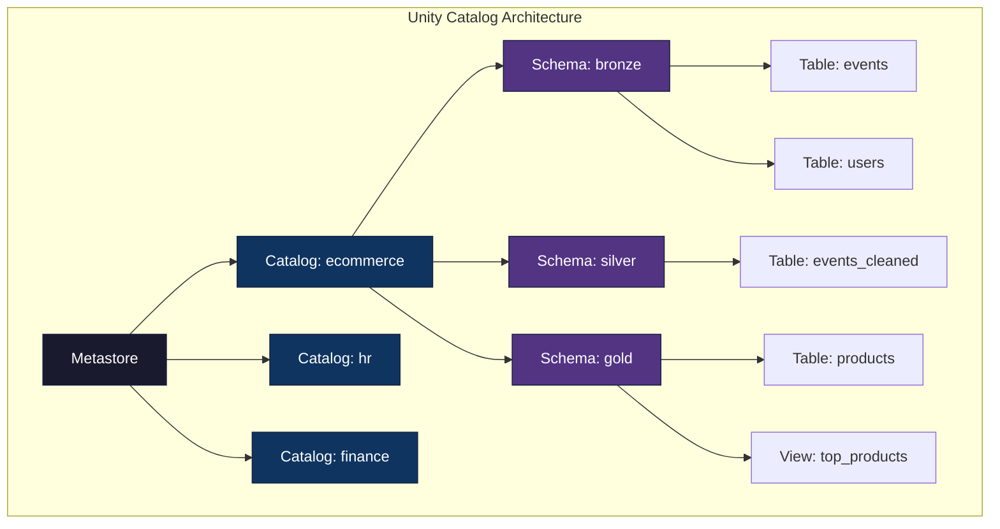
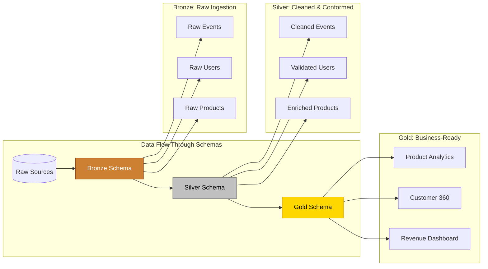
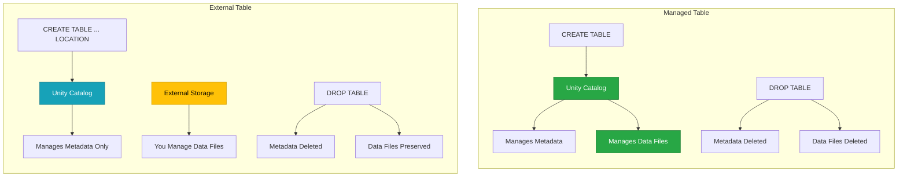
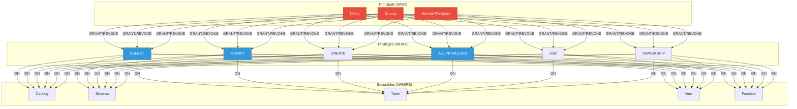
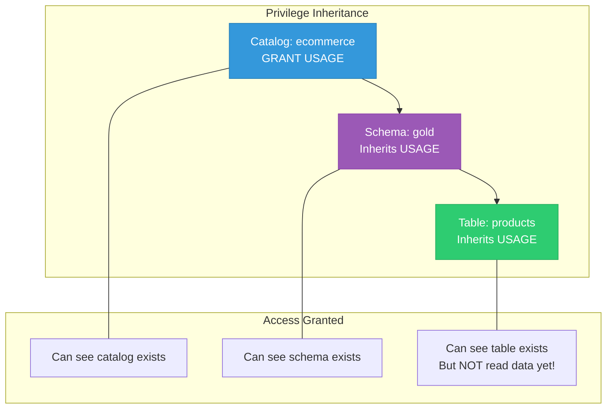
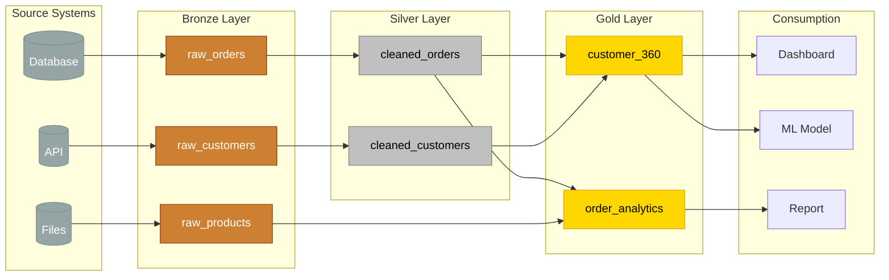
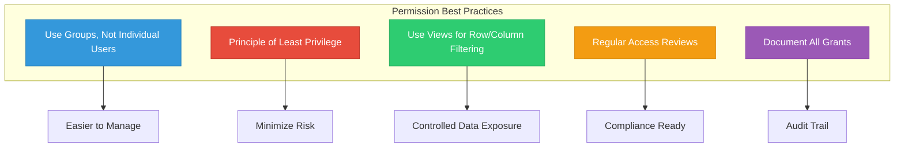

# Unity Catalog: Comprehensive Guide

## Table of Contents
1. [Introduction to Unity Catalog](#introduction-to-unity-catalog)
2. [Three-Level Namespace Hierarchy](#three-level-namespace-hierarchy)
3. [Catalog → Schema → Table Explained](#catalog--schema--table-explained)
4. [Managed vs External Tables](#managed-vs-external-tables)
5. [Access Control with GRANT/REVOKE](#access-control-with-grantrevoke)
6. [Data Lineage](#data-lineage)
7. [Practical Implementation](#practical-implementation)
8. [Best Practices](#best-practices)
9. [Quick Reference](#quick-reference)

---

## Introduction to Unity Catalog

Unity Catalog is Databricks' unified governance solution for all data and AI assets. Think of it as the **central librarian** for your entire data ecosystem—it knows where everything is stored, who can access what, and how data flows through your organization.

### Why Unity Catalog Matters

Before Unity Catalog, organizations faced significant challenges:

| Challenge | Without Unity Catalog | With Unity Catalog |
|-----------|----------------------|-------------------|
| **Data Discovery** | Scattered metadata across systems | Single searchable catalog |
| **Access Control** | Inconsistent, workspace-specific | Centralized, consistent governance |
| **Audit Trail** | Limited visibility | Complete lineage and audit logs |
| **Data Sharing** | Complex, insecure methods | Secure, governed sharing |
| **Compliance** | Manual tracking | Automated compliance reporting |

### Core Capabilities

Unity Catalog provides four fundamental capabilities:

1. **Centralized Governance** - Single place to manage all data assets
2. **Fine-grained Access Control** - Control who can do what, at any level
3. **Data Lineage** - Track where data comes from and where it goes
4. **Data Sharing** - Securely share data across organizations

---

## Three-Level Namespace Hierarchy

Unity Catalog organizes data using a three-level namespace hierarchy. This structure is essential to understand before working with any data in Databricks.



### The Complete Address Format

Every table in Unity Catalog has a **fully qualified name** that follows this pattern:

```
catalog_name.schema_name.table_name
```

For example: `ecommerce.gold.products`

This is similar to how a postal address works:

| Hierarchy Level | Analogy | Example | Purpose |
|----------------|---------|---------|---------|
| **Metastore** | Country | (Implicit, tied to account) | Top-level container for all catalogs |
| **Catalog** | City | `ecommerce` | Groups related schemas (usually by domain/department) |
| **Schema** | Street | `gold` | Groups related tables (usually by data quality layer) |
| **Table** | House Number | `products` | Actual data container |

---

## Catalog → Schema → Table Explained

### Level 1: Catalog

A **Catalog** is the highest level of organization within a metastore. It acts as a container for schemas and represents a logical grouping of data—typically by business domain, department, or environment.

**Key Characteristics:**
- First component of the three-part naming convention
- Contains multiple schemas
- Isolation boundary for permissions
- Typically represents a business domain

**Common Catalog Strategies:**

| Strategy | Example Catalogs | Use Case |
|----------|-----------------|----------|
| **By Domain** | `ecommerce`, `marketing`, `finance` | Large enterprises with distinct business units |
| **By Environment** | `dev`, `staging`, `prod` | Organizations needing environment isolation |
| **By Region** | `us_west`, `eu_central`, `apac` | Multinational companies with data residency requirements |
| **Hybrid** | `ecommerce_prod`, `ecommerce_dev` | Combined domain and environment approach |

**Creating a Catalog:**

```sql
-- Create a new catalog
CREATE CATALOG ecommerce;

-- Add description for discoverability
CREATE CATALOG ecommerce
COMMENT 'E-commerce platform data including orders, products, and customer information';

-- Switch to using this catalog
USE CATALOG ecommerce;
```

### Level 2: Schema (Database)

A **Schema** (also called a database) is a container for tables, views, and functions within a catalog. Schemas organize related objects and provide a secondary level of access control.

**Key Characteristics:**
- Second component of the three-part naming convention
- Contains tables, views, functions, and volumes
- Commonly used for medallion architecture layers
- Provides namespace isolation within a catalog

**The Medallion Architecture:**

The most popular schema organization follows the **medallion architecture**:



| Layer | Purpose | Data Quality | Typical Users |
|-------|---------|--------------|---------------|
| **Bronze** | Raw data ingestion | As-is from source, may contain duplicates and errors | Data Engineers |
| **Silver** | Cleaned and conformed | Deduplicated, validated, type-corrected | Data Engineers, Analysts |
| **Gold** | Business-ready aggregations | Curated, aggregated, ready for consumption | Analysts, Data Scientists, Business Users |

**Creating Schemas:**

```sql
-- Create schemas for medallion architecture
CREATE SCHEMA bronze
COMMENT 'Raw ingested data from source systems';

CREATE SCHEMA silver
COMMENT 'Cleaned, validated, and conformed data';

CREATE SCHEMA gold
COMMENT 'Business-ready aggregations and analytics';

-- Switch to a specific schema
USE SCHEMA gold;
```

### Level 3: Tables and Views

**Tables** are the actual containers holding your data. **Views** are saved queries that present data from one or more tables in a specific way.

**Types of Objects at This Level:**

| Object Type | Description | Stores Data? |
|-------------|-------------|--------------|
| **Managed Table** | Unity Catalog manages both metadata and data files | Yes |
| **External Table** | Unity Catalog manages only metadata; data stored externally | Yes (external location) |
| **View** | Saved SQL query referencing other tables | No |
| **Materialized View** | Precomputed view stored as a table | Yes |
| **Function** | User-defined functions (UDFs) | No |

**Creating Tables:**

```sql
-- Managed table (Unity Catalog controls storage)
CREATE TABLE bronze.events (
    event_id STRING,
    user_id STRING,
    event_type STRING,
    event_timestamp TIMESTAMP,
    properties MAP<STRING, STRING>
)
USING DELTA
COMMENT 'Raw event stream from web and mobile applications';

-- External table (you control storage location)
CREATE TABLE bronze.events
USING DELTA
LOCATION '/delta/bronze/events'
COMMENT 'Raw event stream stored in external location';
```

---

## Managed vs External Tables

Understanding the difference between managed and external tables is crucial for designing your data architecture.

### Comparison Overview



### Detailed Comparison

| Aspect | Managed Table | External Table |
|--------|---------------|----------------|
| **Data Location** | Unity Catalog's managed storage | User-specified location |
| **Who Controls Storage** | Unity Catalog (automatic) | You (manual) |
| **DROP TABLE Behavior** | Deletes metadata AND data files | Deletes metadata only; data preserved |
| **Storage Path** | Auto-assigned (opaque) | You specify explicitly |
| **Best For** | New data, self-contained projects | Existing data, shared storage, data lakes |
| **Lifecycle Management** | Fully automatic | Your responsibility |
| **Recovery After DROP** | Requires backup/time travel | Data still exists at location |

### When to Use Each Type

**Choose Managed Tables When:**
- Starting fresh with new data
- You want Unity Catalog to handle all storage concerns
- Working on isolated projects
- You want automatic cleanup on table deletion
- Simplicity is a priority

**Choose External Tables When:**
- You have existing data in cloud storage
- Multiple systems need access to the same data files
- You want to preserve data even if the table is dropped
- Migrating from an existing data lake
- You need control over exact storage location

### Syntax Examples

**Managed Table:**
```sql
-- Simple managed table
CREATE TABLE gold.products (
    product_id STRING,
    product_name STRING,
    category STRING,
    price DECIMAL(10,2),
    revenue DECIMAL(15,2),
    purchases INT,
    conversion_rate DOUBLE
)
USING DELTA;

-- Unity Catalog automatically stores data in its managed location
```

**External Table:**
```sql
-- External table pointing to existing data
CREATE TABLE bronze.events
USING DELTA
LOCATION '/delta/bronze/events';

-- Or with full path
CREATE TABLE bronze.events
USING DELTA
LOCATION 'abfss://container@storage.dfs.core.windows.net/delta/bronze/events';
```

### External Locations

For external tables, you need to configure **External Locations** in Unity Catalog:

```sql
-- First, create a storage credential (done by admin)
CREATE STORAGE CREDENTIAL my_credential
WITH (
    AZURE_MANAGED_IDENTITY = 'my-managed-identity-id'
);

-- Then, create an external location
CREATE EXTERNAL LOCATION delta_bronze
URL 'abfss://container@storage.dfs.core.windows.net/delta/bronze'
WITH (STORAGE CREDENTIAL my_credential);

-- Now you can create external tables using this location
CREATE TABLE bronze.events
USING DELTA
LOCATION 'abfss://container@storage.dfs.core.windows.net/delta/bronze/events';
```

---

## Access Control with GRANT/REVOKE

Unity Catalog provides fine-grained access control through a privilege-based security model. This allows you to control exactly who can do what, at every level of the hierarchy.

### The Security Model



### Key Concepts

**Principals** - Who is being granted access:
- **Users**: Individual accounts (identified by email)
- **Groups**: Collections of users
- **Service Principals**: Applications or automated processes

**Privileges** - What actions are allowed:

| Privilege | Description | Applicable To |
|-----------|-------------|---------------|
| `SELECT` | Read data from tables/views | Tables, Views |
| `MODIFY` | Add, update, delete data | Tables |
| `CREATE` | Create objects within a container | Catalogs, Schemas |
| `USAGE` | Access the container (required to see contents) | Catalogs, Schemas |
| `ALL PRIVILEGES` | All available privileges | All securables |
| `EXECUTE` | Run functions | Functions |
| `READ FILES` | Read from external locations | External Locations |
| `WRITE FILES` | Write to external locations | External Locations |

**Securables** - What objects are being protected:
- Catalogs, Schemas, Tables, Views, Functions, External Locations, Storage Credentials

### Privilege Inheritance

Privileges flow down the hierarchy:



**Important**: To access a table, a user needs:
1. `USAGE` on the catalog
2. `USAGE` on the schema
3. `SELECT` on the table (to read data)

### GRANT Syntax

```sql
-- Basic syntax
GRANT privilege_type ON securable_type securable_name TO principal;

-- Grant SELECT on a specific table
GRANT SELECT ON TABLE gold.products TO `analysts@company.com`;

-- Grant all privileges on a schema
GRANT ALL PRIVILEGES ON SCHEMA silver TO `engineers@company.com`;

-- Grant USAGE to allow access to a catalog
GRANT USAGE ON CATALOG ecommerce TO `data_team`;

-- Grant CREATE to allow creating new tables
GRANT CREATE ON SCHEMA gold TO `senior_engineers`;

-- Grant multiple privileges at once
GRANT SELECT, MODIFY ON TABLE silver.events TO `etl_service`;
```

### REVOKE Syntax

```sql
-- Basic syntax
REVOKE privilege_type ON securable_type securable_name FROM principal;

-- Revoke SELECT from a table
REVOKE SELECT ON TABLE gold.products FROM `intern@company.com`;

-- Revoke all privileges
REVOKE ALL PRIVILEGES ON SCHEMA bronze FROM `contractors`;
```

### Practical Permission Patterns

**Pattern 1: Data Analysts (Read-Only Access to Gold)**
```sql
-- Analysts can read from gold layer only
GRANT USAGE ON CATALOG ecommerce TO `analysts@company.com`;
GRANT USAGE ON SCHEMA gold TO `analysts@company.com`;
GRANT SELECT ON ALL TABLES IN SCHEMA gold TO `analysts@company.com`;
```

**Pattern 2: Data Engineers (Full Access)**
```sql
-- Engineers have full access to all schemas
GRANT ALL PRIVILEGES ON CATALOG ecommerce TO `engineers@company.com`;
```

**Pattern 3: ETL Service Account**
```sql
-- ETL needs to read from bronze, write to silver
GRANT USAGE ON CATALOG ecommerce TO `etl_service`;
GRANT USAGE ON SCHEMA bronze TO `etl_service`;
GRANT SELECT ON ALL TABLES IN SCHEMA bronze TO `etl_service`;
GRANT USAGE, CREATE ON SCHEMA silver TO `etl_service`;
GRANT SELECT, MODIFY ON ALL TABLES IN SCHEMA silver TO `etl_service`;
```

**Pattern 4: Using Views for Controlled Access**

Views provide an excellent way to give controlled access to data:

```sql
-- Create a view that shows only non-sensitive columns
CREATE VIEW gold.top_products AS
SELECT 
    product_name, 
    revenue, 
    conversion_rate
FROM gold.products
WHERE purchases > 10
ORDER BY revenue DESC 
LIMIT 100;

-- Grant access to the view (not the underlying table)
GRANT SELECT ON VIEW gold.top_products TO `marketing@company.com`;

-- Marketing can see product performance but not full product details
```

### Checking Permissions

```sql
-- Show grants on a specific object
SHOW GRANTS ON TABLE gold.products;

-- Show grants for a specific principal
SHOW GRANTS TO `analysts@company.com`;

-- Show all grants on a schema
SHOW GRANTS ON SCHEMA gold;
```

---

## Data Lineage

Data lineage tracks the complete journey of data—where it comes from, how it transforms, and where it ends up. Unity Catalog automatically captures lineage for all operations.

### What Lineage Captures



### Types of Lineage

| Lineage Type | Description | Example |
|--------------|-------------|---------|
| **Table Lineage** | Which tables derive from which sources | `gold.products` comes from `silver.products_cleaned` |
| **Column Lineage** | Which columns map to which source columns | `revenue` comes from `SUM(order_amount)` |
| **Query Lineage** | Which queries read from which tables | Dashboard X reads from `gold.metrics` |
| **User Lineage** | Which users interact with which data | User A accessed `gold.products` 50 times last week |

### Benefits of Lineage

**Impact Analysis:**
- Before modifying a table, see all downstream dependencies
- Understand which reports/dashboards will be affected

**Root Cause Analysis:**
- When data looks wrong, trace back to the source
- Identify where transformation errors occurred

**Compliance & Auditing:**
- Demonstrate data provenance for regulations
- Show exactly how sensitive data is used

**Documentation:**
- Auto-generated documentation of data flows
- No manual maintenance required

### Viewing Lineage

Lineage is automatically captured and can be viewed in the Databricks UI:

1. Navigate to **Catalog** in the sidebar
2. Find your table
3. Click on the **Lineage** tab

You'll see:
- **Upstream**: Tables and views that feed into this object
- **Downstream**: Objects that depend on this table
- **Column-level lineage**: How specific columns map

### Lineage in Practice

Consider this transformation:

```sql
-- This creates lineage automatically
CREATE OR REPLACE TABLE gold.product_performance AS
SELECT 
    p.product_id,
    p.product_name,
    p.category,
    SUM(o.amount) as total_revenue,
    COUNT(o.order_id) as total_orders,
    AVG(o.amount) as avg_order_value
FROM silver.products p
JOIN silver.orders o ON p.product_id = o.product_id
GROUP BY p.product_id, p.product_name, p.category;
```

Unity Catalog automatically captures:
- `gold.product_performance` depends on `silver.products` and `silver.orders`
- `total_revenue` comes from `SUM(silver.orders.amount)`
- `product_name` comes from `silver.products.product_name`

---

## Practical Implementation

Let's build a complete Unity Catalog structure for an e-commerce platform.

### Step 1: Create the Catalog Structure

```sql
-- ============================================
-- STEP 1: Create the Catalog
-- ============================================
CREATE CATALOG IF NOT EXISTS ecommerce
COMMENT 'E-commerce data platform - orders, products, customers';

-- Switch to the new catalog
USE CATALOG ecommerce;

-- ============================================
-- STEP 2: Create Schemas (Medallion Architecture)
-- ============================================
CREATE SCHEMA IF NOT EXISTS bronze
COMMENT 'Raw ingested data from source systems - minimal transformation';

CREATE SCHEMA IF NOT EXISTS silver
COMMENT 'Cleaned, validated, and conformed data - business rules applied';

CREATE SCHEMA IF NOT EXISTS gold
COMMENT 'Business-ready aggregations - optimized for analytics';
```

### Step 2: Register Tables

```sql
-- ============================================
-- BRONZE LAYER: External Tables (data already exists)
-- ============================================
CREATE TABLE IF NOT EXISTS bronze.events
USING DELTA
LOCATION '/delta/bronze/events'
COMMENT 'Raw clickstream events from web and mobile applications';

CREATE TABLE IF NOT EXISTS bronze.orders
USING DELTA
LOCATION '/delta/bronze/orders'
COMMENT 'Raw order data from order management system';

CREATE TABLE IF NOT EXISTS bronze.products
USING DELTA
LOCATION '/delta/bronze/products'
COMMENT 'Raw product catalog from PIM system';

-- ============================================
-- SILVER LAYER: External Tables (processed data)
-- ============================================
CREATE TABLE IF NOT EXISTS silver.events
USING DELTA
LOCATION '/delta/silver/events'
COMMENT 'Cleaned events - deduplicated, validated timestamps';

CREATE TABLE IF NOT EXISTS silver.orders
USING DELTA
LOCATION '/delta/silver/orders'
COMMENT 'Validated orders - business rules applied, enriched';

CREATE TABLE IF NOT EXISTS silver.products
USING DELTA
LOCATION '/delta/silver/products'
COMMENT 'Standardized products - consistent categories, prices';

-- ============================================
-- GOLD LAYER: External Tables (analytics-ready)
-- ============================================
CREATE TABLE IF NOT EXISTS gold.products
USING DELTA
LOCATION '/delta/gold/products'
COMMENT 'Product analytics - revenue, conversion rates, rankings';

CREATE TABLE IF NOT EXISTS gold.customer_360
USING DELTA
LOCATION '/delta/gold/customer_360'
COMMENT 'Customer analytics - lifetime value, segmentation';
```

### Step 3: Set Up Permissions

```sql
-- ============================================
-- PERMISSION SETUP
-- ============================================

-- Create groups for different roles (typically done in Identity Provider)
-- Here we show granting to existing groups

-- ANALYSTS: Read-only access to Gold layer
GRANT USAGE ON CATALOG ecommerce TO `analysts@company.com`;
GRANT USAGE ON SCHEMA gold TO `analysts@company.com`;
GRANT SELECT ON ALL TABLES IN SCHEMA gold TO `analysts@company.com`;

-- DATA SCIENTISTS: Read access to Silver and Gold
GRANT USAGE ON CATALOG ecommerce TO `datascience@company.com`;
GRANT USAGE ON SCHEMA silver TO `datascience@company.com`;
GRANT USAGE ON SCHEMA gold TO `datascience@company.com`;
GRANT SELECT ON ALL TABLES IN SCHEMA silver TO `datascience@company.com`;
GRANT SELECT ON ALL TABLES IN SCHEMA gold TO `datascience@company.com`;

-- DATA ENGINEERS: Full access to all layers
GRANT ALL PRIVILEGES ON CATALOG ecommerce TO `engineers@company.com`;

-- ETL SERVICE ACCOUNT: Read Bronze, Write Silver/Gold
GRANT USAGE ON CATALOG ecommerce TO `etl_service_principal`;
GRANT USAGE ON SCHEMA bronze TO `etl_service_principal`;
GRANT SELECT ON ALL TABLES IN SCHEMA bronze TO `etl_service_principal`;
GRANT USAGE, CREATE ON SCHEMA silver TO `etl_service_principal`;
GRANT SELECT, MODIFY ON ALL TABLES IN SCHEMA silver TO `etl_service_principal`;
GRANT USAGE, CREATE ON SCHEMA gold TO `etl_service_principal`;
GRANT SELECT, MODIFY ON ALL TABLES IN SCHEMA gold TO `etl_service_principal`;
```

### Step 4: Create Views for Controlled Access

```sql
-- ============================================
-- VIEWS FOR CONTROLLED DATA ACCESS
-- ============================================

-- Top Products View (safe for marketing team)
CREATE OR REPLACE VIEW gold.top_products AS
SELECT 
    product_name, 
    category,
    revenue, 
    conversion_rate,
    RANK() OVER (PARTITION BY category ORDER BY revenue DESC) as category_rank
FROM gold.products
WHERE purchases > 10  -- Filter out low-volume products
ORDER BY revenue DESC 
LIMIT 100;

COMMENT ON VIEW gold.top_products IS 
'Top 100 products by revenue - safe for marketing consumption';

-- Grant marketing access to the view only
GRANT SELECT ON VIEW gold.top_products TO `marketing@company.com`;

-- Customer Summary View (anonymized for junior analysts)
CREATE OR REPLACE VIEW gold.customer_summary AS
SELECT 
    customer_segment,
    COUNT(*) as customer_count,
    AVG(lifetime_value) as avg_ltv,
    AVG(total_orders) as avg_orders
FROM gold.customer_360
GROUP BY customer_segment;

COMMENT ON VIEW gold.customer_summary IS 
'Aggregated customer metrics by segment - no PII exposed';

GRANT SELECT ON VIEW gold.customer_summary TO `junior_analysts@company.com`;
```

### Step 5: Verify the Setup

```sql
-- ============================================
-- VERIFICATION QUERIES
-- ============================================

-- List all catalogs
SHOW CATALOGS;

-- List schemas in ecommerce catalog
SHOW SCHEMAS IN ecommerce;

-- List tables in gold schema
SHOW TABLES IN ecommerce.gold;

-- Show table details
DESCRIBE EXTENDED gold.products;

-- Show grants on a table
SHOW GRANTS ON TABLE gold.products;

-- Show grants for a user/group
SHOW GRANTS TO `analysts@company.com`;
```

---

## Best Practices

### Naming Conventions

| Level | Convention | Example |
|-------|------------|---------|
| Catalog | lowercase, business domain | `ecommerce`, `hr`, `finance` |
| Schema | lowercase, data layer | `bronze`, `silver`, `gold` |
| Table | lowercase_snake_case, descriptive | `customer_orders`, `product_metrics` |
| View | lowercase_snake_case, prefix with purpose | `rpt_sales_summary`, `vw_active_customers` |

### Permission Strategy



### Common Anti-Patterns to Avoid

| Anti-Pattern | Problem | Better Approach |
|--------------|---------|-----------------|
| Granting `ALL PRIVILEGES` broadly | Over-permissioning | Grant specific privileges needed |
| Granting to individual users | Hard to manage | Use groups |
| Skipping USAGE grants | Tables visible but inaccessible | Always grant USAGE on parent containers |
| One giant catalog | No isolation | Separate catalogs by domain |
| Direct table access for everyone | No data protection | Use views for controlled access |

---

## Quick Reference

### Essential Commands Cheat Sheet

```sql
-- CATALOG OPERATIONS
CREATE CATALOG catalog_name;
USE CATALOG catalog_name;
DROP CATALOG catalog_name CASCADE;
SHOW CATALOGS;

-- SCHEMA OPERATIONS
CREATE SCHEMA schema_name;
USE SCHEMA schema_name;
DROP SCHEMA schema_name CASCADE;
SHOW SCHEMAS IN catalog_name;

-- TABLE OPERATIONS (Managed)
CREATE TABLE schema.table_name (col1 TYPE, col2 TYPE) USING DELTA;
DROP TABLE schema.table_name;

-- TABLE OPERATIONS (External)
CREATE TABLE schema.table_name USING DELTA LOCATION 'path';

-- VIEW OPERATIONS
CREATE VIEW schema.view_name AS SELECT ...;
DROP VIEW schema.view_name;

-- PERMISSION OPERATIONS
GRANT privilege ON object TO principal;
REVOKE privilege ON object FROM principal;
SHOW GRANTS ON object;
SHOW GRANTS TO principal;
```

### Permission Quick Reference

| To Do This... | Grant This... |
|---------------|---------------|
| See a catalog exists | `USAGE ON CATALOG` |
| See schemas in a catalog | `USAGE ON CATALOG` |
| See tables in a schema | `USAGE ON CATALOG` + `USAGE ON SCHEMA` |
| Read data from a table | `USAGE ON CATALOG` + `USAGE ON SCHEMA` + `SELECT ON TABLE` |
| Insert/Update data | Above + `MODIFY ON TABLE` |
| Create new tables | Above + `CREATE ON SCHEMA` |
| Full control | `ALL PRIVILEGES` |

### Fully Qualified Name Pattern

```
catalog.schema.table
   │       │      │
   │       │      └── Table/View name
   │       └── Schema name (often: bronze, silver, gold)
   └── Catalog name (often: domain like ecommerce, hr)

Example: ecommerce.gold.products
```

---

## Summary

Unity Catalog provides a comprehensive governance solution for Databricks with:

1. **Three-Level Hierarchy**: Catalog → Schema → Table for organized namespace management
2. **Flexible Table Types**: Managed tables for simplicity, External tables for existing data
3. **Fine-Grained Access Control**: GRANT/REVOKE at any level with inheritance
4. **Automatic Data Lineage**: Track data flow without manual effort
5. **Secure Data Sharing**: Views provide controlled access to sensitive data

By implementing these patterns, you create a well-governed, secure, and maintainable data platform that scales with your organization's needs.