# Medallion Architecture: Complete Guide

## Table of Contents
1. [Introduction to Medallion Architecture](#introduction-to-medallion-architecture)
2. [Why Medallion Architecture?](#why-medallion-architecture)
3. [The Three Layers Explained](#the-three-layers-explained)
4. [Bronze Layer: Raw Data Ingestion](#bronze-layer-raw-data-ingestion)
5. [Silver Layer: Cleaned and Validated Data](#silver-layer-cleaned-and-validated-data)
6. [Gold Layer: Business Aggregates](#gold-layer-business-aggregates)
7. [Data Flow and Transformations](#data-flow-and-transformations)
8. [Incremental Processing Patterns](#incremental-processing-patterns)
9. [Best Practices for Each Layer](#best-practices-for-each-layer)
10. [Complete Code Walkthrough](#complete-code-walkthrough)
11. [Common Patterns and Anti-Patterns](#common-patterns-and-anti-patterns)
12. [Summary](#summary)

---

## Introduction to Medallion Architecture

**Medallion Architecture** (also known as **Multi-Hop Architecture**) is a data design pattern used to logically organize data in a **lakehouse**. The architecture progressively improves the structure and quality of data as it flows through three distinct layers named after medals: **Bronze**, **Silver**, and **Gold**.

Think of it like refining raw ore into precious metal:
- **Raw ore (Bronze)** → Contains impurities, unprocessed
- **Refined metal (Silver)** → Purified, standardized
- **Finished jewelry (Gold)** → Ready for use, high value


The fundamental principle is: **Data quality and structure improve as data moves from Bronze to Gold**, while maintaining a complete lineage back to the raw source.

---

## Why Medallion Architecture?

### Problems It Solves

| Problem | How Medallion Architecture Solves It |
|---------|--------------------------------------|
| **Data Quality Issues** | Progressive refinement ensures clean data reaches consumers |
| **Debugging Difficulties** | Raw data preserved in Bronze enables root cause analysis |
| **Schema Changes** | Bronze stores data as-is; transformations handled in Silver |
| **Reprocessing Needs** | Can replay from Bronze when business logic changes |
| **Multiple Use Cases** | Gold layer can have multiple tables for different needs |
| **Performance Issues** | Pre-aggregated Gold tables are optimized for queries |
| **Data Governance** | Clear separation enables access control per layer |

### Key Benefits

1. **Data Lineage**: Every transformation is traceable from Gold back to Bronze
2. **Replayability**: If business logic changes, reprocess from Bronze without re-ingesting
3. **Separation of Concerns**: Ingestion logic separate from transformation logic
4. **Quality Gates**: Each layer transition is an opportunity to validate data
5. **Flexibility**: Multiple Gold tables can be built from the same Silver data
6. **Performance**: End users query pre-aggregated Gold tables, not raw data

---

## The Three Layers Explained

```mermaid
flowchart TB
    subgraph Bronze["🥉 BRONZE LAYER"]
        direction TB
        B1["• Raw data exactly as received"]
        B2["• No transformations"]
        B3["• Add metadata (ingestion timestamp)"]
        B4["• Append-only pattern"]
        B5["• Source of truth for raw data"]
    end
    
    subgraph Silver["🥈 SILVER LAYER"]
        direction TB
        S1["• Cleaned and validated"]
        S2["• Duplicates removed"]
        S3["• Schema enforced"]
        S4["• Business rules applied"]
        S5["• Joined with reference data"]
    end
    
    subgraph Gold["🥇 GOLD LAYER"]
        direction TB
        G1["• Business-level aggregates"]
        G2["• Pre-computed metrics"]
        G3["• Ready for consumption"]
        G4["• Optimized for queries"]
        G5["• Multiple domain tables"]
    end
    
    Bronze --> Silver
    Silver --> Gold
    
    style Bronze fill:#CD7F32,color:white
    style Silver fill:#C0C0C0,color:black
    style Gold fill:#FFD700,color:black
```



### Quick Comparison Table

| Aspect | Bronze | Silver | Gold |
|--------|--------|--------|------|
| **Data Quality** | Raw, may have issues | Cleaned, validated | Aggregated, business-ready |
| **Schema** | Schema-on-read | Schema enforced | Highly structured |
| **Duplicates** | May exist | Removed | N/A (aggregated) |
| **Transformations** | None (only metadata) | Filtering, cleaning, joining | Aggregations, calculations |
| **Users** | Data engineers | Data engineers, analysts | Business users, BI tools |
| **Update Pattern** | Append-only | Upsert/Merge | Overwrite or Merge |
| **Retention** | Long-term | Medium-term | Based on reporting needs |

---

## Bronze Layer: Raw Data Ingestion

### What is the Bronze Layer?

The Bronze layer is the **landing zone** for all raw data. It captures data exactly as received from source systems with minimal transformation. The only additions are operational metadata like ingestion timestamps.

### Characteristics of Bronze Layer

1. **Raw and Unmodified**: Data stored exactly as received
2. **Append-Only**: New data is added, existing data is never modified
3. **Full History**: Complete record of all data ever received
4. **Metadata Enriched**: Adds tracking information (when, from where)
5. **Schema-on-Read**: Schema is inferred or loosely defined

### What Gets Added in Bronze?

```
Source Data + Ingestion Metadata = Bronze Data
```

Common metadata fields added:
- `ingestion_timestamp`: When the data was loaded
- `source_file`: Name/path of the source file
- `source_system`: Identifier of the source system
- `batch_id`: Identifier for the processing batch

### Bronze Layer Code Explanation

```python
# BRONZE: Raw ingestion
raw = spark.read.csv("/raw/events.csv", header=True, inferSchema=True)
raw.withColumn("ingestion_ts", F.current_timestamp()) \
   .write.format("delta").mode("overwrite").save("/delta/bronze/events")
```

**Line-by-line breakdown:**

| Line | Code | Explanation |
|------|------|-------------|
| 1 | `spark.read.csv("/raw/events.csv", ...)` | Read raw CSV file from the landing area |
| 1 | `header=True` | First row contains column names |
| 1 | `inferSchema=True` | Spark automatically detects data types |
| 2 | `.withColumn("ingestion_ts", F.current_timestamp())` | Add metadata: when this data was ingested |
| 3 | `.write.format("delta")` | Save as Delta Lake format (enables ACID transactions) |
| 3 | `.mode("overwrite")` | Replace existing data (for demo; production uses append) |
| 3 | `.save("/delta/bronze/events")` | Save to the Bronze layer location |

### Bronze Layer Data Flow

```mermaid
flowchart LR
    subgraph Source["Source System"]
        CSV["events.csv<br/>─────────<br/>user_id<br/>event_time<br/>event_type<br/>product_id<br/>price"]
    end
    
    subgraph Transform["Transformation"]
        T["Add Metadata<br/>─────────<br/>ingestion_ts = now()"]
    end
    
    subgraph Bronze["Bronze Table"]
        B["events (Delta)<br/>─────────<br/>user_id<br/>event_time<br/>event_type<br/>product_id<br/>price<br/>ingestion_ts ✨"]
    end
    
    CSV --> T --> B
    
    style Bronze fill:#CD7F32,color:white
```



### Bronze Layer Best Practices

| Practice | Description | Reason |
|----------|-------------|--------|
| **Never modify raw data** | Store data exactly as received | Enables reprocessing, audit trails |
| **Use append mode** | Add new data, don't overwrite | Preserves history |
| **Add ingestion metadata** | Timestamp, source, batch ID | Debugging and lineage |
| **Partition by date** | Use ingestion date for partitioning | Efficient incremental processing |
| **Keep original schema** | Don't rename or transform columns | Easier source comparison |
| **Use Delta format** | ACID transactions, time travel | Reliability and recoverability |

---

## Silver Layer: Cleaned and Validated Data

### What is the Silver Layer?

The Silver layer contains **cleaned, validated, and enriched data**. This is where data quality rules are applied, duplicates are removed, and data is transformed into a consistent, reliable format.

### Characteristics of Silver Layer

1. **Cleaned Data**: Invalid or corrupt records filtered out
2. **Validated**: Business rules enforced (e.g., price > 0)
3. **Deduplicated**: No duplicate records
4. **Enriched**: Additional derived columns added
5. **Schema Enforced**: Consistent data types and structure
6. **Joined**: May combine data from multiple Bronze tables

### Common Silver Layer Operations


### Silver Layer Code Explanation

```python
# SILVER: Cleaned data
bronze = spark.read.format("delta").load("/delta/bronze/events")
silver = bronze.filter(F.col("price") > 0) \
    .filter(F.col("price") < 10000) \
    .dropDuplicates(["user_session", "event_time"]) \
    .withColumn("event_date", F.to_date("event_time")) \
    .withColumn("price_tier",
        F.when(F.col("price") < 10, "budget")
         .when(F.col("price") < 50, "mid")
         .otherwise("premium"))
silver.write.format("delta").mode("overwrite").save("/delta/silver/events")
```

**Line-by-line breakdown:**

| Line | Code | Purpose |
|------|------|---------|
| 1 | `spark.read.format("delta").load(...)` | Read from Bronze layer |
| 2 | `.filter(F.col("price") > 0)` | **Validation**: Remove records with invalid prices (zero or negative) |
| 3 | `.filter(F.col("price") < 10000)` | **Validation**: Remove outliers (unrealistically high prices) |
| 4 | `.dropDuplicates(["user_session", "event_time"])` | **Deduplication**: Keep one record per session/time combination |
| 5 | `.withColumn("event_date", F.to_date("event_time"))` | **Transformation**: Extract date from timestamp |
| 6-8 | `.withColumn("price_tier", F.when(...))` | **Enrichment**: Categorize prices into tiers |
| 9 | `.write.format("delta")...save(...)` | Save to Silver layer |

### Understanding the Price Tier Logic

The code creates a derived column called `price_tier` using conditional logic:

```python
F.when(F.col("price") < 10, "budget")     # If price < $10 → "budget"
 .when(F.col("price") < 50, "mid")         # Else if price < $50 → "mid"  
 .otherwise("premium")                      # Else → "premium"
```

This translates to:

| Price Range | Tier |
|-------------|------|
| $0.01 - $9.99 | budget |
| $10.00 - $49.99 | mid |
| $50.00+ | premium |

### Data Transformation Example

| Field | Bronze (Before) | Silver (After) |
|-------|-----------------|----------------|
| price | -5, 0, 25.99, 99999 | 25.99 (invalid removed) |
| event_time | "2024-01-15 14:30:00" | "2024-01-15 14:30:00" |
| event_date | (doesn't exist) | 2024-01-15 (derived) |
| price_tier | (doesn't exist) | "mid" (derived) |
| duplicates | May exist | Removed |

### Silver Layer Best Practices

| Practice | Description |
|----------|-------------|
| **Document business rules** | Record why each filter/validation exists |
| **Handle nulls explicitly** | Decide: filter out, fill with default, or keep |
| **Use meaningful column names** | Rename cryptic source columns |
| **Standardize formats** | Consistent date formats, units, etc. |
| **Add data quality columns** | Flags for records that needed cleaning |
| **Partition appropriately** | Usually by business date |
| **Enable schema enforcement** | Use Delta Lake schema evolution carefully |

---

## Gold Layer: Business Aggregates

### What is the Gold Layer?

The Gold layer contains **business-level aggregates and metrics** ready for consumption by analysts, BI tools, and ML models. This is where raw events become meaningful business insights.

### Characteristics of Gold Layer

1. **Pre-aggregated**: Calculations already performed
2. **Business-Focused**: Organized by business domains
3. **Consumption-Ready**: Optimized for queries
4. **Multiple Tables**: Different views for different use cases
5. **Denormalized**: May duplicate data for query performance

### Gold Layer Architecture Pattern

```mermaid
flowchart TB
    subgraph Silver["Silver Layer"]
        S["Clean Events Data"]
    end
    
    subgraph Gold["Gold Layer - Multiple Domain Tables"]
        G1["product_performance<br/>─────────<br/>views, purchases,<br/>revenue, conversion_rate"]
        G2["user_metrics<br/>─────────<br/>total_spent,<br/>purchase_count, ltv"]
        G3["daily_summary<br/>─────────<br/>date, total_revenue,<br/>total_orders, avg_order"]
    end
    
    subgraph Consumers["Consumers"]
        C1["Product Dashboard"]
        C2["Customer Analytics"]
        C3["Executive Reports"]
    end
    
    S --> G1
    S --> G2
    S --> G3
    G1 --> C1
    G2 --> C2
    G3 --> C3
    
    style Silver fill:#C0C0C0,color:black
    style Gold fill:#FFD700,color:black
```



### Gold Layer Code Explanation

```python
# GOLD: Aggregates
silver = spark.read.format("delta").load("/delta/silver/events")
product_perf = silver.groupBy("product_id", "product_name") \
    .agg(
        F.countDistinct(F.when(F.col("event_type")=="view", "user_id")).alias("views"),
        F.countDistinct(F.when(F.col("event_type")=="purchase", "user_id")).alias("purchases"),
        F.sum(F.when(F.col("event_type")=="purchase", "price")).alias("revenue")
    ).withColumn("conversion_rate", F.col("purchases")/F.col("views")*100)
product_perf.write.format("delta").mode("overwrite").save("/delta/gold/products")
```

**Line-by-line breakdown:**

| Line | Code | Purpose |
|------|------|---------|
| 1 | `spark.read.format("delta").load(...)` | Read from Silver layer |
| 2 | `.groupBy("product_id", "product_name")` | Group data by product for aggregation |
| 3-6 | `.agg(...)` | Perform multiple aggregations |
| 4 | `F.countDistinct(F.when(...=="view",...))` | Count unique users who viewed (conditional count) |
| 5 | `F.countDistinct(F.when(...=="purchase",...))` | Count unique users who purchased |
| 6 | `F.sum(F.when(...=="purchase", "price"))` | Sum revenue from purchases only |
| 7 | `.withColumn("conversion_rate", ...)` | Calculate conversion rate metric |
| 8 | `.write...save(...)` | Save to Gold layer |

### Understanding the Aggregation Logic

The aggregations use **conditional counting/summing**. Let's break down how this works:

**Counting Views:**
```python
F.countDistinct(F.when(F.col("event_type")=="view", "user_id")).alias("views")
```

This says: "Count distinct user_ids, but only when event_type is 'view'"

**Visual representation of conditional aggregation:**

| user_id | event_type | Included in views? | Included in purchases? |
|---------|------------|-------------------|----------------------|
| user_1 | view | ✅ Yes | ❌ No |
| user_1 | purchase | ❌ No | ✅ Yes |
| user_2 | view | ✅ Yes | ❌ No |
| user_2 | view | ✅ Yes (but counted once due to DISTINCT) | ❌ No |

### Conversion Rate Calculation

The conversion rate formula:

$$\text{Conversion Rate} = \frac{\text{Purchases}}{\text{Views}} \times 100$$

In code:
```python
.withColumn("conversion_rate", F.col("purchases")/F.col("views")*100)
```

**Example calculation:**
- Views: 1000 unique users
- Purchases: 50 unique users
- Conversion Rate: (50 / 1000) × 100 = 5%

### Sample Gold Table Output

| product_id | product_name | views | purchases | revenue | conversion_rate |
|------------|--------------|-------|-----------|---------|-----------------|
| P001 | Laptop | 5000 | 250 | 249,750.00 | 5.0% |
| P002 | Mouse | 8000 | 1200 | 35,880.00 | 15.0% |
| P003 | Keyboard | 3500 | 420 | 20,958.00 | 12.0% |

### Gold Layer Best Practices

| Practice | Description |
|----------|-------------|
| **Design for consumers** | Understand what questions users need answered |
| **Pre-calculate metrics** | Avoid complex calculations at query time |
| **Use meaningful names** | `conversion_rate` not `cr` or `metric_5` |
| **Document calculations** | Record formulas and business definitions |
| **Consider multiple tables** | Different domains (products, users, time) |
| **Optimize for queries** | Partition by common filter columns |
| **Include timestamps** | When was this aggregate last updated? |

---

## Data Flow and Transformations

### Complete Data Journey

```mermaid
flowchart TB
    subgraph Stage1["Stage 1: Source"]
        Raw["Raw CSV File<br/>─────────<br/>Contains:<br/>• Valid records<br/>• Invalid prices<br/>• Duplicates"]
    end
    
    subgraph Stage2["Stage 2: Bronze"]
        Bronze["Bronze Table<br/>─────────<br/>All data preserved<br/>+ ingestion_ts"]
    end
    
    subgraph Stage3["Stage 3: Silver"]
        Silver["Silver Table<br/>─────────<br/>• Invalid filtered<br/>• Duplicates removed<br/>• event_date added<br/>• price_tier added"]
    end
    
    subgraph Stage4["Stage 4: Gold"]
        Gold["Gold Table<br/>─────────<br/>Product metrics:<br/>• views<br/>• purchases<br/>• revenue<br/>• conversion_rate"]
    end
    
    Stage1 -->|"Load + Metadata"| Stage2
    Stage2 -->|"Clean + Enrich"| Stage3
    Stage3 -->|"Aggregate"| Stage4
    
    style Stage1 fill:#808080,color:white
    style Stage2 fill:#CD7F32,color:white
    style Stage3 fill:#C0C0C0,color:black
    style Stage4 fill:#FFD700,color:black
```



### Transformation Summary Table

| Transformation | Layer | Description | Example |
|----------------|-------|-------------|---------|
| Add Metadata | Bronze | Add operational columns | `ingestion_ts = current_timestamp()` |
| Filter Invalid | Silver | Remove bad records | `price > 0 AND price < 10000` |
| Deduplicate | Silver | Remove duplicates | `dropDuplicates(["session", "time"])` |
| Type Conversion | Silver | Convert data types | `to_date("event_time")` |
| Derive Columns | Silver | Calculate new values | `price_tier` from price ranges |
| Aggregate | Gold | Summarize data | `groupBy().agg()` |
| Calculate Metrics | Gold | Business calculations | `conversion_rate = purchases/views` |

---

## Incremental Processing Patterns

### Why Incremental Processing?

Processing all data every time (full refresh) is expensive and slow. Incremental processing only handles new or changed data.

### Pattern 1: Append-Only (Bronze)

```python
# Only process new files
new_files = spark.read.csv("/raw/events/*.csv") \
    .filter(F.col("file_date") > last_processed_date)

new_files.withColumn("ingestion_ts", F.current_timestamp()) \
    .write.format("delta").mode("append").save("/delta/bronze/events")
```

### Pattern 2: Merge/Upsert (Silver)

```python
# Merge new data with existing
from delta.tables import DeltaTable

silver_table = DeltaTable.forPath(spark, "/delta/silver/events")
new_bronze = spark.read.format("delta").load("/delta/bronze/events") \
    .filter(F.col("ingestion_ts") > last_silver_update)

silver_table.alias("target").merge(
    new_bronze.alias("source"),
    "target.event_id = source.event_id"
).whenMatchedUpdate(set={
    "price": "source.price",
    "updated_ts": "current_timestamp()"
}).whenNotMatchedInsert(values={
    "event_id": "source.event_id",
    "price": "source.price",
    "created_ts": "current_timestamp()"
}).execute()
```

### Pattern 3: Incremental Aggregation (Gold)

```python
# Process only recent data
recent_silver = spark.read.format("delta").load("/delta/silver/events") \
    .filter(F.col("event_date") >= F.date_sub(F.current_date(), 1))

# Recalculate affected aggregates
daily_metrics = recent_silver.groupBy("product_id", "event_date").agg(...)

# Merge into Gold table
gold_table.alias("target").merge(
    daily_metrics.alias("source"),
    "target.product_id = source.product_id AND target.event_date = source.event_date"
).whenMatchedUpdateAll() \
 .whenNotMatchedInsertAll() \
 .execute()
```

### Incremental Processing Comparison

| Pattern | When to Use | Pros | Cons |
|---------|------------|------|------|
| **Append** | New data only, no updates | Simple, fast | Duplicates if replayed |
| **Merge** | Updates to existing records | Handles updates | More complex |
| **Overwrite Partition** | Time-based data | Simple, idempotent | Reprocesses whole partition |
| **Change Data Capture** | Real-time updates | Efficient | Requires CDC infrastructure |

---

## Best Practices for Each Layer

### Bronze Layer Best Practices

| Category | Best Practice |
|----------|---------------|
| **Data Preservation** | Never modify source data |
| **Metadata** | Always add ingestion timestamp and source info |
| **Format** | Use Delta Lake for ACID and time travel |
| **Schema** | Keep original schema, use `inferSchema` |
| **Mode** | Use `append` mode (not overwrite) in production |
| **Partitioning** | Partition by ingestion date |
| **Retention** | Keep raw data for compliance/reprocessing |

### Silver Layer Best Practices

| Category | Best Practice |
|----------|---------------|
| **Validation** | Define and document all validation rules |
| **Deduplication** | Use business keys for deduplication |
| **Schema** | Enforce schema strictly |
| **Nulls** | Handle nulls explicitly |
| **Naming** | Use clear, business-friendly column names |
| **Derived Fields** | Add commonly needed transformations |
| **Quality Flags** | Add columns indicating data quality |

### Gold Layer Best Practices

| Category | Best Practice |
|----------|---------------|
| **Design** | Design for specific use cases |
| **Aggregations** | Pre-compute common aggregations |
| **Metrics** | Document all metric calculations |
| **Multiple Tables** | Create separate tables for different domains |
| **Performance** | Optimize partitioning for query patterns |
| **Freshness** | Include last_updated timestamps |
| **SLAs** | Define and monitor data freshness requirements |

---

## Complete Code Walkthrough

### Full Pipeline Code with Comments

```python
from pyspark.sql import SparkSession
import pyspark.sql.functions as F

# Initialize Spark session with Delta Lake support
spark = SparkSession.builder \
    .appName("MedallionArchitecture") \
    .config("spark.sql.extensions", "io.delta.sql.DeltaSparkSessionExtension") \
    .getOrCreate()

# ═══════════════════════════════════════════════════════════════════════════
# BRONZE LAYER: Raw Data Ingestion
# ═══════════════════════════════════════════════════════════════════════════
# Purpose: Land raw data exactly as received from source systems
# Key Principles:
#   - No transformations to data itself
#   - Add operational metadata only
#   - Preserve everything for audit/reprocessing

raw = spark.read.csv(
    "/raw/events.csv",      # Source file location
    header=True,            # First row contains column headers
    inferSchema=True        # Automatically detect data types
)

bronze_df = raw.withColumn(
    "ingestion_ts",         # Column name for metadata
    F.current_timestamp()   # When this data was ingested
)

bronze_df.write \
    .format("delta") \      # Delta Lake format for ACID transactions
    .mode("overwrite") \    # For demo; use "append" in production
    .save("/delta/bronze/events")

print("✅ Bronze layer complete: Raw data ingested with metadata")

# ═══════════════════════════════════════════════════════════════════════════
# SILVER LAYER: Data Cleaning and Validation
# ═══════════════════════════════════════════════════════════════════════════
# Purpose: Clean, validate, deduplicate, and enrich data
# Key Principles:
#   - Remove invalid records
#   - Enforce business rules
#   - Add derived columns
#   - Standardize formats

bronze = spark.read.format("delta").load("/delta/bronze/events")

silver = bronze \
    # VALIDATION: Remove invalid prices
    .filter(F.col("price") > 0) \           # No free or negative prices
    .filter(F.col("price") < 10000) \       # Remove unrealistic outliers
    
    # DEDUPLICATION: Remove duplicate events
    .dropDuplicates(["user_session", "event_time"]) \
    
    # TRANSFORMATION: Extract date from timestamp
    .withColumn(
        "event_date",
        F.to_date("event_time")             # Convert timestamp to date
    ) \
    
    # ENRICHMENT: Categorize prices into business tiers
    .withColumn(
        "price_tier",
        F.when(F.col("price") < 10, "budget")     # Under $10
         .when(F.col("price") < 50, "mid")         # $10 - $49.99
         .otherwise("premium")                      # $50 and above
    )

silver.write \
    .format("delta") \
    .mode("overwrite") \
    .save("/delta/silver/events")

print("✅ Silver layer complete: Data cleaned and enriched")

# ═══════════════════════════════════════════════════════════════════════════
# GOLD LAYER: Business Aggregates
# ═══════════════════════════════════════════════════════════════════════════
# Purpose: Create business-ready aggregated views
# Key Principles:
#   - Pre-compute metrics for fast queries
#   - Design for specific use cases
#   - Use business-friendly naming

silver = spark.read.format("delta").load("/delta/silver/events")

product_performance = silver \
    # GROUP BY: One row per product
    .groupBy("product_id", "product_name") \
    
    # AGGREGATIONS: Calculate key metrics
    .agg(
        # Count unique users who viewed this product
        F.countDistinct(
            F.when(F.col("event_type") == "view", F.col("user_id"))
        ).alias("views"),
        
        # Count unique users who purchased this product
        F.countDistinct(
            F.when(F.col("event_type") == "purchase", F.col("user_id"))
        ).alias("purchases"),
        
        # Total revenue from this product
        F.sum(
            F.when(F.col("event_type") == "purchase", F.col("price"))
        ).alias("revenue")
    ) \
    
    # DERIVED METRIC: Calculate conversion rate
    .withColumn(
        "conversion_rate",
        F.round(F.col("purchases") / F.col("views") * 100, 2)
    )

product_performance.write \
    .format("delta") \
    .mode("overwrite") \
    .save("/delta/gold/products")

print("✅ Gold layer complete: Business aggregates created")

# ═══════════════════════════════════════════════════════════════════════════
# Verification: Display sample results
# ═══════════════════════════════════════════════════════════════════════════
print("\n📊 Sample Gold Layer Results:")
spark.read.format("delta").load("/delta/gold/products").show()
```

---

## Common Patterns and Anti-Patterns

### Patterns to Follow (Do This)

| Pattern | Description |
|---------|-------------|
| **Single Responsibility** | Each layer does one thing well |
| **Idempotent Pipelines** | Running twice produces same result |
| **Schema Evolution** | Plan for schema changes gracefully |
| **Metadata Tracking** | Always know when/where data came from |
| **Modular Gold** | Multiple Gold tables for different use cases |

### Anti-Patterns to Avoid (Don't Do This)

| Anti-Pattern | Problem | Solution |
|--------------|---------|----------|
| **Transforming in Bronze** | Loses raw data for debugging | Keep Bronze untransformed |
| **Skipping Silver** | No validated layer to build on | Always have cleaning step |
| **One Mega Gold Table** | Slow queries, complex logic | Split into domain tables |
| **No Incremental Logic** | Reprocesses everything each time | Implement incremental patterns |
| **Hard-coded Thresholds** | Difficult to maintain | Use configuration tables |
| **Missing Metadata** | Can't track data lineage | Always add timestamps |

---

## Summary

### Key Takeaways

1. **Medallion Architecture** provides a structured approach to organizing data in a lakehouse

2. **Three layers serve distinct purposes:**
   - **Bronze**: Raw data preservation + metadata
   - **Silver**: Cleaned, validated, enriched data
   - **Gold**: Business-ready aggregates

3. **Each layer builds on the previous**, improving data quality progressively

4. **Incremental processing** is essential for production systems

5. **Best practices** ensure maintainability, performance, and reliability

### Quick Reference

```
┌─────────────────────────────────────────────────────────────────┐
│                    MEDALLION ARCHITECTURE                       │
├─────────────────────────────────────────────────────────────────┤
│                                                                 │
│   🥉 BRONZE          🥈 SILVER           🥇 GOLD                │
│   ─────────          ─────────           ────────               │
│   Raw Data           Clean Data          Aggregates             │
│   + Metadata         + Validation        + Metrics              │
│                      + Enrichment        + KPIs                 │
│                                                                 │
│   append-only   ─→   upsert/merge   ─→   overwrite/merge       │
│                                                                 │
│   Engineers          Engineers           Business Users         │
│                      Analysts            BI Tools               │
│                                                                 │
└─────────────────────────────────────────────────────────────────┘
```
