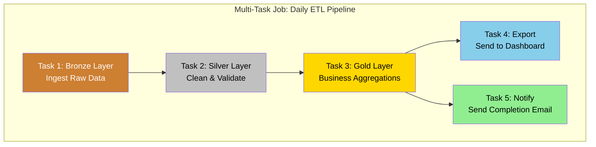
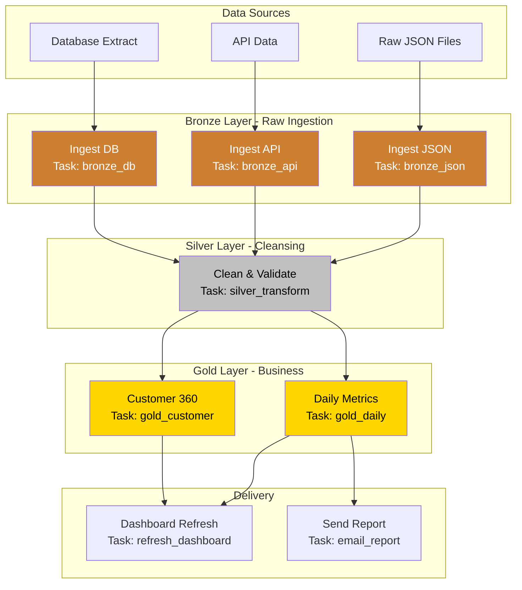
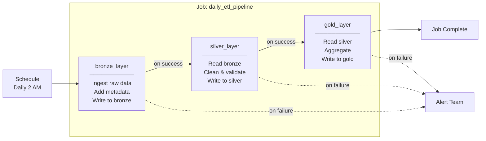

# Databricks Jobs and Workflows: Complete Guide

## Table of Contents

1. [Introduction to Databricks Jobs](#1-introduction-to-databricks-jobs)
2. [Databricks Jobs vs Notebooks: Understanding the Difference](#2-databricks-jobs-vs-notebooks-understanding-the-difference)
3. [Multi-Task Workflows](#3-multi-task-workflows)
4. [Parameters and Widgets](#4-parameters-and-widgets)
5. [Scheduling Jobs](#5-scheduling-jobs)
6. [Error Handling and Retry Mechanisms](#6-error-handling-and-retry-mechanisms)
7. [Practical Implementation: Bronze→Silver→Gold Pipeline](#7-practical-implementation-bronzeservergold-pipeline)
8. [Best Practices](#8-best-practices)
9. [Troubleshooting Common Issues](#9-troubleshooting-common-issues)

---

## 1. Introduction to Databricks Jobs

### What is a Databricks Job?

A **Databricks Job** is a mechanism to run data processing workloads in a scheduled, automated, and production-ready manner. Think of it as a way to take your interactive notebook code and run it automatically without manual intervention.

**Simple Analogy**: If a notebook is like manually cooking a meal step by step, a job is like setting up an automated cooking machine that prepares the same meal at a scheduled time every day without you being present.

### Why Do We Need Jobs?

When working with data pipelines, you often need to:
- Run transformations at specific times (e.g., daily at 2 AM when system load is low)
- Ensure data processing happens reliably even when you're not watching
- Chain multiple processing steps together in a specific order
- Handle failures gracefully and retry automatically
- Track execution history and monitor performance

Jobs solve all these problems by providing a production-grade execution environment.

---

## 2. Databricks Jobs vs Notebooks: Understanding the Difference

### Core Concepts

**Notebooks** are interactive development environments where data engineers and scientists write, test, and debug code. They're designed for exploration, experimentation, and iterative development.

**Jobs** are automated execution units designed to run notebooks (or other code) in production without human intervention. They're built for reliability, scheduling, and monitoring.

### Detailed Comparison

| Aspect | Notebooks | Jobs |
|--------|-----------|------|
| **Primary Purpose** | Interactive development, exploration, testing | Automated production execution |
| **Execution Trigger** | Manual (user clicks "Run") | Scheduled (cron), triggered (API/event), or manual |
| **User Interaction** | Required - user actively works in the notebook | Not required - runs autonomously |
| **Cluster Lifecycle** | Often uses shared interactive clusters | Typically uses job-specific clusters that start/stop automatically |
| **State Persistence** | Variables persist during session | Fresh state each run (stateless) |
| **Error Handling** | Manual debugging by user | Automatic retries, alerts, and failure handling |
| **Cost Model** | Pay while cluster runs (often longer) | Pay only for execution time (more efficient) |
| **Monitoring** | Manual observation | Built-in run history, metrics, and alerting |
| **Parameterization** | Widgets for interactive input | Job parameters passed at runtime |
| **Concurrency** | Single user typically | Can run multiple instances simultaneously |
| **Version Control** | Working copy changes frequently | Tied to specific notebook version/commit |

### When to Use What?

```
┌─────────────────────────────────────────────────────────────────┐
│                    DECISION FRAMEWORK                           │
├─────────────────────────────────────────────────────────────────┤
│                                                                 │
│  Use NOTEBOOKS when:                                            │
│  ├── Exploring new data sources                                 │
│  ├── Developing and testing transformations                     │
│  ├── Creating visualizations for analysis                       │
│  ├── Debugging pipeline issues                                  │
│  └── Sharing analysis results interactively                     │
│                                                                 │
│  Use JOBS when:                                                 │
│  ├── Running daily/weekly/monthly ETL pipelines                 │
│  ├── Processing data on a schedule                              │
│  ├── Production workloads requiring reliability                 │
│  ├── Multi-step workflows with dependencies                     │
│  └── Any automated, unattended execution                        │
│                                                                 │
└─────────────────────────────────────────────────────────────────┘
```

### The Development-to-Production Journey

The typical workflow involves:

1. **Develop** in notebooks interactively
2. **Test** your logic with sample data
3. **Parameterize** your notebooks to accept inputs
4. **Create a Job** to automate execution
5. **Schedule** the job to run at appropriate times
6. **Monitor** execution and handle failures

---

## 3. Multi-Task Workflows

### What are Multi-Task Workflows?

A **Multi-Task Workflow** is a job that contains multiple tasks (individual units of work) that can run in sequence, in parallel, or in complex dependency patterns. This is essential for building data pipelines where different stages depend on each other.

### Why Multi-Task?

Real-world data pipelines rarely consist of a single step. Consider a typical data pipeline:

1. **Ingest** raw data from source systems
2. **Clean** and validate the data
3. **Transform** data into business-ready format
4. **Aggregate** data for reporting
5. **Export** data to downstream systems

Each step depends on the previous one completing successfully. Multi-task workflows let you model these dependencies explicitly.

### Workflow Architecture



### Task Types Available

Databricks supports several task types that can be combined in a workflow:

| Task Type | Description | Use Case |
|-----------|-------------|----------|
| **Notebook** | Runs a Databricks notebook | Data transformations, ETL logic |
| **Python Script** | Executes a Python file | Standalone Python applications |
| **Python Wheel** | Runs packaged Python code | Production-grade Python packages |
| **JAR** | Executes Java/Scala JAR files | Spark applications in JVM languages |
| **Spark Submit** | Generic Spark job submission | Legacy Spark applications |
| **SQL** | Runs SQL queries | Simple transformations, aggregations |
| **dbt** | Runs dbt transformations | dbt-based data modeling |
| **Delta Live Tables** | Runs DLT pipelines | Declarative ETL pipelines |
| **If/else condition** | Conditional branching | Dynamic workflow logic |
| **For each** | Loop over items | Processing multiple files/tables |

### Dependency Patterns

Tasks can be connected in various patterns:

**Sequential (Linear)**: Each task waits for the previous one
```
Task A → Task B → Task C
```

**Parallel (Fan-out)**: Multiple tasks run simultaneously
```
        → Task B
Task A  → Task C
        → Task D
```

**Fan-in**: Multiple tasks converge to one
```
Task A →
Task B → Task D
Task C →
```

**Complex DAG**: Combination of patterns
```
Task A → Task B → Task D
    ↘          ↗
      Task C →
```

### Dependency Configuration Options

When setting up dependencies, you can specify conditions:

| Condition | Meaning |
|-----------|---------|
| **All succeeded** | Run only if ALL upstream tasks completed successfully |
| **At least one succeeded** | Run if ANY upstream task succeeded |
| **None failed** | Run if no upstream tasks failed (includes skipped) |
| **All done** | Run regardless of upstream task outcomes |
| **At least one failed** | Run only if at least one upstream failed (for error handling) |

---

## 4. Parameters and Widgets

### Understanding Parameterization

**Parameterization** is the practice of making your code flexible by accepting inputs at runtime rather than hardcoding values. This is crucial for:

- Reusing the same notebook for different scenarios
- Running pipelines for different dates or data sources
- Testing with different configurations
- Promoting code from development to production

### Databricks Widgets

**Widgets** are Databricks' mechanism for parameterizing notebooks. They create input controls that can accept values either interactively (in the notebook UI) or programmatically (when run as a job).

### Widget Types

| Widget Type | Method | Description | Best For |
|-------------|--------|-------------|----------|
| **Text** | `widgets.text()` | Free-form text input | File paths, table names, custom strings |
| **Dropdown** | `widgets.dropdown()` | Select from predefined options | Environment selection, layer names |
| **Combobox** | `widgets.combobox()` | Dropdown with custom input option | Options with occasional custom values |
| **Multiselect** | `widgets.multiselect()` | Select multiple values | Processing multiple tables, columns |

### Widget Implementation

#### Creating Widgets

```python
# =============================================================================
# WIDGET CREATION EXAMPLES
# =============================================================================

# 1. TEXT WIDGET
# Use for: file paths, table names, any free-form string input
# Syntax: dbutils.widgets.text(name, defaultValue, label)

dbutils.widgets.text(
    "source_path",           # Parameter name (used to retrieve value)
    "/mnt/raw/data",        # Default value if none provided
    "Source Data Path"       # Label shown in UI (optional)
)

# 2. DROPDOWN WIDGET
# Use for: selecting from a fixed set of options
# Syntax: dbutils.widgets.dropdown(name, defaultValue, choices, label)

dbutils.widgets.dropdown(
    "layer",                 # Parameter name
    "bronze",               # Default value (must be in choices list)
    ["bronze", "silver", "gold"],  # Available options
    "Processing Layer"       # Label shown in UI
)

# 3. COMBOBOX WIDGET
# Use for: dropdown with ability to enter custom values
# Syntax: dbutils.widgets.combobox(name, defaultValue, choices, label)

dbutils.widgets.combobox(
    "environment",
    "dev",
    ["dev", "staging", "prod"],
    "Target Environment"
)

# 4. MULTISELECT WIDGET
# Use for: selecting multiple values from options
# Syntax: dbutils.widgets.multiselect(name, defaultValue, choices, label)

dbutils.widgets.multiselect(
    "tables_to_process",
    "customers",            # Default selection
    ["customers", "orders", "products", "inventory"],
    "Tables to Process"
)
```

#### Retrieving Widget Values

```python
# =============================================================================
# RETRIEVING WIDGET VALUES
# =============================================================================

# Get single value from text or dropdown widget
source_path = dbutils.widgets.get("source_path")
layer = dbutils.widgets.get("layer")
environment = dbutils.widgets.get("environment")

# Get multiple values from multiselect (returns comma-separated string)
tables_string = dbutils.widgets.get("tables_to_process")
# Convert to list for processing
tables_list = [t.strip() for t in tables_string.split(",")]

# Example usage
print(f"Processing {layer} layer")
print(f"Source path: {source_path}")
print(f"Environment: {environment}")
print(f"Tables to process: {tables_list}")
```

#### Removing Widgets

```python
# Remove a specific widget
dbutils.widgets.remove("source_path")

# Remove all widgets from the notebook
dbutils.widgets.removeAll()
```

### How Parameters Flow: Interactive vs Job Execution

```
┌─────────────────────────────────────────────────────────────────────────┐
│                     PARAMETER FLOW DIAGRAM                              │
├─────────────────────────────────────────────────────────────────────────┤
│                                                                         │
│  INTERACTIVE MODE (Running in Notebook):                                │
│  ┌─────────────┐    ┌──────────────────┐    ┌─────────────────┐        │
│  │ User types  │ → │ Widget UI shows  │ → │ Code reads via  │        │
│  │ in widget   │    │ input controls   │    │ widgets.get()   │        │
│  └─────────────┘    └──────────────────┘    └─────────────────┘        │
│                                                                         │
│  JOB MODE (Running as Job Task):                                        │
│  ┌─────────────┐    ┌──────────────────┐    ┌─────────────────┐        │
│  │ Job config  │ → │ Parameters sent  │ → │ Widgets receive │        │
│  │ specifies   │    │ to notebook      │    │ values auto-    │        │
│  │ parameters  │    │ at runtime       │    │ matically       │        │
│  └─────────────┘    └──────────────────┘    └─────────────────┘        │
│                                                                         │
└─────────────────────────────────────────────────────────────────────────┘
```

### Complete Parameterized Notebook Example

```python
# =============================================================================
# NOTEBOOK: process_data_layer.py
# Purpose: Generic data processing notebook that handles any layer
# =============================================================================

# -----------------------------------------------------------------------------
# STEP 1: Define Parameters (Widgets)
# -----------------------------------------------------------------------------

# Create widgets with sensible defaults
dbutils.widgets.text("source_path", "/mnt/datalake/raw", "Source Path")
dbutils.widgets.text("target_path", "/mnt/datalake/processed", "Target Path")
dbutils.widgets.dropdown("layer", "bronze", ["bronze", "silver", "gold"], "Layer")
dbutils.widgets.text("process_date", "", "Process Date (YYYY-MM-DD)")
dbutils.widgets.dropdown("mode", "append", ["append", "overwrite"], "Write Mode")

# -----------------------------------------------------------------------------
# STEP 2: Retrieve Parameters
# -----------------------------------------------------------------------------

source_path = dbutils.widgets.get("source_path")
target_path = dbutils.widgets.get("target_path")
layer = dbutils.widgets.get("layer")
process_date = dbutils.widgets.get("process_date")
write_mode = dbutils.widgets.get("mode")

# Handle empty date - use current date as default
if not process_date:
    from datetime import datetime
    process_date = datetime.now().strftime("%Y-%m-%d")

# Log parameters for debugging
print("=" * 60)
print("EXECUTION PARAMETERS")
print("=" * 60)
print(f"Source Path:   {source_path}")
print(f"Target Path:   {target_path}")
print(f"Layer:         {layer}")
print(f"Process Date:  {process_date}")
print(f"Write Mode:    {write_mode}")
print("=" * 60)

# -----------------------------------------------------------------------------
# STEP 3: Layer-Specific Processing Logic
# -----------------------------------------------------------------------------

def process_bronze_layer(source, target, date):
    """
    Bronze Layer: Raw data ingestion with minimal transformation
    - Read from source systems
    - Add metadata columns
    - Write as-is to bronze zone
    """
    print(f"Processing BRONZE layer for date: {date}")
    
    # Read raw data
    df = spark.read.format("json").load(f"{source}/{date}")
    
    # Add ingestion metadata
    from pyspark.sql.functions import current_timestamp, lit
    df = df.withColumn("ingestion_timestamp", current_timestamp())
    df = df.withColumn("source_file", lit(f"{source}/{date}"))
    df = df.withColumn("layer", lit("bronze"))
    
    # Write to bronze zone
    output_path = f"{target}/bronze/{date}"
    df.write.mode(write_mode).format("delta").save(output_path)
    
    return df.count()


def process_silver_layer(source, target, date):
    """
    Silver Layer: Cleansed and validated data
    - Read from bronze
    - Apply data quality rules
    - Standardize formats
    - Remove duplicates
    """
    print(f"Processing SILVER layer for date: {date}")
    
    # Read from bronze
    bronze_path = f"{source}/bronze/{date}"
    df = spark.read.format("delta").load(bronze_path)
    
    # Data cleaning operations
    from pyspark.sql.functions import trim, lower, col, when
    
    # Remove nulls in critical columns
    df = df.dropna(subset=["id", "timestamp"])
    
    # Standardize string columns
    string_columns = [f.name for f in df.schema.fields 
                      if str(f.dataType) == "StringType"]
    for col_name in string_columns:
        df = df.withColumn(col_name, trim(col(col_name)))
    
    # Remove duplicates
    df = df.dropDuplicates(["id"])
    
    # Add processing metadata
    df = df.withColumn("layer", lit("silver"))
    df = df.withColumn("processed_timestamp", current_timestamp())
    
    # Write to silver zone
    output_path = f"{target}/silver/{date}"
    df.write.mode(write_mode).format("delta").save(output_path)
    
    return df.count()


def process_gold_layer(source, target, date):
    """
    Gold Layer: Business-ready aggregations
    - Read from silver
    - Apply business logic
    - Create aggregations
    - Optimize for consumption
    """
    print(f"Processing GOLD layer for date: {date}")
    
    # Read from silver
    silver_path = f"{source}/silver/{date}"
    df = spark.read.format("delta").load(silver_path)
    
    # Business aggregations (example: daily summary)
    from pyspark.sql.functions import sum, count, avg, max, min
    
    aggregated_df = df.groupBy("category", "region").agg(
        count("*").alias("total_records"),
        sum("amount").alias("total_amount"),
        avg("amount").alias("avg_amount"),
        max("timestamp").alias("latest_record"),
        min("timestamp").alias("earliest_record")
    )
    
    # Add metadata
    aggregated_df = aggregated_df.withColumn("layer", lit("gold"))
    aggregated_df = aggregated_df.withColumn("report_date", lit(date))
    
    # Write to gold zone (optimized for queries)
    output_path = f"{target}/gold/daily_summary"
    aggregated_df.write.mode(write_mode).format("delta") \
        .partitionBy("report_date") \
        .save(output_path)
    
    return aggregated_df.count()


# -----------------------------------------------------------------------------
# STEP 4: Execute Based on Layer Parameter
# -----------------------------------------------------------------------------

# Mapping of layer names to processing functions
layer_processors = {
    "bronze": process_bronze_layer,
    "silver": process_silver_layer,
    "gold": process_gold_layer
}

# Execute the appropriate processor
if layer in layer_processors:
    record_count = layer_processors[layer](source_path, target_path, process_date)
    print(f"\n✓ Successfully processed {record_count} records in {layer} layer")
else:
    raise ValueError(f"Unknown layer: {layer}. Expected one of: {list(layer_processors.keys())}")

# -----------------------------------------------------------------------------
# STEP 5: Return Result (for job chaining)
# -----------------------------------------------------------------------------

# Exit with success and return metrics
dbutils.notebook.exit(f'{{"status": "success", "layer": "{layer}", "records": {record_count}}}')
```

---

## 5. Scheduling Jobs

### Scheduling Concepts

**Scheduling** determines when your job runs automatically. Databricks supports several scheduling mechanisms:

| Schedule Type | Description | Use Case |
|---------------|-------------|----------|
| **None (Manual)** | Job runs only when manually triggered | Testing, ad-hoc execution |
| **Scheduled (Cron)** | Job runs on a time-based schedule | Regular ETL, daily/weekly reports |
| **Continuous** | Job runs continuously, restarting immediately after completion | Real-time/streaming workloads |
| **File Arrival** | Job triggers when new files arrive in a location | Event-driven processing |

### Cron Expression Deep Dive

Cron expressions define when scheduled jobs run. The format used in Databricks follows the Quartz cron format:

```
┌───────────── second (0-59)
│ ┌───────────── minute (0-59)
│ │ ┌───────────── hour (0-23)
│ │ │ ┌───────────── day of month (1-31)
│ │ │ │ ┌───────────── month (1-12)
│ │ │ │ │ ┌───────────── day of week (0-6, Sunday=0)
│ │ │ │ │ │
│ │ │ │ │ │
* * * * * *
```

### Common Cron Schedules

| Schedule | Cron Expression | Explanation |
|----------|-----------------|-------------|
| Every day at 2:00 AM | `0 0 2 * * ?` | Second 0, minute 0, hour 2, any day/month/weekday |
| Every hour | `0 0 * * * ?` | At minute 0 of every hour |
| Every 15 minutes | `0 */15 * * * ?` | Every 15 minutes |
| Weekdays at 9 AM | `0 0 9 ? * MON-FRI` | Monday through Friday at 9:00 AM |
| First day of month at midnight | `0 0 0 1 * ?` | Day 1 of every month at 00:00 |
| Every Sunday at 3 AM | `0 0 3 ? * SUN` | Sunday at 3:00 AM |
| Last day of month at 11 PM | `0 0 23 L * ?` | Last day (L) of month at 23:00 |

### Special Characters in Cron

| Character | Meaning | Example |
|-----------|---------|---------|
| `*` | Any value | `* * * * * ?` = every second |
| `?` | No specific value | Used in day-of-month OR day-of-week |
| `-` | Range | `MON-FRI` = Monday to Friday |
| `,` | List | `1,15` = 1st and 15th |
| `/` | Increment | `*/15` = every 15 units |
| `L` | Last | `L` in day-of-month = last day |
| `W` | Weekday | `15W` = nearest weekday to 15th |
| `#` | Nth occurrence | `FRI#2` = 2nd Friday |

### Time Zone Considerations

Jobs run based on the configured time zone. Important considerations:

- **Default**: UTC if not specified
- **Daylight Saving**: Jobs automatically adjust for DST
- **Recommendation**: Use UTC for consistency across global teams, or use the business's primary time zone

```python
# Example: Schedule for 2 AM Eastern Time
# In job configuration:
# Schedule: 0 0 2 * * ?
# Time Zone: America/New_York

# This will automatically adjust for EST/EDT transitions
```

### Scheduling Best Practices

1. **Avoid Peak Hours**: Schedule large jobs during off-peak times (e.g., 2-4 AM)
2. **Stagger Schedules**: Don't schedule all jobs at the same time (e.g., not all at midnight)
3. **Consider Dependencies**: If Job B needs Job A's output, schedule Job B with enough buffer time
4. **Monitor Execution Time**: Ensure jobs complete before the next scheduled run
5. **Use Meaningful Times**: Align with business needs (e.g., reports ready before 9 AM meeting)

---

## 6. Error Handling and Retry Mechanisms

### Why Error Handling Matters

In production data pipelines, failures happen. Sources become unavailable, data formats change, clusters run out of memory. Proper error handling ensures:

- **Reliability**: Transient failures don't require manual intervention
- **Visibility**: Failures are detected and communicated quickly
- **Recovery**: Pipelines can recover without data loss
- **Debugging**: Enough information exists to diagnose issues

### Types of Failures

| Failure Type | Examples | Typical Solution |
|--------------|----------|------------------|
| **Transient** | Network timeout, temporary service unavailable | Retry automatically |
| **Resource** | Out of memory, disk full, cluster termination | Scale up resources, retry |
| **Data** | Schema mismatch, corrupt files, missing data | Fix data, alert team |
| **Logic** | Bug in transformation code | Fix code, redeploy |
| **External** | Source system down, API rate limited | Wait and retry, alert team |

### Job-Level Retry Configuration

At the job level, you can configure:

**Maximum Retries**: Number of times to retry the entire job on failure
- Default: 0 (no retries)
- Recommended: 1-3 for transient failures

**Retry on Timeout**: Whether to retry if the job times out
- Use when jobs might timeout due to temporary resource constraints

### Task-Level Retry Configuration

Each task within a job can have independent retry settings:

| Setting | Description | Recommendation |
|---------|-------------|----------------|
| **Max Retries** | Times to retry this specific task | 1-3 for most tasks |
| **Min Retry Interval** | Minimum seconds between retries | 30-60 seconds |
| **Max Retry Interval** | Maximum seconds between retries | 300-600 seconds |
| **Retry on Timeout** | Retry if task exceeds timeout | Enable for long-running tasks |

### Implementing Error Handling in Notebooks

```python
# =============================================================================
# ERROR HANDLING PATTERNS IN DATABRICKS NOTEBOOKS
# =============================================================================

import logging
from datetime import datetime

# -----------------------------------------------------------------------------
# Pattern 1: Basic Try-Except with Logging
# -----------------------------------------------------------------------------

def process_with_basic_error_handling():
    """Basic pattern: catch exceptions and log them"""
    try:
        # Your processing logic
        df = spark.read.format("delta").load("/path/to/data")
        result = df.count()
        print(f"Successfully processed {result} records")
        return result
    except Exception as e:
        # Log the error
        print(f"ERROR: Processing failed with exception: {str(e)}")
        # Re-raise to fail the job (triggers retry if configured)
        raise


# -----------------------------------------------------------------------------
# Pattern 2: Specific Exception Handling
# -----------------------------------------------------------------------------

from pyspark.sql.utils import AnalysisException
from py4j.protocol import Py4JJavaError

def process_with_specific_handling():
    """Handle different error types differently"""
    try:
        df = spark.read.format("delta").load("/path/to/data")
        return df.count()
        
    except AnalysisException as e:
        # Spark analysis error (e.g., table not found, schema mismatch)
        if "Path does not exist" in str(e):
            print("WARNING: Source path not found, skipping...")
            return 0  # Return gracefully
        else:
            raise  # Re-raise unexpected analysis errors
            
    except Py4JJavaError as e:
        # Java/Spark error (e.g., OOM, cluster issues)
        print(f"ERROR: Spark error occurred: {str(e)}")
        raise  # Always re-raise - let job retry handle this
        
    except Exception as e:
        # Catch-all for unexpected errors
        print(f"ERROR: Unexpected error: {type(e).__name__}: {str(e)}")
        raise


# -----------------------------------------------------------------------------
# Pattern 3: Retry Logic Within Notebook
# -----------------------------------------------------------------------------

import time

def process_with_internal_retry(max_attempts=3, delay_seconds=30):
    """Implement retry logic within the notebook for specific operations"""
    
    for attempt in range(1, max_attempts + 1):
        try:
            print(f"Attempt {attempt}/{max_attempts}")
            
            # Operation that might fail transiently
            df = spark.read.format("jdbc") \
                .option("url", "jdbc:postgresql://host:5432/db") \
                .option("dbtable", "source_table") \
                .load()
            
            print(f"Success on attempt {attempt}")
            return df
            
        except Exception as e:
            print(f"Attempt {attempt} failed: {str(e)}")
            
            if attempt < max_attempts:
                print(f"Waiting {delay_seconds} seconds before retry...")
                time.sleep(delay_seconds)
                delay_seconds *= 2  # Exponential backoff
            else:
                print("All attempts exhausted")
                raise


# -----------------------------------------------------------------------------
# Pattern 4: Graceful Degradation
# -----------------------------------------------------------------------------

def process_with_graceful_degradation():
    """Handle failures gracefully when possible"""
    
    results = {
        "primary_source": None,
        "fallback_source": None,
        "status": "unknown"
    }
    
    # Try primary source
    try:
        results["primary_source"] = spark.read.format("delta") \
            .load("/primary/path").count()
        results["status"] = "primary_success"
        
    except Exception as primary_error:
        print(f"Primary source failed: {str(primary_error)}")
        
        # Try fallback source
        try:
            results["fallback_source"] = spark.read.format("delta") \
                .load("/fallback/path").count()
            results["status"] = "fallback_success"
            
        except Exception as fallback_error:
            print(f"Fallback source also failed: {str(fallback_error)}")
            results["status"] = "complete_failure"
            raise  # Both failed, raise error
    
    return results


# -----------------------------------------------------------------------------
# Pattern 5: Checkpoint and Recovery
# -----------------------------------------------------------------------------

def process_with_checkpoint():
    """Use checkpoints to enable recovery from failure"""
    
    checkpoint_path = "/path/to/checkpoint"
    checkpoint_file = f"{checkpoint_path}/progress.json"
    
    # Check for existing checkpoint
    try:
        checkpoint_data = spark.read.json(checkpoint_file).first()
        last_processed_id = checkpoint_data["last_processed_id"]
        print(f"Resuming from checkpoint: last_processed_id = {last_processed_id}")
    except:
        last_processed_id = 0
        print("No checkpoint found, starting from beginning")
    
    # Process data in batches
    batch_size = 10000
    current_id = last_processed_id
    
    while True:
        # Read batch
        batch_df = spark.read.format("delta") \
            .load("/source/data") \
            .filter(f"id > {current_id}") \
            .limit(batch_size)
        
        if batch_df.count() == 0:
            print("No more data to process")
            break
        
        # Process batch
        process_batch(batch_df)
        
        # Update checkpoint
        current_id = batch_df.agg({"id": "max"}).collect()[0][0]
        checkpoint_df = spark.createDataFrame(
            [{"last_processed_id": current_id, "timestamp": str(datetime.now())}]
        )
        checkpoint_df.write.mode("overwrite").json(checkpoint_file)
        
        print(f"Checkpoint updated: last_processed_id = {current_id}")


# -----------------------------------------------------------------------------
# Pattern 6: Exit Codes for Job Control
# -----------------------------------------------------------------------------

def process_with_exit_code():
    """Use dbutils.notebook.exit() to communicate status to job orchestrator"""
    
    try:
        # Processing logic
        df = spark.read.format("delta").load("/path/to/data")
        record_count = df.count()
        
        if record_count == 0:
            # No data to process - not an error, but notable
            dbutils.notebook.exit('{"status": "success", "records": 0, "message": "No new data"}')
        
        # Process data
        processed_count = transform_and_write(df)
        
        # Success with data
        dbutils.notebook.exit(f'{{"status": "success", "records": {processed_count}}}')
        
    except Exception as e:
        # Failure - log and exit with error status
        error_message = str(e).replace('"', '\\"')  # Escape quotes for JSON
        dbutils.notebook.exit(f'{{"status": "failed", "error": "{error_message}"}}')
        raise  # Also raise to trigger job retry
```

### Alerting Configuration

Configure alerts to be notified of job outcomes:

| Alert Type | Trigger | Notification |
|------------|---------|--------------|
| **On Failure** | Any task fails (after retries exhausted) | Email, Slack, PagerDuty |
| **On Success** | Job completes successfully | Email (optional) |
| **On Start** | Job begins execution | Email (optional) |
| **On Duration** | Job exceeds expected duration | Email, monitoring system |
| **SLA Breach** | Job doesn't complete by expected time | Email, PagerDuty |

---

## 7. Practical Implementation: Bronze→Silver→Gold Pipeline

This section provides a complete, production-ready implementation of a multi-task data pipeline.

### Pipeline Architecture



### Task 1: Bronze Layer Notebook

```python
# =============================================================================
# NOTEBOOK: bronze_layer.py
# Purpose: Ingest raw data into bronze layer with minimal transformation
# =============================================================================

# -----------------------------------------------------------------------------
# PARAMETERS
# -----------------------------------------------------------------------------

dbutils.widgets.text("source_path", "/mnt/landing/raw", "Source Path")
dbutils.widgets.text("target_path", "/mnt/datalake/bronze", "Target Path")
dbutils.widgets.text("process_date", "", "Process Date (YYYY-MM-DD)")
dbutils.widgets.dropdown("source_type", "json", ["json", "csv", "parquet"], "Source Type")

# Retrieve parameters
source_path = dbutils.widgets.get("source_path")
target_path = dbutils.widgets.get("target_path")
process_date = dbutils.widgets.get("process_date")
source_type = dbutils.widgets.get("source_type")

# Default to current date if not provided
if not process_date:
    from datetime import datetime
    process_date = datetime.now().strftime("%Y-%m-%d")

print(f"""
================================================================================
BRONZE LAYER INGESTION
================================================================================
Source Path:  {source_path}
Target Path:  {target_path}
Process Date: {process_date}
Source Type:  {source_type}
================================================================================
""")

# -----------------------------------------------------------------------------
# INGESTION LOGIC
# -----------------------------------------------------------------------------

from pyspark.sql.functions import (
    current_timestamp, lit, input_file_name, 
    sha2, concat_ws, col
)

def ingest_bronze_layer(source, target, date, file_type):
    """
    Ingest raw data into bronze layer.
    
    Bronze layer characteristics:
    - Raw data as-is from source
    - Added metadata columns for lineage
    - No business transformations
    - Preserved original schema
    """
    
    # Construct source path for this date
    source_location = f"{source}/{date}"
    
    # Read raw data based on source type
    print(f"Reading {file_type} data from: {source_location}")
    
    if file_type == "json":
        df = spark.read \
            .option("multiLine", True) \
            .option("mode", "PERMISSIVE") \
            .option("columnNameOfCorruptRecord", "_corrupt_record") \
            .json(source_location)
    elif file_type == "csv":
        df = spark.read \
            .option("header", True) \
            .option("inferSchema", True) \
            .option("mode", "PERMISSIVE") \
            .csv(source_location)
    elif file_type == "parquet":
        df = spark.read.parquet(source_location)
    else:
        raise ValueError(f"Unsupported source type: {file_type}")
    
    # Get initial record count
    initial_count = df.count()
    print(f"Records read from source: {initial_count}")
    
    # Add metadata columns (lineage tracking)
    df_with_metadata = df \
        .withColumn("_ingestion_timestamp", current_timestamp()) \
        .withColumn("_source_file", input_file_name()) \
        .withColumn("_process_date", lit(date)) \
        .withColumn("_layer", lit("bronze"))
    
    # Generate a unique row ID for tracking
    # Using SHA-256 hash of all columns concatenated
    all_columns = [col(c) for c in df.columns]
    df_with_metadata = df_with_metadata \
        .withColumn("_row_hash", sha2(concat_ws("||", *all_columns), 256))
    
    # Write to bronze layer
    output_path = f"{target}/{date}"
    print(f"Writing to bronze layer: {output_path}")
    
    df_with_metadata.write \
        .format("delta") \
        .mode("overwrite") \
        .option("overwriteSchema", True) \
        .save(output_path)
    
    # Verify write
    written_count = spark.read.format("delta").load(output_path).count()
    print(f"Records written to bronze: {written_count}")
    
    return written_count

# -----------------------------------------------------------------------------
# EXECUTE
# -----------------------------------------------------------------------------

try:
    record_count = ingest_bronze_layer(source_path, target_path, process_date, source_type)
    
    # Exit with success status
    result = {
        "status": "success",
        "layer": "bronze",
        "records": record_count,
        "process_date": process_date
    }
    
    print(f"\n✓ Bronze layer ingestion completed successfully")
    print(f"  Records processed: {record_count}")
    
    dbutils.notebook.exit(str(result))
    
except Exception as e:
    error_result = {
        "status": "failed",
        "layer": "bronze",
        "error": str(e),
        "process_date": process_date
    }
    
    print(f"\n✗ Bronze layer ingestion failed")
    print(f"  Error: {str(e)}")
    
    dbutils.notebook.exit(str(error_result))
    raise
```

### Task 2: Silver Layer Notebook

```python
# =============================================================================
# NOTEBOOK: silver_layer.py
# Purpose: Clean and validate data from bronze, write to silver layer
# =============================================================================

# -----------------------------------------------------------------------------
# PARAMETERS
# -----------------------------------------------------------------------------

dbutils.widgets.text("source_path", "/mnt/datalake/bronze", "Bronze Source Path")
dbutils.widgets.text("target_path", "/mnt/datalake/silver", "Silver Target Path")
dbutils.widgets.text("process_date", "", "Process Date (YYYY-MM-DD)")

source_path = dbutils.widgets.get("source_path")
target_path = dbutils.widgets.get("target_path")
process_date = dbutils.widgets.get("process_date")

if not process_date:
    from datetime import datetime
    process_date = datetime.now().strftime("%Y-%m-%d")

print(f"""
================================================================================
SILVER LAYER TRANSFORMATION
================================================================================
Source Path:  {source_path}
Target Path:  {target_path}
Process Date: {process_date}
================================================================================
""")

# -----------------------------------------------------------------------------
# DATA QUALITY RULES
# -----------------------------------------------------------------------------

from pyspark.sql.functions import (
    col, when, trim, lower, upper, regexp_replace,
    to_date, to_timestamp, coalesce, lit, current_timestamp,
    count, sum as spark_sum
)
from pyspark.sql.types import StringType, IntegerType, DoubleType

class DataQualityRules:
    """Define data quality rules for silver layer transformation"""
    
    @staticmethod
    def remove_nulls_in_required_fields(df, required_columns):
        """Remove rows where required columns are null"""
        for column in required_columns:
            df = df.filter(col(column).isNotNull())
        return df
    
    @staticmethod
    def standardize_strings(df, string_columns):
        """Trim whitespace and standardize case"""
        for column in string_columns:
            df = df.withColumn(column, trim(col(column)))
        return df
    
    @staticmethod
    def remove_duplicates(df, key_columns):
        """Remove duplicate rows based on key columns"""
        return df.dropDuplicates(key_columns)
    
    @staticmethod
    def validate_ranges(df, column, min_val, max_val):
        """Filter values outside acceptable range"""
        return df.filter(
            (col(column) >= min_val) & (col(column) <= max_val)
        )
    
    @staticmethod
    def standardize_dates(df, date_column, date_format="yyyy-MM-dd"):
        """Convert string dates to standard date format"""
        return df.withColumn(
            date_column,
            to_date(col(date_column), date_format)
        )
    
    @staticmethod
    def mask_sensitive_data(df, column_name, mask_char="*", visible_chars=4):
        """Mask sensitive data like credit card numbers"""
        return df.withColumn(
            column_name,
            when(
                col(column_name).isNotNull(),
                regexp_replace(
                    col(column_name),
                    f"^(.{{{visible_chars}}}).*(.{{{visible_chars}}})$",
                    f"$1{'*' * 8}$2"
                )
            ).otherwise(col(column_name))
        )

# -----------------------------------------------------------------------------
# TRANSFORMATION LOGIC
# -----------------------------------------------------------------------------

def transform_silver_layer(source, target, date):
    """
    Transform data from bronze to silver layer.
    
    Silver layer characteristics:
    - Cleaned and validated data
    - Standardized formats
    - Deduplication applied
    - Schema enforced
    - Data quality checks passed
    """
    
    # Read from bronze layer
    bronze_path = f"{source}/{date}"
    print(f"Reading from bronze layer: {bronze_path}")
    
    df = spark.read.format("delta").load(bronze_path)
    initial_count = df.count()
    print(f"Records read from bronze: {initial_count}")
    
    # Track data quality metrics
    quality_metrics = {
        "initial_count": initial_count,
        "after_null_removal": 0,
        "after_deduplication": 0,
        "after_validation": 0,
        "final_count": 0
    }
    
    # Apply data quality rules
    dq = DataQualityRules()
    
    # 1. Remove nulls in required fields
    required_fields = ["id", "timestamp"]  # Adjust based on your schema
    # Check which required fields exist in the dataframe
    existing_required = [f for f in required_fields if f in df.columns]
    if existing_required:
        df = dq.remove_nulls_in_required_fields(df, existing_required)
        quality_metrics["after_null_removal"] = df.count()
        print(f"After null removal: {quality_metrics['after_null_removal']} records")
    else:
        quality_metrics["after_null_removal"] = initial_count
    
    # 2. Standardize strings
    string_columns = [f.name for f in df.schema.fields if isinstance(f.dataType, StringType)]
    # Exclude metadata columns
    string_columns = [c for c in string_columns if not c.startswith("_")]
    df = dq.standardize_strings(df, string_columns)
    
    # 3. Remove duplicates
    key_columns = ["id"] if "id" in df.columns else []
    if key_columns:
        df = dq.remove_duplicates(df, key_columns)
        quality_metrics["after_deduplication"] = df.count()
        print(f"After deduplication: {quality_metrics['after_deduplication']} records")
    else:
        quality_metrics["after_deduplication"] = quality_metrics["after_null_removal"]
    
    # 4. Add silver layer metadata
    df = df \
        .withColumn("_silver_timestamp", current_timestamp()) \
        .withColumn("_layer", lit("silver"))
    
    quality_metrics["final_count"] = df.count()
    
    # Calculate data quality score
    if initial_count > 0:
        quality_score = (quality_metrics["final_count"] / initial_count) * 100
    else:
        quality_score = 100
    
    print(f"""
    Data Quality Summary:
    ---------------------
    Initial records:      {quality_metrics['initial_count']}
    After null removal:   {quality_metrics['after_null_removal']}
    After deduplication:  {quality_metrics['after_deduplication']}
    Final records:        {quality_metrics['final_count']}
    Quality score:        {quality_score:.2f}%
    Records filtered:     {initial_count - quality_metrics['final_count']}
    """)
    
    # Write to silver layer
    output_path = f"{target}/{date}"
    print(f"Writing to silver layer: {output_path}")
    
    df.write \
        .format("delta") \
        .mode("overwrite") \
        .save(output_path)
    
    return quality_metrics["final_count"], quality_metrics

# -----------------------------------------------------------------------------
# EXECUTE
# -----------------------------------------------------------------------------

try:
    record_count, metrics = transform_silver_layer(source_path, target_path, process_date)
    
    result = {
        "status": "success",
        "layer": "silver",
        "records": record_count,
        "process_date": process_date,
        "metrics": metrics
    }
    
    print(f"\n✓ Silver layer transformation completed successfully")
    dbutils.notebook.exit(str(result))
    
except Exception as e:
    error_result = {
        "status": "failed",
        "layer": "silver",
        "error": str(e),
        "process_date": process_date
    }
    
    print(f"\n✗ Silver layer transformation failed: {str(e)}")
    dbutils.notebook.exit(str(error_result))
    raise
```

### Task 3: Gold Layer Notebook

```python
# =============================================================================
# NOTEBOOK: gold_layer.py
# Purpose: Create business-level aggregations and metrics from silver data
# =============================================================================

# -----------------------------------------------------------------------------
# PARAMETERS
# -----------------------------------------------------------------------------

dbutils.widgets.text("source_path", "/mnt/datalake/silver", "Silver Source Path")
dbutils.widgets.text("target_path", "/mnt/datalake/gold", "Gold Target Path")
dbutils.widgets.text("process_date", "", "Process Date (YYYY-MM-DD)")
dbutils.widgets.multiselect("aggregations", "daily_summary", 
    ["daily_summary", "customer_metrics", "product_performance", "regional_analysis"],
    "Aggregations to Run")

source_path = dbutils.widgets.get("source_path")
target_path = dbutils.widgets.get("target_path")
process_date = dbutils.widgets.get("process_date")
aggregations = dbutils.widgets.get("aggregations").split(",")

if not process_date:
    from datetime import datetime
    process_date = datetime.now().strftime("%Y-%m-%d")

print(f"""
================================================================================
GOLD LAYER AGGREGATIONS
================================================================================
Source Path:   {source_path}
Target Path:   {target_path}
Process Date:  {process_date}
Aggregations:  {aggregations}
================================================================================
""")

# -----------------------------------------------------------------------------
# AGGREGATION FUNCTIONS
# -----------------------------------------------------------------------------

from pyspark.sql.functions import (
    col, sum as spark_sum, count, avg, max as spark_max, min as spark_min,
    round as spark_round, when, datediff, current_date, lit, current_timestamp,
    window, dense_rank
)
from pyspark.sql.window import Window

def create_daily_summary(df, target, date):
    """
    Create daily summary metrics.
    
    Metrics:
    - Total records processed
    - Total and average amounts by category
    - Record counts by status
    """
    
    print("Creating daily summary aggregation...")
    
    # Aggregate by category (assuming these columns exist)
    # Adjust column names based on your actual schema
    
    summary_df = df.groupBy("category").agg(
        count("*").alias("record_count"),
        spark_sum("amount").alias("total_amount"),
        avg("amount").alias("avg_amount"),
        spark_max("amount").alias("max_amount"),
        spark_min("amount").alias("min_amount"),
        count(when(col("status") == "completed", 1)).alias("completed_count"),
        count(when(col("status") == "pending", 1)).alias("pending_count")
    )
    
    # Add metadata
    summary_df = summary_df \
        .withColumn("report_date", lit(date)) \
        .withColumn("_created_timestamp", current_timestamp()) \
        .withColumn("_layer", lit("gold"))
    
    # Write to gold layer
    output_path = f"{target}/daily_summary"
    summary_df.write \
        .format("delta") \
        .mode("append") \
        .partitionBy("report_date") \
        .save(output_path)
    
    return summary_df.count()


def create_customer_metrics(df, target, date):
    """
    Create customer-level metrics.
    
    Metrics:
    - Customer lifetime value
    - Purchase frequency
    - Average order value
    - Customer segment
    """
    
    print("Creating customer metrics aggregation...")
    
    # Customer-level aggregations
    customer_df = df.groupBy("customer_id").agg(
        count("*").alias("total_orders"),
        spark_sum("amount").alias("lifetime_value"),
        avg("amount").alias("avg_order_value"),
        spark_max("timestamp").alias("last_order_date"),
        spark_min("timestamp").alias("first_order_date")
    )
    
    # Calculate customer tenure (days since first order)
    customer_df = customer_df.withColumn(
        "customer_tenure_days",
        datediff(current_date(), col("first_order_date"))
    )
    
    # Segment customers based on lifetime value
    customer_df = customer_df.withColumn(
        "customer_segment",
        when(col("lifetime_value") >= 10000, "Platinum")
        .when(col("lifetime_value") >= 5000, "Gold")
        .when(col("lifetime_value") >= 1000, "Silver")
        .otherwise("Bronze")
    )
    
    # Add metadata
    customer_df = customer_df \
        .withColumn("report_date", lit(date)) \
        .withColumn("_created_timestamp", current_timestamp()) \
        .withColumn("_layer", lit("gold"))
    
    # Write to gold layer
    output_path = f"{target}/customer_metrics"
    customer_df.write \
        .format("delta") \
        .mode("overwrite") \
        .save(output_path)
    
    return customer_df.count()


def create_product_performance(df, target, date):
    """
    Create product performance metrics.
    
    Metrics:
    - Units sold
    - Revenue by product
    - Product ranking
    """
    
    print("Creating product performance aggregation...")
    
    # Product-level aggregations
    product_df = df.groupBy("product_id", "product_name").agg(
        count("*").alias("units_sold"),
        spark_sum("amount").alias("total_revenue"),
        avg("amount").alias("avg_unit_price")
    )
    
    # Rank products by revenue
    window_spec = Window.orderBy(col("total_revenue").desc())
    product_df = product_df.withColumn(
        "revenue_rank",
        dense_rank().over(window_spec)
    )
    
    # Add metadata
    product_df = product_df \
        .withColumn("report_date", lit(date)) \
        .withColumn("_created_timestamp", current_timestamp())
    
    # Write to gold layer
    output_path = f"{target}/product_performance"
    product_df.write \
        .format("delta") \
        .mode("append") \
        .partitionBy("report_date") \
        .save(output_path)
    
    return product_df.count()


def create_regional_analysis(df, target, date):
    """
    Create regional analysis metrics.
    
    Metrics:
    - Revenue by region
    - Order count by region
    - Regional growth trends
    """
    
    print("Creating regional analysis aggregation...")
    
    # Regional aggregations
    regional_df = df.groupBy("region", "country").agg(
        count("*").alias("order_count"),
        spark_sum("amount").alias("total_revenue"),
        avg("amount").alias("avg_order_value"),
        count(col("customer_id")).alias("unique_customers")
    )
    
    # Calculate revenue share
    total_revenue = regional_df.agg(spark_sum("total_revenue")).collect()[0][0]
    regional_df = regional_df.withColumn(
        "revenue_share_pct",
        spark_round((col("total_revenue") / total_revenue) * 100, 2)
    )
    
    # Add metadata
    regional_df = regional_df \
        .withColumn("report_date", lit(date)) \
        .withColumn("_created_timestamp", current_timestamp())
    
    # Write to gold layer
    output_path = f"{target}/regional_analysis"
    regional_df.write \
        .format("delta") \
        .mode("append") \
        .partitionBy("report_date") \
        .save(output_path)
    
    return regional_df.count()

# -----------------------------------------------------------------------------
# EXECUTE
# -----------------------------------------------------------------------------

# Aggregation function mapping
aggregation_functions = {
    "daily_summary": create_daily_summary,
    "customer_metrics": create_customer_metrics,
    "product_performance": create_product_performance,
    "regional_analysis": create_regional_analysis
}

try:
    # Read silver layer data
    silver_path = f"{source_path}/{process_date}"
    print(f"Reading from silver layer: {silver_path}")
    
    df = spark.read.format("delta").load(silver_path)
    source_count = df.count()
    print(f"Records in silver layer: {source_count}")
    
    # Run selected aggregations
    results = {}
    for agg_name in aggregations:
        agg_name = agg_name.strip()
        if agg_name in aggregation_functions:
            try:
                count = aggregation_functions[agg_name](df, target_path, process_date)
                results[agg_name] = {"status": "success", "records": count}
                print(f"  ✓ {agg_name}: {count} records")
            except Exception as e:
                results[agg_name] = {"status": "failed", "error": str(e)}
                print(f"  ✗ {agg_name}: {str(e)}")
        else:
            print(f"  ? Unknown aggregation: {agg_name}")
    
    # Summary
    final_result = {
        "status": "success",
        "layer": "gold",
        "process_date": process_date,
        "source_records": source_count,
        "aggregations": results
    }
    
    print(f"\n✓ Gold layer aggregations completed")
    dbutils.notebook.exit(str(final_result))
    
except Exception as e:
    error_result = {
        "status": "failed",
        "layer": "gold",
        "error": str(e),
        "process_date": process_date
    }
    
    print(f"\n✗ Gold layer aggregations failed: {str(e)}")
    dbutils.notebook.exit(str(error_result))
    raise
```

### Creating the Multi-Task Job

Here's how to create the complete job through the Databricks UI:

```
================================================================================
JOB CONFIGURATION: Daily ETL Pipeline
================================================================================

General Settings:
-----------------
Job Name:         daily_etl_pipeline
Tags:             environment:production, team:data-engineering
Max Concurrent:   1 (prevent duplicate runs)
Timeout:          4 hours

--------------------------------------------------------------------------------
TASK 1: bronze_layer
--------------------------------------------------------------------------------
Task Name:        bronze_layer
Type:             Notebook
Source:           /Repos/data-engineering/pipelines/bronze_layer
Cluster:          Job Cluster (see cluster config below)
Dependencies:     None (first task)
Parameters:
  - source_path:  /mnt/landing/raw
  - target_path:  /mnt/datalake/bronze
  - process_date: {{job.start_time.iso_date}}
  - source_type:  json
Retries:          2
Min Retry Interval: 60 seconds

--------------------------------------------------------------------------------
TASK 2: silver_layer
--------------------------------------------------------------------------------
Task Name:        silver_layer
Type:             Notebook
Source:           /Repos/data-engineering/pipelines/silver_layer
Cluster:          Same as bronze_layer (shared job cluster)
Dependencies:     bronze_layer (runs after bronze succeeds)
Parameters:
  - source_path:  /mnt/datalake/bronze
  - target_path:  /mnt/datalake/silver
  - process_date: {{job.start_time.iso_date}}
Retries:          2
Min Retry Interval: 60 seconds

--------------------------------------------------------------------------------
TASK 3: gold_layer
--------------------------------------------------------------------------------
Task Name:        gold_layer
Type:             Notebook
Source:           /Repos/data-engineering/pipelines/gold_layer
Cluster:          Same as bronze_layer (shared job cluster)
Dependencies:     silver_layer (runs after silver succeeds)
Parameters:
  - source_path:  /mnt/datalake/silver
  - target_path:  /mnt/datalake/gold
  - process_date: {{job.start_time.iso_date}}
  - aggregations: daily_summary,customer_metrics
Retries:          2
Min Retry Interval: 60 seconds

--------------------------------------------------------------------------------
JOB CLUSTER CONFIGURATION
--------------------------------------------------------------------------------
Cluster Name:     etl_job_cluster
Node Type:        Standard_DS3_v2 (or equivalent)
Workers:          2-8 (autoscaling)
Spark Version:    12.2.x-scala2.12
Auto-termination: 10 minutes after job completion

Spark Config:
  spark.sql.adaptive.enabled true
  spark.sql.adaptive.coalescePartitions.enabled true
  spark.databricks.delta.optimizeWrite.enabled true

--------------------------------------------------------------------------------
SCHEDULE
--------------------------------------------------------------------------------
Schedule Type:    Scheduled
Cron Expression:  0 0 2 * * ?
Time Zone:        America/New_York
Description:      Daily at 2:00 AM Eastern Time

--------------------------------------------------------------------------------
ALERTS
--------------------------------------------------------------------------------
On Failure:       Email to data-engineering-alerts@company.com
On Success:       None
On Duration:      > 2 hours - warn data-engineering@company.com
```

### Job Dependency Visualization



---

## 8. Best Practices

### Job Design Best Practices

| Category | Best Practice | Rationale |
|----------|---------------|-----------|
| **Idempotency** | Design jobs to be safely re-runnable | Failed jobs can be retried without data corruption |
| **Parameterization** | Use parameters for all environment-specific values | Same code works in dev, staging, prod |
| **Small Tasks** | Break large jobs into focused tasks | Easier debugging, better parallelism |
| **Logging** | Add meaningful log messages | Aids troubleshooting and monitoring |
| **Exit Codes** | Use `dbutils.notebook.exit()` with status | Enables downstream task decision making |
| **Checkpointing** | For long jobs, save progress periodically | Enables recovery without full restart |

### Cluster Configuration Best Practices

| Setting | Recommendation | Reason |
|---------|----------------|--------|
| **Cluster Type** | Use Job Clusters for production | Cost-efficient, isolated, auto-terminates |
| **Autoscaling** | Enable with min 2, max based on data volume | Handles variable workloads efficiently |
| **Spot Instances** | Use for cost savings (with fallback) | 60-90% cost reduction |
| **Spark Version** | Use LTS (Long Term Support) versions | Stability and support |
| **Libraries** | Define in cluster config, not notebook | Consistent environment |

### Scheduling Best Practices

1. **Avoid Midnight**: Many systems schedule at midnight, causing resource contention
2. **Use Buffer Time**: Schedule dependent jobs with time gaps
3. **Consider Time Zones**: Be explicit about time zones in documentation
4. **Monitor Duration**: Set alerts if jobs run longer than expected
5. **Stagger Similar Jobs**: Don't run all daily jobs at the same time

### Error Handling Best Practices

1. **Be Specific**: Catch specific exceptions, not just generic Exception
2. **Log Before Re-raise**: Always log error details before re-raising
3. **Use Appropriate Retry Counts**: 2-3 for transient errors, 0 for data errors
4. **Configure Alerts**: Always set up failure notifications
5. **Test Failure Paths**: Deliberately test what happens when jobs fail

---

## 9. Troubleshooting Common Issues

### Issue 1: Job Fails to Start

**Symptoms**: Job shows "Pending" for a long time, then fails

**Common Causes and Solutions**:

| Cause | Solution |
|-------|----------|
| Cluster quota exceeded | Request quota increase or reduce cluster size |
| No available capacity | Change cloud region or use different instance type |
| Invalid configuration | Check cluster config for typos |
| Permission issues | Verify service principal has required permissions |

### Issue 2: Task Timeout

**Symptoms**: Task runs longer than timeout limit

**Diagnostic Steps**:
1. Check data volume - did it increase unexpectedly?
2. Review Spark UI for slow stages
3. Check for data skew in join operations
4. Verify cluster has adequate resources

**Solutions**:
- Increase timeout limit
- Optimize slow queries
- Add more worker nodes
- Partition data differently

### Issue 3: Parameter Not Passed Correctly

**Symptoms**: Widget shows default value instead of job parameter

**Common Causes**:
```python
# WRONG: Parameter name mismatch
# In notebook: dbutils.widgets.text("source_path", ...)
# In job config: "sourcePath": "/path/..."  # Different name!

# CORRECT: Names must match exactly
# In notebook: dbutils.widgets.text("source_path", ...)
# In job config: "source_path": "/path/..."  # Same name!
```

**Diagnostic**:
```python
# Add this at the start of your notebook to debug
print("All widget values:")
for param in dbutils.widgets.getAll():
    print(f"  {param}: {dbutils.widgets.get(param)}")
```

### Issue 4: Dependencies Not Working

**Symptoms**: Tasks run in wrong order or concurrently when they shouldn't

**Checklist**:
- [ ] Dependencies are configured in UI (not just conceptual)
- [ ] Dependency condition is correct (e.g., "All succeeded" vs "At least one succeeded")
- [ ] No circular dependencies exist
- [ ] Task names in dependencies match exactly

### Issue 5: Retries Not Working

**Symptoms**: Job fails immediately without retrying

**Common Causes**:
- `dbutils.notebook.exit()` called with error status (counts as success)
- Exception not raised after exit
- Retry configured at wrong level (job vs task)

**Correct Pattern**:
```python
try:
    # Processing
    result = process_data()
    dbutils.notebook.exit(f'{{"status": "success", "count": {result}}}')
except Exception as e:
    # Log for debugging
    print(f"ERROR: {str(e)}")
    # Exit with failure status
    dbutils.notebook.exit(f'{{"status": "failed", "error": "{str(e)}"}}')
    # IMPORTANT: Also raise to trigger retry
    raise
```

---

## Summary

This guide covered the essential concepts and practical implementation of Databricks Jobs and Workflows:

**Key Takeaways**:

1. **Jobs vs Notebooks**: Notebooks are for development; Jobs are for production execution
2. **Multi-Task Workflows**: Chain tasks with dependencies to build reliable pipelines
3. **Parameters**: Use widgets to make notebooks flexible and reusable
4. **Scheduling**: Use cron expressions for time-based execution
5. **Error Handling**: Implement retries, logging, and alerts for reliability
6. **Medallion Architecture**: Bronze → Silver → Gold pattern organizes data transformations

**Implementation Checklist**:

- [ ] Parameterize notebooks with widgets
- [ ] Create separate notebooks for each layer (Bronze, Silver, Gold)
- [ ] Set up multi-task job with proper dependencies
- [ ] Configure appropriate retry settings
- [ ] Set up alerting for failures
- [ ] Schedule job to run at appropriate time
- [ ] Test end-to-end with sample data
- [ ] Document the pipeline for team members

