# SQL Analytics & Dashboards in Databricks

## Table of Contents
1. [Introduction](#introduction)
2. [SQL Warehouses](#sql-warehouses)
3. [Complex Analytical Queries](#complex-analytical-queries)
4. [Dashboard Creation](#dashboard-creation)
5. [Visualizations & Filters](#visualizations--filters)
6. [Practical Tasks & Query Analysis](#practical-tasks--query-analysis)
7. [Best Practices](#best-practices)
8. [Quick Reference](#quick-reference)

---

## Introduction

SQL Analytics in Databricks provides a powerful environment for running analytical queries, building interactive dashboards, and gaining insights from your data lakehouse. It bridges the gap between data engineering (Delta Lake tables) and business intelligence by offering serverless or provisioned SQL compute, a query editor, and visualization tools.

The typical workflow in SQL Analytics follows this pattern:


**Why SQL Analytics Matters:**
- Enables business analysts to query data without Spark knowledge
- Provides familiar SQL interface for complex analytics
- Integrates directly with the lakehouse architecture (Bronze → Silver → Gold)
- Supports real-time dashboards with automatic refresh capabilities

---

## SQL Warehouses

### What is a SQL Warehouse?

A SQL Warehouse is the compute resource that executes SQL queries in Databricks. Think of it as a dedicated "engine" that processes your analytical queries against Delta Lake tables. Unlike traditional databases where compute and storage are tightly coupled, SQL Warehouses follow a separation of compute and storage architecture.

### Types of SQL Warehouses

| Warehouse Type | Description | Best Use Case | Cost Model |
|----------------|-------------|---------------|------------|
| **Serverless** | Fully managed by Databricks, instant startup | Ad-hoc queries, variable workloads | Pay per query |
| **Pro** | Provisioned clusters with advanced features | Production dashboards, scheduled queries | Pay per hour |
| **Classic** | Basic provisioned clusters | Development, testing | Pay per hour |

### Architecture Overview


### Key Components

**1. Photon Engine:** A vectorized query engine written in C++ that dramatically accelerates SQL queries. It processes data in batches (vectors) rather than row-by-row, leading to significant performance improvements.

**2. Auto-scaling:** SQL Warehouses can automatically scale up (add more clusters) during high demand and scale down during low usage periods.

**3. Auto-stop:** Warehouses automatically shut down after a configurable period of inactivity, reducing costs.

### Creating a SQL Warehouse

When creating a SQL Warehouse, you configure several parameters:

| Parameter | Description | Recommendation |
|-----------|-------------|----------------|
| **Name** | Identifier for the warehouse | Use descriptive names (e.g., `analytics_prod`) |
| **Cluster Size** | Compute power (2X-Small to 4X-Large) | Start small, scale based on query performance |
| **Min/Max Clusters** | Auto-scaling boundaries | Min=1, Max based on concurrent users |
| **Auto Stop** | Minutes before shutdown | 10-30 minutes for development |
| **Spot Instance Policy** | Use cheaper spot instances | Cost-optimized for non-critical workloads |

### Warehouse Sizing Guide

The size you choose affects query performance and cost:

| Size | DBU/Hour | Concurrent Queries | Memory |
|------|----------|-------------------|--------|
| 2X-Small | 2 | ~10 | 16 GB |
| X-Small | 4 | ~20 | 32 GB |
| Small | 8 | ~40 | 64 GB |
| Medium | 16 | ~80 | 128 GB |
| Large | 32 | ~160 | 256 GB |

---

## Complex Analytical Queries

### Understanding Window Functions

Window functions perform calculations across a set of rows that are related to the current row. Unlike aggregate functions that collapse rows into a single result, window functions retain all individual rows while adding computed values.

The general syntax is:

```sql
function_name(expression) OVER (
    [PARTITION BY partition_expression]
    [ORDER BY order_expression]
    [frame_clause]
)
```

**Frame Clause Explained:**

The frame clause defines which rows are included in the calculation relative to the current row:

```
ROWS BETWEEN 6 PRECEDING AND CURRENT ROW
```

This means: include the current row and the 6 rows before it (7 rows total).


### Common Window Functions

| Function | Purpose | Example Use Case |
|----------|---------|------------------|
| `ROW_NUMBER()` | Assigns unique sequential integers | Ranking products |
| `RANK()` | Assigns rank with gaps for ties | Leaderboards |
| `DENSE_RANK()` | Assigns rank without gaps | Competition rankings |
| `LAG()` | Accesses previous row value | Day-over-day comparison |
| `LEAD()` | Accesses next row value | Forecasting trends |
| `SUM() OVER` | Running total | Cumulative revenue |
| `AVG() OVER` | Moving average | Smoothing trends |
| `FIRST_VALUE()` | First value in window | Baseline comparisons |
| `LAST_VALUE()` | Last value in window | Latest status |

### Common Table Expressions (CTEs)

CTEs create temporary named result sets that exist only for the duration of the query. They improve readability and allow you to break complex queries into logical steps.

```sql
WITH cte_name AS (
    -- First query
    SELECT ...
),
another_cte AS (
    -- Can reference previous CTEs
    SELECT ... FROM cte_name
)
SELECT * FROM another_cte;
```

**Benefits of CTEs:**
- Improve query readability
- Allow recursive queries
- Can be referenced multiple times in the main query
- Easier to debug complex logic

---

## Dashboard Creation

### Dashboard Components

A Databricks dashboard consists of multiple visualizations (widgets) arranged on a canvas. Each visualization is powered by a SQL query.


### Visualization Types and When to Use Them

| Visualization | Best For | Example |
|--------------|----------|---------|
| **Line Chart** | Trends over time | Revenue over months |
| **Bar Chart** | Comparing categories | Sales by region |
| **Pie/Donut Chart** | Part-to-whole relationships | Market share |
| **Counter** | Single KPI display | Total revenue |
| **Table** | Detailed data display | Top products list |
| **Funnel** | Stage-based conversion | Purchase funnel |
| **Scatter Plot** | Correlation analysis | Price vs. quantity |
| **Heatmap** | Matrix relationships | Activity by day/hour |

### Dashboard Design Principles

**1. Hierarchy:** Place most important metrics at the top-left (reading pattern follows "F" shape).

**2. Grouping:** Related visualizations should be placed together.

**3. Context:** Provide comparison points (previous period, targets, benchmarks).

**4. Clarity:** Avoid clutter; each widget should answer one question.

---

## Visualizations & Filters

### Filter Types

Filters allow users to interactively narrow down dashboard data:

| Filter Type | Description | Example |
|-------------|-------------|---------|
| **Dropdown** | Select from predefined options | Category selection |
| **Date Range** | Pick start and end dates | Report period |
| **Date/Time** | Single datetime selection | Snapshot date |
| **Text** | Free-form text input | Search by name |
| **Query-based Dropdown** | Options from SQL query | Dynamic product list |

### Filter Implementation

Filters work by injecting parameter values into your SQL queries:

```sql
SELECT *
FROM gold.products
WHERE category_code = '{{ category_filter }}'
  AND event_date BETWEEN '{{ start_date }}' AND '{{ end_date }}'
```

The double curly braces `{{ parameter_name }}` create a placeholder that gets replaced with the filter value at runtime.

### Scheduled Refresh

Dashboards can be configured to automatically refresh at specified intervals:

| Refresh Interval | Use Case |
|-----------------|----------|
| Every 1 minute | Real-time monitoring |
| Every hour | Operational dashboards |
| Daily | Executive reports |
| Weekly | Summary dashboards |

**Considerations for Scheduling:**
- More frequent refreshes = higher compute costs
- Consider data freshness requirements
- Account for data pipeline completion times
- Use warehouse auto-start for scheduled refreshes

---

## Practical Tasks & Query Analysis

### Task 1: Revenue with 7-Day Moving Average

This query calculates daily revenue and smooths it with a 7-day moving average to identify trends while reducing noise from daily fluctuations.

**The Query:**

```sql
-- Revenue with 7-day moving average
WITH daily AS (
    SELECT 
        event_date,
        SUM(revenue) as rev
    FROM gold.products
    GROUP BY event_date
)
SELECT 
    event_date,
    rev,
    AVG(rev) OVER (
        ORDER BY event_date 
        ROWS BETWEEN 6 PRECEDING AND CURRENT ROW
    ) as ma7
FROM daily;
```

**Step-by-Step Explanation:**

**Step 1: CTE Creation (Daily Aggregation)**

```sql
WITH daily AS (
    SELECT 
        event_date,
        SUM(revenue) as rev
    FROM gold.products
    GROUP BY event_date
)
```

This creates a temporary result set that:
- Reads from the `gold.products` table
- Groups all records by `event_date`
- Sums up the `revenue` column for each date
- Produces a simple two-column result: date and total revenue

**Step 2: Moving Average Calculation**

```sql
AVG(rev) OVER (
    ORDER BY event_date 
    ROWS BETWEEN 6 PRECEDING AND CURRENT ROW
) as ma7
```

The window function computes the average of revenue over a sliding window:
- `ORDER BY event_date`: Rows are processed in chronological order
- `ROWS BETWEEN 6 PRECEDING AND CURRENT ROW`: Include 7 days total (current + 6 previous)

**Mathematical Formula for Moving Average:**

$$MA_7(t) = \frac{1}{7} \sum_{i=0}^{6} R_{t-i}$$

Where:
- $MA_7(t)$ = 7-day moving average at time $t$
- $R_{t-i}$ = Revenue on day $t-i$

**Example Calculation:**

If daily revenues for 7 days are: 100, 150, 120, 180, 200, 160, 140

$$MA_7 = \frac{100 + 150 + 120 + 180 + 200 + 160 + 140}{7} = \frac{1050}{7} = 150$$

**Visual Representation:**


**Why 7-Day Moving Average?**

- **Smooths daily volatility:** Removes noise from day-to-day fluctuations
- **Captures weekly patterns:** A 7-day window accounts for weekly seasonality (weekdays vs. weekends)
- **Identifies trends:** Makes it easier to see if revenue is trending up or down

**Sample Output:**

| event_date | rev | ma7 |
|------------|-----|-----|
| 2024-01-01 | 1000 | 1000.00 |
| 2024-01-02 | 1200 | 1100.00 |
| 2024-01-03 | 800 | 1000.00 |
| 2024-01-04 | 1500 | 1125.00 |
| 2024-01-05 | 1100 | 1120.00 |
| 2024-01-06 | 900 | 1083.33 |
| 2024-01-07 | 1300 | 1114.29 |
| 2024-01-08 | 1400 | 1171.43 |

Note: The first 6 rows will have fewer than 7 data points, so the average is calculated over available rows.

---

### Task 2: Conversion Funnel Analysis

This query measures how effectively different product categories convert views into purchases.

**The Query:**

```sql
-- Conversion funnel
SELECT 
    category_code,
    SUM(views) as views,
    SUM(purchases) as purchases,
    ROUND(SUM(purchases) * 100.0 / SUM(views), 2) as conversion_rate
FROM gold.products
GROUP BY category_code;
```

**Step-by-Step Explanation:**

**Step 1: Grouping by Category**

```sql
GROUP BY category_code
```

This ensures all metrics are calculated separately for each product category.

**Step 2: Aggregating Views and Purchases**

```sql
SUM(views) as views,
SUM(purchases) as purchases,
```

For each category, we sum up:
- Total number of product views
- Total number of purchases

**Step 3: Calculating Conversion Rate**

```sql
ROUND(SUM(purchases) * 100.0 / SUM(views), 2) as conversion_rate
```

**Mathematical Formula:**

$$\text{Conversion Rate} = \frac{\text{Total Purchases}}{\text{Total Views}} \times 100$$

**Why multiply by 100.0 (not 100)?**

Using `100.0` (a decimal) ensures floating-point division. In SQL, dividing two integers performs integer division, which truncates decimals:
- `5 / 3 = 1` (integer division)
- `5 / 3.0 = 1.666...` (floating-point division)

**Example Calculation:**

For Electronics category with 10,000 views and 250 purchases:

$$\text{Conversion Rate} = \frac{250}{10000} \times 100 = 2.50\%$$

**Funnel Visualization:**

```mermaid
flowchart TB
    subgraph "Conversion Funnel"
        V["👁️ Views: 10,000"]
        V --> C["🛒 Cart Adds: 1,500"]
        C --> P["💰 Purchases: 250"]
    end
    
    V --> VR["100%"]
    C --> CR["15%"]
    P --> PR["2.5%"]
```



**Interpreting Results:**

| Conversion Rate | Interpretation |
|-----------------|----------------|
| < 1% | Poor conversion, investigate UX/pricing |
| 1-3% | Average for e-commerce |
| 3-5% | Good performance |
| > 5% | Excellent, identify what's working |

**Sample Output:**

| category_code | views | purchases | conversion_rate |
|---------------|-------|-----------|-----------------|
| electronics | 50000 | 1250 | 2.50 |
| clothing | 35000 | 1400 | 4.00 |
| home_garden | 20000 | 500 | 2.50 |
| sports | 15000 | 600 | 4.00 |

---

### Task 3: Customer Tier Segmentation

This query segments customers into tiers based on their purchase frequency and calculates the average lifetime value (LTV) for each tier.

**The Query:**

```sql
-- Customer tiers
SELECT 
    CASE 
        WHEN cnt >= 10 THEN 'VIP'
        WHEN cnt >= 5 THEN 'Loyal'
        ELSE 'Regular'
    END as tier,
    COUNT(*) as customers,
    AVG(total_spent) as avg_ltv
FROM (
    SELECT 
        user_id,
        COUNT(*) cnt,
        SUM(price) total_spent
    FROM silver.events
    WHERE event_type = 'purchase'
    GROUP BY user_id
) 
GROUP BY tier;
```

**Step-by-Step Explanation:**

**Step 1: Inner Subquery (Customer Metrics)**

```sql
SELECT 
    user_id,
    COUNT(*) cnt,
    SUM(price) total_spent
FROM silver.events
WHERE event_type = 'purchase'
GROUP BY user_id
```

This subquery creates a customer-level summary:
- Filters to only purchase events
- Groups by `user_id`
- Counts total purchases (`cnt`)
- Sums total spending (`total_spent`)

**Sample Intermediate Result:**

| user_id | cnt | total_spent |
|---------|-----|-------------|
| U001 | 15 | 2500.00 |
| U002 | 3 | 450.00 |
| U003 | 7 | 1200.00 |
| U004 | 12 | 3100.00 |

**Step 2: CASE Statement (Tier Assignment)**

```sql
CASE 
    WHEN cnt >= 10 THEN 'VIP'
    WHEN cnt >= 5 THEN 'Loyal'
    ELSE 'Regular'
END as tier
```

The CASE statement works like an if-else chain:


**Tier Definitions:**

| Tier | Purchase Count | Typical Behavior |
|------|----------------|------------------|
| **VIP** | 10+ purchases | Brand advocates, high engagement |
| **Loyal** | 5-9 purchases | Returning customers, opportunity for upsell |
| **Regular** | 1-4 purchases | New or occasional buyers |

**Step 3: Outer Query (Tier Aggregation)**

```sql
SELECT 
    tier,
    COUNT(*) as customers,
    AVG(total_spent) as avg_ltv
...
GROUP BY tier
```

For each tier, this calculates:
- `COUNT(*)`: Number of customers in the tier
- `AVG(total_spent)`: Average lifetime value (total revenue per customer)

**Lifetime Value (LTV) Formula:**

$$\text{Average LTV} = \frac{\sum_{i=1}^{n} \text{TotalSpent}_i}{n}$$

Where:
- $n$ = number of customers in the tier
- $\text{TotalSpent}_i$ = total spending by customer $i$

**Sample Output:**

| tier | customers | avg_ltv |
|------|-----------|---------|
| VIP | 150 | 2850.50 |
| Loyal | 480 | 980.25 |
| Regular | 2200 | 245.80 |

**Business Insights from This Query:**

1. **VIP customers** represent a small percentage but contribute significantly to revenue
2. **Loyal customers** have room for growth - targeted campaigns can push them to VIP
3. **Regular customers** need engagement strategies to increase purchase frequency

**Customer Tier Distribution Visualization:**


---

## Best Practices

### Query Optimization

**1. Use Appropriate Data Layers:**
- `bronze`: Raw data, avoid for analytics
- `silver`: Cleansed data, good for detailed analysis
- `gold`: Aggregated data, best for dashboards

**2. Leverage Partitioning:**
```sql
-- Filter on partition columns first
SELECT * FROM gold.products
WHERE event_date >= '2024-01-01'  -- Partition column
  AND category_code = 'electronics'
```

**3. Use Delta Lake Features:**
- Z-ordering for frequently filtered columns
- OPTIMIZE command for file compaction
- VACUUM for storage cleanup

### Dashboard Performance

| Practice | Description |
|----------|-------------|
| **Pre-aggregate data** | Use gold layer tables, not raw queries |
| **Limit result sets** | Return only needed rows (use LIMIT) |
| **Cache queries** | Enable query caching for repeated queries |
| **Optimize refresh** | Schedule during low-usage hours |
| **Index filters** | Z-order tables on filter columns |

### Cost Management

**1. Right-size warehouses:** Start small, scale up based on query times.

**2. Use auto-stop:** Configure warehouses to shut down after inactivity.

**3. Monitor usage:** Review query history for expensive queries.

**4. Schedule strategically:** Run heavy queries during off-peak hours.

---

## Quick Reference

### Window Function Syntax

```sql
function_name(expression) OVER (
    [PARTITION BY column1, column2, ...]
    [ORDER BY column3, column4, ...]
    [ROWS|RANGE BETWEEN start AND end]
)
```

### Common Frame Specifications

| Frame | Description |
|-------|-------------|
| `ROWS BETWEEN UNBOUNDED PRECEDING AND CURRENT ROW` | Cumulative from start |
| `ROWS BETWEEN 6 PRECEDING AND CURRENT ROW` | Rolling 7 days |
| `ROWS BETWEEN 1 PRECEDING AND 1 FOLLOWING` | 3-row centered window |
| `ROWS BETWEEN CURRENT ROW AND UNBOUNDED FOLLOWING` | Current to end |

### Useful SQL Patterns

**Running Total:**
```sql
SUM(amount) OVER (ORDER BY date ROWS UNBOUNDED PRECEDING)
```

**Rank within Group:**
```sql
ROW_NUMBER() OVER (PARTITION BY category ORDER BY sales DESC)
```

**Year-over-Year Comparison:**
```sql
LAG(revenue, 12) OVER (ORDER BY month) as prev_year_revenue
```

**Percent of Total:**
```sql
revenue * 100.0 / SUM(revenue) OVER () as pct_of_total
```

### Filter Parameter Syntax

| Type | Syntax |
|------|--------|
| Single value | `WHERE col = '{{ param }}'` |
| Multiple values | `WHERE col IN ({{ param }})` |
| Date range | `WHERE date BETWEEN '{{ start }}' AND '{{ end }}'` |
| Optional filter | `WHERE (col = '{{ param }}' OR '{{ param }}' = '')` |

## Summary

SQL Analytics in Databricks provides a complete solution for analytical workloads:

| Component | Purpose |
|-----------|---------|
| **SQL Warehouse** | Compute engine for query execution |
| **Query Editor** | Write and test SQL queries |
| **Visualizations** | Transform data into charts |
| **Dashboards** | Combine visualizations into reports |
| **Filters** | Enable interactive exploration |
| **Scheduling** | Automate refresh cycles |

The three queries covered demonstrate essential analytical patterns:

1. **Moving Average** - Trend analysis with window functions
2. **Conversion Funnel** - Performance metrics with aggregation
3. **Customer Tiers** - Segmentation with CASE statements and subqueries

These patterns form the foundation for building comprehensive business intelligence solutions on top of your lakehouse architecture.