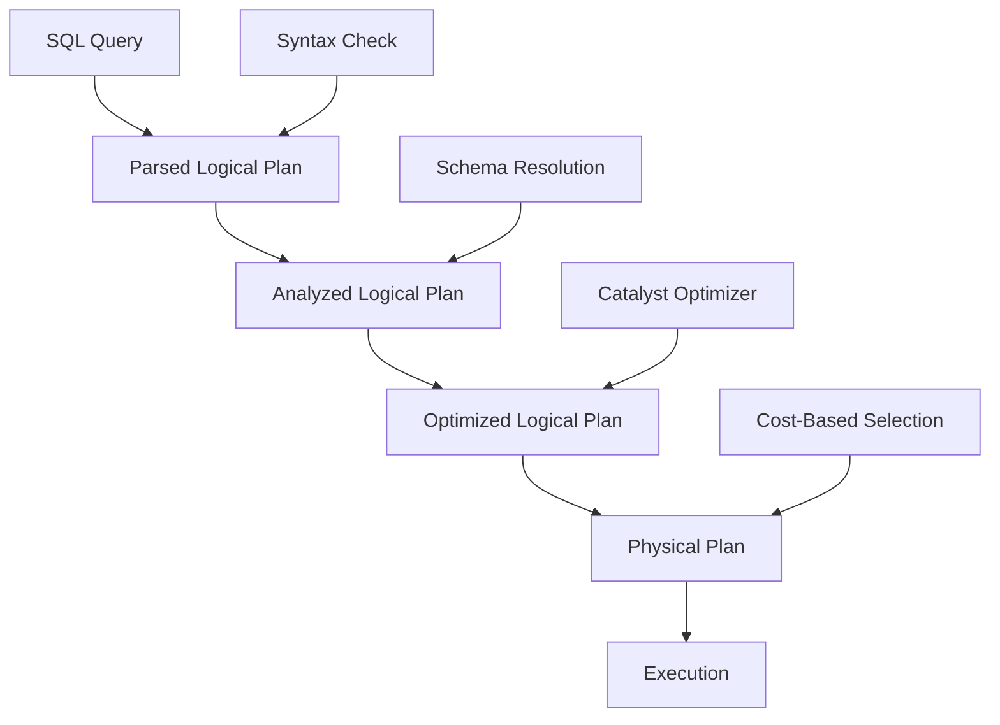
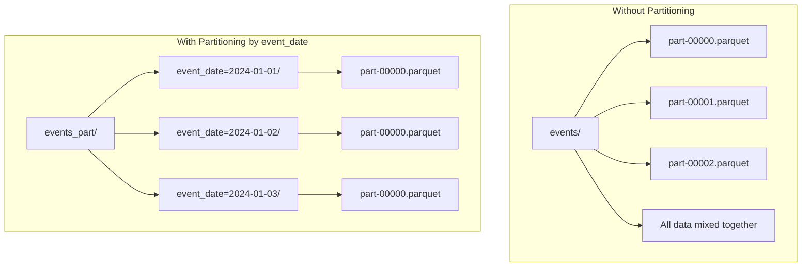
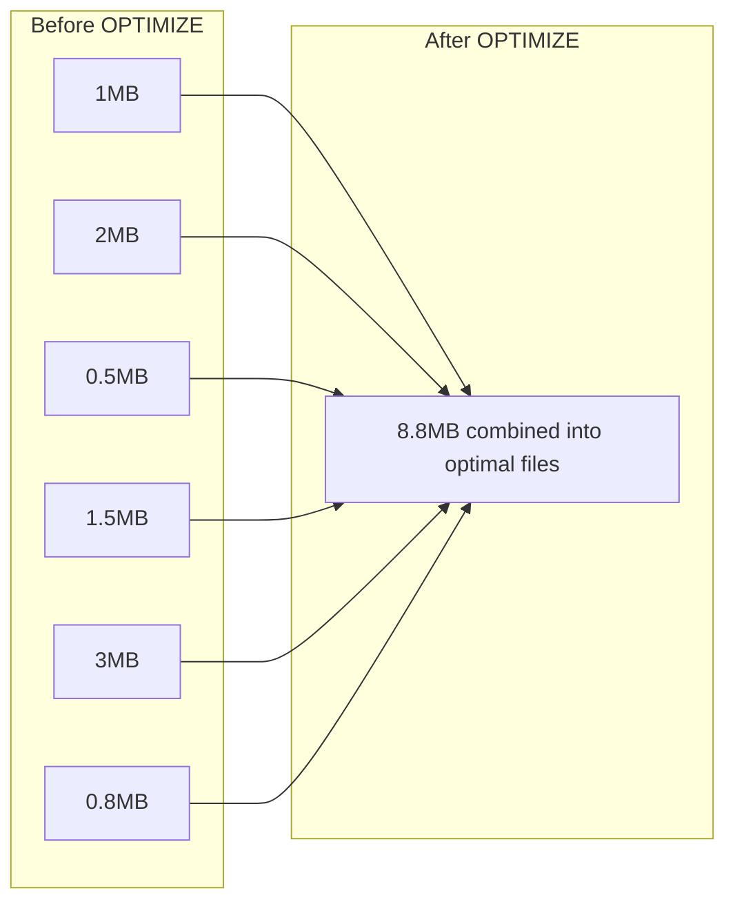
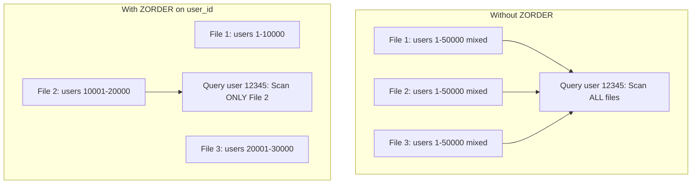
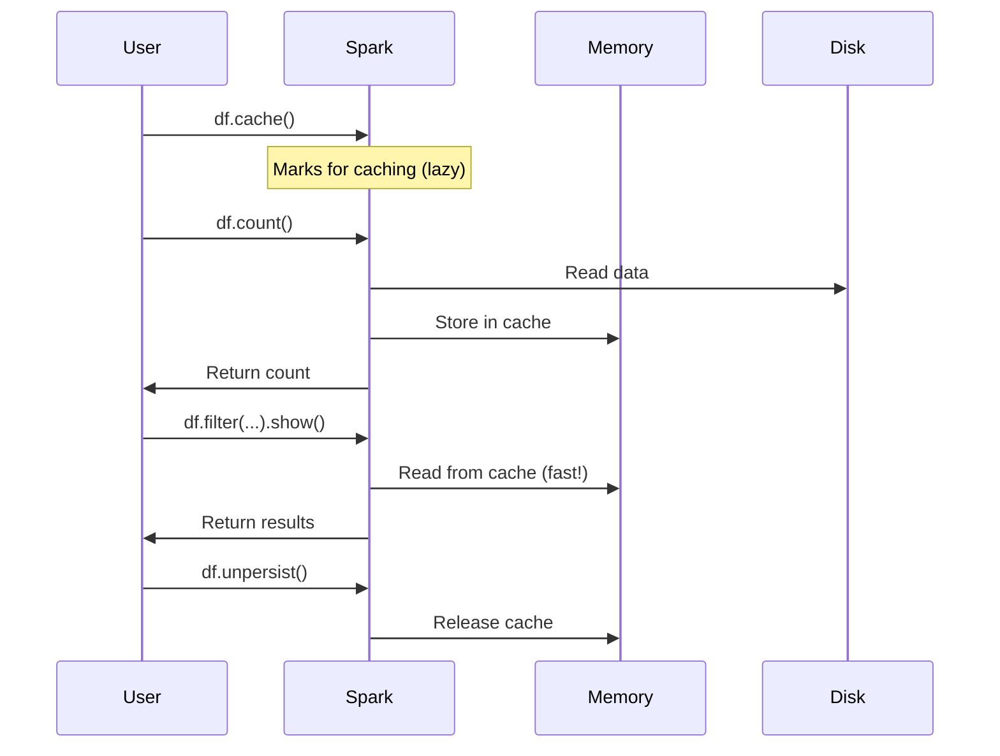
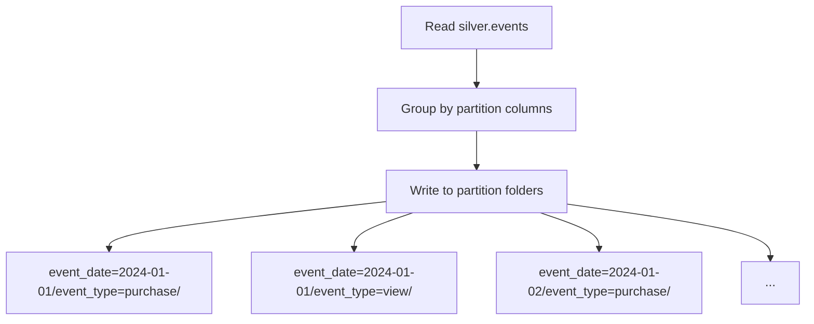
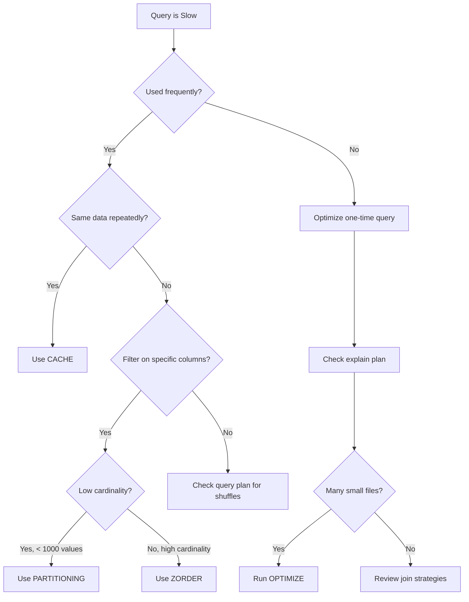

# Day 10 – Performance Optimization in Delta Lake & Spark

## Table of Contents
1. [Introduction to Performance Optimization](#introduction-to-performance-optimization)
2. [Query Execution Plans](#query-execution-plans)
3. [Partitioning Strategies](#partitioning-strategies)
4. [OPTIMIZE & ZORDER](#optimize--zorder)
5. [Caching Techniques](#caching-techniques)
6. [Hands-On Tasks with Code Explanations](#hands-on-tasks-with-code-explanations)
7. [Best Practices Summary](#best-practices-summary)
8. [Quick Reference](#quick-reference)

## Introduction to Performance Optimization

Performance optimization in Spark and Delta Lake involves making your queries run faster and use fewer resources. Think of it like organizing a library: if books are scattered randomly, finding one takes forever. But if they're organized by genre, author, and alphabetically, you can find any book quickly.

**Why Performance Matters:**
- Reduces compute costs (you pay for processing time)
- Improves user experience with faster results
- Enables processing of larger datasets within time constraints
- Reduces resource contention in shared environments

**The Four Pillars of Optimization:**

| Pillar | What It Does | When to Use |
|--------|--------------|-------------|
| Query Plans | Shows HOW Spark executes your query | Debugging slow queries |
| Partitioning | Physically organizes data on disk | Large tables with filter patterns |
| ZORDER | Optimizes data layout within files | Multi-column filter queries |
| Caching | Keeps data in memory | Repeated access to same data |

---

## Query Execution Plans

### What is a Query Execution Plan?

A query execution plan is like a recipe that Spark creates before cooking your data. It shows every step Spark will take to transform your query into results. Understanding this "recipe" helps you identify bottlenecks.

### The Four Phases of Query Planning



**Phase 1: Parsed Logical Plan**
- Spark parses your SQL into an abstract syntax tree
- Checks for syntax errors (missing commas, wrong keywords)
- No validation against actual tables yet

**Phase 2: Analyzed Logical Plan**
- Validates table and column names exist
- Resolves data types
- Checks permissions

**Phase 3: Optimized Logical Plan**
- Catalyst optimizer applies transformation rules
- Pushes filters down (predicate pushdown)
- Eliminates unnecessary columns (projection pruning)
- Combines adjacent operations

**Phase 4: Physical Plan**
- Converts logical operations to physical operations
- Chooses join strategies (broadcast, sort-merge, shuffle)
- Determines data exchange patterns

### Understanding explain(True) Output

When you call `.explain(True)`, you see all four phases:

```python
spark.sql("SELECT * FROM silver.events WHERE event_type='purchase'").explain(True)
```

**Sample Output Breakdown:**

```
== Parsed Logical Plan ==
'Project [*]
+- 'Filter ('event_type = purchase)
   +- 'UnresolvedRelation [silver, events]

== Analyzed Logical Plan ==
user_id: bigint, event_type: string, event_date: date, product_id: int, amount: decimal(10,2)
Project [user_id#1, event_type#2, event_date#3, product_id#4, amount#5]
+- Filter (event_type#2 = purchase)
   +- SubqueryAlias silver.events
      +- Relation[user_id#1, event_type#2, ...] parquet

== Optimized Logical Plan ==
Filter (isnotnull(event_type#2) AND (event_type#2 = purchase))
+- Relation[user_id#1, event_type#2, ...] parquet

== Physical Plan ==
*(1) Filter (isnotnull(event_type#2) AND (event_type#2 = purchase))
+- *(1) ColumnarToRow
   +- FileScan parquet silver.events[user_id#1, event_type#2, ...]
      Batched: true, DataFilters: [isnotnull(event_type#2), (event_type#2 = purchase)],
      PartitionFilters: [], PushedFilters: [IsNotNull(event_type), EqualTo(event_type,purchase)]
```

### Key Terms in Physical Plans

| Term | Meaning | Performance Impact |
|------|---------|-------------------|
| FileScan | Reading from disk | Base cost |
| Filter | Removing rows | Good if pushed to scan |
| Project | Selecting columns | Good if reduces data |
| Exchange | Shuffle between nodes | Expensive! |
| BroadcastExchange | Small table broadcast | Efficient for joins |
| SortMergeJoin | Both sides sorted | Moderate cost |
| BroadcastHashJoin | One side broadcast | Best for small tables |
| HashAggregate | Grouping operation | Memory intensive |

### Reading Physical Plan Symbols

```
*(1) Filter  ← The asterisk (*) means "whole-stage code generation" is active (good!)
+- *(1) ...  ← The tree shows parent-child relationships
```

**What to Look For (Red Flags):**

1. **Multiple Exchanges** → Too many shuffles
2. **SortMergeJoin on small tables** → Should use broadcast
3. **No PushedFilters** → Filter not optimized
4. **Full table scan when filtering** → Missing partitioning/indexing

---

## Partitioning Strategies

### What is Partitioning?

Partitioning divides your table into separate folders on disk based on column values. When you query with a filter on the partition column, Spark only reads relevant folders instead of scanning everything.

**Analogy:** Imagine a filing cabinet. Without partitioning, all documents are in one drawer. With partitioning by year, you have separate drawers for 2022, 2023, 2024. Finding "all 2024 documents" means opening only one drawer.

### How Partitioning Works Physically



### Creating a Partitioned Table

```python
spark.sql("""
  CREATE TABLE silver.events_part
  USING DELTA
  PARTITIONED BY (event_date, event_type)
  AS SELECT * FROM silver.events
""")
```

**Code Breakdown:**

| Component | Purpose |
|-----------|---------|
| `CREATE TABLE silver.events_part` | Creates new table named events_part in silver schema |
| `USING DELTA` | Specifies Delta Lake format (enables ACID, time travel) |
| `PARTITIONED BY (event_date, event_type)` | Creates folder hierarchy: event_date → event_type |
| `AS SELECT * FROM silver.events` | Populates with data from source table |

**Resulting Directory Structure:**
```
silver/events_part/
├── event_date=2024-01-01/
│   ├── event_type=purchase/
│   │   └── part-00000.parquet
│   ├── event_type=view/
│   │   └── part-00000.parquet
│   └── event_type=click/
│       └── part-00000.parquet
├── event_date=2024-01-02/
│   ├── event_type=purchase/
│   └── ...
```

### Partition Pruning in Action

When you run:
```sql
SELECT * FROM silver.events_part 
WHERE event_date = '2024-01-15' AND event_type = 'purchase'
```

Spark reads ONLY:
```
silver/events_part/event_date=2024-01-15/event_type=purchase/
```

Instead of scanning the entire table. This is called **partition pruning**.

### Choosing Partition Columns

**Good Partition Columns:**
- Low cardinality (few unique values): 10-1000 unique values ideal
- Frequently used in WHERE clauses
- Used in joins as keys
- Time-based columns (date, month, year)

**Bad Partition Columns:**
- High cardinality (millions of unique values) → Creates millions of tiny folders
- Columns rarely filtered on → No benefit
- Columns that change frequently → Requires rewriting partitions

### Cardinality Guidelines

| Cardinality | Example | Recommendation |
|-------------|---------|----------------|
| Very Low (< 10) | `status`, `region` | Good for second-level partition |
| Low (10-100) | `country`, `event_type` | Good partition column |
| Medium (100-1000) | `city`, `product_category` | Use with caution |
| High (1000-10000) | `user_segment` | Consider ZORDER instead |
| Very High (> 10000) | `user_id`, `timestamp` | Never partition, use ZORDER |

### Multi-Column Partitioning Order

The order matters! Spark creates nested folders:

```python
PARTITIONED BY (year, month, day)  # Creates: year=X/month=Y/day=Z/
PARTITIONED BY (day, month, year)  # Creates: day=X/month=Y/year=Z/
```

**Best Practice:** Order from lowest to highest cardinality for balanced folder sizes.

---

## OPTIMIZE & ZORDER

### The Small Files Problem

Over time, Delta tables accumulate many small files from:
- Streaming micro-batches
- Frequent small updates
- Upsert operations
- Individual inserts

**Why Small Files Are Bad:**

| Problem | Explanation |
|---------|-------------|
| Overhead per file | Each file requires metadata operations |
| Inefficient reads | Reading 1000 x 1MB files is slower than 1 x 1GB file |
| Memory pressure | Driver must track all file locations |
| Slower planning | More files = longer query planning time |

### OPTIMIZE Command

OPTIMIZE compacts small files into larger ones, targeting ~1GB per file.



**Basic OPTIMIZE:**
```sql
OPTIMIZE silver.events_part
```

### What is ZORDER?

ZORDER (Z-ordering) is a technique to co-locate related data within files. It uses a space-filling curve algorithm to organize data so that rows with similar values in ZORDER columns are stored physically close together.

**Analogy:** Imagine organizing a deck of cards. Normal sorting puts all hearts together, then all diamonds. ZORDER is like organizing so that similar values across MULTIPLE attributes (suit AND number) end up near each other.

### How ZORDER Works (The Math)

ZORDER uses Z-order curve (Morton code) to map multi-dimensional data to one dimension while preserving locality.

For two columns with values $(x, y)$, the Z-value interleaves their binary representations:

$$Z = \text{interleave}(x_{binary}, y_{binary})$$

**Example with 2-bit values:**

If $x = 3$ (binary: 11) and $y = 2$ (binary: 10):

$$x = 1\ 1$$
$$y = 1\ 0$$
$$Z = x_1\ y_1\ x_0\ y_0 = 1\ 1\ 1\ 0 = 14$$

This creates a pattern that keeps nearby points in the multi-dimensional space close in storage:

```
y
3 |  5   7  13  15
2 |  4   6  12  14
1 |  1   3   9  11
0 |  0   2   8  10
  +---------------
     0   1   2   3  x
```

### ZORDER Command Syntax

```python
spark.sql("OPTIMIZE silver.events_part ZORDER BY (user_id, product_id)")
```

**Code Breakdown:**

| Part | Purpose |
|------|---------|
| `OPTIMIZE silver.events_part` | Target table to optimize |
| `ZORDER BY (user_id, product_id)` | Columns to co-locate |

### When ZORDER Helps

ZORDER provides **data skipping** benefits. Delta Lake maintains min/max statistics per file. When you filter:

```sql
SELECT * FROM silver.events_part WHERE user_id = 12345
```

Without ZORDER: `user_id = 12345` might be scattered across ALL files → read everything
With ZORDER: `user_id = 12345` is concentrated in FEW files → skip most files



### ZORDER Best Practices

**Choose ZORDER Columns When:**
- High cardinality columns (too many unique values for partitioning)
- Frequently used in filter conditions (WHERE clauses)
- Used in join conditions
- 2-4 columns maximum (effectiveness decreases with more)

**Column Order Matters:**
```sql
ZORDER BY (user_id, product_id)  -- Optimizes user_id queries best
ZORDER BY (product_id, user_id)  -- Optimizes product_id queries best
```

First column gets the most optimization benefit.

### OPTIMIZE with Partition Filters

For large tables, optimize specific partitions:

```sql
OPTIMIZE silver.events_part 
WHERE event_date >= '2024-01-01'
ZORDER BY (user_id, product_id)
```

---

## Caching Techniques

### What is Caching?

Caching stores data in memory (RAM) so subsequent reads don't hit disk. It's like keeping frequently used books on your desk instead of walking to the bookshelf each time.

### When to Use Caching

| Scenario | Cache? | Why |
|----------|--------|-----|
| Same DataFrame used 5+ times | Yes | Avoids repeated computation |
| Interactive data exploration | Yes | Fast iterations |
| Machine learning training loops | Yes | Features reread many times |
| One-time transformation | No | Cache overhead not worth it |
| Data larger than cluster memory | No | Causes spilling to disk |

### Cache vs Persist

```python
# Cache - stores in memory only
df.cache()

# Persist - flexible storage levels
from pyspark import StorageLevel
df.persist(StorageLevel.MEMORY_AND_DISK)
```

**Storage Levels:**

| Level | Memory | Disk | Serialized | Replicated |
|-------|--------|------|------------|------------|
| MEMORY_ONLY | ✓ | ✗ | ✗ | ✗ |
| MEMORY_AND_DISK | ✓ | ✓ | ✗ | ✗ |
| MEMORY_ONLY_SER | ✓ | ✗ | ✓ | ✗ |
| MEMORY_AND_DISK_SER | ✓ | ✓ | ✓ | ✗ |
| DISK_ONLY | ✗ | ✓ | ✓ | ✗ |
| MEMORY_ONLY_2 | ✓ | ✗ | ✗ | ✓ |

### Caching Code Example

```python
# Cache for iterative queries
cached = spark.table("silver.events").cache()
cached.count()  # Materialize the cache
```

**Code Breakdown:**

| Line | Purpose |
|------|---------|
| `spark.table("silver.events")` | Creates DataFrame from Delta table |
| `.cache()` | Marks DataFrame for caching (lazy) |
| `cached.count()` | **Triggers** actual caching (materialize) |

**Important:** `.cache()` is lazy! Data isn't cached until an action runs.

### Cache Lifecycle



### Delta Cache vs Spark Cache

Delta Lake has its own caching layer (on Databricks):

| Feature | Spark Cache | Delta Cache |
|---------|-------------|-------------|
| Location | Executor memory | Local SSD |
| Survives | Cluster restart: No | Cluster restart: Yes |
| Format | Deserialized objects | Compressed Parquet |
| Best for | Repeated DataFrame ops | Repeated file reads |
| Management | Manual (.cache/.unpersist) | Automatic |

### Releasing Cache

```python
# Release specific DataFrame
cached.unpersist()

# Clear all cached DataFrames
spark.catalog.clearCache()
```

---

## Hands-On Tasks with Code Explanations

### Task 1: Analyze Query Plans

```python
spark.sql("SELECT * FROM silver.events WHERE event_type='purchase'").explain(True)
```

**What This Does:**

1. **Parses** the SQL query
2. **Analyzes** against catalog (checks table exists)
3. **Optimizes** using Catalyst rules
4. **Generates** physical execution plan
5. **Prints** all four plan stages

**What to Look For:**
- `PushedFilters: [EqualTo(event_type,purchase)]` → Good! Filter pushed to scan
- `PartitionFilters: []` → No partition pruning (table not partitioned by event_type)
- `DataFilters: [...]` → Applied during scan

### Task 2: Create Partitioned Table

```python
spark.sql("""
  CREATE TABLE silver.events_part
  USING DELTA
  PARTITIONED BY (event_date, event_type)
  AS SELECT * FROM silver.events
""")
```

**Execution Flow:**



**Verify Partitioning:**
```python
spark.sql("DESCRIBE DETAIL silver.events_part").show()
# Check partitionColumns field
```

### Task 3: Apply OPTIMIZE with ZORDER

```python
spark.sql("OPTIMIZE silver.events_part ZORDER BY (user_id, product_id)")
```

**What Happens:**

1. Spark reads all data files in the table
2. Computes Z-order values for each row
3. Sorts data by Z-order value
4. Rewrites into optimally-sized files (~1GB)
5. Updates Delta transaction log
6. Old files marked for deletion (vacuum later)

**Check Results:**
```python
spark.sql("DESCRIBE HISTORY silver.events_part").show()
# Look for OPTIMIZE operation
```

### Task 4: Benchmark Query Performance

```python
import time

# Without cache - first run
start = time.time()
spark.sql("SELECT * FROM silver.events WHERE user_id=12345").count()
print(f"Time: {time.time()-start:.2f}s")
```

**Code Breakdown:**

| Part | Purpose |
|------|---------|
| `time.time()` | Gets current timestamp in seconds |
| `spark.sql(...)` | Executes SQL query |
| `.count()` | Action that triggers execution |
| `time.time()-start` | Calculates elapsed time |
| `:.2f` | Formats to 2 decimal places |

**Benchmark Methodology:**
```python
# Run multiple times for accurate measurement
times = []
for i in range(5):
    start = time.time()
    spark.sql("SELECT * FROM silver.events WHERE user_id=12345").count()
    times.append(time.time() - start)

avg_time = sum(times) / len(times)
print(f"Average time: {avg_time:.2f}s (over {len(times)} runs)")
```

### Task 5: Implement Caching

```python
# Cache for iterative queries
cached = spark.table("silver.events").cache()
cached.count()  # Materialize the cache
```

**Verify Cache:**
```python
# Check if cached
print(cached.is_cached)  # True

# See cache in Spark UI
# Go to: Spark UI → Storage tab
```

**Benchmark Cached vs Uncached:**
```python
# Uncached timing
uncached = spark.table("silver.events")
start = time.time()
uncached.filter("user_id = 12345").count()
uncached_time = time.time() - start

# Cached timing (after materialization)
start = time.time()
cached.filter("user_id = 12345").count()
cached_time = time.time() - start

print(f"Uncached: {uncached_time:.2f}s")
print(f"Cached: {cached_time:.2f}s")
print(f"Speedup: {uncached_time/cached_time:.1f}x")
```

---

## Best Practices Summary

### Optimization Decision Tree



### Summary Table

| Technique | When to Use | Impact | Cost |
|-----------|-------------|--------|------|
| Partitioning | Filter column has < 1000 unique values | Eliminates reading irrelevant data | Storage overhead from folder structure |
| ZORDER | Filter column has high cardinality | Enables data skipping | Compute for rewriting files |
| OPTIMIZE | Many small files accumulated | Faster reads, better compression | Compute for compaction |
| Caching | Same data read 3+ times | Memory-speed access | Memory consumption |

### Anti-Patterns to Avoid

| Anti-Pattern | Problem | Solution |
|--------------|---------|----------|
| Partition by user_id | Millions of folders | ZORDER instead |
| Cache once-used data | Wastes memory | Don't cache |
| Never OPTIMIZE | Small file overhead | Schedule regular OPTIMIZE |
| ZORDER on 10 columns | Diminishing returns | Choose 2-4 most filtered columns |
| Filter after join | Processes unnecessary data | Push filters before join |

---

## Quick Reference

### Commands Cheat Sheet

```sql
-- View query execution plan
EXPLAIN [EXTENDED] SELECT ...

-- Create partitioned table
CREATE TABLE table_name
USING DELTA
PARTITIONED BY (col1, col2)
AS SELECT ...

-- Optimize entire table
OPTIMIZE table_name

-- Optimize with ZORDER
OPTIMIZE table_name ZORDER BY (col1, col2)

-- Optimize specific partitions
OPTIMIZE table_name WHERE partition_col = 'value' ZORDER BY (col1)

-- Check table details
DESCRIBE DETAIL table_name

-- View optimization history
DESCRIBE HISTORY table_name
```

### Python API Reference

```python
# Explain query
df.explain(True)  # True = show all plan stages

# Cache DataFrame
df.cache()                    # Memory only
df.persist(StorageLevel.X)    # Custom storage level
df.unpersist()                # Release cache
df.is_cached                  # Check cache status

# Clear all caches
spark.catalog.clearCache()

# Benchmark template
import time
start = time.time()
result = df.action()  # count(), collect(), show()
elapsed = time.time() - start
```

### Performance Metrics to Track

| Metric | Good | Bad | How to Check |
|--------|------|-----|--------------|
| Partition pruning | PartitionFilters populated | Empty | explain() output |
| Data skipping | Few files scanned | All files scanned | Spark UI metrics |
| Cache hit ratio | > 90% | < 50% | Spark UI Storage tab |
| Shuffle read/write | Minimal | GB+ per stage | Spark UI Stages tab |
| File count | < 1000 per partition | > 10000 | DESCRIBE DETAIL |
| Avg file size | 500MB - 1GB | < 10MB or > 2GB | DESCRIBE DETAIL |

---

## Key Takeaways

1. **Always check execution plans** before optimizing - understand the problem first
2. **Partition wisely** - low cardinality columns used in filters
3. **ZORDER complements partitioning** - for high cardinality filter columns
4. **Run OPTIMIZE regularly** - prevents small file accumulation
5. **Cache strategically** - only for repeatedly accessed data
6. **Benchmark everything** - measure before and after to validate improvements

The goal is to minimize data read and shuffled while maximizing data locality. Each technique addresses a different aspect of this goal.