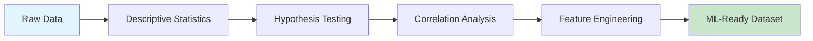
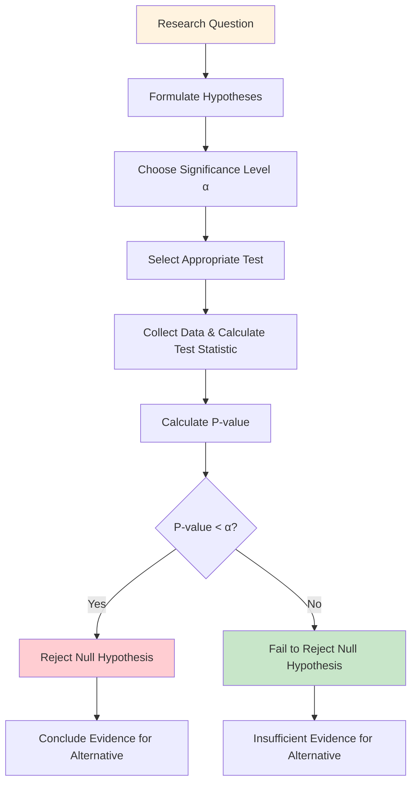
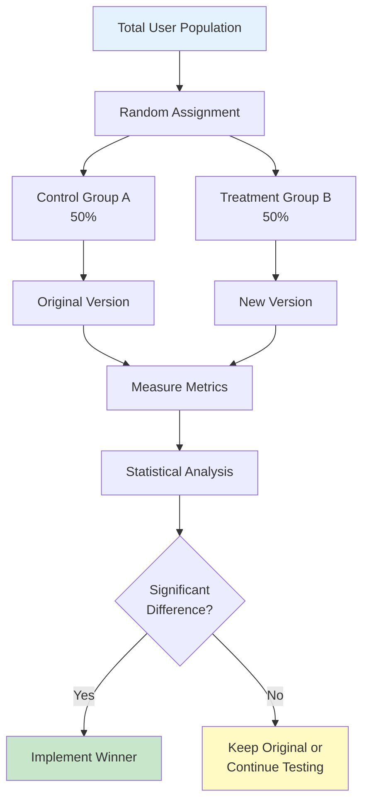
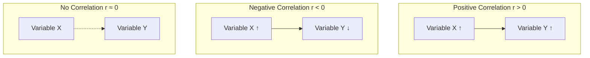
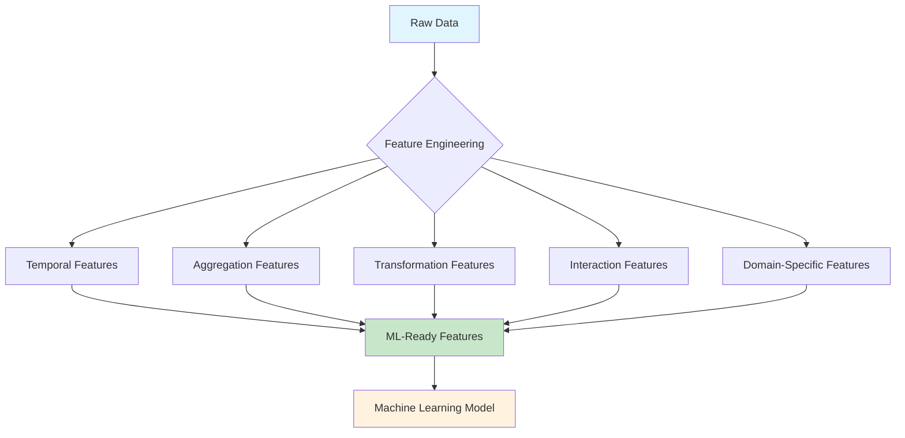
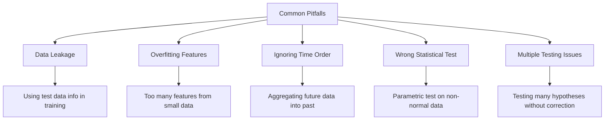

# DAY 11 – Statistical Analysis & ML Preparation with PySpark

## Table of Contents
1. [Introduction](#introduction)
2. [Descriptive Statistics](#1-descriptive-statistics)
   - [Measures of Central Tendency](#11-measures-of-central-tendency)
   - [Measures of Dispersion](#12-measures-of-dispersion)
   - [Implementation in PySpark](#13-implementation-in-pyspark)
3. [Hypothesis Testing](#2-hypothesis-testing)
   - [Understanding Hypothesis Testing](#21-understanding-hypothesis-testing)
   - [Types of Hypotheses](#22-types-of-hypotheses)
   - [P-Value and Significance Level](#23-p-value-and-significance-level)
   - [Types of Errors](#24-types-of-errors)
   - [Common Statistical Tests](#25-common-statistical-tests)
   - [Implementation in PySpark](#26-implementation-in-pyspark)
4. [A/B Test Design](#3-ab-test-design)
   - [What is A/B Testing](#31-what-is-ab-testing)
   - [Components of A/B Testing](#32-components-of-ab-testing)
   - [Sample Size Calculation](#33-sample-size-calculation)
   - [A/B Testing Workflow](#34-ab-testing-workflow)
   - [Implementation in PySpark](#35-implementation-in-pyspark)
5. [Correlation Analysis](#4-correlation-analysis)
   - [Types of Correlation](#41-types-of-correlation)
   - [Correlation Coefficient](#42-correlation-coefficient)
   - [Implementation in PySpark](#43-implementation-in-pyspark)
6. [Feature Engineering](#5-feature-engineering)
   - [What is Feature Engineering](#51-what-is-feature-engineering)
   - [Types of Feature Engineering](#52-types-of-feature-engineering)
   - [Common Techniques](#53-common-techniques)
   - [Implementation in PySpark](#54-implementation-in-pyspark)
7. [Complete Practical Example](#6-complete-practical-example)
8. [Best Practices](#7-best-practices)
9. [Quick Reference](#8-quick-reference)

---

## Introduction

Statistical analysis and machine learning preparation are critical steps in the data science pipeline. Before building any ML model, we must understand our data through descriptive statistics, validate our assumptions through hypothesis testing, and transform raw data into meaningful features through feature engineering.

This guide covers the essential concepts and their practical implementation using PySpark for large-scale data processing.



---

## 1. Descriptive Statistics

Descriptive statistics summarize and describe the main features of a dataset. They provide simple summaries about the sample and the measures, giving us a quick overview of our data's characteristics.

### 1.1 Measures of Central Tendency

Central tendency measures identify a single value that represents the center or typical value of a dataset.

**Mean (Arithmetic Average)**

The sum of all values divided by the number of values.

$$
\bar{x} = \frac{1}{n} \sum_{i=1}^{n} x_i = \frac{x_1 + x_2 + ... + x_n}{n}
$$

Where:
- $\bar{x}$ = sample mean
- $n$ = number of observations
- $x_i$ = individual values

**Example Calculation:**
Given prices: [10, 20, 30, 40, 50]

$$
\bar{x} = \frac{10 + 20 + 30 + 40 + 50}{5} = \frac{150}{5} = 30
$$

**Median**

The middle value when data is sorted in order. For odd n, it's the middle value; for even n, it's the average of the two middle values.

$$
\text{Median} = \begin{cases} 
x_{\frac{n+1}{2}} & \text{if } n \text{ is odd} \\
\frac{x_{\frac{n}{2}} + x_{\frac{n}{2}+1}}{2} & \text{if } n \text{ is even}
\end{cases}
$$

**Mode**

The most frequently occurring value in a dataset. A dataset can have no mode, one mode (unimodal), or multiple modes (multimodal).

**When to Use Each Measure:**

| Measure | Best Used When | Sensitive to Outliers |
|---------|----------------|----------------------|
| Mean | Data is normally distributed | Yes |
| Median | Data has outliers or is skewed | No |
| Mode | Categorical data or finding most common value | No |

### 1.2 Measures of Dispersion

Dispersion measures describe how spread out the data is around the central value.

**Variance**

The average of squared differences from the mean.

*Population Variance:*
$$
\sigma^2 = \frac{1}{N} \sum_{i=1}^{N} (x_i - \mu)^2
$$

*Sample Variance:*
$$
s^2 = \frac{1}{n-1} \sum_{i=1}^{n} (x_i - \bar{x})^2
$$

The $(n-1)$ in sample variance is called Bessel's correction, which corrects bias in the estimation of population variance.

**Standard Deviation**

The square root of variance, expressed in the same units as the data.

$$
\sigma = \sqrt{\sigma^2} = \sqrt{\frac{1}{N} \sum_{i=1}^{N} (x_i - \mu)^2}
$$

**Example Calculation:**
Given data: [2, 4, 4, 4, 5, 5, 7, 9]

Step 1: Calculate mean
$$
\bar{x} = \frac{2+4+4+4+5+5+7+9}{8} = \frac{40}{8} = 5
$$

Step 2: Calculate squared differences
$$
(2-5)^2 = 9, \quad (4-5)^2 = 1, \quad (4-5)^2 = 1, \quad (4-5)^2 = 1
$$
$$
(5-5)^2 = 0, \quad (5-5)^2 = 0, \quad (7-5)^2 = 4, \quad (9-5)^2 = 16
$$

Step 3: Calculate variance (sample)
$$
s^2 = \frac{9+1+1+1+0+0+4+16}{8-1} = \frac{32}{7} \approx 4.57
$$

Step 4: Calculate standard deviation
$$
s = \sqrt{4.57} \approx 2.14
$$

**Percentiles and Quartiles**

Percentiles divide data into 100 equal parts. Quartiles are specific percentiles:
- Q1 (25th percentile): 25% of data falls below this value
- Q2 (50th percentile): The median
- Q3 (75th percentile): 75% of data falls below this value

**Interquartile Range (IQR)**

$$
IQR = Q3 - Q1
$$

IQR is robust to outliers and represents the middle 50% of the data.

**Skewness**

Measures the asymmetry of the distribution.

$$
\text{Skewness} = \frac{n}{(n-1)(n-2)} \sum_{i=1}^{n} \left(\frac{x_i - \bar{x}}{s}\right)^3
$$

| Skewness Value | Interpretation |
|----------------|----------------|
| = 0 | Symmetric distribution |
| > 0 | Right-skewed (tail on right) |
| < 0 | Left-skewed (tail on left) |

**Kurtosis**

Measures the "tailedness" of the distribution.

$$
\text{Kurtosis} = \frac{n(n+1)}{(n-1)(n-2)(n-3)} \sum_{i=1}^{n} \left(\frac{x_i - \bar{x}}{s}\right)^4 - \frac{3(n-1)^2}{(n-2)(n-3)}
$$

| Kurtosis Value | Interpretation |
|----------------|----------------|
| = 0 (Mesokurtic) | Similar to normal distribution |
| > 0 (Leptokurtic) | Heavy tails, more outliers |
| < 0 (Platykurtic) | Light tails, fewer outliers |

### 1.3 Implementation in PySpark

```python
from pyspark.sql import SparkSession
from pyspark.sql import functions as F
from pyspark.sql.window import Window

# Initialize Spark Session
spark = SparkSession.builder \
    .appName("DescriptiveStatistics") \
    .getOrCreate()

# Basic descriptive statistics using describe()
# This provides count, mean, stddev, min, max
events.describe(["price"]).show()

# Output example:
# +-------+------------------+
# |summary|             price|
# +-------+------------------+
# |  count|            100000|
# |   mean|            125.45|
# | stddev|             45.23|
# |    min|              5.00|
# |    max|            500.00|
# +-------+------------------+

# Extended statistics with percentiles
events.select(
    F.count("price").alias("count"),
    F.mean("price").alias("mean"),
    F.stddev("price").alias("std_dev"),
    F.variance("price").alias("variance"),
    F.min("price").alias("min"),
    F.max("price").alias("max"),
    F.expr("percentile_approx(price, 0.25)").alias("Q1"),
    F.expr("percentile_approx(price, 0.50)").alias("median"),
    F.expr("percentile_approx(price, 0.75)").alias("Q3"),
    F.skewness("price").alias("skewness"),
    F.kurtosis("price").alias("kurtosis")
).show()

# Calculate IQR
quartiles = events.select(
    F.expr("percentile_approx(price, 0.25)").alias("Q1"),
    F.expr("percentile_approx(price, 0.75)").alias("Q3")
).collect()[0]

iqr = quartiles["Q3"] - quartiles["Q1"]
print(f"IQR: {iqr}")

# Detect outliers using IQR method
lower_bound = quartiles["Q1"] - 1.5 * iqr
upper_bound = quartiles["Q3"] + 1.5 * iqr

outliers = events.filter(
    (F.col("price") < lower_bound) | (F.col("price") > upper_bound)
)
print(f"Number of outliers: {outliers.count()}")

# Group-wise statistics
events.groupBy("category").agg(
    F.count("price").alias("count"),
    F.mean("price").alias("avg_price"),
    F.stddev("price").alias("std_price"),
    F.min("price").alias("min_price"),
    F.max("price").alias("max_price")
).show()
```

---

## 2. Hypothesis Testing

Hypothesis testing is a statistical method used to make decisions about population parameters based on sample data. It helps us determine whether observed differences or relationships in data are statistically significant or occurred by chance.

### 2.1 Understanding Hypothesis Testing

The fundamental question hypothesis testing answers: "Is the observed pattern in the sample data likely to exist in the population, or is it just due to random sampling variation?"



### 2.2 Types of Hypotheses

**Null Hypothesis ($H_0$)**

The default assumption that there is no effect, no difference, or no relationship. It represents the status quo.

Examples:
- There is no difference in conversion rates between weekdays and weekends
- The mean price is equal to $100
- There is no correlation between price and sales

**Alternative Hypothesis ($H_1$ or $H_a$)**

The hypothesis that contradicts the null hypothesis. It represents what we're trying to find evidence for.

| Type | Null ($H_0$) | Alternative ($H_1$) | Description |
|------|--------------|---------------------|-------------|
| Two-tailed | $\mu = \mu_0$ | $\mu \neq \mu_0$ | Testing for any difference |
| Left-tailed | $\mu \geq \mu_0$ | $\mu < \mu_0$ | Testing if value is less |
| Right-tailed | $\mu \leq \mu_0$ | $\mu > \mu_0$ | Testing if value is greater |

### 2.3 P-Value and Significance Level

**Significance Level ($\alpha$)**

The probability threshold below which we reject the null hypothesis. Common values:
- $\alpha = 0.05$ (5%): Most common, standard threshold
- $\alpha = 0.01$ (1%): More stringent, for critical decisions
- $\alpha = 0.10$ (10%): Less stringent, exploratory research

**P-Value**

The probability of obtaining results at least as extreme as the observed results, assuming the null hypothesis is true.

$$
\text{P-value} = P(\text{Observed or more extreme} | H_0 \text{ is true})
$$

**Decision Rule:**
- If $p\text{-value} < \alpha$: Reject $H_0$ (statistically significant)
- If $p\text{-value} \geq \alpha$: Fail to reject $H_0$ (not statistically significant)

**Interpretation Example:**

If p-value = 0.03 and α = 0.05:
- Since 0.03 < 0.05, we reject the null hypothesis
- There's only a 3% chance of seeing this result if the null hypothesis were true
- We conclude the result is statistically significant

### 2.4 Types of Errors

| Decision | $H_0$ is True | $H_0$ is False |
|----------|---------------|----------------|
| Reject $H_0$ | **Type I Error (α)** False Positive | ✓ Correct Decision (Power) |
| Fail to Reject $H_0$ | ✓ Correct Decision | **Type II Error (β)** False Negative |

**Type I Error (False Positive)**
- Rejecting a true null hypothesis
- Probability = $\alpha$ (significance level)
- Example: Concluding a treatment works when it doesn't

**Type II Error (False Negative)**
- Failing to reject a false null hypothesis
- Probability = $\beta$
- Example: Concluding a treatment doesn't work when it does

**Statistical Power**

$$
\text{Power} = 1 - \beta
$$

Power is the probability of correctly rejecting a false null hypothesis. Higher power means better ability to detect true effects.

Factors affecting power:
1. Sample size (larger = more power)
2. Effect size (larger = more power)
3. Significance level (higher α = more power)
4. Variance (lower = more power)

### 2.5 Common Statistical Tests

**Z-Test**

Used when population standard deviation is known and sample size is large (n > 30).

$$
z = \frac{\bar{x} - \mu_0}{\sigma / \sqrt{n}}
$$

**T-Test**

Used when population standard deviation is unknown. There are three types:

*One-sample t-test:* Tests if a sample mean differs from a hypothesized value
$$
t = \frac{\bar{x} - \mu_0}{s / \sqrt{n}}
$$

*Independent two-sample t-test:* Tests if two groups have different means
$$
t = \frac{\bar{x}_1 - \bar{x}_2}{\sqrt{\frac{s_1^2}{n_1} + \frac{s_2^2}{n_2}}}
$$

*Paired t-test:* Tests if the mean difference between paired observations is zero
$$
t = \frac{\bar{d}}{s_d / \sqrt{n}}
$$

Where $\bar{d}$ is the mean of differences and $s_d$ is the standard deviation of differences.

**Chi-Square Test**

Used for categorical data to test independence or goodness of fit.

$$
\chi^2 = \sum \frac{(O_i - E_i)^2}{E_i}
$$

Where:
- $O_i$ = Observed frequency
- $E_i$ = Expected frequency

**Degrees of freedom:** $(rows - 1) \times (columns - 1)$

### 2.6 Implementation in PySpark

```python
from pyspark.sql import functions as F
from pyspark.sql.window import Window
import scipy.stats as stats

# Hypothesis: Is there a difference in conversion rates between weekday and weekend?

# Step 1: Add weekend indicator
events_with_weekend = events.withColumn(
    "is_weekend",
    F.dayofweek("event_date").isin([1, 7])  # 1=Sunday, 7=Saturday in Spark
)

# Step 2: Calculate conversion rates by group
conversion_stats = events_with_weekend.groupBy("is_weekend", "event_type").count()
conversion_stats.show()

# Output:
# +----------+----------+------+
# |is_weekend|event_type| count|
# +----------+----------+------+
# |     false|      view| 45000|
# |     false|  purchase|  4500|
# |      true|      view| 25000|
# |      true|  purchase|  3000|
# +----------+----------+------+

# Step 3: Calculate conversion rates
weekday_stats = events_with_weekend.filter(~F.col("is_weekend")).agg(
    F.sum(F.when(F.col("event_type") == "purchase", 1).otherwise(0)).alias("conversions"),
    F.count("*").alias("total")
).collect()[0]

weekend_stats = events_with_weekend.filter(F.col("is_weekend")).agg(
    F.sum(F.when(F.col("event_type") == "purchase", 1).otherwise(0)).alias("conversions"),
    F.count("*").alias("total")
).collect()[0]

# Calculate conversion rates
weekday_rate = weekday_stats["conversions"] / weekday_stats["total"]
weekend_rate = weekend_stats["conversions"] / weekend_stats["total"]

print(f"Weekday conversion rate: {weekday_rate:.4f}")
print(f"Weekend conversion rate: {weekend_rate:.4f}")

# Step 4: Perform two-proportion z-test
# H0: p_weekday = p_weekend (no difference)
# H1: p_weekday ≠ p_weekend (there is a difference)

n1 = weekday_stats["total"]
n2 = weekend_stats["total"]
x1 = weekday_stats["conversions"]
x2 = weekend_stats["conversions"]

# Pooled proportion under null hypothesis
p_pool = (x1 + x2) / (n1 + n2)

# Standard error
se = (p_pool * (1 - p_pool) * (1/n1 + 1/n2)) ** 0.5

# Z-statistic
z_stat = (weekday_rate - weekend_rate) / se

# P-value (two-tailed)
p_value = 2 * (1 - stats.norm.cdf(abs(z_stat)))

print(f"\nHypothesis Test Results:")
print(f"Z-statistic: {z_stat:.4f}")
print(f"P-value: {p_value:.4f}")

alpha = 0.05
if p_value < alpha:
    print(f"\nResult: Reject H0 (p-value {p_value:.4f} < α {alpha})")
    print("There is a statistically significant difference in conversion rates.")
else:
    print(f"\nResult: Fail to reject H0 (p-value {p_value:.4f} >= α {alpha})")
    print("No statistically significant difference in conversion rates.")

# Alternative: Chi-Square Test for Independence
# Create contingency table
contingency = events_with_weekend.groupBy("is_weekend").pivot("event_type").count()
contingency.show()

# Extract values for chi-square test
from pyspark.ml.stat import ChiSquareTest
from pyspark.ml.feature import VectorAssembler

# Prepare data for chi-square test
chi_data = events_with_weekend.select(
    F.when(F.col("is_weekend"), 1).otherwise(0).alias("weekend_num"),
    F.when(F.col("event_type") == "purchase", 1).otherwise(0).alias("purchase_num")
)

# Calculate chi-square statistic
observed = chi_data.crosstab("weekend_num", "purchase_num")
observed.show()
```

---

## 3. A/B Test Design

A/B testing (also called split testing) is a controlled experiment where two or more variants are compared to determine which performs better for a given objective.

### 3.1 What is A/B Testing

A/B testing involves randomly splitting users into groups:
- **Control Group (A)**: Receives the current/original version
- **Treatment Group (B)**: Receives the new/modified version

The goal is to measure whether the treatment produces a statistically significant improvement over the control.



### 3.2 Components of A/B Testing

**Key Metrics to Define:**

| Metric Type | Description | Examples |
|-------------|-------------|----------|
| Primary Metric | Main success indicator | Conversion rate, revenue per user |
| Secondary Metrics | Supporting indicators | Click-through rate, time on page |
| Guardrail Metrics | Metrics that shouldn't worsen | Page load time, error rate |

**Important Parameters:**

1. **Baseline Conversion Rate ($p_0$)**: Current performance of control
2. **Minimum Detectable Effect (MDE)**: Smallest improvement worth detecting
3. **Statistical Significance ($\alpha$)**: Usually 0.05
4. **Statistical Power ($1 - \beta$)**: Usually 0.80 or 0.90

### 3.3 Sample Size Calculation

For a two-proportion z-test, the required sample size per group is:

$$
n = \frac{2 \cdot (Z_{\alpha/2} + Z_{\beta})^2 \cdot \bar{p}(1-\bar{p})}{(p_1 - p_0)^2}
$$

Where:
- $Z_{\alpha/2}$ = Z-score for significance level (1.96 for α = 0.05)
- $Z_{\beta}$ = Z-score for power (0.84 for power = 0.80)
- $\bar{p} = \frac{p_0 + p_1}{2}$ = Average of baseline and expected conversion rates
- $p_0$ = Baseline conversion rate
- $p_1$ = Expected conversion rate with treatment

**Example Calculation:**

Given:
- Baseline conversion rate: $p_0 = 0.10$ (10%)
- Minimum Detectable Effect: 2 percentage points
- Expected conversion rate: $p_1 = 0.12$ (12%)
- Significance level: $\alpha = 0.05$ → $Z_{0.025} = 1.96$
- Power: $1 - \beta = 0.80$ → $Z_{0.20} = 0.84$

Step 1: Calculate average proportion
$$
\bar{p} = \frac{0.10 + 0.12}{2} = 0.11
$$

Step 2: Calculate sample size
$$
n = \frac{2 \times (1.96 + 0.84)^2 \times 0.11 \times (1-0.11)}{(0.12 - 0.10)^2}
$$

$$
n = \frac{2 \times 7.84 \times 0.0979}{0.0004} = \frac{1.535}{0.0004} \approx 3,838
$$

We need approximately **3,838 users per group** (7,676 total).

**Simplified Formula:**

For detecting a relative lift of $r$ from baseline $p_0$:

$$
n \approx \frac{16 \cdot p_0 \cdot (1-p_0)}{(r \cdot p_0)^2}
$$

### 3.4 A/B Testing Workflow

```mermaid
flowchart LR
    subgraph Planning
        A[Define Hypothesis] --> B[Choose Metrics]
        B --> C[Calculate Sample Size]
        C --> D[Determine Duration]
    end
    
    subgraph Execution
        D --> E[Implement Variants]
        E --> F[Random Assignment]
        F --> G[Run Experiment]
    end
    
    subgraph Analysis
        G --> H[Collect Data]
        H --> I[Statistical Test]
        I --> J[Interpret Results]
    end
    
    subgraph Decision
        J --> K[Make Decision]
        K --> L[Document Learnings]
    end
```



**Test Duration Considerations:**

1. **Day-of-week effects**: Run for at least 1-2 full weeks
2. **Seasonality**: Consider holidays and special events
3. **Learning effects**: Users may take time to adapt
4. **Sample size**: Continue until required sample is reached

**Common Pitfalls:**

| Pitfall | Problem | Solution |
|---------|---------|----------|
| Peeking | Checking results too early inflates false positives | Pre-commit to duration and sample size |
| Multiple comparisons | Testing many variants increases Type I errors | Apply Bonferroni correction |
| Simpson's Paradox | Aggregate results differ from segment results | Analyze segments separately |
| Novelty effect | Users engage more with new things initially | Run test longer |

### 3.5 Implementation in PySpark

```python
from pyspark.sql import functions as F
from pyspark.sql.window import Window
import scipy.stats as stats
import numpy as np

# Sample A/B test setup
# Assume we have user events with experiment assignment

# Step 1: Calculate sample size needed
def calculate_sample_size(p0, mde, alpha=0.05, power=0.80):
    """
    Calculate required sample size per group for A/B test.
    
    Parameters:
    - p0: baseline conversion rate
    - mde: minimum detectable effect (absolute)
    - alpha: significance level
    - power: statistical power
    
    Returns:
    - n: required sample size per group
    """
    p1 = p0 + mde
    p_avg = (p0 + p1) / 2
    
    z_alpha = stats.norm.ppf(1 - alpha/2)
    z_beta = stats.norm.ppf(power)
    
    n = 2 * ((z_alpha + z_beta) ** 2) * p_avg * (1 - p_avg) / (mde ** 2)
    
    return int(np.ceil(n))

# Example: 10% baseline, want to detect 2% improvement
baseline_rate = 0.10
mde = 0.02  # 2 percentage points

sample_size_needed = calculate_sample_size(baseline_rate, mde)
print(f"Required sample size per group: {sample_size_needed}")
print(f"Total sample size needed: {sample_size_needed * 2}")

# Step 2: Randomly assign users to groups
# Create experiment assignment
total_users = spark.table("users")

experiment_users = total_users.withColumn(
    "experiment_group",
    F.when(F.rand() < 0.5, "control").otherwise("treatment")
)

# Verify balanced assignment
experiment_users.groupBy("experiment_group").count().show()

# Step 3: Track events and calculate metrics
ab_test_results = events.join(
    experiment_users.select("user_id", "experiment_group"),
    on="user_id",
    how="inner"
)

# Calculate conversion by group
group_stats = ab_test_results.groupBy("experiment_group").agg(
    F.countDistinct("user_id").alias("users"),
    F.sum(F.when(F.col("event_type") == "purchase", 1).otherwise(0)).alias("conversions"),
    F.sum(F.when(F.col("event_type") == "purchase", F.col("price")).otherwise(0)).alias("revenue")
)

group_stats = group_stats.withColumn(
    "conversion_rate",
    F.col("conversions") / F.col("users")
).withColumn(
    "revenue_per_user",
    F.col("revenue") / F.col("users")
)

group_stats.show()

# Step 4: Statistical significance test
results = group_stats.collect()
control = [r for r in results if r["experiment_group"] == "control"][0]
treatment = [r for r in results if r["experiment_group"] == "treatment"][0]

# Two-proportion z-test
n_control = control["users"]
n_treatment = treatment["users"]
x_control = control["conversions"]
x_treatment = treatment["conversions"]

p_control = x_control / n_control
p_treatment = x_treatment / n_treatment

# Pooled proportion
p_pool = (x_control + x_treatment) / (n_control + n_treatment)

# Standard error
se = np.sqrt(p_pool * (1 - p_pool) * (1/n_control + 1/n_treatment))

# Z-statistic
z_stat = (p_treatment - p_control) / se

# P-value (one-tailed, testing if treatment > control)
p_value = 1 - stats.norm.cdf(z_stat)

# Confidence interval for the difference
se_diff = np.sqrt(p_control*(1-p_control)/n_control + p_treatment*(1-p_treatment)/n_treatment)
ci_lower = (p_treatment - p_control) - 1.96 * se_diff
ci_upper = (p_treatment - p_control) + 1.96 * se_diff

# Lift calculation
lift = (p_treatment - p_control) / p_control * 100

print("\n===== A/B Test Results =====")
print(f"\nControl Group:")
print(f"  Users: {n_control}")
print(f"  Conversions: {x_control}")
print(f"  Conversion Rate: {p_control:.4f} ({p_control*100:.2f}%)")

print(f"\nTreatment Group:")
print(f"  Users: {n_treatment}")
print(f"  Conversions: {x_treatment}")
print(f"  Conversion Rate: {p_treatment:.4f} ({p_treatment*100:.2f}%)")

print(f"\nStatistical Analysis:")
print(f"  Absolute Difference: {(p_treatment - p_control)*100:.2f} percentage points")
print(f"  Relative Lift: {lift:.2f}%")
print(f"  95% Confidence Interval: [{ci_lower*100:.2f}%, {ci_upper*100:.2f}%]")
print(f"  Z-statistic: {z_stat:.4f}")
print(f"  P-value (one-tailed): {p_value:.4f}")

alpha = 0.05
if p_value < alpha and p_treatment > p_control:
    print(f"\n✓ Result: SIGNIFICANT (p = {p_value:.4f} < α = {alpha})")
    print("  Recommendation: Implement the treatment version")
else:
    print(f"\n✗ Result: NOT SIGNIFICANT (p = {p_value:.4f})")
    print("  Recommendation: Continue with control or run longer test")
```

---

## 4. Correlation Analysis

Correlation measures the strength and direction of the linear relationship between two variables.

### 4.1 Types of Correlation

**Positive Correlation**
When one variable increases, the other tends to increase. Correlation coefficient > 0.

**Negative Correlation**
When one variable increases, the other tends to decrease. Correlation coefficient < 0.

**No Correlation**
No linear relationship exists between variables. Correlation coefficient ≈ 0.



### 4.2 Correlation Coefficient

**Pearson Correlation Coefficient (r)**

Measures linear relationship between continuous variables.

$$
r = \frac{\sum_{i=1}^{n}(x_i - \bar{x})(y_i - \bar{y})}{\sqrt{\sum_{i=1}^{n}(x_i - \bar{x})^2} \cdot \sqrt{\sum_{i=1}^{n}(y_i - \bar{y})^2}}
$$

This can also be written as:

$$
r = \frac{n\sum xy - \sum x \sum y}{\sqrt{[n\sum x^2 - (\sum x)^2][n\sum y^2 - (\sum y)^2]}}
$$

**Interpretation of r:**

| r Value | Strength | Interpretation |
|---------|----------|----------------|
| 0.90 to 1.00 | Very strong | Variables move almost perfectly together |
| 0.70 to 0.89 | Strong | Clear relationship |
| 0.50 to 0.69 | Moderate | Noticeable relationship |
| 0.30 to 0.49 | Weak | Some relationship |
| 0.00 to 0.29 | Very weak | Little to no linear relationship |

Note: The same interpretations apply to negative values (-0.90 to -1.00 is very strong negative, etc.)

**Coefficient of Determination ($r^2$)**

The proportion of variance in one variable explained by the other.

$$
r^2 = \left(\frac{\text{Cov}(X,Y)}{\sigma_X \cdot \sigma_Y}\right)^2
$$

Example: If r = 0.80, then $r^2$ = 0.64, meaning 64% of the variance in Y is explained by X.

**Spearman Rank Correlation ($\rho$)**

Used for ordinal data or when the relationship is monotonic but not linear.

$$
\rho = 1 - \frac{6\sum d_i^2}{n(n^2-1)}
$$

Where $d_i$ is the difference between ranks of corresponding values.

### 4.3 Implementation in PySpark

```python
from pyspark.sql import functions as F
from pyspark.ml.stat import Correlation
from pyspark.ml.feature import VectorAssembler

# Method 1: Using stat.corr() for two columns
correlation = events.stat.corr("price", "conversion_rate")
print(f"Pearson correlation between price and conversion_rate: {correlation:.4f}")

# Method 2: Correlation matrix for multiple columns
# First, create a vector column
numeric_columns = ["price", "quantity", "discount", "revenue"]

assembler = VectorAssembler(
    inputCols=numeric_columns,
    outputCol="features"
)

vector_df = assembler.transform(events.na.drop(subset=numeric_columns))

# Calculate correlation matrix
correlation_matrix = Correlation.corr(vector_df, "features", "pearson").head()
corr_array = correlation_matrix[0].toArray()

print("\nCorrelation Matrix:")
print("=" * 60)
for i, col in enumerate(numeric_columns):
    print(f"{col:15}", end=" ")
    for j in range(len(numeric_columns)):
        print(f"{corr_array[i][j]:8.3f}", end=" ")
    print()

# Method 3: Custom correlation calculation with significance test
def calculate_correlation_with_pvalue(df, col1, col2):
    """
    Calculate Pearson correlation with p-value for significance testing.
    """
    stats = df.select(
        F.count(col1).alias("n"),
        F.mean(col1).alias("mean_x"),
        F.mean(col2).alias("mean_y"),
        F.stddev(col1).alias("std_x"),
        F.stddev(col2).alias("std_y"),
        F.covar_pop(col1, col2).alias("cov_xy")
    ).collect()[0]
    
    n = stats["n"]
    cov_xy = stats["cov_xy"]
    std_x = stats["std_x"]
    std_y = stats["std_y"]
    
    # Pearson correlation
    r = cov_xy / (std_x * std_y)
    
    # T-statistic for significance test
    t_stat = r * np.sqrt((n - 2) / (1 - r**2))
    
    # P-value (two-tailed)
    p_value = 2 * (1 - stats.t.cdf(abs(t_stat), df=n-2))
    
    return {
        "correlation": r,
        "r_squared": r**2,
        "t_statistic": t_stat,
        "p_value": p_value,
        "n": n
    }

result = calculate_correlation_with_pvalue(events, "price", "quantity")
print(f"\nCorrelation Analysis: price vs quantity")
print(f"  r = {result['correlation']:.4f}")
print(f"  r² = {result['r_squared']:.4f}")
print(f"  p-value = {result['p_value']:.4f}")
print(f"  Significant: {'Yes' if result['p_value'] < 0.05 else 'No'}")

# Method 4: Grouped correlation
# Calculate correlation within each category
def correlation_by_group(df, group_col, col1, col2):
    """Calculate correlation for each group."""
    correlations = df.groupBy(group_col).agg(
        F.count(col1).alias("n"),
        (
            (F.sum(F.col(col1) * F.col(col2)) - 
             F.sum(col1) * F.sum(col2) / F.count(col1)) /
            (F.sqrt(
                (F.sum(F.col(col1) * F.col(col1)) - 
                 F.sum(col1) * F.sum(col1) / F.count(col1)) *
                (F.sum(F.col(col2) * F.col(col2)) - 
                 F.sum(col2) * F.sum(col2) / F.count(col2))
            ))
        ).alias("correlation")
    )
    return correlations

category_correlations = correlation_by_group(events, "category", "price", "quantity")
category_correlations.show()
```

---

## 5. Feature Engineering

Feature engineering is the process of using domain knowledge to create new features from raw data that help machine learning algorithms perform better.

### 5.1 What is Feature Engineering

Feature engineering transforms raw data into formats that machine learning algorithms can understand and learn from effectively. Good features can significantly improve model performance, often more than algorithm tuning.



### 5.2 Types of Feature Engineering

| Type | Description | Examples |
|------|-------------|----------|
| **Temporal** | Extract time-based patterns | Hour of day, day of week, month, season |
| **Aggregation** | Summarize related data | Total purchases, average order value |
| **Transformation** | Change data distribution | Log transform, power transform, binning |
| **Interaction** | Combine multiple features | Price × Quantity, Ratios |
| **Window** | Calculate rolling/cumulative metrics | Moving average, time since last event |
| **Encoding** | Convert categorical to numeric | One-hot, label, target encoding |

### 5.3 Common Techniques

**Temporal Feature Extraction**

Extracting meaningful components from datetime data:

| Feature | Formula/Method | Use Case |
|---------|----------------|----------|
| Hour | `hour(timestamp)` | Daily patterns |
| Day of Week | `dayofweek(date)` | Weekly patterns |
| Is Weekend | `dayofweek IN (1, 7)` | Weekday vs weekend behavior |
| Month | `month(date)` | Seasonal patterns |
| Quarter | `quarter(date)` | Quarterly trends |
| Is Holiday | Lookup table | Holiday effects |
| Days Since | `datediff(current, past)` | Recency |

**Numerical Transformations**

*Log Transformation:*
$$
x' = \log(x + 1)
$$

Used to handle skewed distributions and reduce the impact of outliers. Adding 1 handles zero values.

*Square Root Transformation:*
$$
x' = \sqrt{x}
$$

Less aggressive than log, good for moderately skewed data.

*Power Transformation (Box-Cox):*
$$
x' = \begin{cases} 
\frac{x^{\lambda} - 1}{\lambda} & \text{if } \lambda \neq 0 \\
\log(x) & \text{if } \lambda = 0
\end{cases}
$$

*Standardization (Z-score):*
$$
z = \frac{x - \mu}{\sigma}
$$

Centers data at 0 with standard deviation of 1.

*Min-Max Scaling:*
$$
x' = \frac{x - x_{min}}{x_{max} - x_{min}}
$$

Scales data to [0, 1] range.

**Binning (Discretization)**

Converting continuous variables to categorical:

```
Age Groups:
0-17:  "Teen"
18-35: "Young Adult"
36-55: "Middle Age"
56+:   "Senior"
```

Quantile-based binning creates equal-frequency bins:
$$
\text{bin}_i = \left\lfloor \frac{x - x_{min}}{(x_{max} - x_{min})/n_{bins}} \right\rfloor
$$

**Window Functions**

*Time Since First Event:*
$$
\text{time\_since\_first} = t_{current} - t_{first}
$$

*Cumulative Sum:*
$$
\text{cumsum}_i = \sum_{j=1}^{i} x_j
$$

*Rolling Average:*
$$
\text{rolling\_avg}_i = \frac{1}{k} \sum_{j=i-k+1}^{i} x_j
$$

### 5.4 Implementation in PySpark

```python
from pyspark.sql import functions as F
from pyspark.sql.window import Window
from pyspark.ml.feature import (
    VectorAssembler, StandardScaler, MinMaxScaler,
    StringIndexer, OneHotEncoder, Bucketizer
)

# ========================================
# TEMPORAL FEATURES
# ========================================

# Basic temporal features
features = events.withColumn("hour", F.hour("event_time")) \
    .withColumn("day_of_week", F.dayofweek("event_date")) \
    .withColumn("day_of_month", F.dayofmonth("event_date")) \
    .withColumn("month", F.month("event_date")) \
    .withColumn("quarter", F.quarter("event_date")) \
    .withColumn("year", F.year("event_date"))

# Weekend indicator
features = features.withColumn(
    "is_weekend",
    F.when(F.dayofweek("event_date").isin([1, 7]), 1).otherwise(0)
)

# Part of day (morning, afternoon, evening, night)
features = features.withColumn(
    "part_of_day",
    F.when(F.col("hour").between(6, 11), "morning")
     .when(F.col("hour").between(12, 17), "afternoon")
     .when(F.col("hour").between(18, 21), "evening")
     .otherwise("night")
)

# Time since first view (per user)
user_window = Window.partitionBy("user_id").orderBy("event_time")

features = features.withColumn(
    "time_since_first_view",
    F.unix_timestamp("event_time") - 
    F.first("event_time").over(user_window).cast("long")
)

# Time since last event (per user)
features = features.withColumn(
    "prev_event_time",
    F.lag("event_time", 1).over(user_window)
).withColumn(
    "time_since_last_event",
    F.when(
        F.col("prev_event_time").isNotNull(),
        F.unix_timestamp("event_time") - F.unix_timestamp("prev_event_time")
    ).otherwise(0)
)

print("Temporal Features:")
features.select(
    "user_id", "event_time", "hour", "day_of_week", 
    "is_weekend", "part_of_day", "time_since_first_view"
).show(5)

# ========================================
# NUMERICAL TRANSFORMATIONS
# ========================================

# Log transformation (handles right-skewed data)
features = features.withColumn(
    "price_log", 
    F.log(F.col("price") + 1)
)

# Square root transformation
features = features.withColumn(
    "price_sqrt",
    F.sqrt(F.col("price"))
)

# Power transformation
features = features.withColumn(
    "price_squared",
    F.pow(F.col("price"), 2)
)

# Standardization using Spark ML
assembler = VectorAssembler(inputCols=["price"], outputCol="price_vec")
features_vec = assembler.transform(features)

scaler = StandardScaler(
    inputCol="price_vec",
    outputCol="price_scaled",
    withStd=True,
    withMean=True
)
scaler_model = scaler.fit(features_vec)
features_scaled = scaler_model.transform(features_vec)

# Min-Max scaling
minmax_scaler = MinMaxScaler(
    inputCol="price_vec",
    outputCol="price_minmax"
)
minmax_model = minmax_scaler.fit(features_vec)

print("\nNumerical Transformations:")
features.select("price", "price_log", "price_sqrt").show(5)

# ========================================
# BINNING / DISCRETIZATION
# ========================================

# Price bins using custom thresholds
price_bucketizer = Bucketizer(
    splits=[0, 25, 50, 100, 200, float("inf")],
    inputCol="price",
    outputCol="price_bin"
)
features = price_bucketizer.transform(features)

# Quantile-based bins
quantiles = features.approxQuantile("price", [0.25, 0.5, 0.75], 0.01)
quantile_bucketizer = Bucketizer(
    splits=[float("-inf")] + quantiles + [float("inf")],
    inputCol="price",
    outputCol="price_quartile"
)
features = quantile_bucketizer.transform(features)

# Add meaningful labels
features = features.withColumn(
    "price_category",
    F.when(F.col("price_bin") == 0, "very_low")
     .when(F.col("price_bin") == 1, "low")
     .when(F.col("price_bin") == 2, "medium")
     .when(F.col("price_bin") == 3, "high")
     .otherwise("very_high")
)

print("\nBinning Features:")
features.select("price", "price_bin", "price_quartile", "price_category").show(5)

# ========================================
# AGGREGATION FEATURES (User-level)
# ========================================

user_aggregations = events.groupBy("user_id").agg(
    # Count features
    F.count("*").alias("total_events"),
    F.countDistinct("product_id").alias("unique_products_viewed"),
    F.countDistinct("category").alias("unique_categories"),
    
    # Sum features
    F.sum(F.when(F.col("event_type") == "view", 1).otherwise(0)).alias("total_views"),
    F.sum(F.when(F.col("event_type") == "cart", 1).otherwise(0)).alias("total_cart_adds"),
    F.sum(F.when(F.col("event_type") == "purchase", 1).otherwise(0)).alias("total_purchases"),
    
    # Price statistics
    F.avg("price").alias("avg_price"),
    F.min("price").alias("min_price"),
    F.max("price").alias("max_price"),
    F.stddev("price").alias("std_price"),
    F.sum("price").alias("total_spent"),
    
    # Time features
    F.min("event_time").alias("first_event_time"),
    F.max("event_time").alias("last_event_time")
)

# Derived ratios
user_aggregations = user_aggregations.withColumn(
    "view_to_cart_rate",
    F.when(F.col("total_views") > 0, 
           F.col("total_cart_adds") / F.col("total_views")
    ).otherwise(0)
).withColumn(
    "cart_to_purchase_rate",
    F.when(F.col("total_cart_adds") > 0,
           F.col("total_purchases") / F.col("total_cart_adds")
    ).otherwise(0)
).withColumn(
    "overall_conversion_rate",
    F.when(F.col("total_views") > 0,
           F.col("total_purchases") / F.col("total_views")
    ).otherwise(0)
)

# Session duration
user_aggregations = user_aggregations.withColumn(
    "session_duration_seconds",
    F.unix_timestamp("last_event_time") - F.unix_timestamp("first_event_time")
)

print("\nUser Aggregation Features:")
user_aggregations.select(
    "user_id", "total_events", "unique_products_viewed",
    "view_to_cart_rate", "overall_conversion_rate"
).show(5)

# ========================================
# WINDOW FEATURES
# ========================================

# User-level windows
user_time_window = Window.partitionBy("user_id").orderBy("event_time")
user_unbounded = Window.partitionBy("user_id").orderBy("event_time").rowsBetween(
    Window.unboundedPreceding, Window.currentRow
)

features = features.withColumn(
    # Event sequence number
    "event_sequence",
    F.row_number().over(user_time_window)
).withColumn(
    # Cumulative purchases
    "cumulative_purchases",
    F.sum(F.when(F.col("event_type") == "purchase", 1).otherwise(0)).over(user_unbounded)
).withColumn(
    # Cumulative spend
    "cumulative_spend",
    F.sum(F.when(F.col("event_type") == "purchase", F.col("price")).otherwise(0)).over(user_unbounded)
).withColumn(
    # Running average price
    "running_avg_price",
    F.avg("price").over(user_unbounded)
)

# Rolling window (last 5 events)
rolling_window = Window.partitionBy("user_id").orderBy("event_time").rowsBetween(-4, 0)

features = features.withColumn(
    "rolling_avg_price_5",
    F.avg("price").over(rolling_window)
).withColumn(
    "rolling_views_5",
    F.sum(F.when(F.col("event_type") == "view", 1).otherwise(0)).over(rolling_window)
)

print("\nWindow Features:")
features.select(
    "user_id", "event_sequence", "cumulative_purchases",
    "running_avg_price", "rolling_avg_price_5"
).show(10)

# ========================================
# CATEGORICAL ENCODING
# ========================================

# String Indexer (Label Encoding)
category_indexer = StringIndexer(
    inputCol="category",
    outputCol="category_index"
)
features = category_indexer.fit(features).transform(features)

# One-Hot Encoding
onehot_encoder = OneHotEncoder(
    inputCols=["category_index"],
    outputCols=["category_onehot"]
)
features = onehot_encoder.fit(features).transform(features)

# Frequency Encoding (manual)
category_counts = features.groupBy("category").count()
features = features.join(
    category_counts.withColumnRenamed("count", "category_frequency"),
    on="category",
    how="left"
)

print("\nCategorical Encoding:")
features.select("category", "category_index", "category_frequency").show(5)

# ========================================
# INTERACTION FEATURES
# ========================================

features = features.withColumn(
    # Price per hour (time interaction)
    "price_hour_interaction",
    F.col("price") * F.col("hour") / 24
).withColumn(
    # Weekend price effect
    "weekend_price",
    F.col("price") * F.col("is_weekend")
).withColumn(
    # Log price per event sequence (recency-price interaction)
    "recency_price_score",
    F.col("price_log") / (F.col("event_sequence") + 1)
)

print("\nInteraction Features:")
features.select(
    "price", "hour", "price_hour_interaction",
    "is_weekend", "weekend_price"
).show(5)

# ========================================
# FINAL FEATURE SELECTION
# ========================================

# Select final features for ML
ml_features = features.select(
    "user_id",
    "product_id",
    "event_type",
    
    # Temporal features
    "hour",
    "day_of_week",
    "is_weekend",
    
    # Numerical features
    "price",
    "price_log",
    
    # Window features
    "time_since_first_view",
    "time_since_last_event",
    "event_sequence",
    "cumulative_purchases",
    "rolling_avg_price_5",
    
    # Categorical features
    "category_index",
    
    # Interaction features
    "price_hour_interaction"
)

print("\nFinal ML Features Schema:")
ml_features.printSchema()
print(f"\nTotal features: {len(ml_features.columns) - 3}")  # Exclude IDs and target
```

---

## 6. Complete Practical Example

Here's a complete workflow combining all concepts for an e-commerce conversion prediction use case:

```python
from pyspark.sql import SparkSession
from pyspark.sql import functions as F
from pyspark.sql.window import Window
import scipy.stats as stats
import numpy as np

# Initialize Spark
spark = SparkSession.builder \
    .appName("StatisticalAnalysis_MLPrep") \
    .config("spark.sql.adaptive.enabled", "true") \
    .getOrCreate()

# Sample data creation (in practice, load from your data source)
# events = spark.read.parquet("path/to/events")

# ========================================
# PHASE 1: DESCRIPTIVE STATISTICS
# ========================================

print("=" * 60)
print("PHASE 1: DESCRIPTIVE STATISTICS")
print("=" * 60)

# Overall statistics
events.describe(["price", "quantity"]).show()

# Extended statistics
extended_stats = events.select(
    F.count("price").alias("count"),
    F.mean("price").alias("mean"),
    F.stddev("price").alias("std_dev"),
    F.min("price").alias("min"),
    F.expr("percentile_approx(price, 0.25)").alias("Q1"),
    F.expr("percentile_approx(price, 0.50)").alias("median"),
    F.expr("percentile_approx(price, 0.75)").alias("Q3"),
    F.max("price").alias("max"),
    F.skewness("price").alias("skewness"),
    F.kurtosis("price").alias("kurtosis")
)
extended_stats.show()

# Statistics by category
events.groupBy("category").agg(
    F.count("*").alias("count"),
    F.mean("price").alias("avg_price"),
    F.stddev("price").alias("std_price")
).orderBy(F.desc("count")).show(10)

# ========================================
# PHASE 2: HYPOTHESIS TESTING
# ========================================

print("\n" + "=" * 60)
print("PHASE 2: HYPOTHESIS TESTING")
print("=" * 60)

# Add weekend indicator
events_weekend = events.withColumn(
    "is_weekend",
    F.dayofweek("event_date").isin([1, 7])
)

# Hypothesis: Weekend conversion rate differs from weekday
weekday_data = events_weekend.filter(~F.col("is_weekend")).agg(
    F.sum(F.when(F.col("event_type") == "purchase", 1).otherwise(0)).alias("conversions"),
    F.count("*").alias("total")
).collect()[0]

weekend_data = events_weekend.filter(F.col("is_weekend")).agg(
    F.sum(F.when(F.col("event_type") == "purchase", 1).otherwise(0)).alias("conversions"),
    F.count("*").alias("total")
).collect()[0]

# Two-proportion z-test
n1, x1 = weekday_data["total"], weekday_data["conversions"]
n2, x2 = weekend_data["total"], weekend_data["conversions"]

p1 = x1 / n1
p2 = x2 / n2
p_pool = (x1 + x2) / (n1 + n2)

se = np.sqrt(p_pool * (1 - p_pool) * (1/n1 + 1/n2))
z_stat = (p1 - p2) / se
p_value = 2 * (1 - stats.norm.cdf(abs(z_stat)))

print(f"\nHypothesis Test: Weekday vs Weekend Conversion")
print(f"Weekday: {p1:.4f} ({n1} events)")
print(f"Weekend: {p2:.4f} ({n2} events)")
print(f"Z-statistic: {z_stat:.4f}")
print(f"P-value: {p_value:.4f}")
print(f"Result: {'Significant' if p_value < 0.05 else 'Not Significant'}")

# ========================================
# PHASE 3: CORRELATION ANALYSIS
# ========================================

print("\n" + "=" * 60)
print("PHASE 3: CORRELATION ANALYSIS")
print("=" * 60)

# Price vs conversion correlation
price_conversion_corr = events.stat.corr("price", "is_converted")
print(f"\nPrice-Conversion Correlation: {price_conversion_corr:.4f}")

# Multiple correlations
numeric_cols = ["price", "quantity", "discount_pct", "user_tenure_days"]
for col1 in numeric_cols:
    for col2 in numeric_cols:
        if col1 < col2:
            corr = events.stat.corr(col1, col2)
            print(f"{col1} vs {col2}: {corr:.4f}")

# ========================================
# PHASE 4: FEATURE ENGINEERING
# ========================================

print("\n" + "=" * 60)
print("PHASE 4: FEATURE ENGINEERING")
print("=" * 60)

user_window = Window.partitionBy("user_id").orderBy("event_time")

ml_features = events \
    .withColumn("hour", F.hour("event_time")) \
    .withColumn("day_of_week", F.dayofweek("event_date")) \
    .withColumn("is_weekend", F.dayofweek("event_date").isin([1, 7]).cast("int")) \
    .withColumn("price_log", F.log(F.col("price") + 1)) \
    .withColumn("event_sequence", F.row_number().over(user_window)) \
    .withColumn(
        "time_since_first_view",
        F.unix_timestamp("event_time") - 
        F.first("event_time").over(user_window).cast("long")
    ) \
    .withColumn(
        "cumulative_views",
        F.sum(F.when(F.col("event_type") == "view", 1).otherwise(0))
         .over(user_window.rowsBetween(Window.unboundedPreceding, 0))
    )

print("\nEngineered Features Sample:")
ml_features.select(
    "user_id", "hour", "day_of_week", "is_weekend",
    "price", "price_log", "event_sequence", "time_since_first_view"
).show(10)

# ========================================
# FINAL: SAVE ML-READY DATASET
# ========================================

print("\n" + "=" * 60)
print("SAVING ML-READY DATASET")
print("=" * 60)

# Save features for ML training
# ml_features.write.parquet("path/to/ml_features", mode="overwrite")

print(f"Total records: {ml_features.count()}")
print(f"Total features: {len(ml_features.columns)}")
print("\nFeature engineering complete!")
```

---

## 7. Best Practices

### Statistical Analysis Best Practices

| Practice | Description |
|----------|-------------|
| **Check Assumptions** | Verify normality, homogeneity of variance before parametric tests |
| **Use Appropriate Tests** | Match test to data type and research question |
| **Multiple Testing Correction** | Apply Bonferroni or FDR when testing multiple hypotheses |
| **Effect Size** | Report effect size alongside p-values |
| **Confidence Intervals** | Always report confidence intervals |
| **Sample Size** | Ensure adequate sample size before testing |

### Feature Engineering Best Practices

| Practice | Description |
|----------|-------------|
| **Domain Knowledge** | Use business understanding to create meaningful features |
| **Avoid Data Leakage** | Don't use future information when creating features |
| **Handle Missing Values** | Impute or flag missing data appropriately |
| **Scale Features** | Normalize/standardize for algorithms sensitive to scale |
| **Remove Redundant Features** | Drop highly correlated or constant features |
| **Validate Transformations** | Check distribution before/after transformation |

### Common Pitfalls to Avoid



---

## 8. Quick Reference

### PySpark Statistical Functions

| Function | Description | Example |
|----------|-------------|---------|
| `F.mean()` | Average | `df.select(F.mean("col"))` |
| `F.stddev()` | Standard deviation | `df.select(F.stddev("col"))` |
| `F.variance()` | Variance | `df.select(F.variance("col"))` |
| `F.skewness()` | Skewness | `df.select(F.skewness("col"))` |
| `F.kurtosis()` | Kurtosis | `df.select(F.kurtosis("col"))` |
| `df.stat.corr()` | Correlation | `df.stat.corr("col1", "col2")` |
| `df.describe()` | Summary stats | `df.describe(["col"])` |

### Key Formulas Cheat Sheet

| Metric | Formula |
|--------|---------|
| **Mean** | $\bar{x} = \frac{\sum x_i}{n}$ |
| **Variance** | $s^2 = \frac{\sum(x_i - \bar{x})^2}{n-1}$ |
| **Standard Deviation** | $s = \sqrt{s^2}$ |
| **Pearson Correlation** | $r = \frac{\text{Cov}(X,Y)}{\sigma_X \cdot \sigma_Y}$ |
| **Z-Score** | $z = \frac{x - \mu}{\sigma}$ |
| **T-Statistic** | $t = \frac{\bar{x} - \mu_0}{s/\sqrt{n}}$ |
| **Sample Size (A/B)** | $n = \frac{2(Z_{\alpha/2} + Z_\beta)^2 \bar{p}(1-\bar{p})}{(p_1-p_0)^2}$ |

### Window Function Templates

```python
# Basic window
Window.partitionBy("group").orderBy("time")

# Row-based window (last 5 rows)
Window.partitionBy("group").orderBy("time").rowsBetween(-4, 0)

# Unbounded preceding (cumulative)
Window.partitionBy("group").orderBy("time").rowsBetween(
    Window.unboundedPreceding, Window.currentRow
)

# Range-based window (time range)
Window.partitionBy("group").orderBy("time").rangeBetween(-86400, 0)  # Last 24 hours
```

---

## Resources

- [Apache Spark ML Guide](https://spark.apache.org/docs/latest/ml-guide.html)
- [Databricks EDA Best Practices](https://docs.databricks.com/)
- [EDA with PySpark](https://sparkbyexamples.com/)
- [Full ML Lifecycle with Databricks](https://docs.databricks.com/machine-learning/index.html)
- [Hypothesis Testing Explained](https://statisticsbyjim.com/hypothesis-testing/)
- [A/B Testing Guide](https://www.optimizely.com/optimization-glossary/ab-testing/)
