# Day 12: MLflow Basics - Complete Guide

## Table of Contents
1. [Introduction to MLflow](#1-introduction-to-mlflow)
2. [MLflow Components Overview](#2-mlflow-components-overview)
3. [MLflow Tracking](#3-mlflow-tracking)
4. [MLflow Model Registry](#4-mlflow-model-registry)
5. [MLflow Models](#5-mlflow-models)
6. [Experiment Tracking Deep Dive](#6-experiment-tracking-deep-dive)
7. [Model Logging](#7-model-logging)
8. [MLflow UI](#8-mlflow-ui)
9. [Practical Implementation](#9-practical-implementation)
10. [Comparing Runs](#10-comparing-runs)
11. [Best Practices](#11-best-practices)
12. [Summary](#12-summary)

---

## 1. Introduction to MLflow

### What is MLflow?

MLflow is an **open-source platform** designed to manage the complete machine learning lifecycle. It addresses the challenges that data scientists and ML engineers face when developing, deploying, and maintaining machine learning models.

### The Problem MLflow Solves

When working on ML projects, teams often struggle with:

| Challenge | Description | How MLflow Helps |
|-----------|-------------|------------------|
| **Reproducibility** | Difficult to recreate exact results from previous experiments | Tracks all parameters, code versions, and environment details |
| **Experiment Management** | Hard to keep track of hundreds of model runs | Centralized tracking with searchable experiment history |
| **Model Versioning** | No standard way to version and manage models | Model Registry provides versioning and stage management |
| **Deployment Complexity** | Different frameworks require different deployment approaches | Unified model format works across platforms |
| **Collaboration** | Team members can't easily share and compare results | Shared tracking server and UI for team visibility |

### MLflow Architecture Overview

```mermaid
flowchart TB
    subgraph MLflow["MLflow Platform"]
        direction TB
        
        subgraph Components["Core Components"]
            Tracking["📊 MLflow Tracking<br/>Log experiments, parameters,<br/>metrics, and artifacts"]
            Registry["📦 Model Registry<br/>Centralized model store<br/>with versioning"]
            Models["🤖 MLflow Models<br/>Standard format for<br/>packaging models"]
            Projects["📁 MLflow Projects<br/>Reproducible runs<br/>with dependencies"]
        end
        
        subgraph Storage["Storage Layer"]
            Backend["Backend Store<br/>(Database)"]
            Artifact["Artifact Store<br/>(File System/Cloud)"]
        end
        
        UI["🖥️ MLflow UI<br/>Web interface for<br/>visualization"]
    end
    
    DS["👨‍🔬 Data Scientist"] --> Tracking
    Tracking --> Backend
    Tracking --> Artifact
    Tracking --> Registry
    Registry --> Models
    Backend --> UI
    Artifact --> UI
    
    style MLflow fill:#e8f4f8,stroke:#1e88e5
    style Components fill:#fff3e0,stroke:#ff9800
    style Storage fill:#f3e5f5,stroke:#9c27b0
```



---

## 2. MLflow Components Overview

MLflow consists of four main components that work together to provide a complete ML lifecycle management solution.

### 2.1 Component Summary Table

| Component | Purpose | Key Features | When to Use |
|-----------|---------|--------------|-------------|
| **Tracking** | Record and query experiments | Log params, metrics, artifacts; Compare runs | During model development and experimentation |
| **Model Registry** | Centralized model store | Model versioning, stage transitions, annotations | When managing production models |
| **Models** | Standard packaging format | Framework-agnostic, multiple deployment options | When deploying models to production |
| **Projects** | Reproducible runs | Package code with dependencies | When sharing code or running on different environments |

### 2.2 How Components Interact

```mermaid
flowchart LR
    subgraph Development["Development Phase"]
        Code["📝 ML Code"] --> Tracking["MLflow Tracking"]
        Tracking --> |"Log metrics,<br/>parameters"| Experiments["Experiments"]
        Tracking --> |"Log model"| Artifacts["Artifacts"]
    end
    
    subgraph Management["Management Phase"]
        Artifacts --> Registry["Model Registry"]
        Registry --> |"Version 1"| Staging["Staging"]
        Registry --> |"Version 2"| Production["Production"]
        Registry --> |"Version 3"| Archived["Archived"]
    end
    
    subgraph Deployment["Deployment Phase"]
        Production --> Models["MLflow Models"]
        Models --> REST["REST API"]
        Models --> Batch["Batch Scoring"]
        Models --> Stream["Streaming"]
    end
    
    style Development fill:#e3f2fd,stroke:#1976d2
    style Management fill:#fff8e1,stroke:#ffa000
    style Deployment fill:#e8f5e9,stroke:#43a047
```



---

## 3. MLflow Tracking

### What is MLflow Tracking?

MLflow Tracking is the component responsible for **logging and querying experiments**. It records:
- **Parameters**: Input configurations (hyperparameters, data paths)
- **Metrics**: Output measurements (accuracy, loss, R² score)
- **Artifacts**: Output files (models, plots, data files)
- **Source**: Code version and entry point
- **Tags**: Custom metadata for organization

### Key Concepts

#### 3.1 Experiments

An **Experiment** is a collection of related runs. Think of it as a folder that groups all attempts to solve a particular problem.

```
Experiment: "Customer Churn Prediction"
├── Run 1: Random Forest (accuracy: 0.85)
├── Run 2: Logistic Regression (accuracy: 0.78)
├── Run 3: XGBoost (accuracy: 0.89)
└── Run 4: Neural Network (accuracy: 0.87)
```

#### 3.2 Runs

A **Run** is a single execution of your ML code. Each run captures:

| Attribute | Description | Example |
|-----------|-------------|---------|
| **Run ID** | Unique identifier | `a1b2c3d4e5f6` |
| **Run Name** | Human-readable name | `linear_regression_v1` |
| **Start/End Time** | Execution timestamps | `2024-01-15 10:30:00` |
| **Status** | Execution state | `FINISHED`, `FAILED`, `RUNNING` |
| **Parameters** | Input configurations | `{"learning_rate": 0.01}` |
| **Metrics** | Performance measurements | `{"r2_score": 0.85}` |
| **Artifacts** | Output files | `model.pkl`, `confusion_matrix.png` |
| **Tags** | Custom metadata | `{"team": "data-science"}` |

### 3.3 Tracking Hierarchy

```mermaid
flowchart TB
    subgraph Tracking["MLflow Tracking Server"]
        subgraph Exp1["Experiment: Sales Forecasting"]
            Run1["Run 1<br/>ARIMA Model"]
            Run2["Run 2<br/>Prophet Model"]
            Run3["Run 3<br/>LSTM Model"]
        end
        
        subgraph Exp2["Experiment: Customer Segmentation"]
            Run4["Run 4<br/>K-Means"]
            Run5["Run 5<br/>DBSCAN"]
        end
        
        subgraph Run1Details["Run 1 Details"]
            Params1["Parameters<br/>• order: (1,1,1)<br/>• seasonal: True"]
            Metrics1["Metrics<br/>• RMSE: 245.6<br/>• MAE: 189.3"]
            Artifacts1["Artifacts<br/>• model.pkl<br/>• forecast_plot.png"]
        end
    end
    
    Run1 --> Run1Details
    
    style Tracking fill:#f5f5f5,stroke:#424242
    style Exp1 fill:#e3f2fd,stroke:#1976d2
    style Exp2 fill:#fff3e0,stroke:#ff9800
    style Run1Details fill:#e8f5e9,stroke:#43a047
```



### 3.4 Tracking API Functions

```python
import mlflow

# Experiment Management
mlflow.set_experiment("my_experiment")      # Create/select experiment
mlflow.create_experiment("new_experiment")  # Create new experiment

# Run Management
mlflow.start_run(run_name="my_run")         # Start a new run
mlflow.end_run()                            # End current run

# Logging Functions
mlflow.log_param("param_name", value)       # Log single parameter
mlflow.log_params({"p1": v1, "p2": v2})     # Log multiple parameters
mlflow.log_metric("metric_name", value)     # Log single metric
mlflow.log_metrics({"m1": v1, "m2": v2})    # Log multiple metrics
mlflow.log_artifact("path/to/file")         # Log single artifact
mlflow.log_artifacts("path/to/directory")   # Log directory of artifacts
mlflow.set_tag("tag_name", "value")         # Set single tag
mlflow.set_tags({"t1": v1, "t2": v2})       # Set multiple tags
```

---

## 4. MLflow Model Registry

### What is the Model Registry?

The Model Registry is a **centralized model store** that provides:
- Model versioning
- Stage transitions (Staging → Production → Archived)
- Model lineage (which run produced this model)
- Annotations and descriptions
- Approval workflows

### 4.1 Model Stages


### 4.2 Model Lifecycle in Registry

| Stage | Purpose | Who Uses It | Actions |
|-------|---------|-------------|---------|
| **None** | Newly registered models | Data Scientists | Initial registration, experimentation |
| **Staging** | Pre-production testing | ML Engineers | Validation, A/B testing, performance checks |
| **Production** | Serving live traffic | Applications | Real-time predictions, batch scoring |
| **Archived** | Historical reference | Compliance/Audit | Record keeping, rollback source |

### 4.3 Registry Operations

```python
from mlflow import MlflowClient

client = MlflowClient()

# Register a model
model_uri = "runs:/<run_id>/model"
mlflow.register_model(model_uri, "MyModelName")

# Transition model stage
client.transition_model_version_stage(
    name="MyModelName",
    version=1,
    stage="Production"
)

# Add model description
client.update_registered_model(
    name="MyModelName",
    description="Customer churn prediction model using XGBoost"
)

# Add version description
client.update_model_version(
    name="MyModelName",
    version=1,
    description="Trained on Q4 2024 data, accuracy: 89%"
)
```

---

## 5. MLflow Models

### What are MLflow Models?

MLflow Models provide a **standard format** for packaging machine learning models. This format allows models to be used with various downstream tools regardless of the framework used to train them.

### 5.1 Model Flavors

A "flavor" is a way of serializing and loading a model. MLflow supports multiple flavors:

| Flavor | Framework | Use Case |
|--------|-----------|----------|
| `mlflow.sklearn` | Scikit-learn | Traditional ML algorithms |
| `mlflow.pytorch` | PyTorch | Deep learning |
| `mlflow.tensorflow` | TensorFlow/Keras | Deep learning |
| `mlflow.xgboost` | XGBoost | Gradient boosting |
| `mlflow.lightgbm` | LightGBM | Gradient boosting |
| `mlflow.spark` | Spark MLlib | Distributed ML |
| `mlflow.pyfunc` | Python Function | Custom models |
| `mlflow.transformers` | Hugging Face | NLP/LLMs |

### 5.2 Model Directory Structure

When you log a model, MLflow creates a directory with this structure:

```
model/
├── MLmodel              # Model metadata and configuration
├── conda.yaml           # Conda environment specification
├── requirements.txt     # Python dependencies
├── python_env.yaml      # Python environment details
├── model.pkl            # Serialized model (or model.pt, etc.)
└── input_example.json   # Sample input (optional)
```

### 5.3 MLmodel File Contents

```yaml
artifact_path: model
flavors:
  python_function:
    env: conda.yaml
    loader_module: mlflow.sklearn
    model_path: model.pkl
    python_version: 3.9.7
  sklearn:
    code: null
    pickled_model: model.pkl
    sklearn_version: 1.0.2
run_id: a1b2c3d4e5f6
signature:
  inputs: '[{"name": "views", "type": "long"}, {"name": "cart_adds", "type": "long"}]'
  outputs: '[{"type": "double"}]'
utc_time_created: '2024-01-15 10:30:00.000000'
```

### 5.4 Model Deployment Options


---

## 6. Experiment Tracking Deep Dive

### 6.1 Setting Up Tracking

There are three ways to configure MLflow tracking:

#### Option 1: Local Tracking (Default)
```python
# Logs to ./mlruns directory
import mlflow
mlflow.set_tracking_uri("mlruns")  # Optional, this is default
```

#### Option 2: Remote Tracking Server
```python
# Logs to a remote server
mlflow.set_tracking_uri("http://mlflow-server:5000")
```

#### Option 3: Databricks Workspace
```python
# Logs to Databricks MLflow
mlflow.set_tracking_uri("databricks")
```

### 6.2 Tracking Data Types

#### Parameters vs Metrics vs Artifacts

| Aspect | Parameters | Metrics | Artifacts |
|--------|------------|---------|-----------|
| **What** | Configuration values | Performance measurements | Files and objects |
| **When Set** | Before/during training | During/after training | After computation |
| **Data Type** | String (converted) | Numeric | Any file |
| **Versioning** | Per run | Per run (with steps) | Per run |
| **Example** | `learning_rate=0.01` | `accuracy=0.95` | `model.pkl` |
| **Searchable** | Yes | Yes | No (metadata only) |

### 6.3 Logging Metrics with Steps

For iterative algorithms, you can log metrics at each step:

```python
with mlflow.start_run():
    for epoch in range(100):
        train_loss = train_one_epoch()
        val_loss = validate()
        
        # Log with step number
        mlflow.log_metric("train_loss", train_loss, step=epoch)
        mlflow.log_metric("val_loss", val_loss, step=epoch)
```

This creates a time-series view in the UI:

```
Epoch  | train_loss | val_loss
-------|------------|----------
0      | 2.5        | 2.7
1      | 1.8        | 2.1
2      | 1.2        | 1.6
...    | ...        | ...
99     | 0.1        | 0.3
```

### 6.4 Model Signatures and Input Examples

Model signatures define the expected input/output schema:

```python
from mlflow.models.signature import infer_signature

# Infer signature from data
signature = infer_signature(X_train, model.predict(X_train))

# Log model with signature
mlflow.sklearn.log_model(
    model, 
    "model",
    signature=signature,
    input_example=X_train.iloc[:5]  # Sample inputs
)
```

---

## 7. Model Logging

### 7.1 Basic Model Logging

```python
import mlflow
import mlflow.sklearn
from sklearn.linear_model import LinearRegression

# Train model
model = LinearRegression()
model.fit(X_train, y_train)

# Log model
mlflow.sklearn.log_model(model, "model")
```

### 7.2 Complete Model Logging with All Options

```python
from mlflow.models.signature import infer_signature

with mlflow.start_run(run_name="complete_logging_example"):
    # Train model
    model = LinearRegression()
    model.fit(X_train, y_train)
    
    # Create signature
    signature = infer_signature(X_train, model.predict(X_train))
    
    # Log model with all options
    mlflow.sklearn.log_model(
        sk_model=model,
        artifact_path="model",
        signature=signature,
        input_example=X_train.iloc[:3],
        registered_model_name="PurchasePredictionModel",  # Auto-register
        pip_requirements=["scikit-learn==1.0.2", "pandas==1.4.0"],
        metadata={"author": "data-team", "use_case": "purchase_prediction"}
    )
```

### 7.3 Loading Logged Models

```python
# Method 1: Load from run
model_uri = f"runs:/{run_id}/model"
loaded_model = mlflow.sklearn.load_model(model_uri)

# Method 2: Load from registry
model_uri = "models:/PurchasePredictionModel/Production"
loaded_model = mlflow.sklearn.load_model(model_uri)

# Method 3: Load as generic Python function
loaded_model = mlflow.pyfunc.load_model(model_uri)
predictions = loaded_model.predict(X_test)
```

### 7.4 Model URI Formats

| URI Format | Description | Example |
|------------|-------------|---------|
| `runs:/<run_id>/<path>` | Load from specific run | `runs:/a1b2c3d4/model` |
| `models:/<name>/<version>` | Load specific version | `models:/MyModel/3` |
| `models:/<name>/<stage>` | Load from stage | `models:/MyModel/Production` |
| `models:/<name>/latest` | Load latest version | `models:/MyModel/latest` |

---

## 8. MLflow UI

### 8.1 Starting the UI

```bash
# Start UI on default port 5000
mlflow ui

# Start on custom port
mlflow ui --port 8080

# Start with specific backend store
mlflow ui --backend-store-uri sqlite:///mlflow.db

# Start with artifact store
mlflow ui --default-artifact-root s3://my-bucket/mlflow
```

### 8.2 UI Components

```mermaid
flowchart TB
    subgraph UI["MLflow UI"]
        subgraph Nav["Navigation"]
            Experiments["📋 Experiments List"]
            Models["📦 Model Registry"]
        end
        
        subgraph ExpView["Experiment View"]
            RunsTable["Runs Table<br/>• Filter by metrics<br/>• Sort by columns<br/>• Select for comparison"]
            Charts["Visualization<br/>• Metric plots<br/>• Parameter importance<br/>• Scatter plots"]
        end
        
        subgraph RunView["Run Details"]
            Params["Parameters"]
            Metrics["Metrics"]
            Artifacts["Artifacts"]
            Tags["Tags"]
            Source["Source Code"]
        end
        
        subgraph Compare["Run Comparison"]
            ParamCompare["Parameter Diff"]
            MetricCompare["Metric Comparison"]
            ChartCompare["Parallel Coordinates"]
        end
    end
    
    Experiments --> ExpView
    RunsTable --> RunView
    RunsTable --> Compare
    
    style UI fill:#f5f5f5,stroke:#424242
    style Nav fill:#e3f2fd,stroke:#1976d2
    style ExpView fill:#fff3e0,stroke:#ff9800
    style RunView fill:#e8f5e9,stroke:#43a047
    style Compare fill:#fce4ec,stroke:#e91e63
```



### 8.3 Key UI Features

| Feature | Description | Use Case |
|---------|-------------|----------|
| **Runs Table** | Tabular view of all runs | Quick overview, filtering, sorting |
| **Run Details** | Complete run information | Debugging, artifact access |
| **Compare Runs** | Side-by-side comparison | Identifying best hyperparameters |
| **Chart View** | Metric visualizations | Understanding training dynamics |
| **Search** | SQL-like filtering | Finding specific runs |
| **Download** | Export runs as CSV | External analysis |

### 8.4 Search Syntax

MLflow supports SQL-like search queries:

```python
# Search examples
mlflow.search_runs(
    experiment_ids=["1"],
    filter_string="metrics.r2_score > 0.8"
)

mlflow.search_runs(
    filter_string="params.model_type = 'LinearRegression'"
)

mlflow.search_runs(
    filter_string="metrics.rmse < 100 AND params.epochs > '50'"
)

mlflow.search_runs(
    filter_string="tags.team = 'data-science'"
)
```

---

## 9. Practical Implementation

### 9.1 Complete Code Walkthrough

Let's analyze the provided code example in detail:

```python
import mlflow
import mlflow.sklearn
from sklearn.linear_model import LinearRegression
from sklearn.model_selection import train_test_split
```

**Import Breakdown:**
- `mlflow`: Core MLflow functionality
- `mlflow.sklearn`: Scikit-learn integration for model logging
- `LinearRegression`: The model we'll train
- `train_test_split`: Data splitting utility

### 9.2 Data Preparation

```python
# Prepare data
df = spark.table("gold.products").toPandas()
X = df[["views", "cart_adds"]]
y = df["purchases"]
X_train, X_test, y_train, y_test = train_test_split(X, y, test_size=0.2)
```

**Understanding the Data:**
- **Source**: Reading from a Delta Lake table in the gold layer (cleaned, aggregated data)
- **Features (X)**: 
  - `views`: Number of product page views
  - `cart_adds`: Number of times product was added to cart
- **Target (y)**: `purchases` - Number of purchases (what we want to predict)

**Train-Test Split:**
- 80% training data
- 20% testing data

### 9.3 MLflow Experiment Execution

```python
# MLflow experiment
with mlflow.start_run(run_name="linear_regression_v1"):
```

**What Happens Here:**
1. Creates a new run within the active experiment
2. Assigns the name "linear_regression_v1" for easy identification
3. `with` statement ensures proper cleanup (run ends automatically)

### 9.4 Parameter Logging

```python
    # Log parameters
    mlflow.log_param("model_type", "LinearRegression")
    mlflow.log_param("test_size", 0.2)
```

**Why Log Parameters:**
- **Reproducibility**: Know exactly what configuration was used
- **Comparison**: Compare different configurations across runs
- **Documentation**: Self-documenting experiments

### 9.5 Model Training

```python
    # Train
    model = LinearRegression()
    model.fit(X_train, y_train)
```

**Linear Regression Mathematics:**

The model learns coefficients to minimize the sum of squared residuals:

$$\hat{y} = \beta_0 + \beta_1 x_1 + \beta_2 x_2$$

Where:
- $\hat{y}$ = predicted purchases
- $\beta_0$ = intercept
- $\beta_1$ = coefficient for views
- $\beta_2$ = coefficient for cart_adds
- $x_1$ = views value
- $x_2$ = cart_adds value

**Optimization Objective (Ordinary Least Squares):**

$$\min_{\beta} \sum_{i=1}^{n} (y_i - \hat{y}_i)^2 = \min_{\beta} \sum_{i=1}^{n} (y_i - \beta_0 - \beta_1 x_{i1} - \beta_2 x_{i2})^2$$

### 9.6 Model Evaluation

```python
    # Evaluate
    score = model.score(X_test, y_test)
    mlflow.log_metric("r2_score", score)
```

**R² Score (Coefficient of Determination):**

$$R^2 = 1 - \frac{SS_{res}}{SS_{tot}} = 1 - \frac{\sum_{i=1}^{n}(y_i - \hat{y}_i)^2}{\sum_{i=1}^{n}(y_i - \bar{y})^2}$$

Where:
- $SS_{res}$ = Residual sum of squares (unexplained variance)
- $SS_{tot}$ = Total sum of squares (total variance)
- $y_i$ = actual value
- $\hat{y}_i$ = predicted value
- $\bar{y}$ = mean of actual values

**Interpretation:**
| R² Value | Meaning |
|----------|---------|
| 1.0 | Perfect prediction |
| 0.8 - 1.0 | Excellent fit |
| 0.6 - 0.8 | Good fit |
| 0.4 - 0.6 | Moderate fit |
| 0.0 - 0.4 | Poor fit |
| < 0 | Worse than predicting mean |

### 9.7 Model Logging

```python
    # Log model
    mlflow.sklearn.log_model(model, "model")
```

**What Gets Saved:**
1. Serialized model (pickle format)
2. Conda environment specification
3. MLmodel metadata file
4. Requirements file

### 9.8 Complete Enhanced Example

```python
import mlflow
import mlflow.sklearn
from sklearn.linear_model import LinearRegression
from sklearn.model_selection import train_test_split
from sklearn.metrics import mean_squared_error, mean_absolute_error
from mlflow.models.signature import infer_signature
import matplotlib.pyplot as plt
import numpy as np

# Set experiment
mlflow.set_experiment("Purchase Prediction")

# Prepare data
df = spark.table("gold.products").toPandas()
X = df[["views", "cart_adds"]]
y = df["purchases"]
X_train, X_test, y_train, y_test = train_test_split(X, y, test_size=0.2, random_state=42)

# MLflow experiment
with mlflow.start_run(run_name="linear_regression_v1"):
    # Log parameters
    mlflow.log_param("model_type", "LinearRegression")
    mlflow.log_param("test_size", 0.2)
    mlflow.log_param("random_state", 42)
    mlflow.log_param("features", "views,cart_adds")
    mlflow.log_param("target", "purchases")
    
    # Set tags for organization
    mlflow.set_tag("team", "data-science")
    mlflow.set_tag("dataset", "gold.products")
    mlflow.set_tag("use_case", "purchase_prediction")
    
    # Train
    model = LinearRegression()
    model.fit(X_train, y_train)
    
    # Predictions
    y_pred_train = model.predict(X_train)
    y_pred_test = model.predict(X_test)
    
    # Calculate metrics
    r2_train = model.score(X_train, y_train)
    r2_test = model.score(X_test, y_test)
    rmse = np.sqrt(mean_squared_error(y_test, y_pred_test))
    mae = mean_absolute_error(y_test, y_pred_test)
    
    # Log metrics
    mlflow.log_metric("r2_score_train", r2_train)
    mlflow.log_metric("r2_score_test", r2_test)
    mlflow.log_metric("rmse", rmse)
    mlflow.log_metric("mae", mae)
    
    # Log model coefficients as metrics
    mlflow.log_metric("coef_views", model.coef_[0])
    mlflow.log_metric("coef_cart_adds", model.coef_[1])
    mlflow.log_metric("intercept", model.intercept_)
    
    # Create and log visualization
    fig, axes = plt.subplots(1, 2, figsize=(12, 5))
    
    # Actual vs Predicted
    axes[0].scatter(y_test, y_pred_test, alpha=0.5)
    axes[0].plot([y_test.min(), y_test.max()], [y_test.min(), y_test.max()], 'r--')
    axes[0].set_xlabel("Actual Purchases")
    axes[0].set_ylabel("Predicted Purchases")
    axes[0].set_title(f"Actual vs Predicted (R² = {r2_test:.4f})")
    
    # Residuals
    residuals = y_test - y_pred_test
    axes[1].hist(residuals, bins=30, edgecolor='black')
    axes[1].set_xlabel("Residuals")
    axes[1].set_ylabel("Frequency")
    axes[1].set_title("Residual Distribution")
    
    plt.tight_layout()
    plt.savefig("model_evaluation.png")
    mlflow.log_artifact("model_evaluation.png")
    
    # Create signature
    signature = infer_signature(X_train, y_pred_train)
    
    # Log model with signature
    mlflow.sklearn.log_model(
        model, 
        "model",
        signature=signature,
        input_example=X_train.iloc[:3]
    )
    
    print(f"R² Score (Test): {r2_test:.4f}")
    print(f"RMSE: {rmse:.4f}")
    print(f"MAE: {mae:.4f}")
```

---

## 10. Comparing Runs

### 10.1 Why Compare Runs?

Run comparison helps you:
- Identify the best performing configuration
- Understand parameter impact on metrics
- Debug underperforming models
- Make informed decisions about production deployment

### 10.2 Comparison Methods

#### Method 1: MLflow UI Comparison

1. Select multiple runs using checkboxes
2. Click "Compare" button
3. View side-by-side parameter and metric differences

#### Method 2: Programmatic Comparison

```python
import mlflow
import pandas as pd

# Get all runs from experiment
experiment = mlflow.get_experiment_by_name("Purchase Prediction")
runs = mlflow.search_runs(experiment_ids=[experiment.experiment_id])

# Display comparison table
comparison_df = runs[["run_id", "params.model_type", "metrics.r2_score", "metrics.rmse"]]
print(comparison_df.sort_values("metrics.r2_score", ascending=False))
```

### 10.3 Multi-Run Experiment Example

```python
from sklearn.linear_model import LinearRegression, Ridge, Lasso
from sklearn.ensemble import RandomForestRegressor

# Define models to compare
models = {
    "LinearRegression": LinearRegression(),
    "Ridge": Ridge(alpha=1.0),
    "Lasso": Lasso(alpha=0.1),
    "RandomForest": RandomForestRegressor(n_estimators=100, random_state=42)
}

# Run experiments
for model_name, model in models.items():
    with mlflow.start_run(run_name=model_name):
        # Log parameters
        mlflow.log_param("model_type", model_name)
        
        # Train and evaluate
        model.fit(X_train, y_train)
        score = model.score(X_test, y_test)
        
        # Log metrics
        mlflow.log_metric("r2_score", score)
        
        # Log model
        mlflow.sklearn.log_model(model, "model")
        
        print(f"{model_name}: R² = {score:.4f}")
```

### 10.4 Expected Comparison Output

| Run Name | Model Type | R² Score | RMSE | MAE |
|----------|------------|----------|------|-----|
| RandomForest | RandomForestRegressor | 0.8923 | 45.23 | 32.15 |
| Ridge | Ridge | 0.8156 | 58.92 | 42.87 |
| LinearRegression | LinearRegression | 0.8134 | 59.34 | 43.21 |
| Lasso | Lasso | 0.7892 | 63.12 | 46.54 |

### 10.5 Visualization for Comparison


---

## 11. Best Practices

### 11.1 Experiment Organization

| Practice | Description | Example |
|----------|-------------|---------|
| **Meaningful Names** | Use descriptive experiment names | `purchase_prediction_q4_2024` |
| **Consistent Naming** | Follow naming conventions | `{task}_{model}_{version}` |
| **Tags for Filtering** | Add searchable metadata | `team`, `dataset`, `purpose` |
| **Run Names** | Make runs identifiable | `rf_n100_depth10` |

### 11.2 What to Log

**Always Log:**
- All hyperparameters
- Train and test metrics
- Model artifacts
- Data version/hash
- Code version (git commit)

**Consider Logging:**
- Feature importance
- Confusion matrices
- Learning curves
- Sample predictions
- Data statistics

### 11.3 Code Organization

```python
# Recommended structure
def train_model(params):
    """Train and log model with MLflow."""
    with mlflow.start_run(run_name=params.get("run_name")):
        # 1. Log parameters first
        mlflow.log_params(params)
        
        # 2. Train model
        model = create_model(params)
        model.fit(X_train, y_train)
        
        # 3. Evaluate
        metrics = evaluate_model(model, X_test, y_test)
        
        # 4. Log metrics
        mlflow.log_metrics(metrics)
        
        # 5. Log artifacts
        log_visualizations(model, X_test, y_test)
        
        # 6. Log model last
        mlflow.sklearn.log_model(model, "model")
        
        return model, metrics
```

### 11.4 Common Mistakes to Avoid

| Mistake | Problem | Solution |
|---------|---------|----------|
| Not setting experiment | Runs go to default experiment | Always call `set_experiment()` |
| Missing parameters | Can't reproduce results | Log ALL configuration |
| No signatures | Deployment issues | Always include model signature |
| Large artifacts | Slow tracking | Use artifact stores for large files |
| Forgetting `end_run()` | Orphaned runs | Use context manager (`with`) |

---

## 12. Summary

### Key Takeaways


### Quick Reference Card

| Task | Code |
|------|------|
| Set experiment | `mlflow.set_experiment("name")` |
| Start run | `with mlflow.start_run():` |
| Log parameter | `mlflow.log_param("key", value)` |
| Log metric | `mlflow.log_metric("key", value)` |
| Log model | `mlflow.sklearn.log_model(model, "path")` |
| Load model | `mlflow.sklearn.load_model("uri")` |
| Register model | `mlflow.register_model(uri, "name")` |
| Start UI | `mlflow ui --port 5000` |

### Next Steps

After mastering MLflow basics, explore:
1. **MLflow Projects**: Package code for reproducible runs
2. **Model Serving**: Deploy models as REST APIs
3. **AutoML Integration**: Combine with tools like Hyperopt
4. **Custom Flavors**: Create flavors for custom frameworks
5. **MLflow Recipes**: Standardized ML workflows

---

## Resources

- [MLflow Official Documentation](https://mlflow.org/docs/latest/index.html)
- [MLflow Model Registry Guide](https://mlflow.org/docs/latest/model-registry.html)
- [MLflow 3.0: AI and MLOps on Databricks](https://www.databricks.com/product/mlflow)
- [MLOps with Databricks FREE edition](https://www.databricks.com/resources/ebook/the-big-book-of-mlops)