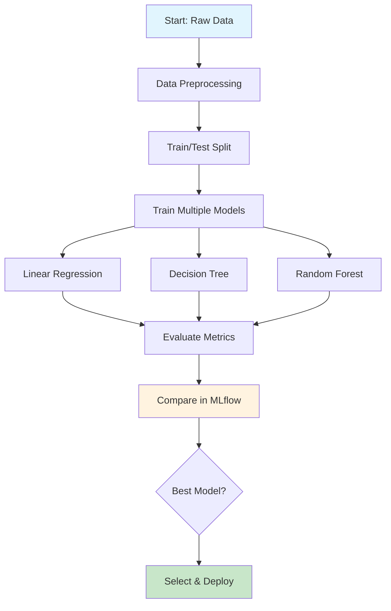
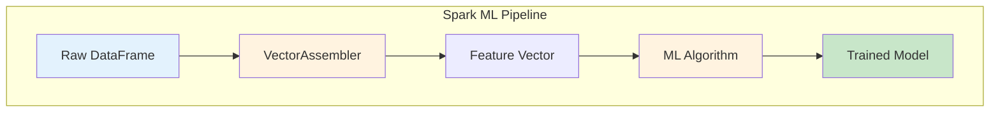
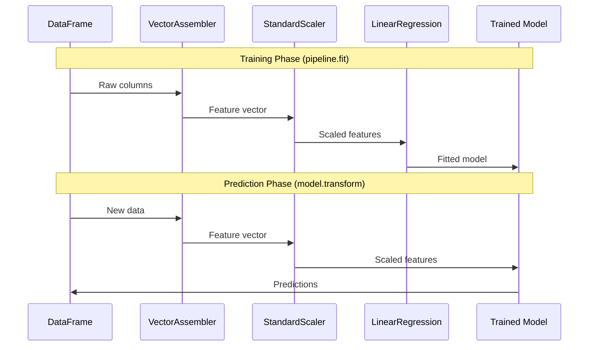
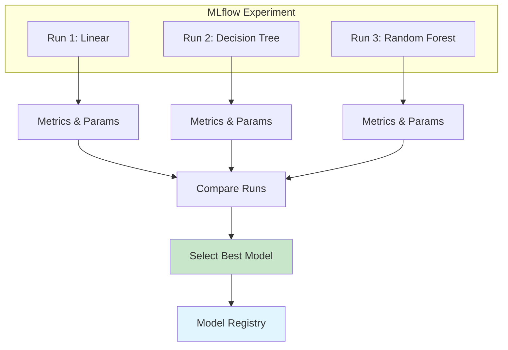
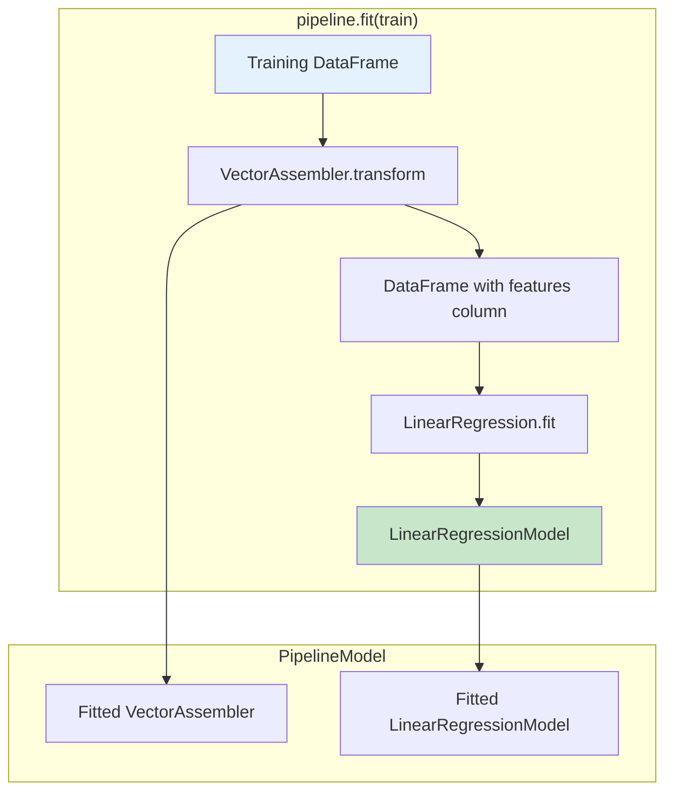
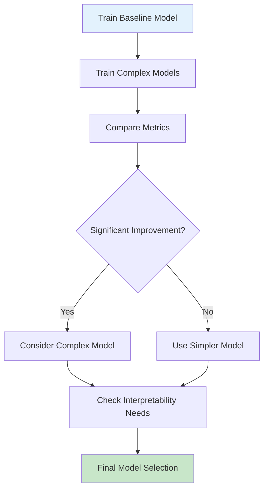
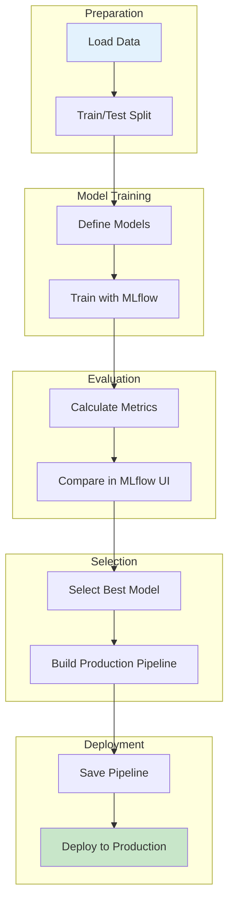

# DAY 13 – Model Comparison & Feature Engineering

## Table of Contents
1. [Introduction](#introduction)
2. [Training Multiple Models](#training-multiple-models)
   - [Why Train Multiple Models?](#why-train-multiple-models)
   - [Common Regression Models](#common-regression-models)
   - [Model Selection Strategy](#model-selection-strategy)
3. [Hyperparameter Tuning](#hyperparameter-tuning)
   - [What are Hyperparameters?](#what-are-hyperparameters)
   - [Tuning Techniques](#tuning-techniques)
4. [Feature Importance](#feature-importance)
   - [Understanding Feature Importance](#understanding-feature-importance)
   - [Methods to Calculate Feature Importance](#methods-to-calculate-feature-importance)
5. [Spark ML Pipelines](#spark-ml-pipelines)
   - [What is a Pipeline?](#what-is-a-pipeline)
   - [Pipeline Components](#pipeline-components)
   - [Building Pipelines](#building-pipelines)
6. [MLflow Integration for Model Tracking](#mlflow-integration-for-model-tracking)
7. [Complete Code Walkthrough](#complete-code-walkthrough)
8. [Model Comparison Metrics](#model-comparison-metrics)
9. [Best Practices](#best-practices)
10. [Summary](#summary)

---

## Introduction

Model comparison and feature engineering are critical steps in the machine learning lifecycle. In production environments, data scientists rarely deploy the first model they train. Instead, they experiment with multiple algorithms, tune their parameters, and systematically compare performance to select the best model for their use case.

This lesson covers:
- Training and comparing multiple regression models (Linear Regression, Decision Tree, Random Forest)
- Tracking experiments using MLflow
- Building reproducible ML pipelines with Apache Spark
- Understanding which features drive model predictions

---

## Training Multiple Models

### Why Train Multiple Models?

Different algorithms have different strengths and weaknesses. The "No Free Lunch" theorem in machine learning states that no single algorithm works best for every problem. By training multiple models, we can:

1. **Compare Performance**: See which algorithm best captures patterns in our data
2. **Understand Trade-offs**: Balance between accuracy, interpretability, and computational cost
3. **Reduce Bias**: Avoid committing to assumptions of a single algorithm
4. **Build Ensembles**: Potentially combine models for better predictions

### Common Regression Models

| Model | Type | Strengths | Weaknesses | Interpretability |
|-------|------|-----------|------------|------------------|
| **Linear Regression** | Parametric | Fast, simple, interpretable | Assumes linear relationships | High |
| **Decision Tree** | Non-parametric | Handles non-linearity, no scaling needed | Prone to overfitting | Medium |
| **Random Forest** | Ensemble | Reduces overfitting, handles complex patterns | Slower, less interpretable | Low |

### Model Selection Strategy



---

## Hyperparameter Tuning

### What are Hyperparameters?

Hyperparameters are configuration settings that control the learning process itself, not learned from data. They must be set before training begins.

**Parameters vs Hyperparameters:**

| Aspect | Parameters | Hyperparameters |
|--------|------------|-----------------|
| **Definition** | Learned from data during training | Set before training begins |
| **Examples** | Coefficients, weights | Learning rate, tree depth |
| **How Set** | Optimization algorithm | Manual or automated search |
| **Location** | Inside the model | Outside the model |

### Key Hyperparameters by Model

**Decision Tree Regressor:**
- `max_depth`: Maximum depth of the tree (controls complexity)
- `min_samples_split`: Minimum samples required to split a node
- `min_samples_leaf`: Minimum samples required at a leaf node

**Random Forest Regressor:**
- `n_estimators`: Number of trees in the forest
- `max_depth`: Maximum depth of each tree
- `max_features`: Number of features to consider for best split

### Tuning Techniques

**1. Grid Search**

Exhaustively searches through a specified parameter grid.

```python
from sklearn.model_selection import GridSearchCV

param_grid = {
    'max_depth': [3, 5, 7, 10],
    'min_samples_split': [2, 5, 10]
}

grid_search = GridSearchCV(
    DecisionTreeRegressor(),
    param_grid,
    cv=5,  # 5-fold cross-validation
    scoring='r2'
)
grid_search.fit(X_train, y_train)
best_params = grid_search.best_params_
```

**2. Random Search**

Samples random combinations from parameter distributions. More efficient than grid search when the parameter space is large.

**3. Bayesian Optimization**

Uses probabilistic models to find optimal parameters efficiently by learning from previous evaluations.

---

## Feature Importance

### Understanding Feature Importance

Feature importance quantifies how much each input feature contributes to the model's predictions. This helps:

1. **Understand the model**: Know what drives predictions
2. **Feature selection**: Remove irrelevant features
3. **Business insights**: Identify key factors affecting outcomes
4. **Model debugging**: Detect if model relies on unexpected features

### Methods to Calculate Feature Importance

**1. Coefficient Magnitude (Linear Regression)**

For linear regression with standardized features:

$$y = \beta_0 + \beta_1 x_1 + \beta_2 x_2 + \ldots + \beta_n x_n$$

The importance of feature $i$ can be measured by $|\beta_i|$ (absolute value of coefficient).

**Interpretation**: A coefficient $\beta_i = 0.5$ means a one-unit increase in $x_i$ increases $y$ by 0.5 units, holding other features constant.

**2. Gini Importance (Decision Trees & Random Forest)**

Also called "Mean Decrease in Impurity" (MDI). For each feature, it sums up how much that feature reduces impurity across all splits.

$$\text{Importance}(f) = \sum_{t \in \text{splits on } f} \frac{n_t}{N} \cdot \Delta \text{impurity}_t$$

Where:
- $n_t$ = number of samples reaching node $t$
- $N$ = total number of samples
- $\Delta \text{impurity}_t$ = reduction in impurity at node $t$

**3. Permutation Importance**

Measures the decrease in model performance when a feature's values are randomly shuffled:

$$\text{Importance}(f) = \text{Score}_{\text{original}} - \text{Score}_{\text{permuted}}$$

```python
from sklearn.inspection import permutation_importance

# Calculate permutation importance
perm_importance = permutation_importance(
    model, X_test, y_test, 
    n_repeats=10, 
    random_state=42
)

# Get feature importance scores
for i, importance in enumerate(perm_importance.importances_mean):
    print(f"Feature {i}: {importance:.4f}")
```

**Extracting Feature Importance from Models:**

```python
# For Random Forest
importances = model.feature_importances_

# For Linear Regression (use absolute coefficients)
importances = np.abs(model.coef_)

# Create importance DataFrame
import pandas as pd
feature_importance_df = pd.DataFrame({
    'feature': feature_names,
    'importance': importances
}).sort_values('importance', ascending=False)
```

---

## Spark ML Pipelines

### What is a Pipeline?

A Pipeline in Spark ML is a sequence of stages that transform data and train models. It chains multiple transformers and estimators into a single workflow, ensuring:

1. **Reproducibility**: Same transformations applied consistently
2. **Simplicity**: Complex workflows as single objects
3. **Prevent Data Leakage**: Transformations fitted only on training data



### Pipeline Components

**1. Transformers**

Convert one DataFrame into another (no learning involved).

| Transformer | Purpose | Example |
|-------------|---------|---------|
| `VectorAssembler` | Combines multiple columns into a single vector | Features for ML |
| `StringIndexer` | Converts strings to numeric indices | Categorical encoding |
| `StandardScaler` | Standardizes features | Mean=0, Std=1 |
| `OneHotEncoder` | Creates one-hot vectors | Categorical features |

**2. Estimators**

Learn from data and produce a model (which is a Transformer).

| Estimator | Type | Output |
|-----------|------|--------|
| `LinearRegression` | Regression | `LinearRegressionModel` |
| `DecisionTreeRegressor` | Regression | `DecisionTreeRegressionModel` |
| `RandomForestRegressor` | Regression | `RandomForestRegressionModel` |

### Building Pipelines

**Basic Pipeline Structure:**

```python
from pyspark.ml import Pipeline
from pyspark.ml.feature import VectorAssembler, StringIndexer, StandardScaler
from pyspark.ml.regression import LinearRegression

# Stage 1: Assemble features into a vector
assembler = VectorAssembler(
    inputCols=["views", "cart_adds", "time_on_page"],
    outputCol="raw_features"
)

# Stage 2: Scale features (optional but recommended)
scaler = StandardScaler(
    inputCol="raw_features",
    outputCol="features",
    withStd=True,
    withMean=True
)

# Stage 3: Train Linear Regression
lr = LinearRegression(
    featuresCol="features",
    labelCol="purchases",
    maxIter=100,
    regParam=0.1
)

# Create Pipeline
pipeline = Pipeline(stages=[assembler, scaler, lr])

# Fit pipeline on training data
pipeline_model = pipeline.fit(train_df)

# Make predictions on test data
predictions = pipeline_model.transform(test_df)
```

**Pipeline Execution Flow:**



---

## MLflow Integration for Model Tracking

MLflow is an open-source platform for managing the ML lifecycle. It provides:

1. **Experiment Tracking**: Log parameters, metrics, and artifacts
2. **Model Registry**: Version and manage models
3. **Model Deployment**: Deploy models as REST APIs

### MLflow Tracking Workflow



### Key MLflow Functions

| Function | Purpose | Example |
|----------|---------|---------|
| `mlflow.start_run()` | Start a new run | `with mlflow.start_run():` |
| `mlflow.log_param()` | Log a parameter | `mlflow.log_param("max_depth", 5)` |
| `mlflow.log_metric()` | Log a metric | `mlflow.log_metric("r2_score", 0.85)` |
| `mlflow.log_artifact()` | Log a file | `mlflow.log_artifact("plot.png")` |
| `mlflow.sklearn.log_model()` | Log sklearn model | `mlflow.sklearn.log_model(model, "model")` |

---

## Complete Code Walkthrough

### Part 1: Training Multiple Models with MLflow

```python
# Import required libraries
from sklearn.linear_model import LinearRegression
from sklearn.tree import DecisionTreeRegressor
from sklearn.ensemble import RandomForestRegressor
import mlflow
import mlflow.sklearn

# Define models dictionary
# Each key is a name, each value is an instantiated model
models = {
    "linear": LinearRegression(),
    "decision_tree": DecisionTreeRegressor(max_depth=5),
    "random_forest": RandomForestRegressor(n_estimators=100)
}
```

**Explanation of Model Initialization:**

1. **LinearRegression()**: No hyperparameters needed for basic usage
   - Fits: $y = \beta_0 + \beta_1 x_1 + \beta_2 x_2 + \ldots$
   - Uses Ordinary Least Squares (OLS) to minimize:
   
   $$\text{MSE} = \frac{1}{n} \sum_{i=1}^{n} (y_i - \hat{y}_i)^2$$

2. **DecisionTreeRegressor(max_depth=5)**: 
   - `max_depth=5` limits tree to 5 levels
   - Prevents overfitting by stopping early
   - Each split minimizes variance:
   
   $$\text{Variance} = \frac{1}{n} \sum_{i=1}^{n} (y_i - \bar{y})^2$$

3. **RandomForestRegressor(n_estimators=100)**:
   - Creates 100 decision trees
   - Each tree trained on bootstrap sample
   - Final prediction is average of all trees:
   
   $$\hat{y} = \frac{1}{T} \sum_{t=1}^{T} \hat{y}_t$$

### Part 2: Training Loop with MLflow Tracking

```python
# Loop through each model
for name, model in models.items():
    # Start a new MLflow run for this model
    with mlflow.start_run(run_name=f"{name}_model"):
        
        # Log the model type as a parameter
        mlflow.log_param("model_type", name)
        
        # Train the model on training data
        model.fit(X_train, y_train)
        
        # Calculate R² score on test data
        score = model.score(X_test, y_test)
        
        # Log the score as a metric
        mlflow.log_metric("r2_score", score)
        
        # Save the trained model as an artifact
        mlflow.sklearn.log_model(model, "model")
        
        # Print results
        print(f"{name}: R² = {score:.4f}")
```

**Line-by-Line Explanation:**

| Line | Purpose |
|------|---------|
| `for name, model in models.items()` | Iterate through model dictionary |
| `with mlflow.start_run(run_name=...)` | Create isolated run for each model; auto-closes when done |
| `mlflow.log_param("model_type", name)` | Record which model type this run used |
| `model.fit(X_train, y_train)` | Train model on training features and labels |
| `score = model.score(X_test, y_test)` | Calculate R² score (coefficient of determination) |
| `mlflow.log_metric("r2_score", score)` | Save metric for later comparison |
| `mlflow.sklearn.log_model(model, "model")` | Serialize and save the trained model |

### Part 3: Spark ML Pipeline

```python
# Import Spark ML components
from pyspark.ml import Pipeline
from pyspark.ml.feature import VectorAssembler
from pyspark.ml.regression import LinearRegression as SparkLR

# Stage 1: VectorAssembler
# Combines multiple feature columns into a single vector column
assembler = VectorAssembler(
    inputCols=["views", "cart_adds"],  # Input feature columns
    outputCol="features"                # Output: single vector column
)

# Stage 2: Linear Regression
# Spark's distributed implementation of linear regression
lr = SparkLR(
    featuresCol="features",   # Column containing feature vectors
    labelCol="purchases"      # Column containing target values
)

# Create Pipeline
# Chains assembler and regression into single workflow
pipeline = Pipeline(stages=[assembler, lr])

# Load data from Delta table
spark_df = spark.table("gold.products")

# Split data: 80% training, 20% testing
train, test = spark_df.randomSplit([0.8, 0.2])

# Fit pipeline on training data
# This fits ALL stages in sequence
model = pipeline.fit(train)
```

**VectorAssembler Deep Dive:**

Spark ML algorithms require features as a single vector column. VectorAssembler transforms:

| views | cart_adds | → | features |
|-------|-----------|---|----------|
| 100 | 5 | → | [100.0, 5.0] |
| 250 | 12 | → | [250.0, 12.0] |
| 75 | 3 | → | [75.0, 3.0] |

**Pipeline Fit Process:**



### Part 4: Making Predictions and Evaluation

```python
# Make predictions on test data
predictions = model.transform(test)

# Evaluate the model
from pyspark.ml.evaluation import RegressionEvaluator

# Create evaluator for R² metric
evaluator = RegressionEvaluator(
    labelCol="purchases",
    predictionCol="prediction",
    metricName="r2"
)

# Calculate R² score
r2 = evaluator.evaluate(predictions)
print(f"Spark ML Pipeline R²: {r2:.4f}")

# Calculate RMSE
evaluator_rmse = RegressionEvaluator(
    labelCol="purchases",
    predictionCol="prediction",
    metricName="rmse"
)
rmse = evaluator_rmse.evaluate(predictions)
print(f"RMSE: {rmse:.4f}")
```

---

## Model Comparison Metrics

### Understanding R² (Coefficient of Determination)

R² measures how well the model explains variance in the target variable:

$$R^2 = 1 - \frac{SS_{res}}{SS_{tot}}$$

Where:
- $SS_{res} = \sum_{i=1}^{n} (y_i - \hat{y}_i)^2$ (Residual Sum of Squares)
- $SS_{tot} = \sum_{i=1}^{n} (y_i - \bar{y})^2$ (Total Sum of Squares)

**Step-by-Step Calculation:**

**Step 1**: Calculate the mean of actual values:
$$\bar{y} = \frac{1}{n} \sum_{i=1}^{n} y_i$$

**Step 2**: Calculate Total Sum of Squares (how much variance exists):
$$SS_{tot} = \sum_{i=1}^{n} (y_i - \bar{y})^2$$

**Step 3**: Calculate Residual Sum of Squares (unexplained variance):
$$SS_{res} = \sum_{i=1}^{n} (y_i - \hat{y}_i)^2$$

**Step 4**: Calculate R²:
$$R^2 = 1 - \frac{SS_{res}}{SS_{tot}}$$

**Interpretation:**
- $R^2 = 1.0$: Perfect predictions
- $R^2 = 0.0$: Model predicts the mean for all inputs
- $R^2 < 0$: Model is worse than predicting the mean

### Other Important Metrics

| Metric | Formula | Use Case |
|--------|---------|----------|
| **MSE** | $\frac{1}{n} \sum (y_i - \hat{y}_i)^2$ | Penalizes large errors more |
| **RMSE** | $\sqrt{\frac{1}{n} \sum (y_i - \hat{y}_i)^2}$ | Same units as target |
| **MAE** | $\frac{1}{n} \sum \|y_i - \hat{y}_i\|$ | Robust to outliers |
| **MAPE** | $\frac{100}{n} \sum \left\|\frac{y_i - \hat{y}_i}{y_i}\right\|$ | Percentage error |

### Model Comparison Example

After running all models, you might see results like:

| Model | R² Score | Training Time | Interpretability |
|-------|----------|---------------|------------------|
| Linear Regression | 0.7234 | 0.5s | High |
| Decision Tree | 0.7856 | 1.2s | Medium |
| Random Forest | 0.8421 | 8.5s | Low |

**Selecting the Best Model:**

Consider multiple factors:
1. **Performance**: Random Forest has highest R²
2. **Speed**: Linear Regression is fastest
3. **Interpretability**: Linear Regression coefficients are easiest to explain
4. **Business needs**: Balance accuracy vs. explainability

---

## Best Practices

### 1. Data Preparation
- Always split data before any preprocessing
- Use cross-validation for robust estimates
- Handle missing values consistently

### 2. Model Training
- Start simple (Linear Regression) before complex models
- Use consistent random seeds for reproducibility
- Log everything with MLflow

### 3. Feature Engineering
- Create meaningful features from domain knowledge
- Remove highly correlated features
- Scale features when needed (especially for linear models)

### 4. Pipeline Design
- Include all preprocessing in the pipeline
- Save fitted pipelines, not just models
- Version your pipelines

### 5. Comparison Strategy



---

## Summary

### Key Takeaways

1. **Multiple Models**: Always train and compare multiple algorithms—no single model works best for all problems

2. **MLflow Tracking**: Systematic experiment tracking enables:
   - Reproducibility
   - Easy comparison
   - Model versioning

3. **Spark ML Pipelines**: Chain transformations and models for:
   - Consistent preprocessing
   - Preventing data leakage
   - Production deployment

4. **Feature Importance**: Understanding which features matter helps:
   - Build trust in models
   - Guide feature engineering
   - Reduce model complexity

5. **Hyperparameters**: Key settings that control model behavior:
   - `max_depth` for trees: Controls complexity
   - `n_estimators` for forests: More trees = more stable

### Quick Reference: Model Selection Guide

| Situation | Recommended Model |
|-----------|-------------------|
| Need interpretability | Linear Regression |
| Non-linear relationships | Decision Tree / Random Forest |
| High accuracy required | Random Forest (with tuning) |
| Large distributed data | Spark ML Pipeline |
| Quick baseline | Linear Regression |

### Complete Workflow Summary



---

*End of Day 13 Notes*