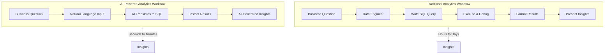
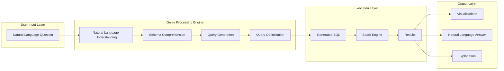
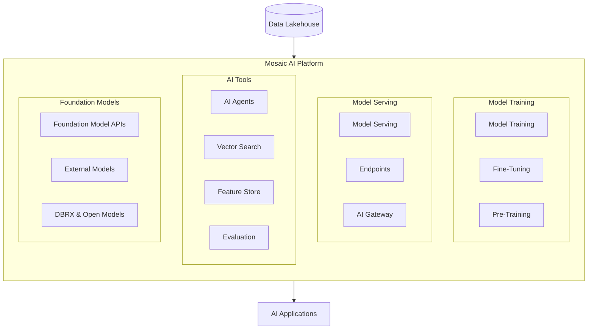
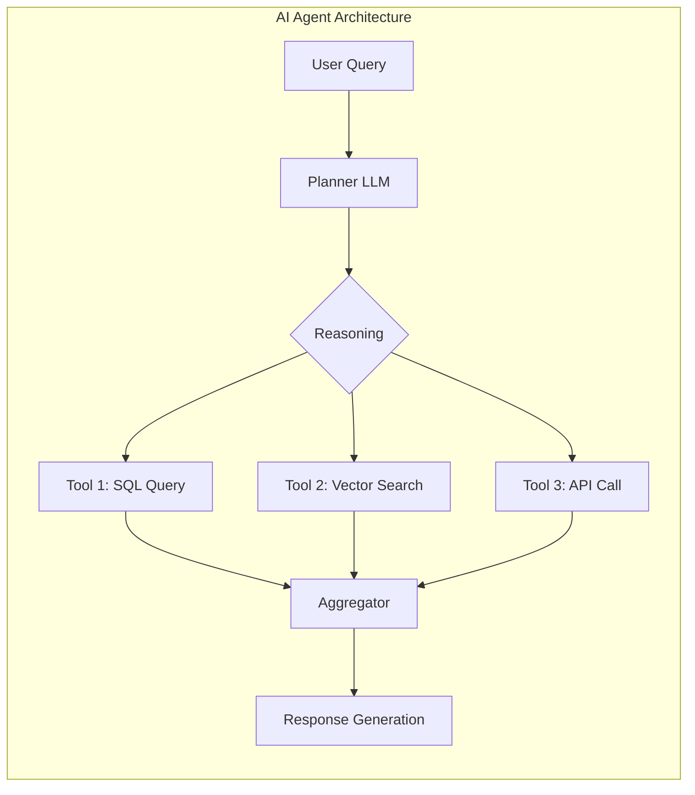
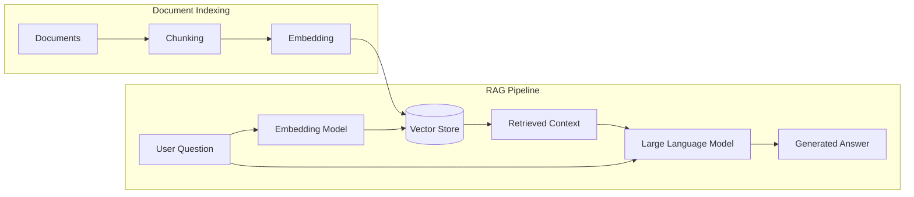
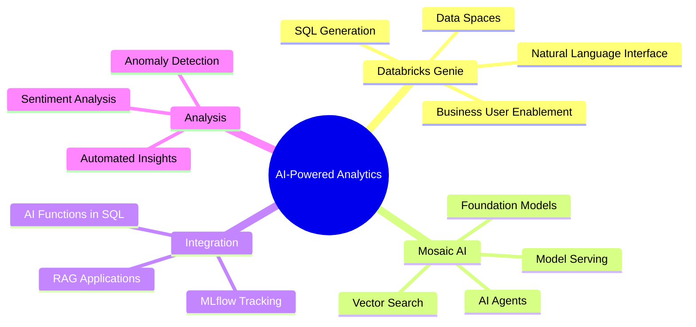

# DAY 14: AI-Powered Analytics - Databricks Genie & Mosaic AI

## Table of Contents
1. [Introduction to AI-Powered Analytics](#1-introduction-to-ai-powered-analytics)
2. [Databricks Genie: Natural Language to SQL](#2-databricks-genie-natural-language-to-sql)
3. [Mosaic AI Platform](#3-mosaic-ai-platform)
4. [Generative AI Integration in Databricks](#4-generative-ai-integration-in-databricks)
5. [AI-Assisted Analysis](#5-ai-assisted-analysis)
6. [Hands-On Tasks and Implementation](#6-hands-on-tasks-and-implementation)
7. [Best Practices and Considerations](#7-best-practices-and-considerations)
8. [Summary and Key Takeaways](#8-summary-and-key-takeaways)

---

## 1. Introduction to AI-Powered Analytics

### What is AI-Powered Analytics?

AI-Powered Analytics represents the convergence of artificial intelligence and traditional data analytics. Instead of requiring users to write complex queries or understand database schemas, AI-powered tools allow users to interact with data using natural language, receive intelligent recommendations, and automate complex analytical tasks.

**The Evolution of Data Analytics:**

Traditional analytics required data professionals to manually write SQL queries, understand complex database schemas, and translate business questions into technical implementations. AI-powered analytics democratizes this process by enabling anyone to ask questions in plain English and receive meaningful insights.

### Why AI-Powered Analytics Matters

**Business Value:**
- Reduces time from question to insight from hours to seconds
- Empowers non-technical users to perform sophisticated analysis
- Increases data democratization across organizations
- Improves decision-making speed and accuracy

**Technical Benefits:**
- Automatic query optimization
- Intelligent data discovery
- Pattern recognition at scale
- Predictive insights generation



The diagram above illustrates the dramatic difference between traditional analytics workflows and AI-powered approaches. Traditional workflows involve multiple handoffs and technical expertise, while AI-powered analytics compresses this into a streamlined, accessible process.

---

## 2. Databricks Genie: Natural Language to SQL

### What is Databricks Genie?

Databricks Genie is an AI-powered conversational interface that transforms natural language questions into SQL queries. Think of it as having a data analyst available 24/7 who understands your data schema and can instantly translate your business questions into executable queries.

**Core Concept:** You ask "What were our top-selling products last month?" and Genie automatically generates the appropriate SQL query, executes it against your data, and returns formatted results.

### How Genie Works Internally



**Step-by-Step Process:**

1. **Natural Language Understanding (NLU):** Genie parses your question to identify intent, entities, and relationships. For "Show me total revenue by category," it identifies "total revenue" as an aggregation operation and "category" as the grouping dimension.

2. **Schema Comprehension:** Genie examines your data catalog, table structures, column names, and relationships. It understands that "revenue" might map to a column called `sale_amount` or `total_price`.

3. **Query Generation:** Based on the understood intent and schema knowledge, Genie constructs the appropriate SQL query with proper JOINs, aggregations, and filters.

4. **Query Optimization:** The generated query is optimized for performance using Databricks' SQL optimization capabilities.

5. **Execution and Response:** The query executes against your data lakehouse, and results are returned with optional visualizations and natural language explanations.

### Genie Data Spaces

A **Genie Data Space** is a curated environment that defines the scope of data Genie can access and query. Think of it as creating a "sandbox" of relevant tables and views for specific business domains.

**Why Data Spaces Matter:**

| Aspect | Without Data Spaces | With Data Spaces |
|--------|---------------------|------------------|
| **Scope** | Access to all tables | Focused on relevant data |
| **Accuracy** | May query wrong tables | Precise table selection |
| **Security** | Broad access concerns | Controlled data exposure |
| **Performance** | Searches entire catalog | Faster schema comprehension |
| **Context** | Generic understanding | Domain-specific knowledge |

**Creating a Genie Data Space:**

```sql
-- Step 1: Identify relevant tables for your domain
-- For an e-commerce analytics space, you might include:

-- Products table
CREATE OR REFRESH TABLE bronze.products AS
SELECT product_id, product_name, category, price, created_at
FROM raw_data.products;

-- Sales table
CREATE OR REFRESH TABLE bronze.sales AS
SELECT sale_id, product_id, customer_id, quantity, sale_amount, sale_date
FROM raw_data.transactions;

-- Customers table
CREATE OR REFRESH TABLE bronze.customers AS
SELECT customer_id, customer_name, segment, region, registration_date
FROM raw_data.customers;
```

### Practical Genie Query Examples

Let's walk through each of the example queries mentioned in the tasks:

#### Query 1: "Show me total revenue by category"

**What Genie Understands:**
- "total revenue" → SUM aggregation on monetary column
- "by category" → GROUP BY category dimension

**Generated SQL (approximate):**
```sql
SELECT 
    p.category,
    SUM(s.sale_amount) AS total_revenue
FROM bronze.sales s
JOIN bronze.products p ON s.product_id = p.product_id
GROUP BY p.category
ORDER BY total_revenue DESC;
```

**Expected Output:**

| category | total_revenue |
|----------|---------------|
| Electronics | 1,250,000 |
| Clothing | 890,000 |
| Home & Garden | 567,000 |
| Books | 234,000 |

#### Query 2: "Which products have the highest conversion rate?"

**What Genie Understands:**
- "products" → Product dimension
- "conversion rate" → Ratio of purchases to views/visits
- "highest" → ORDER BY DESC with limit

**Conversion Rate Formula:**

$$\text{Conversion Rate} = \frac{\text{Number of Purchases}}{\text{Number of Product Views}} \times 100$$

**Generated SQL (approximate):**
```sql
SELECT 
    p.product_name,
    COUNT(DISTINCT s.sale_id) AS purchases,
    COUNT(DISTINCT v.view_id) AS views,
    ROUND(
        (COUNT(DISTINCT s.sale_id) * 100.0) / 
        NULLIF(COUNT(DISTINCT v.view_id), 0), 
        2
    ) AS conversion_rate_pct
FROM bronze.products p
LEFT JOIN bronze.sales s ON p.product_id = s.product_id
LEFT JOIN bronze.product_views v ON p.product_id = v.product_id
GROUP BY p.product_id, p.product_name
ORDER BY conversion_rate_pct DESC
LIMIT 10;
```

#### Query 3: "What's the trend of daily purchases over time?"

**What Genie Understands:**
- "trend" → Time series analysis
- "daily purchases" → COUNT aggregated by day
- "over time" → Date-based ordering

**Generated SQL (approximate):**
```sql
SELECT 
    DATE(sale_date) AS purchase_date,
    COUNT(*) AS total_purchases,
    SUM(sale_amount) AS daily_revenue
FROM bronze.sales
WHERE sale_date >= DATE_SUB(CURRENT_DATE(), 90)  -- Last 90 days
GROUP BY DATE(sale_date)
ORDER BY purchase_date ASC;
```

**Understanding Trends - Moving Average:**

To smooth out daily fluctuations, Genie might also calculate a moving average:

$$\text{7-Day Moving Average} = \frac{\sum_{i=0}^{6} \text{Purchases}_{t-i}}{7}$$

```sql
-- With 7-day moving average
SELECT 
    purchase_date,
    total_purchases,
    AVG(total_purchases) OVER (
        ORDER BY purchase_date 
        ROWS BETWEEN 6 PRECEDING AND CURRENT ROW
    ) AS moving_avg_7day
FROM daily_purchases;
```

#### Query 4: "Find customers who viewed but never purchased"

**What Genie Understands:**
- "customers" → Customer entity
- "viewed" → Product view action
- "never purchased" → NOT EXISTS or LEFT JOIN with NULL check

**Generated SQL (approximate):**
```sql
SELECT DISTINCT
    c.customer_id,
    c.customer_name,
    c.email,
    COUNT(v.view_id) AS total_views,
    MAX(v.view_date) AS last_view_date
FROM bronze.customers c
INNER JOIN bronze.product_views v ON c.customer_id = v.customer_id
LEFT JOIN bronze.sales s ON c.customer_id = s.customer_id
WHERE s.sale_id IS NULL  -- No purchases found
GROUP BY c.customer_id, c.customer_name, c.email
HAVING COUNT(v.view_id) > 0
ORDER BY total_views DESC;
```

**Business Value:** This query identifies potential customers who showed interest but didn't convert, enabling targeted remarketing campaigns.

### Genie Best Practices

**For Optimal Results:**

1. **Be Specific:** Instead of "show sales data," ask "show monthly sales by product category for the last quarter"

2. **Use Business Terms:** Genie learns from your data catalog descriptions. If you've documented that "ARR" means "Annual Recurring Revenue," use that term.

3. **Provide Context:** "Compare this month's performance to last month" helps Genie understand the temporal context.

4. **Iterate and Refine:** Start broad, then narrow down. "Show revenue" → "Show revenue by region" → "Show revenue by region for enterprise customers"

---

## 3. Mosaic AI Platform

### What is Mosaic AI?

Mosaic AI is Databricks' comprehensive AI and machine learning platform that provides tools for training, deploying, and managing AI models at scale. It was built on the foundation of MosaicML (acquired by Databricks) and integrates deeply with the Databricks Data Intelligence Platform.

**Mosaic AI is not a single tool but a suite of capabilities:**



### Key Components of Mosaic AI

#### 1. Foundation Model APIs

Foundation Model APIs provide access to state-of-the-art large language models (LLMs) directly within Databricks. This eliminates the need to manage model infrastructure separately.

**Available Models:**
- **DBRX:** Databricks' own open LLM, optimized for enterprise use
- **Llama Models:** Meta's open-source LLM family
- **External Models:** Integration with OpenAI, Anthropic, and other providers through AI Gateway

**Accessing Foundation Models:**
```python
# Using Databricks Foundation Model APIs
import mlflow.deployments

# Get the deployment client
client = mlflow.deployments.get_deploy_client("databricks")

# Query a foundation model
response = client.predict(
    endpoint="databricks-dbrx-instruct",
    inputs={
        "messages": [
            {"role": "user", "content": "Summarize the key trends in our Q4 sales data"}
        ],
        "max_tokens": 500
    }
)

print(response["choices"][0]["message"]["content"])
```

#### 2. Model Serving

Model Serving allows you to deploy machine learning models as REST API endpoints. These endpoints automatically scale based on demand and provide low-latency predictions.

**Types of Model Serving:**

| Serving Type | Use Case | Latency | Scaling |
|--------------|----------|---------|---------|
| **Real-time** | Interactive applications | < 100ms | Auto-scale |
| **Batch** | Large-scale scoring | Minutes | Parallel jobs |
| **Streaming** | Continuous predictions | Seconds | Event-driven |

**Deploying a Model Endpoint:**
```python
import mlflow
from mlflow.deployments import get_deploy_client

# Register model to MLflow
model_uri = "runs:/<run_id>/model"
mlflow.register_model(model_uri, "sentiment_classifier")

# Deploy to serving endpoint
client = get_deploy_client("databricks")
endpoint = client.create_endpoint(
    name="sentiment-classifier-endpoint",
    config={
        "served_models": [{
            "model_name": "sentiment_classifier",
            "model_version": "1",
            "workload_size": "Small",
            "scale_to_zero_enabled": True
        }]
    }
)
```

#### 3. Vector Search

Vector Search enables semantic search capabilities by storing and querying high-dimensional vector embeddings. This is essential for building retrieval-augmented generation (RAG) applications.

**How Vector Search Works:**

Text or data is converted into numerical vectors (embeddings) that capture semantic meaning. Similar items have vectors that are "close" together in vector space.

**Mathematical Foundation - Cosine Similarity:**

$$\text{similarity}(A, B) = \cos(\theta) = \frac{A \cdot B}{\|A\| \|B\|} = \frac{\sum_{i=1}^{n} A_i B_i}{\sqrt{\sum_{i=1}^{n} A_i^2} \sqrt{\sum_{i=1}^{n} B_i^2}}$$

Where:
- $A$ and $B$ are embedding vectors
- $\theta$ is the angle between them
- Values range from -1 (opposite) to 1 (identical)

**Creating a Vector Search Index:**
```python
from databricks.vector_search.client import VectorSearchClient

# Initialize client
vsc = VectorSearchClient()

# Create a vector search index
index = vsc.create_delta_sync_index(
    endpoint_name="vector-search-endpoint",
    index_name="product_descriptions_index",
    source_table_name="catalog.schema.products",
    pipeline_type="TRIGGERED",
    primary_key="product_id",
    embedding_dimension=1536,
    embedding_vector_column="description_embedding"
)
```

#### 4. AI Agents

AI Agents are autonomous systems that can plan, reason, and execute multi-step tasks. Mosaic AI provides tools to build agents that can interact with data, tools, and external systems.



**Agent Capabilities:**
- Multi-step reasoning and planning
- Tool use (SQL queries, API calls, calculations)
- Memory and context management
- Self-correction and error handling

#### 5. MLflow Integration

MLflow is deeply integrated into Mosaic AI for experiment tracking, model registry, and deployment management.

**Key MLflow Features:**

| Feature | Description | Use Case |
|---------|-------------|----------|
| **Tracking** | Log parameters, metrics, artifacts | Experiment comparison |
| **Registry** | Version and stage models | Model governance |
| **Deployment** | Deploy to various targets | Production serving |
| **Evaluation** | Assess model quality | Quality assurance |

---

## 4. Generative AI Integration in Databricks

### Understanding Generative AI in Enterprise Context

Generative AI refers to AI systems that can create new content—text, images, code, or data—based on patterns learned from training data. In the enterprise context, this translates to:

- **Text Generation:** Automated reports, summaries, and documentation
- **Code Generation:** SQL queries, Python scripts, data transformations
- **Data Augmentation:** Synthetic data generation for testing or training
- **Content Personalization:** Customized recommendations and communications

### AI Functions in Databricks SQL

Databricks provides built-in AI functions that can be used directly in SQL queries:

```sql
-- AI-powered text analysis directly in SQL
SELECT 
    review_id,
    review_text,
    ai_analyze_sentiment(review_text) AS sentiment,
    ai_extract_entities(review_text) AS entities,
    ai_summarize(review_text, 50) AS summary
FROM product_reviews
WHERE review_date >= '2024-01-01';
```

**Available AI Functions:**

| Function | Description | Example Use |
|----------|-------------|-------------|
| `ai_analyze_sentiment()` | Detect positive/negative sentiment | Customer feedback analysis |
| `ai_extract_entities()` | Extract named entities (people, places, products) | Information extraction |
| `ai_summarize()` | Generate concise summaries | Document processing |
| `ai_classify()` | Categorize text into labels | Ticket routing |
| `ai_translate()` | Translate between languages | Globalization |
| `ai_query()` | Custom LLM queries | Flexible AI tasks |

### Building RAG Applications

Retrieval-Augmented Generation (RAG) combines the knowledge retrieval capabilities of search systems with the generation abilities of LLMs.



**RAG Implementation Example:**
```python
from databricks.vector_search.client import VectorSearchClient
import mlflow.deployments

def rag_query(question: str) -> str:
    """
    Perform RAG query: retrieve relevant context and generate answer.
    """
    # Step 1: Get embeddings for the question
    deploy_client = mlflow.deployments.get_deploy_client("databricks")
    
    question_embedding = deploy_client.predict(
        endpoint="databricks-bge-large-en",
        inputs={"input": question}
    )["data"][0]["embedding"]
    
    # Step 2: Search for relevant documents
    vsc = VectorSearchClient()
    results = vsc.get_index(
        endpoint_name="vector-search-endpoint",
        index_name="knowledge_base_index"
    ).similarity_search(
        query_vector=question_embedding,
        num_results=5,
        columns=["content", "source"]
    )
    
    # Step 3: Construct context from retrieved documents
    context = "\n\n".join([
        f"Source: {r['source']}\nContent: {r['content']}"
        for r in results["result"]["data_array"]
    ])
    
    # Step 4: Generate answer using LLM
    prompt = f"""Based on the following context, answer the question.
    
Context:
{context}

Question: {question}

Answer:"""
    
    response = deploy_client.predict(
        endpoint="databricks-dbrx-instruct",
        inputs={
            "messages": [{"role": "user", "content": prompt}],
            "max_tokens": 500
        }
    )
    
    return response["choices"][0]["message"]["content"]
```

---

## 5. AI-Assisted Analysis

### What is AI-Assisted Analysis?

AI-Assisted Analysis augments human analytical capabilities with AI tools that can automatically detect patterns, generate hypotheses, and provide explanations. Rather than replacing analysts, these tools amplify their productivity.

**Key Capabilities:**

1. **Anomaly Detection:** Automatically identify unusual patterns in data
2. **Root Cause Analysis:** Trace back to factors causing observed changes
3. **Predictive Insights:** Forecast future trends based on historical patterns
4. **Natural Language Explanations:** Convert complex findings into plain English

### Automated Insights Generation

```python
# Example: Automated sales insights generator
def generate_sales_insights(df):
    """
    Automatically analyze sales data and generate insights.
    """
    insights = []
    
    # Calculate key metrics
    total_revenue = df['sale_amount'].sum()
    avg_order_value = df['sale_amount'].mean()
    
    # Identify top performers
    top_category = df.groupby('category')['sale_amount'].sum().idxmax()
    top_category_revenue = df.groupby('category')['sale_amount'].sum().max()
    
    # Detect trends
    daily_sales = df.groupby(df['sale_date'].dt.date)['sale_amount'].sum()
    trend_direction = "increasing" if daily_sales.iloc[-7:].mean() > daily_sales.iloc[-14:-7].mean() else "decreasing"
    
    # Generate natural language insights
    insights.append(f"Total revenue: ${total_revenue:,.2f}")
    insights.append(f"Average order value: ${avg_order_value:,.2f}")
    insights.append(f"Top performing category: {top_category} with ${top_category_revenue:,.2f}")
    insights.append(f"Sales trend is {trend_direction} compared to the previous week")
    
    return insights
```

### Sentiment Analysis Implementation

The provided task includes building sentiment analysis. Here's a comprehensive implementation:

```python
# Complete sentiment analysis implementation with MLflow tracking
from transformers import pipeline
import mlflow
import pandas as pd
from datetime import datetime

class SentimentAnalyzer:
    """
    Production-ready sentiment analysis with MLflow integration.
    """
    
    def __init__(self, model_name="distilbert-base-uncased-finetuned-sst-2-english"):
        """
        Initialize the sentiment analyzer.
        
        Parameters:
        -----------
        model_name : str
            The HuggingFace model to use for sentiment analysis
        """
        self.model_name = model_name
        self.classifier = pipeline("sentiment-analysis", model=model_name)
        
    def analyze(self, texts: list) -> list:
        """
        Analyze sentiment of input texts.
        
        Parameters:
        -----------
        texts : list
            List of text strings to analyze
            
        Returns:
        --------
        list : List of dictionaries with label and score
        """
        return self.classifier(texts)
    
    def analyze_with_tracking(self, texts: list, run_name: str = None) -> pd.DataFrame:
        """
        Analyze sentiment and track results in MLflow.
        
        Parameters:
        -----------
        texts : list
            List of text strings to analyze
        run_name : str, optional
            Name for the MLflow run
            
        Returns:
        --------
        pd.DataFrame : Results with text, label, and confidence
        """
        if run_name is None:
            run_name = f"sentiment_analysis_{datetime.now().strftime('%Y%m%d_%H%M%S')}"
        
        # Run analysis
        results = self.analyze(texts)
        
        # Create results DataFrame
        df_results = pd.DataFrame({
            'text': texts,
            'sentiment': [r['label'] for r in results],
            'confidence': [r['score'] for r in results]
        })
        
        # Calculate metrics
        positive_count = (df_results['sentiment'] == 'POSITIVE').sum()
        negative_count = (df_results['sentiment'] == 'NEGATIVE').sum()
        avg_confidence = df_results['confidence'].mean()
        
        # Log to MLflow
        with mlflow.start_run(run_name=run_name):
            # Log parameters
            mlflow.log_param("model", self.model_name)
            mlflow.log_param("num_samples", len(texts))
            
            # Log metrics
            mlflow.log_metric("positive_count", positive_count)
            mlflow.log_metric("negative_count", negative_count)
            mlflow.log_metric("positive_ratio", positive_count / len(texts))
            mlflow.log_metric("avg_confidence", avg_confidence)
            
            # Log results as artifact
            df_results.to_csv("/tmp/sentiment_results.csv", index=False)
            mlflow.log_artifact("/tmp/sentiment_results.csv")
            
        return df_results


# Usage Example
if __name__ == "__main__":
    # Initialize analyzer
    analyzer = SentimentAnalyzer()
    
    # Sample product reviews
    reviews = [
        "This product is amazing! Best purchase I've made all year.",
        "Terrible quality, complete waste of money. Very disappointed.",
        "Decent product for the price. Does what it's supposed to do.",
        "Absolutely love it! The quality exceeded my expectations.",
        "Poor customer service and the product broke after a week.",
        "Good value for money. Would recommend to others.",
        "Not what I expected. The description was misleading.",
        "Perfect! Exactly what I needed. Fast shipping too!"
    ]
    
    # Analyze with MLflow tracking
    results = analyzer.analyze_with_tracking(
        texts=reviews,
        run_name="product_review_sentiment"
    )
    
    # Display results
    print("\nSentiment Analysis Results:")
    print("=" * 60)
    for _, row in results.iterrows():
        emoji = "✅" if row['sentiment'] == 'POSITIVE' else "❌"
        print(f"{emoji} [{row['sentiment']}] ({row['confidence']:.2%})")
        print(f"   \"{row['text'][:50]}...\"")
        print()
```

**Understanding Sentiment Scores:**

The confidence score represents the model's certainty about its prediction:

$$P(\text{sentiment}|\text{text}) = \text{softmax}(z_i) = \frac{e^{z_i}}{\sum_{j} e^{z_j}}$$

Where $z_i$ are the logits (raw model outputs) for each class.

---

## 6. Hands-On Tasks and Implementation

### Task 1: Setting Up a Genie Data Space

```python
# Step 1: Create and configure tables for Genie
# This ensures clean, well-documented data for natural language queries

# Create products table with descriptions
spark.sql("""
CREATE OR REPLACE TABLE analytics.ecommerce.products (
    product_id STRING COMMENT 'Unique product identifier',
    product_name STRING COMMENT 'Name of the product',
    category STRING COMMENT 'Product category (Electronics, Clothing, etc.)',
    subcategory STRING COMMENT 'Product subcategory',
    price DECIMAL(10,2) COMMENT 'Product price in USD',
    cost DECIMAL(10,2) COMMENT 'Product cost in USD',
    stock_quantity INT COMMENT 'Current inventory count',
    created_at TIMESTAMP COMMENT 'When product was added'
)
COMMENT 'Product catalog with pricing and inventory information'
""")

# Create sales table
spark.sql("""
CREATE OR REPLACE TABLE analytics.ecommerce.sales (
    sale_id STRING COMMENT 'Unique sale transaction ID',
    product_id STRING COMMENT 'Product that was sold',
    customer_id STRING COMMENT 'Customer who made the purchase',
    quantity INT COMMENT 'Number of units purchased',
    sale_amount DECIMAL(10,2) COMMENT 'Total sale amount in USD',
    sale_date TIMESTAMP COMMENT 'When the sale occurred',
    channel STRING COMMENT 'Sales channel (web, mobile, store)'
)
COMMENT 'Sales transactions with revenue and customer information'
""")

# Create customer views table for conversion analysis
spark.sql("""
CREATE OR REPLACE TABLE analytics.ecommerce.product_views (
    view_id STRING COMMENT 'Unique view event ID',
    product_id STRING COMMENT 'Product that was viewed',
    customer_id STRING COMMENT 'Customer who viewed the product',
    view_date TIMESTAMP COMMENT 'When the view occurred',
    session_id STRING COMMENT 'Browser session identifier',
    device_type STRING COMMENT 'Device used (desktop, mobile, tablet)'
)
COMMENT 'Product view events for conversion analysis'
""")
```

### Task 2: Exploring Mosaic AI Features

```python
# Comprehensive Mosaic AI feature exploration

# 1. Foundation Model API - Text Generation
def explore_foundation_models():
    """Demonstrate foundation model capabilities."""
    import mlflow.deployments
    
    client = mlflow.deployments.get_deploy_client("databricks")
    
    # Text summarization
    sales_report = """
    Q4 2024 showed remarkable growth across all product categories. 
    Electronics led with a 45% increase in revenue, followed by 
    Home & Garden at 32%. Customer acquisition costs decreased by 
    15% while average order value increased by 23%. The mobile 
    channel now represents 65% of all transactions, up from 48% 
    in Q3. Key challenges included supply chain delays affecting 
    20% of orders and increased return rates in the Clothing category.
    """
    
    response = client.predict(
        endpoint="databricks-dbrx-instruct",
        inputs={
            "messages": [{
                "role": "user",
                "content": f"Summarize the key points from this report in 3 bullet points:\n\n{sales_report}"
            }],
            "max_tokens": 200
        }
    )
    
    print("Summary:")
    print(response["choices"][0]["message"]["content"])

# 2. Embedding Generation for Semantic Search
def generate_embeddings():
    """Generate embeddings for semantic search."""
    import mlflow.deployments
    
    client = mlflow.deployments.get_deploy_client("databricks")
    
    product_descriptions = [
        "Wireless Bluetooth headphones with noise cancellation",
        "Organic cotton t-shirt, comfortable and breathable",
        "Smart home thermostat with AI-powered scheduling"
    ]
    
    response = client.predict(
        endpoint="databricks-bge-large-en",
        inputs={"input": product_descriptions}
    )
    
    embeddings = [item["embedding"] for item in response["data"]]
    
    print(f"Generated {len(embeddings)} embeddings")
    print(f"Embedding dimension: {len(embeddings[0])}")
    
    return embeddings

# 3. Classification Task
def explore_classification():
    """Demonstrate text classification capabilities."""
    import mlflow.deployments
    
    client = mlflow.deployments.get_deploy_client("databricks")
    
    support_tickets = [
        "I can't log into my account, password reset not working",
        "When will my order ship? It's been 5 days",
        "Your product is amazing, best purchase ever!",
        "Requesting refund for defective item"
    ]
    
    categories = ["Technical Issue", "Order Inquiry", "Feedback", "Refund Request"]
    
    for ticket in support_tickets:
        response = client.predict(
            endpoint="databricks-dbrx-instruct",
            inputs={
                "messages": [{
                    "role": "user",
                    "content": f"""Classify this support ticket into one of these categories: {categories}
                    
Ticket: {ticket}

Respond with only the category name."""
                }],
                "max_tokens": 20
            }
        )
        
        classification = response["choices"][0]["message"]["content"]
        print(f"Ticket: {ticket[:50]}...")
        print(f"Category: {classification}\n")
```

### Task 3: Building a Simple NLP Task

```python
# Complete NLP pipeline for product review analysis

from transformers import pipeline
import pandas as pd
import mlflow
from collections import Counter

class ProductReviewAnalyzer:
    """
    Comprehensive NLP analysis for product reviews.
    Combines sentiment analysis, keyword extraction, and summarization.
    """
    
    def __init__(self):
        """Initialize all required NLP models."""
        print("Loading NLP models...")
        
        # Sentiment analysis
        self.sentiment_model = pipeline(
            "sentiment-analysis",
            model="distilbert-base-uncased-finetuned-sst-2-english"
        )
        
        # Named entity recognition (optional, for extracting product mentions)
        self.ner_model = pipeline(
            "ner",
            model="dbmdz/bert-large-cased-finetuned-conll03-english",
            aggregation_strategy="simple"
        )
        
        # Zero-shot classification for topic categorization
        self.classifier = pipeline(
            "zero-shot-classification",
            model="facebook/bart-large-mnli"
        )
        
        print("Models loaded successfully!")
    
    def analyze_sentiment(self, reviews: list) -> list:
        """
        Analyze sentiment of reviews.
        
        Returns list of dicts with 'label' and 'score'.
        """
        return self.sentiment_model(reviews)
    
    def extract_topics(self, review: str, candidate_topics: list = None) -> dict:
        """
        Classify review into topics using zero-shot classification.
        """
        if candidate_topics is None:
            candidate_topics = [
                "Product Quality",
                "Customer Service",
                "Shipping & Delivery",
                "Value for Money",
                "Ease of Use"
            ]
        
        result = self.classifier(
            review,
            candidate_topics,
            multi_label=True
        )
        
        return dict(zip(result['labels'], result['scores']))
    
    def full_analysis(self, reviews: list, log_to_mlflow: bool = True) -> pd.DataFrame:
        """
        Perform comprehensive analysis on reviews.
        """
        results = []
        
        for review in reviews:
            # Sentiment
            sentiment = self.sentiment_model(review)[0]
            
            # Topics
            topics = self.extract_topics(review)
            top_topic = max(topics, key=topics.get)
            
            results.append({
                'review': review,
                'sentiment': sentiment['label'],
                'sentiment_confidence': sentiment['score'],
                'primary_topic': top_topic,
                'topic_confidence': topics[top_topic],
                'all_topics': topics
            })
        
        df_results = pd.DataFrame(results)
        
        # Log to MLflow
        if log_to_mlflow:
            with mlflow.start_run(run_name="product_review_analysis"):
                # Log metrics
                mlflow.log_metric("total_reviews", len(reviews))
                mlflow.log_metric(
                    "positive_ratio",
                    (df_results['sentiment'] == 'POSITIVE').mean()
                )
                mlflow.log_metric(
                    "avg_sentiment_confidence",
                    df_results['sentiment_confidence'].mean()
                )
                
                # Log topic distribution
                topic_counts = df_results['primary_topic'].value_counts()
                for topic, count in topic_counts.items():
                    mlflow.log_metric(f"topic_{topic.replace(' ', '_')}", count)
                
                # Log artifacts
                df_results.to_csv("/tmp/review_analysis.csv", index=False)
                mlflow.log_artifact("/tmp/review_analysis.csv")
        
        return df_results


# Example usage
if __name__ == "__main__":
    analyzer = ProductReviewAnalyzer()
    
    # Sample reviews
    reviews = [
        "The product arrived quickly and works exactly as described. Great value!",
        "Terrible customer service. Waited 3 weeks for a response to my inquiry.",
        "Build quality is exceptional. Premium materials throughout.",
        "Shipping took forever and the packaging was damaged.",
        "Easy to set up and use. Even my grandparents figured it out!"
    ]
    
    # Run analysis
    results = analyzer.full_analysis(reviews)
    
    # Display results
    print("\n" + "="*80)
    print("PRODUCT REVIEW ANALYSIS RESULTS")
    print("="*80)
    
    for _, row in results.iterrows():
        print(f"\nReview: \"{row['review'][:60]}...\"")
        print(f"  Sentiment: {row['sentiment']} ({row['sentiment_confidence']:.1%})")
        print(f"  Primary Topic: {row['primary_topic']} ({row['topic_confidence']:.1%})")
```

### Task 4: Creating AI-Powered Insights

```python
# Complete AI-powered insights dashboard

import pandas as pd
import numpy as np
from datetime import datetime, timedelta
import mlflow.deployments

class AIInsightsGenerator:
    """
    Generate AI-powered insights from business data.
    Combines statistical analysis with LLM-generated explanations.
    """
    
    def __init__(self):
        self.llm_client = mlflow.deployments.get_deploy_client("databricks")
    
    def analyze_sales_data(self, df: pd.DataFrame) -> dict:
        """
        Comprehensive sales data analysis.
        """
        insights = {}
        
        # Basic metrics
        insights['total_revenue'] = df['sale_amount'].sum()
        insights['total_transactions'] = len(df)
        insights['avg_order_value'] = df['sale_amount'].mean()
        insights['median_order_value'] = df['sale_amount'].median()
        
        # Growth metrics (if date data available)
        if 'sale_date' in df.columns:
            df['sale_date'] = pd.to_datetime(df['sale_date'])
            df['week'] = df['sale_date'].dt.isocalendar().week
            
            weekly_revenue = df.groupby('week')['sale_amount'].sum()
            if len(weekly_revenue) >= 2:
                insights['wow_growth'] = (
                    (weekly_revenue.iloc[-1] - weekly_revenue.iloc[-2]) / 
                    weekly_revenue.iloc[-2] * 100
                )
        
        # Category analysis
        if 'category' in df.columns:
            category_revenue = df.groupby('category')['sale_amount'].sum()
            insights['top_category'] = category_revenue.idxmax()
            insights['top_category_revenue'] = category_revenue.max()
            insights['category_breakdown'] = category_revenue.to_dict()
        
        # Customer analysis
        if 'customer_id' in df.columns:
            customer_metrics = df.groupby('customer_id').agg({
                'sale_amount': ['sum', 'count', 'mean']
            })
            customer_metrics.columns = ['total_spend', 'num_orders', 'avg_order']
            
            insights['unique_customers'] = df['customer_id'].nunique()
            insights['avg_customer_value'] = customer_metrics['total_spend'].mean()
            insights['repeat_customer_rate'] = (
                (customer_metrics['num_orders'] > 1).sum() / 
                len(customer_metrics) * 100
            )
        
        return insights
    
    def generate_narrative(self, insights: dict) -> str:
        """
        Generate natural language narrative from insights using LLM.
        """
        # Prepare insights summary for LLM
        insights_text = "\n".join([
            f"- {key}: {value}" for key, value in insights.items()
            if not isinstance(value, dict)
        ])
        
        prompt = f"""Based on the following business metrics, generate a brief 
executive summary highlighting key findings and actionable recommendations:

{insights_text}

Provide:
1. A 2-sentence overview of performance
2. Top 3 key findings
3. 2 actionable recommendations

Keep the response concise and business-focused."""
        
        response = self.llm_client.predict(
            endpoint="databricks-dbrx-instruct",
            inputs={
                "messages": [{"role": "user", "content": prompt}],
                "max_tokens": 400
            }
        )
        
        return response["choices"][0]["message"]["content"]
    
    def detect_anomalies(self, df: pd.DataFrame, column: str) -> list:
        """
        Detect anomalies using statistical methods.
        Uses IQR method for robust outlier detection.
        """
        Q1 = df[column].quantile(0.25)
        Q3 = df[column].quantile(0.75)
        IQR = Q3 - Q1
        
        lower_bound = Q1 - 1.5 * IQR
        upper_bound = Q3 + 1.5 * IQR
        
        anomalies = df[(df[column] < lower_bound) | (df[column] > upper_bound)]
        
        return anomalies.to_dict('records')
    
    def generate_full_report(self, df: pd.DataFrame) -> dict:
        """
        Generate comprehensive AI-powered report.
        """
        report = {
            'generated_at': datetime.now().isoformat(),
            'data_summary': {
                'total_records': len(df),
                'date_range': None,
                'columns': list(df.columns)
            },
            'insights': self.analyze_sales_data(df),
            'anomalies': {},
            'narrative': None
        }
        
        # Add date range if available
        if 'sale_date' in df.columns:
            report['data_summary']['date_range'] = {
                'start': df['sale_date'].min().isoformat(),
                'end': df['sale_date'].max().isoformat()
            }
        
        # Detect anomalies in key metrics
        if 'sale_amount' in df.columns:
            report['anomalies']['sale_amount'] = self.detect_anomalies(
                df, 'sale_amount'
            )
        
        # Generate narrative summary
        report['narrative'] = self.generate_narrative(report['insights'])
        
        return report


# Example usage
if __name__ == "__main__":
    # Create sample data
    np.random.seed(42)
    n_records = 1000
    
    sample_data = pd.DataFrame({
        'sale_id': range(n_records),
        'customer_id': np.random.randint(1, 201, n_records),
        'category': np.random.choice(
            ['Electronics', 'Clothing', 'Home & Garden', 'Books'],
            n_records,
            p=[0.3, 0.25, 0.25, 0.2]
        ),
        'sale_amount': np.random.exponential(100, n_records) + 20,
        'sale_date': pd.date_range(
            start='2024-01-01',
            periods=n_records,
            freq='H'
        )
    })
    
    # Generate insights
    generator = AIInsightsGenerator()
    report = generator.generate_full_report(sample_data)
    
    # Display results
    print("\n" + "="*80)
    print("AI-POWERED INSIGHTS REPORT")
    print("="*80)
    print(f"\nGenerated at: {report['generated_at']}")
    print(f"Records analyzed: {report['data_summary']['total_records']}")
    
    print("\n--- KEY METRICS ---")
    for key, value in report['insights'].items():
        if not isinstance(value, dict):
            if isinstance(value, float):
                print(f"  {key}: {value:,.2f}")
            else:
                print(f"  {key}: {value}")
    
    print("\n--- EXECUTIVE SUMMARY ---")
    print(report['narrative'])
```

---

## 7. Best Practices and Considerations

### Data Quality for AI Analytics

**Why Data Quality Matters:**

AI systems are only as good as the data they analyze. Poor data quality leads to incorrect insights and unreliable predictions.

| Issue | Impact on AI | Solution |
|-------|--------------|----------|
| Missing values | Incomplete analysis | Imputation or filtering |
| Inconsistent formats | Parsing errors | Standardization |
| Duplicate records | Inflated metrics | Deduplication |
| Outdated data | Irrelevant insights | Regular refresh |
| Biased samples | Skewed predictions | Stratified sampling |

### Prompt Engineering for Better Results

**Genie Query Optimization:**

| Less Effective | More Effective |
|----------------|----------------|
| "Show me data" | "Show monthly revenue by product category for Q4 2024" |
| "Sales info" | "What's the total sales amount grouped by customer segment?" |
| "Best products" | "Which 10 products have the highest profit margin?" |

**LLM Prompt Best Practices:**

1. **Be Specific:** Include exact requirements and constraints
2. **Provide Context:** Share relevant background information
3. **Specify Format:** Request specific output structure
4. **Use Examples:** Show desired input/output patterns
5. **Set Boundaries:** Define what to include and exclude

### Security and Governance

**Data Access Controls:**

- Configure Genie Data Spaces with appropriate permissions
- Use Unity Catalog for fine-grained access control
- Implement row-level and column-level security
- Audit AI queries and results

**Model Governance:**

- Version all models in MLflow Registry
- Document model lineage and training data
- Implement model validation before deployment
- Monitor model performance and drift

### Cost Optimization

**Managing AI Compute Costs:**

| Strategy | Description | Savings Potential |
|----------|-------------|-------------------|
| Right-sizing | Match compute to workload | 20-40% |
| Caching | Store frequent query results | 30-50% |
| Batch processing | Combine small requests | 15-25% |
| Model selection | Use smaller models when appropriate | 40-60% |

---

## 8. Summary and Key Takeaways

### Core Concepts Recap



### Key Takeaways

1. **Databricks Genie** democratizes data access by translating natural language questions into SQL queries, enabling non-technical users to perform sophisticated analysis.

2. **Mosaic AI** provides a comprehensive platform for building, deploying, and managing AI applications at enterprise scale.

3. **Foundation Model APIs** eliminate the need to manage LLM infrastructure while providing access to state-of-the-art models.

4. **Vector Search** enables semantic search capabilities essential for building RAG applications.

5. **AI-Assisted Analysis** amplifies human analytical capabilities by automating pattern detection, anomaly identification, and insight generation.

6. **MLflow Integration** ensures proper tracking, versioning, and governance of all AI experiments and models.

### When to Use What

| Need | Solution |
|------|----------|
| Business users need self-service analytics | Databricks Genie |
| Deploy custom ML models as APIs | Mosaic AI Model Serving |
| Build semantic search or Q&A systems | Vector Search + RAG |
| Analyze text data (sentiment, classification) | Foundation Model APIs or custom NLP |
| Track experiments and model versions | MLflow |
| Create automated insights | AI Functions + Custom Analysis |

### Resources for Further Learning

**Official Documentation:**
- Databricks Genie: https://docs.databricks.com/en/genie/index.html
- Mosaic AI: https://docs.databricks.com/en/machine-learning/index.html
- Foundation Model APIs: https://docs.databricks.com/en/machine-learning/foundation-models/index.html
- Vector Search: https://docs.databricks.com/en/generative-ai/vector-search.html

**Related Topics to Explore:**
- Building production RAG applications
- Fine-tuning foundation models on custom data
- Implementing AI agents with tool use
- Model monitoring and observability

---

*Document Version: 1.0*  
*Last Updated: January 2026*  
*Course: 30-Day Databricks Learning Path - Day 14*